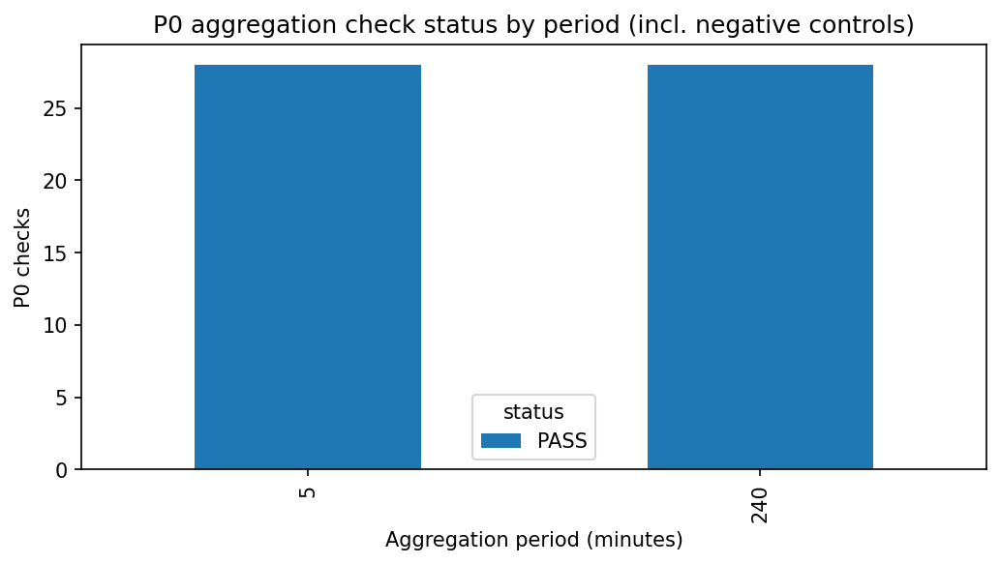
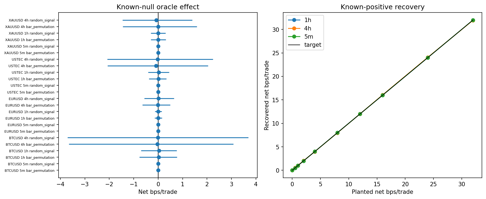

# Experiment Report: EXP-001 — Synthetic Substrate Validation

## Status: COMPLETED

**Date**: 2026-06-02
**Instruments**: BTCUSD, EURUSD, USTEC, XAUUSD
**Data Views / Feature Categories**: 1-minute time bars resampled to 5m (strict
coverage), 1h and 4h (`min_coverage=0.90`) OHLC domains via
`xen.bar_aggregator.aggregate_ohlc`. No chart-type views.

---

## Question

Can Phase 001 trust its synthetic calibration substrate — the known-null and
known-positive generators — before it measures either referee?

## Hypothesis

The known-null generators produce no oracle-recoverable edge, and the
known-positive generator carries the planted oracle-recoverable net edge, on real
analysis-set prices for each of the 5m, 1h, and 4h domains.

## Method Summary

On the first-70% analysis slice of each instrument, the script (1) extends the
VAL-001 aggregation-integrity suite (with negative controls) to the new {5, 240}
minute parameterizations and reports coverage retention across a
{strict, 0.90, 0.80} grid; (2) measures the oracle's gross effect over fixed-seed
draws of two known-null generators (bar permutation, random signal); and (3)
injects a closed-form state-aligned drift `r' = r + s·(m+cost)/1e4` and verifies
the oracle recovers the planted net edge `m`. Per-cell status separates recovery
(correctness) from significance (precision), per checkpoint design §11/D-prec.
See [analysis-plan.md](analysis-plan.md).

## Key Findings

### Finding 1: P0 aggregation precondition passes for 5m and 240m

56/56 P0 checks PASS, including all four negative controls per period. The
independent strict pandas resample oracle matched `aggregate_ohlc` with zero OHLC
mismatches at both 5- and 240-minute periods for all four instruments, extending
VAL-001's verified coverage ({1,15,60}m) to the periods this phase uses.

This satisfies checkpoint precondition P0 (§9): the 5m and 4h domains rest on a
verified aggregation path.

### Finding 2: Known-nulls carry no recoverable edge; positives recover `m`

All 24 known-null cells have mean gross oracle effect in [−0.087, +0.103] bps
with CIs bracketing zero (200 draws/cell). All non-zero known-positive cells
recover the planted `m` within the `max(0.5 bps, 15% of m)` tolerance; recovery
is closed-form and reproduced to machine epsilon (audit spot-check).

Two structurally different nulls agreeing at ≈0, plus unbiased recovery across
`m ∈ {0,…,32}` bps, certify both axes of the substrate.

### Finding 3: 4h sub-material edges are under-powered (reported, not failed)

Five cells are per-cell INCONCLUSIVE — BTCUSD 4h `m`=1,2; USTEC 4h `m`=1,2;
XAUUSD 4h `m`=1. Each recovers the planted mean, but its across-draw CI straddles
zero because the 4h domain retains only ~2,700–4,400 returns and BTC/XAU per-bar
dispersion is large. All five sit **below the 4h economic materiality threshold
(3.0 bps)**, so the non-separability is economically immaterial. This is exactly
the precision shortfall §11 predeclared as "expected most likely on the 4h
domain."

## Conclusion

**Hypothesis SUPPORTED. Substrate gate: PASS.**

Every P0 check passes, every known-null is indistinguishable from zero, and every
known-positive recovers the planted edge within tolerance. The only shortfalls
are five 4h sub-material significance cells, which the predeclared criteria
classify as under-powered (per-cell INCONCLUSIVE), not failures. `run_metadata.json`
records `overall_status: PASS`, `p0_pass: true`, `substrate_pass: true`,
`inconclusive_cells: 0`, `underpowered_cells: 5`. EXP-002 and EXP-003 may build
on this substrate; the 4h domain's reduced power is a recorded, economically
immaterial limitation.

## Limitations

- The known-positive "significance" leg measures across-draw recovery precision,
  not single-series statistical detectability (that is EXP-003's job).
- 4h effective sample (~2,700–4,400 returns/instrument) bounds attainable
  precision; sub-3 bps effects there are not reliably separable from zero.
- Per-instrument/domain round-trip costs are predeclared conservative constants
  (the data layer stores no spread). Recovery is closed-form and cost-independent,
  but the economic units everything is reported in depend on these defaults.

## Implications for Future Research

- The calibration harness can be trusted to feed referees inputs of known truth.
- EXP-003's 4h power curve near the materiality boundary will carry wide CIs;
  this should be reported as a measured operating characteristic, not smoothed.

## Recommended Next Experiments

1. **EXP-002**: referee golden-fixture correctness (next in the phase plan; the
   substrate gate is satisfied).
2. **Future EXP (proposed)**: if a tighter 4h MDE is ever needed, test whether a
   longer outcome horizon or alternative 4h inference atom raises 4h effective
   sample. Out of scope for Phase 001.

## Artifacts

| Artifact | Path |
|----------|------|
| Scope | [scope.md](scope.md) |
| Analysis Plan | [analysis-plan.md](analysis-plan.md) |
| Code | [code/](code/) · shared module `python/src/xen/referee_calibration.py` |
| Audit | [audit.md](audit.md) |
| Results | [results.md](results.md) |
| Governance Reviews | [governance/](governance/) |
| Plots | [plots/](plots/) |
