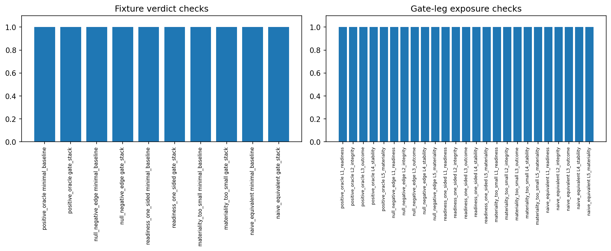

# Experiment Report: EXP-002 — Referee Golden-Fixture Correctness

## Status: COMPLETED

**Date**: 2026-06-02
**Instruments**: EURUSD label only (fixture diagnostics; no market data read)
**Data Views / Feature Categories**: Deterministic in-memory return-space golden
fixtures; EXP-001 dependency metadata

---

## Question

Are the two Phase 001 referee implementations correct enough to be measured in
EXP-003?

## Hypothesis

The minimal baseline referee and the 5-check gate-stack referee reproduce
predeclared hand-computed verdicts on deterministic golden fixtures, while the
gate stack records every leg independently.

## Method Summary

After requiring EXP-001 to have recorded `overall_status == PASS`, the script
evaluates five deterministic fixtures — clear positive, negative/null,
one-sided-readiness, sub-material, and naive-control-equivalent — against both
referees at `alpha = 0.05`, `n_bootstrap = 1000`, using the frozen EURUSD/5m cost
and materiality. It checks each fixture's minimal verdict, gate verdict, and the
required gate-leg states, and verifies all five legs are emitted. No raw market
data is loaded. See [analysis-plan.md](analysis-plan.md).

## Key Findings

### Finding 1: All verdicts and leg states reproduce

10/10 verdict checks and 25/25 leg-exposure checks PASS. Independent reproduction
with the current `referee_calibration` module matched the committed CSVs
bit-for-bit. Gate effect equals minimal effect minus the 1.0 bps cost in every
fixture.

### Finding 2: Each gate leg is isolated and the stack never short-circuits

The fixtures jointly exercise every leg's pass and fail path: `readiness_one_sided`
isolates **L1** (minimal PASS, gate REJECT on identical data via 0 down-episodes),
`materiality_too_small` isolates **L5** (net +0.2 < 0.5 bps), `naive_equivalent`
isolates **L3** (candidate equals its own naive control, `ci_vs_naive_lower = 0`),
and `null_negative_edge` fails L3+L5. Every fixture — including those with a
failing early leg — records all five legs, so EXP-003's per-leg pass rates and
false-negative attribution are well-defined.

## Conclusion

**Hypothesis SUPPORTED.**

Both referees are correct on the golden-fixture battery and the gate stack
exposes all five legs without short-circuiting. The referee logic is approved for
the EXP-003 calibration measurement. `run_metadata.json` records
`overall_status: PASS`.

## Limitations

- Certifies correctness, not calibration — FPR/TPR/MDE on real data is EXP-003.
- Single operating point (alpha 0.05, EURUSD/5m cost); the alpha grid and other
  domains are exercised in EXP-003.
- The `materiality_too_small` minimal row reports a degenerate `effective_n = 0.9`
  (block-length capped) because its series is constant to floating-point dust — a
  metadata artifact with no effect on any verdict, impossible on real returns.

## Implications for Future Research

- EXP-003 can trust the per-leg outputs it aggregates into pass rates.
- The block-length estimator's behaviour on (near-)constant series is benign here
  but should be confirmed not to arise on any real EXP-003 cell.

## Recommended Next Experiments

1. **EXP-003 (keystone)**: per-domain FPR / TPR / economic MDE / per-leg pass
   rates for both referees on the validated substrate.

## Artifacts

| Artifact | Path |
|----------|------|
| Scope | [scope.md](scope.md) |
| Analysis Plan | [analysis-plan.md](analysis-plan.md) |
| Code | [code/](code/) · shared module `python/src/xen/referee_calibration.py` |
| Audit | [audit.md](audit.md) |
| Results | [results.md](results.md) |
| Governance Reviews | [governance/](governance/) |
| Plots | [plots/](plots/) |
