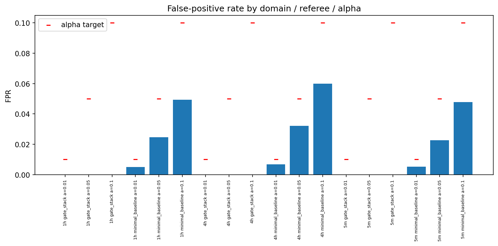
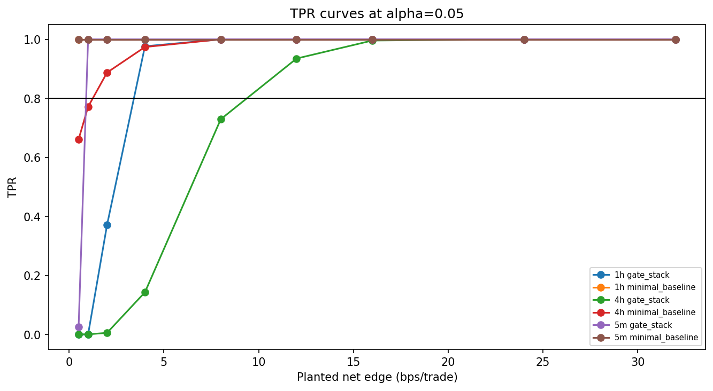
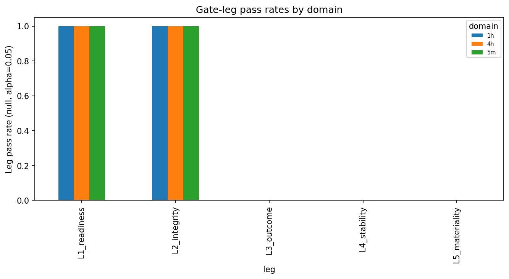

# Experiment Report: EXP-003 — Referee Operating-Characteristic Calibration (Keystone)

## Status: COMPLETED

**Date**: 2026-06-02
**Instruments**: BTCUSD, EURUSD, USTEC, XAUUSD
**Data Views / Feature Categories**: 1-minute time bars resampled to 5m (strict),
1h and 4h (`min_coverage=0.90`) OHLC domains

---

## Question

What are the per-domain FPR, TPR curve, economic MDE (across the α grid), and
gate-leg pass rates of the minimal baseline referee and the 5-check gate stack?

## Hypothesis

The 5-check gate stack has a measurable empirical economic MDE at FPR ≤ α₀ = 0.05
on each domain, and its operating characteristics can be compared against the
minimal baseline without touching the global holdout.

## Method Summary

After requiring EXP-001 and EXP-002 to have PASSed, the script feeds identical
(paired) known-null and known-positive draws to both referees on the validated
substrate — ≥1000 null draws (two generators) and ≥500 positive draws per
edge-grid point per domain, with 1000 inner block-bootstrap resamples per verdict
— and summarises FPR/TPR with Wilson intervals, locates the empirical MDE (smallest
net edge with TPR ≥ 0.80 at controlled FPR), and parses gate-leg pass rates. Draws
are seed-deterministic and parallelised; results are sorted to a canonical order.
See [analysis-plan.md](analysis-plan.md).

## Key Findings

### Finding 1: The measured stringency↔sensitivity trade-off

The minimal baseline is a calibrated single test (FPR ≈ α, small MDE); the gate
stack is a near-zero-FPR conjunction with an inflated MDE.

| Domain | Gate FPR | Min FPR (α=0.05) | Gate MDE | Min MDE | MDE inflation |
|--------|----------|------------------|----------|---------|---------------|
| 5m | 0.0 | 0.023 | 1.0 | 0.5 | ×2 |
| 1h | 0.0 | 0.025 | 4.0 | 0.5 | ×8 |
| 4h | 0.0 | 0.032 | 12.0 | 2.0 | ×6 |

This table is the PS§6 "measured stringency" deliverable: a gate-stack "reject"
means "no edge, or a net edge below ~1 / 4 / 12 bps (per domain)" — the blind-spot
magnitude X is now measured.

### Finding 2: TPR curves and a finite MDE on every domain

TPR rises monotonically from 0 to 1 across the edge grid for both referees; all 18
(domain, referee, α) cells reach TPR ≥ 0.80 with usable precision and yield a
finite MDE (`mde_status_counts: {PASS: 18}`). 4h is fully resolved — the pooled
2000-draw rates give tight Wilson intervals despite the small effective sample.

### Finding 3: L5 materiality is the gate stack's binding leg

On nulls, the three outcome legs each reject 100% of draws (L1 = L2 = 1.0,
L3 = L4 = L5 = 0.0), so the FPR collapse is a joint effect. On positives near the
MDE, **L5 materiality** is the lagging leg (4h m=2 → L5 = 0.006; 1h m=2 → L5 =
0.371; 4h m=12 → L5 = 0.935), so the gate MDE is materiality-driven and therefore
**α-invariant** — the α grid moves only the minimal baseline's MDE (4h:
4.0 → 2.0 → 1.0 across α = 0.01 / 0.05 / 0.10).

## Conclusion

**Hypothesis SUPPORTED.**

Both referees have a fully characterised operating-characteristic map with usable
precision on all three domains. The keystone result is the per-domain
stringency↔sensitivity trade-off: the gate stack drives FPR from ~α to ~0 at the
cost of a 2–8× larger economic MDE (1 / 4 / 12 bps net on 5m / 1h / 4h), with L5
materiality the binding leg. The design's success condition — *stating* the
operating characteristics, not the gate stack passing anything — is met. Whether
those MDEs sit above where plausibly-real edges live (structural blindness) is
decided by the EXP-004 empirical anchor.

## Limitations

- Per-domain rates pool four instruments of heterogeneous cost (1–10 bps) and
  dispersion, so each MDE is a domain aggregate; per-instrument MDEs could be lower.
- Stationary fixed-magnitude planted edges only; non-stationary edges deferred.
- MDE is grid-resolution limited (uncertainty reported as a grid half-step).
- The blind-vs-not-blind verdict needs the EXP-004 anchor; the 4h gate MDE of 12
  bps vs a 4h materiality of 3 bps means the gate would reject material 4h edges
  below ~12 bps.

## Implications for Future Research

- The MDE map is the reference against which EXP-004 locates real strategy effects.
- L5 materiality is the lever on gate stringency — a natural target for the
  deferred loss-function phase.

## Recommended Next Experiments

1. **EXP-004**: anchor the MDE map against real Donchian / MA dogfood effect sizes
   to decide blind-vs-not-blind per domain.
2. **Future EXP (proposed)**: per-instrument operating-characteristic map to resolve
   the pooling caveat.
3. **Future EXP (proposed)**: sweep the materiality threshold to trace gate MDE vs L5.

## Artifacts

| Artifact | Path |
|----------|------|
| Scope | [scope.md](scope.md) |
| Analysis Plan | [analysis-plan.md](analysis-plan.md) |
| Code | [code/](code/) · shared module `python/src/xen/referee_calibration.py` |
| Audit | [audit.md](audit.md) |
| Results | [results.md](results.md) |
| Governance Reviews | [governance/](governance/) |
| Plots | [plots/](plots/) |
