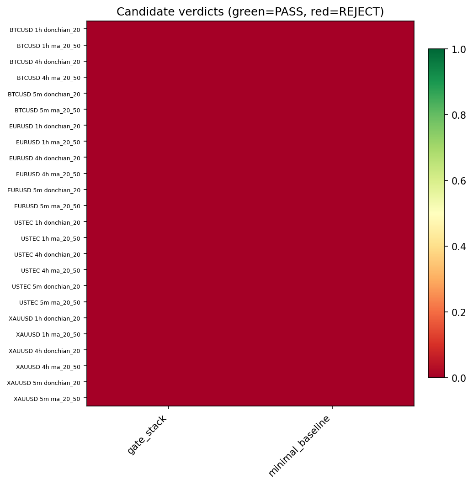
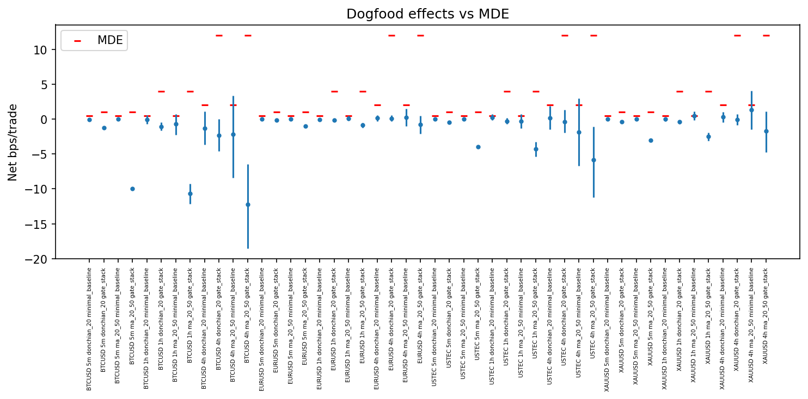

# Experiment Report: EXP-004 — Real Dogfood Consistency Anchor

## Status: COMPLETED

**Date**: 2026-06-02
**Instruments**: BTCUSD, EURUSD, USTEC, XAUUSD
**Data Views / Feature Categories**: 1-minute time bars resampled to 5m (strict),
1h and 4h (`min_coverage=0.90`) OHLC domains. No chart-type views.

---

## Question

Do real, simple, untuned price-based candidates (Donchian breakout and
MA-crossover) behave consistently with the synthetic referee calibration map from
EXP-003 — i.e. do their verdicts agree with where their measured net effect sizes
fall on each domain's calibrated MDE?

## Hypothesis

Real Donchian-channel breakout (lookback 20) and MA-crossover (fast 20, slow 50)
verdicts are consistent with where their measured net effect sizes fall on the
calibrated per-domain MDE map from EXP-003.

## Method Summary

For each instrument × domain × strategy, the script generated look-ahead-safe
positions (Donchian on prior-window highs/lows; MA on closes known at bar `t`),
evaluated both the minimal-baseline (gross) and 5-check gate-stack (net-of-cost)
referees at α=0.05 with a 1000-resample stationary block bootstrap on the test
segment, and located each measured effect on the EXP-003 MDE map. Consistency
follows design §10: expect PASS when the effect CI lower bound ≥ MDE, REJECT when
the point estimate < MDE, with a grey band of one MDE grid half-step. All loading
used the first-70% analysis slice; the train/test cut is the shared 1-minute
boundary timestamp. See [analysis-plan.md](analysis-plan.md).

## Key Findings

### Finding 1: Every dogfood verdict is consistent with its MDE position

All 48 cells (4 × 3 × 2 × 2) returned **REJECT**, and all 48 were classified
**consistent** (`matched_reject`): each measured effect sits below its domain MDE,
which is exactly the verdict the calibration map predicts. There were 0
inconsistent and 0 inconclusive cells. The audit independently re-derived all 48
consistency classifications with zero mismatches and confirmed the EXP-003 α=0.05
MDE map (5m gate 1.0 / 1h gate 4.0 / 4h gate 12.0 bps; minimal 0.5 / 0.5 / 2.0)
was loaded correctly.

This means real simple strategies produced no synthetic-vs-real DGP gap — the
calibration's edge-free prediction held on real candidates.

### Finding 2: The strategies carry no positive edge, even gross of cost

The minimal-baseline referee tests the gross edge with no cost gate, and it too
REJECTed all 48 — no candidate's gross effect has a bootstrap CI excluding zero.
Gross effects span ≈ **[−2.20, +1.32] bps/trade** (e.g. XAUUSD/4h/MA +1.317
[−1.445, +4.035]; USTEC/1h/Donchian +0.226 [−0.178, +0.680]). Net (gate-stack)
effects are the gross effect minus cost × active-bar fraction, pushing them
negative (most negative: BTCUSD/4h/MA −12.20 [−18.52, −6.46]). The rejections are
therefore genuine absence of edge, not merely cost erosion. Effective N ranged
from ~902 (4h) to ~65,144 (5m); `block_length = 1` for all cells (negligible
per-bar autocorrelation).

### Finding 3: The keystone empirical anchor is a null/lower anchor

EXP-004's effects are the empirical anchor that locates where plausibly-real
intraday edges live, against which EXP-003's gate MDE is judged blind or not
(design §4/§10/D-ceiling). The measured edges cluster at ≈0 (gross) / negative
(net), below the gate MDE on every domain (4h gate MDE 12 bps sits an order of
magnitude above where these effects fall). This is consistent with the gate
stack's rejections — they are true negatives, not false negatives — but because
no positive real edge was present, it does **not** demonstrate the gate is
sensitive to weak real edges near the MDE boundary.

## Conclusion

**Hypothesis SUPPORTED.**

Real Donchian and MA-crossover verdicts agree with their positions on the EXP-003
calibrated MDE map in all 48 cells: each is rejected, and each measured effect
sits below its domain MDE, satisfying the predeclared Evidence-FOR criterion with
no Evidence-AGAINST and no inconclusive cells. No synthetic-vs-real distribution
gap was surfaced.

For the keystone reading this experiment feeds (H-keystone), the contribution is a
**null/lower anchor**: simple untuned intraday edges live at ≈0 / sub-materiality,
beneath every per-domain MDE. This is consistent with the gate stack's behaviour
but is insufficient on its own to declare the gate stack non-blind to genuinely
weak real edges — that question is bounded, not closed, because this dogfood set
contained no positive edge to probe detection near the MDE.

## Limitations

- **Null anchor**: with no positive real edge present, the experiment cannot probe
  detection in the near-MDE region where structural blindness would bite.
- **Narrow universe**: two strategy families at one fixed lookback each; absence of
  edge here does not generalise to all simple signals.
- **Effective N / block length**: `block_length = 1` everywhere, so the bootstrap
  reduced to i.i.d. resampling; 4h has the smallest N (~900–1335) and widest CIs.
- **Pooled/flat assumptions**: flat per-instrument/domain costs, log-return bps,
  α=0.05 only; the MDE map is itself a four-instrument domain aggregate.

## Implications for Future Research

- The phase's keystone (H-keystone) cannot be positively resolved with an
  edge-free dogfood set; resolving structural blindness needs a candidate carrying
  a small real edge near the MDE.
- Confirms simple untuned momentum/breakout signals have no detectable standalone
  intraday edge net of conservative costs on these four instruments — a useful
  prior for prioritising future candidate families.

## Recommended Next Experiments

1. **EXP-005 (proposed) — Near-MDE detection anchor**: evaluate a candidate
   engineered to carry a small, real, predeclared edge straddling each domain's
   gate MDE (validated as in EXP-001), to convert this null anchor into a near-MDE
   anchor and directly test the gate stack's structural blindness at the boundary.
2. **EXP-006 (proposed) — Broadened dogfood distribution**: a wider untuned
   real-candidate set (more lookbacks and strategy families) to characterise the
   empirical effect-size distribution of simple intraday signals.
3. **EXP-007 (proposed) — Per-instrument MDE**: re-derive MDE per instrument
   (not pooled) so the dogfood comparison uses instrument-specific detection floors.

## Artifacts

| Artifact | Path |
|----------|------|
| Scope | [scope.md](scope.md) |
| Analysis Plan | [analysis-plan.md](analysis-plan.md) |
| Code | [code/](code/) |
| Audit | [audit.md](audit.md) |
| Results | [results.md](results.md) |
| Governance Reviews | [governance/](governance/) |
| Plots | [plots/](plots/) |
