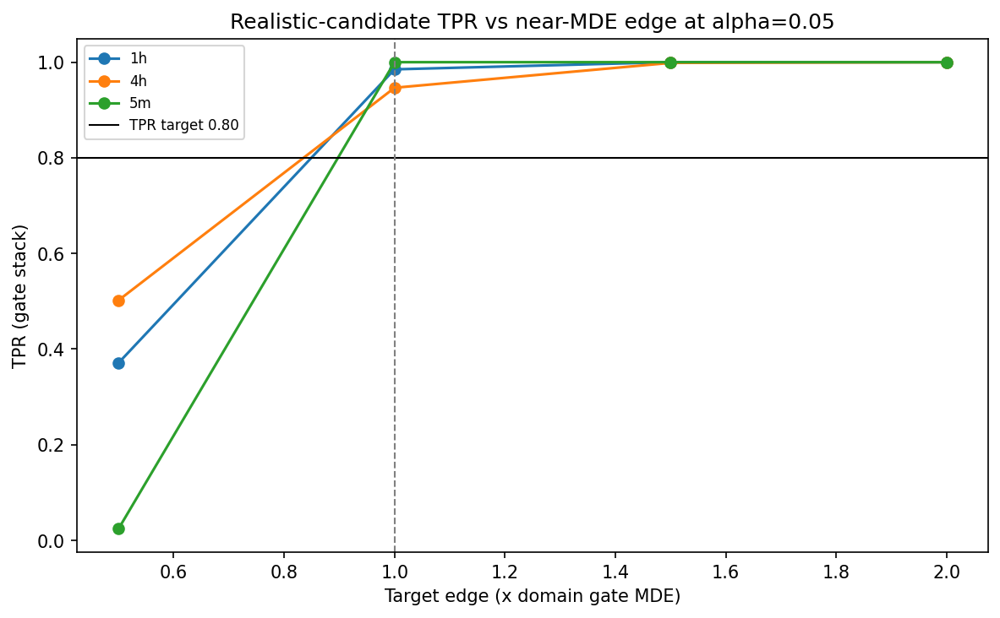
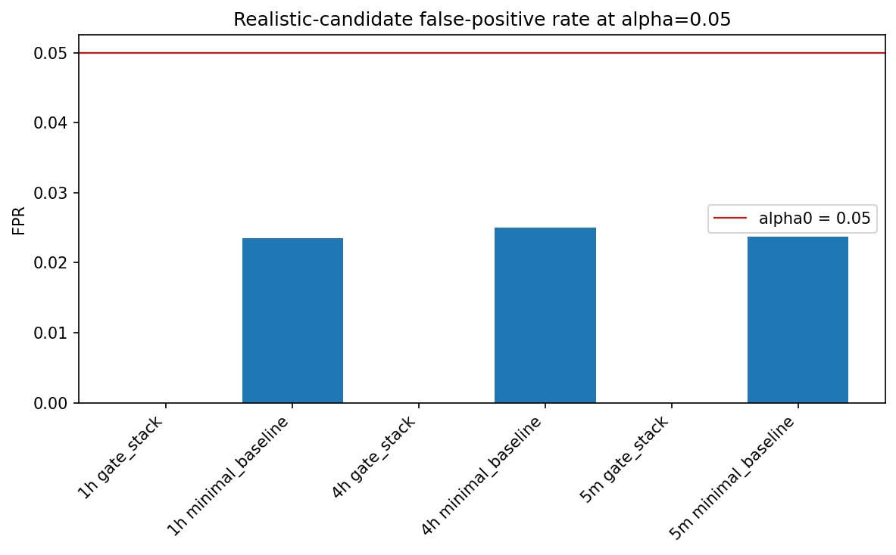
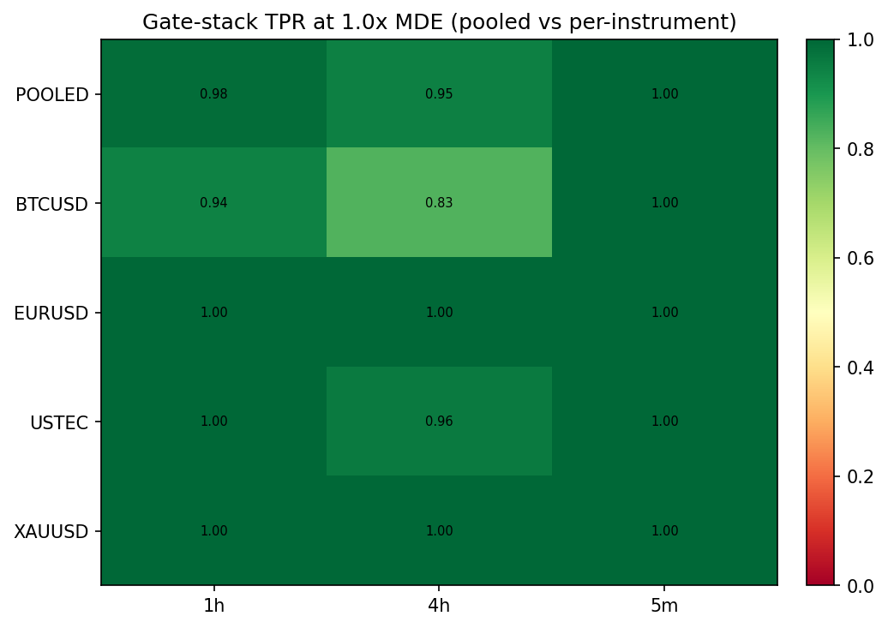
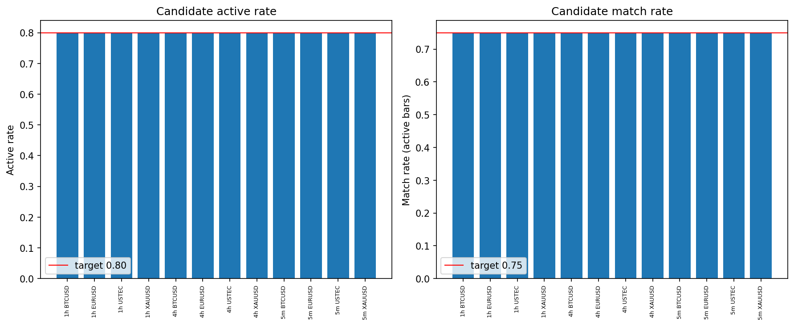

# Experiment Report: EXP-005 - Near-MDE Realistic-Candidate Detection Anchor

## Status: COMPLETED

**Date**: 2026-06-03
**Instruments**: BTCUSD, EURUSD, USTEC, XAUUSD
**Data Views / Feature Categories**: 1-minute time bars resampled to 5m (strict), 1h and 4h (`min_coverage=0.90`) OHLC domains. No chart-type views.

---

## Question

Is the oracle-calibrated EXP-003 MDE map an honest detection floor for a weak-but-real, imperfect candidate signal?

## Hypothesis

On each scoped domain, the frozen Phase 001 5-check gate stack detects an imperfect realistic candidate whose expected net real-price edge is at least the EXP-003 gate-stack MDE, with pooled-domain TPR >= 0.80 at `FPR <= alpha0 = 0.05`.

## Method Summary

EXP-005 generated a predeclared noisy candidate from a latent state with `p_active = 0.80` and `q_match = 0.75`, then planted known positive drift on the latent state so the candidate's expected all-eligible-row net edge matched `{0.5, 1.0, 1.5, 2.0} x` the EXP-003 gate MDE. The script evaluated 500 positive draws per edge and 500 null draws per null generator across 4 instruments and 3 domains, using the frozen Phase 001 minimal-baseline and gate-stack referees with 1000 bootstrap resamples per verdict. All data loading used only the first 70% chronological analysis slice.

## Key Findings

### Finding 1: The strict gate detects the realistic candidate at the MDE floor

At `alpha0 = 0.05`, the gate stack met the predeclared FPR and TPR criteria in every pooled domain:

| Domain | MDE bps | Gate FPR | Gate TPR at 1.0x MDE | Status |
|--------|---------|----------|----------------------|--------|
| 5m | 1.0 | 0.0000 | 1.0000 | DETECTED_FLOOR |
| 1h | 4.0 | 0.0000 | 0.9850 | DETECTED_FLOOR |
| 4h | 12.0 | 0.0000 | 0.9465 | DETECTED_FLOOR |

This supports the EXP-003 MDE map as an honest detection floor for the scoped realistic-candidate class.

### Finding 2: The gate stays conservative on null draws

Gate-stack FPR is `0/4000` null verdicts in every domain at `alpha0 = 0.05`, with Wilson half-width `0.000480`. The minimal-baseline diagnostic FPR remains near nominal but below `alpha0` (5m `0.02375`, 1h `0.02350`, 4h `0.02500`).

This preserves the conservative false-positive behavior measured in EXP-003.

### Finding 3: No per-instrument headline failure is hidden by pooling

All 12 per-instrument headline rows at `1.0x` MDE classify as `DETECTED_FLOOR` with `under_powered=false`. The weakest headline cell is BTCUSD/4h with TPR `0.828` and half-width `0.0330`, still above the `0.80` target.

The pooled-domain finding is therefore not masking an instrument-level failure under the approved precision rule.

### Finding 4: The candidate construction passed its sanity gate

Overall active rate is `0.799997` and active match rate is `0.750005`; every aggregated sanity cell stays within the predeclared tolerance. Positive calibration absolute error ranges from `0.000005` to `0.129769` bps.

The finding is not driven by an accidentally oracle-like, inactive, or miscalibrated candidate.

## Conclusion

**Hypothesis SUPPORTED.**

EXP-005 closes the Phase 001 open keystone for this candidate class: the frozen gate stack is not structurally blind to an imperfect realistic candidate at the EXP-003 oracle-calibrated MDE. The strict gate detects the candidate at 5m, 1h, and 4h while maintaining zero pooled null passes.

The result does not adopt or modify a referee. It gives Phase 002 a positive near-MDE anchor to use when interpreting the L5 threshold sweep, lenient-L5 variant, per-instrument MDE map, and final operating-point recommendation.

## Limitations

- The candidate is synthetic and controlled; this tests referee sensitivity, not live strategy profitability.
- The conclusion applies to the predeclared `p_active = 0.80`, `q_match = 0.75` candidate class.
- At `0.5x` MDE, TPR is below target in every domain, so the result does not show reliable detection of materially sub-MDE edges.
- All verdict rows used `block_length = 1`; the audit accepts this because the frozen harness estimated it from train data, but split/dependence robustness remains EXP-010's job.

## Implications for Future Research

- EXP-006/EXP-007 should be read as sensitivity/stringency characterization, not as emergency repair for a failed keystone: EXP-005 shows the strict gate detects this near-MDE realistic candidate.
- EXP-008 remains useful because EXP-005 did not estimate per-instrument MDEs; it only checked whether the pooled MDE hid headline instrument failures.
- EXP-010 remains useful because the bootstrap dependence estimate collapsed to `block_length = 1` in this experiment.

## Recommended Next Experiments

1. **EXP-006**: Sweep the L5 materiality threshold to map the strict-mechanism sensitivity frontier.
2. **EXP-007**: Evaluate the predeclared lenient-L5 mechanism against the EXP-006 frontier and report economically sub-material passes.
3. **EXP-008**: Produce the per-instrument MDE map and compare it with the pooled-domain MDE used here.

## Artifacts

| Artifact | Path |
|----------|------|
| Scope | [scope.md](scope.md) |
| Analysis Plan | [analysis-plan.md](analysis-plan.md) |
| Code | [code/](code/) |
| Audit | [audit.md](audit.md) |
| Results | [results.md](results.md) |
| Governance Reviews | [governance/](governance/) |
| Plots | [plots/](plots/) |
