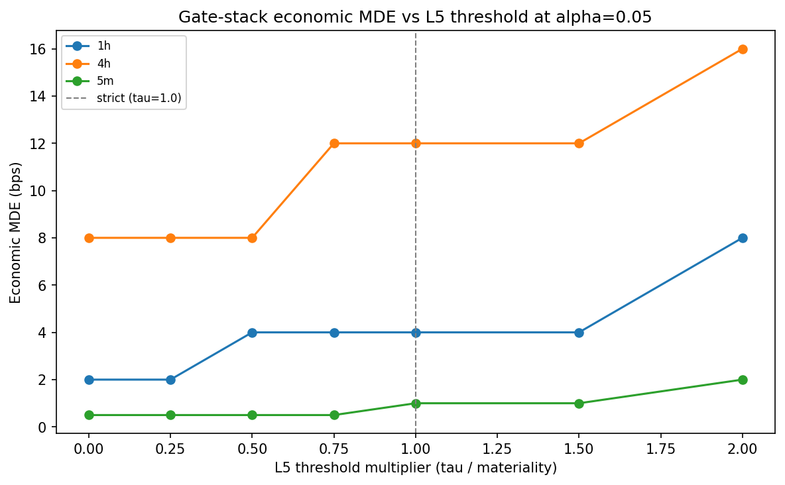
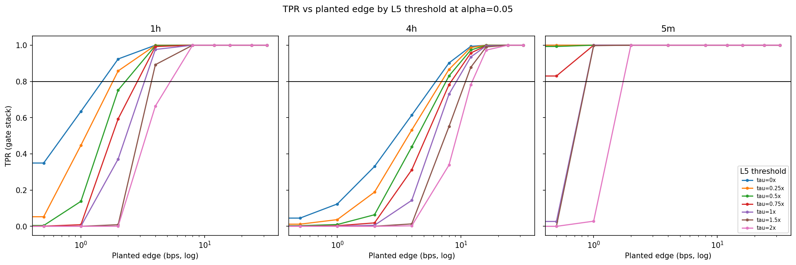

# Experiment Report: EXP-006 - L5 Materiality Threshold Sweep

## Status: SUPPORTED

**Date**: 2026-06-03
**Instruments**: BTCUSD, EURUSD, USTEC, XAUUSD (pooled by domain through EXP-003 draw artifacts)
**Data Views / Feature Categories**: EXP-003 draw-level referee verdicts for 5m, 1h, and 4h OHLC domains; no chart-type views

---

## Question

How do the frozen gate stack's FPR and economic MDE vary as the L5 materiality threshold is swept per domain?

## Hypothesis

This was an exploratory characterization experiment: produce the L5 lever curve `MDE(tau)` and `FPR(tau)` while preserving the frozen EXP-003 gate stack except for the L5 threshold magnitude.

## Method Summary

EXP-006 reused EXP-003 gate-stack draw verdicts and reconstructed pass flags for L5 thresholds `tau = multiplier x materiality_bps(domain)` with multipliers `{0, 0.25, 0.5, 0.75, 1, 1.5, 2}`. FPR, TPR, and grid-defined MDE were recomputed with the same Wilson precision rules as EXP-003. No market data or holdout rows were loaded.

## Key Findings

### Finding 1: Strict Reference Reproduced EXP-003 Exactly

The strict `tau=1.0` reconstruction had `0` draw mismatches against the frozen EXP-003 gate across all 216,000 gate-stack rows. Reconstructed strict MDEs matched EXP-003 in every domain and alpha row: 5m `1.0`, 1h `4.0`, and 4h `12.0` bps at `alpha0=0.05`.

### Finding 2: Lower L5 Thresholds Improved MDE With FPR Still Zero

At `alpha0=0.05`, FPR stayed `0/4000` for every domain and threshold. Lowering the L5 threshold reduced MDE:

- 5m: strict `1.0` bps -> `0.5` bps for `tau <= 0.75`.
- 1h: strict `4.0` bps -> `2.0` bps for `tau <= 0.25`.
- 4h: strict `12.0` bps -> `8.0` bps for `tau <= 0.50`.

### Finding 3: Raising L5 Thresholds Reduced Sensitivity

At `tau=2.0`, MDE rose to 5m `2.0`, 1h `8.0`, and 4h `16.0` bps. This confirms L5 threshold magnitude behaves as a monotone stringency lever on the scoped grid.

## Conclusion

**Hypothesis SUPPORTED as an exploratory measurement.**

EXP-006 produced a complete, precise L5 threshold frontier and passed its strict-reference reproduction gate. The result supports the Phase 002 characterization claim that L5 is a practical stringency lever: lower thresholds improve measured sensitivity without increasing pooled FPR on the EXP-003 draw substrate. This does not adopt any threshold or referee variant.

## Limitations

- MDE values are limited to the EXP-003 planted-edge grid.
- Results are pooled by domain over four instruments.
- The zero-FPR result is specific to the scoped null generators and paired draws.
- No real candidate signals were evaluated.

## Implications for Future Research

- EXP-007 should treat lenient L5 as the `tau=0` endpoint unless it can prove otherwise.
- EXP-011 should use this frontier as the threshold-choice input under the predeclared loss function.
- Phase 003 adoption should use fresh draws before freezing any lower-threshold operating point.

## Recommended Next Experiments

1. **EXP-007**: Confirm whether lenient L5 differs from the EXP-006 zero-buffer endpoint and quantify sub-material passes.
2. **EXP-008**: De-pool MDE by instrument to check whether pooled domain curves mask instrument heterogeneity.
3. **EXP-011**: Select a recommended operating point under the predeclared loss function.

## Artifacts

| Artifact | Path |
|----------|------|
| Scope | [scope.md](scope.md) |
| Analysis Plan | [analysis-plan.md](analysis-plan.md) |
| Code | [code/](code/) |
| Audit | [audit.md](audit.md) |
| Results | [results.md](results.md) |
| Governance Reviews | [governance/](governance/) |
| Raw Results | [results/](results/) |
| Plots | [plots/](plots/) |
