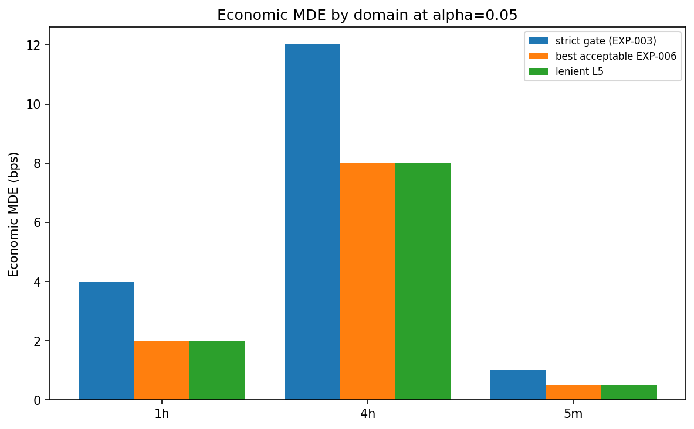
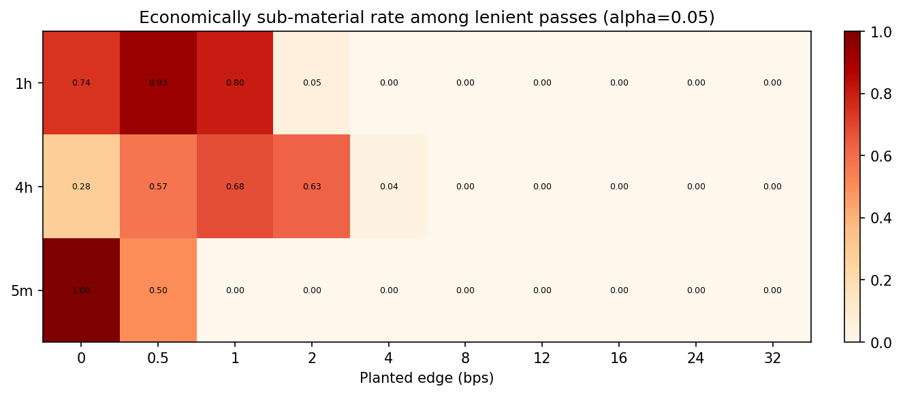

# Experiment Report: EXP-007 - Lenient-L5 Referee Variant

## Status: REFUTED

**Date**: 2026-06-03
**Instruments**: BTCUSD, EURUSD, USTEC, XAUUSD (pooled by domain through EXP-003/EXP-006 draw artifacts)
**Data Views / Feature Categories**: EXP-003 gate-stack draw verdicts plus EXP-006 threshold frontier artifacts for 5m, 1h, and 4h OHLC domains; no chart-type views

---

## Question

Does replacing strict L5 materiality with statistical net-positivity after costs create a genuine sensitivity gain beyond the EXP-006 threshold frontier?

## Hypothesis

The predeclared lenient L5 variant lowers economic MDE relative to the frozen strict gate while holding `FPR <= alpha0 = 0.05`, beyond what is achieved by the EXP-006 threshold-magnitude frontier.

## Method Summary

EXP-007 reused EXP-003 gate-stack draw rows and reconstructed a lenient pass flag with `L5_lenient = ci_lower_bps > 0.0`, leaving L1-L4 unchanged. It then recomputed FPR, TPR, and MDE, confirmed verdict-level equality against EXP-006 `tau=0` rows, and measured economically sub-material pass rates among lenient positive passes. No market data or holdout rows were loaded.

## Key Findings

### Finding 1: Lenient L5 Equals EXP-006 Tau=0 and Drop-L5

The structural-equivalence check found `0` lenient-vs-drop-L5 mismatches, `0` lenient-vs-EXP-006-`tau=0` mismatches, and `0` unmatched tau0 rows across all 9 domain/alpha cells. Lenient MDE equaled EXP-006 tau0 MDE in every row.

### Finding 2: Lenient L5 Lowered Strict MDE, But Not Beyond the Frontier

At `alpha0=0.05`, lenient L5 reduced MDE relative to strict:

- 5m: strict `1.0` bps -> lenient `0.5` bps.
- 1h: strict `4.0` bps -> lenient `2.0` bps.
- 4h: strict `12.0` bps -> lenient `8.0` bps.

Those lenient MDEs exactly equal the best acceptable EXP-006 frontier MDEs, so `improves_beyond_frontier = false` in every headline row.

### Finding 3: FPR Stayed Controlled

Lenient FPR was `0/4000` in every domain at every alpha, with Wilson half-width `0.000480`. The lower MDE did not come with an observed FPR increase on these draws.

### Finding 4: Sub-Material Accounting Does Not Rescue the Structural Claim

At the alpha0 lenient MDE, sub-material pass rates were 5m `0.4965`, 1h `0.054654`, and 4h `0.0`. These do not exceed the predeclared `0.50` failure cutoff at the MDE, but the headline claim is still refuted because lenient L5 does not improve beyond EXP-006 `tau=0`.

## Conclusion

**Hypothesis REFUTED.**

The lenient variant controls FPR and lowers strict MDE, but it is not a distinct mechanism-level gain. It is exactly the zero-buffer endpoint of the EXP-006 threshold sweep and exactly equivalent to dropping L5 because L3 already requires `ci_lower_bps > 0`. Phase 002 should treat lenient L5 as "EXP-006 tau=0 plus sub-material accounting", not as a separate referee innovation.

## Limitations

- Results use the shared EXP-003/EXP-006 synthetic draw substrate for comparability.
- MDE values are limited to the EXP-003 planted-edge grid.
- The 5m sub-material rate at the lenient MDE is close to the `0.50` threshold.
- No operating point is adopted in Phase 002; fresh-draw ratification remains deferred.

## Implications for Future Research

- EXP-011 should not score lenient L5 as a distinct mechanism; it should score the EXP-006 zero-buffer endpoint with EXP-007's sub-material context.
- Any adoption of the zero-buffer endpoint should be tested with fresh draws in Phase 003.
- The result narrows Phase 002's lever characterization: the useful object is threshold magnitude, not a new L5 mechanism.

## Recommended Next Experiments

1. **EXP-008**: Estimate per-instrument MDEs to determine whether pooled domain frontiers hide instrument-specific behavior.
2. **EXP-011**: Select a recommended operating point using the predeclared loss function and cite EXP-007's structural-equivalence result.
3. **Phase 003 decision phase**: Ratify any recommended lower-threshold operating point on fresh draws before adoption.

## Artifacts

| Artifact | Path |
|----------|------|
| Scope | [scope.md](scope.md) |
| Analysis Plan | [analysis-plan.md](analysis-plan.md) |
| Code | [code/](code/) |
| Audit | [audit.md](audit.md) |
| Results | [results.md](results.md) |
| Governance Reviews | [governance/](governance/) |
| Raw Results | [results/](results/) |
| Plots | [plots/](plots/) |
