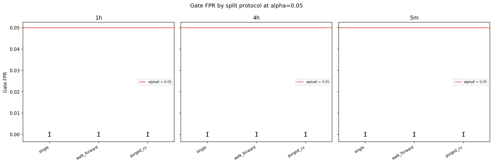
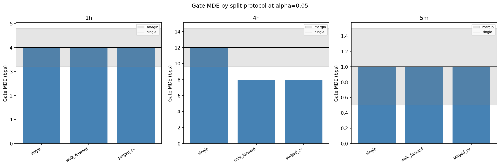

# Experiment Report: EXP-010 - Split-Protocol Robustness of the Referee

## Status: PARTIALLY REFUTED

**Date**: 2026-06-04 (re-run under corrected multi-fold estimator)
**Instruments**: BTCUSD, EURUSD, USTEC, XAUUSD (pooled by domain)
**Data Views / Feature Categories**: 1-minute time bars resampled to 5m, 1h, and 4h OHLC domains; regenerated known-null and known-positive referee-calibration draws; no chart-type views

> **Correction note (2026-06-04 adversarial review F01).** The original run combined
> multi-fold draws by concatenating per-fold bootstrap-mean distributions, which gave
> multi-fold protocols an artificially wide CI (per-fold sized) on a pooled-OOS estimate
> and spuriously inflated walk-forward MDE on 1h and 4h. The wrapper now uses a
> test-size-weighted, per-resample average of per-fold bootstrap means (stratified
> pooled-OOS bootstrap); the single-split arm stays bit-identical to the frozen referee.
> Under the corrected estimator **1h is split-robust** and the only falsified domain is
> **4h**, where alternative protocols now give a *lower* MDE (more OOS rows).

---

## Question

Do alternative within-analysis-set split protocols materially change the frozen referee's pooled-by-domain operating characteristics versus the mandated single chronological split?

## Hypothesis

H-split: anchored walk-forward and purged/embargoed CV do not materially change gate-stack FPR or economic MDE versus the single chronological split, under the frozen criterion.

## Method Summary

EXP-010 regenerated EXP-003-style null and positive draws with a reduced draw budget held constant across protocols. It evaluated the frozen referees under single split, anchored walk-forward, and purged/embargoed CV. Fold boundaries were mapped from shared 1-minute `CloseTime` coordinates into each domain, and the multi-fold wrapper evaluated the referee per fold with disjoint fold train/test sets, then combined one verdict per draw by **test-size-weighting the per-fold bootstrap means into a stratified bootstrap of the pooled OOS mean** (corrected estimator; see correction note).

## Key Findings

### Finding 1: The Single-Split Reference Reproduced EXP-003

The single-split arm passed every reference check: FPR intervals overlap EXP-003 and MDEs match within grid uncertainty across all 9 domain/alpha rows. This validates the regenerated substrate and wrapper for protocol comparison.

### Finding 2: FPR Was Stable

At `alpha0=0.05`, gate-stack FPR was `0/2000` for every domain/protocol, with Wilson half-width `0.000959`.

### Finding 3: 5m/1h Split-Robust; 4h Alternative Protocols Detect a Smaller Edge

Under the corrected estimator, at alpha0:

- 5m: single / walk-forward / purged CV all `1.0` bps — robust.
- 1h: single / walk-forward / purged CV all `4.0` bps — robust (the original run's walk-forward `8.0` was the concatenation artifact).
- 4h: single `12.0` bps; walk-forward and purged CV both `8.0` bps (delta `-4.0`, margin `2.4`) — material, in the *more-sensitive* direction.

The 4h shift is toward better detection: the alternative protocols pool more out-of-sample rows than the single split's last-30% window, and 4h is the data-poorest domain, so the single-split MDE is the most conservative. Both alternative protocols agree at `8.0`, consistent with an OOS-sample-size effect (F02), not referee instability or FPR inflation (FPR stays `0/2000`).

## Conclusion

**Hypothesis PARTIALLY REFUTED.**

H-split is SUPPORTED on 5m and 1h. It is FALSIFIED on 4h, but the falsification is now a single domain and points the *opposite* way to the original run: the more-OOS alternative protocols detect a one-grid-step smaller edge than the conservative single split. This is best read as a protocol-plus-OOS-window sensitivity (F02) rather than the referee logic moving. EXP-010 does not recommend a split change; it supplies corrected robustness context for EXP-011.

## Limitations

- Draw counts are reduced versus EXP-003 for tri-protocol tractability, though all alpha0 reportability targets pass.
- The multi-fold wrapper is experiment-local and guarded by the single-split reproduction check.
- The result applies to the frozen synthetic calibration substrate, not real strategy candidates.

## Implications for Future Research

- EXP-011 should treat 5m/1h as split-robust and 4h as split-sensitive in the *more-sensitive* direction (alternative protocols detect a smaller edge).
- Walk-forward and purged CV agree at 4h, so the effect is not specific to one protocol; it tracks OOS sample size (F02). A common-OOS-window ablation would separate protocol mechanics from sample size and is a candidate for a future scoped experiment.

## Recommended Next Experiments

1. **EXP-011**: Incorporate split-protocol robustness into the predeclared loss-function synthesis.
2. **Phase 003 decision phase**: If a split-policy change is proposed, ratify it separately on fresh draws.

## Artifacts

| Artifact | Path |
|----------|------|
| Scope | [scope.md](scope.md) |
| Analysis Plan | [analysis-plan.md](analysis-plan.md) |
| Code | [code/](code/) |
| Audit | [audit.md](audit.md) |
| Results | [results.md](results.md) |
| Governance Reviews | [governance/](governance/) |
| Raw Results | [results/](results/) |
| Plots | [plots/](plots/) |
