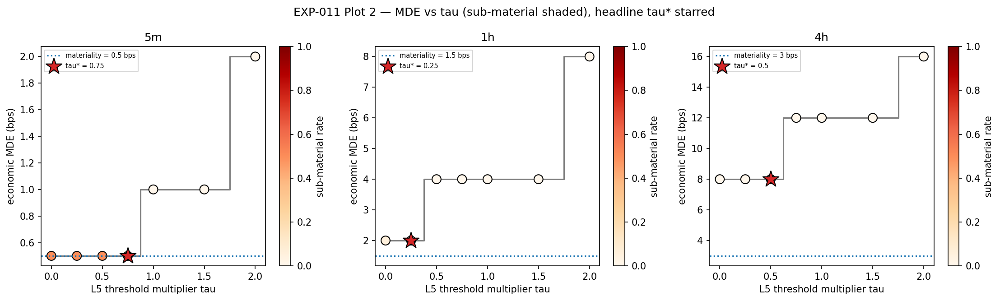
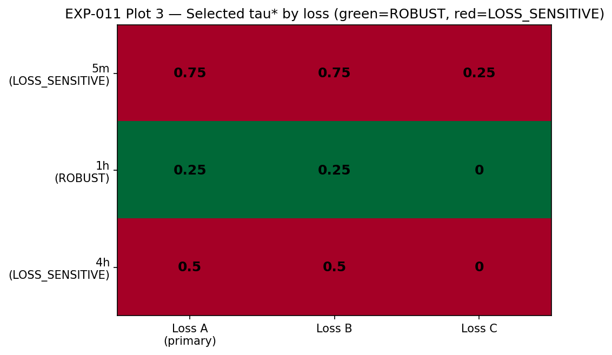
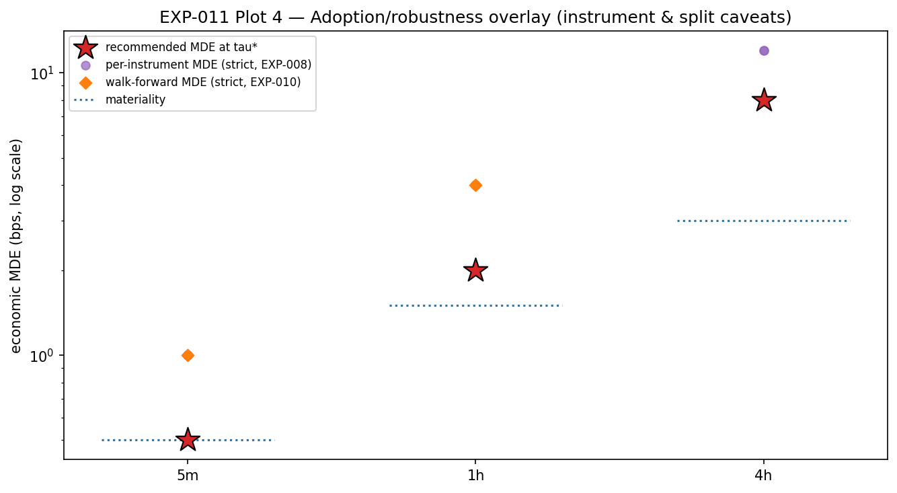

# Experiment Report: EXP-011 - Predeclared-Loss Operating-Point Synthesis & Recommendation

## Status: RECOMMENDATION DELIVERED (exploratory)

**Date**: 2026-06-04 (re-run after EXP-010 estimator correction; dependencies hard-gated)
**Instruments**: BTCUSD, EURUSD, USTEC, XAUUSD (pooled by domain through upstream calibration artifacts)
**Data Views / Feature Categories**: Result-level artifacts from EXP-003, EXP-005, EXP-006, EXP-007, EXP-008, EXP-009, and EXP-010; no market-data or chart-type views loaded

> **Re-run note (2026-06-04 adversarial review).** EXP-011 was re-run after the EXP-010
> multi-fold estimator correction. The headline tau* recommendations are **unchanged**
> (they depend only on the EXP-006 tau-frontier), but the adoption caveats are now
> **derived from the corrected EXP-010 overlay** rather than a hardcoded string: 1h is now
> **split-robust** (only 4h carries a walk-forward caveat). All scoped context
> dependencies (EXP-005/008/009/010) are now hard-gated to COMPLETE.

---

## Question

Given a fully predeclared loss family, which L5 threshold multiplier on the frozen EXP-006 tau-frontier should Phase 002 recommend per domain, and is that recommendation robust across three loss specifications?

## Hypothesis

EXP-011 is exploratory and has no SUPPORTED/REFUTED hypothesis. Its success criterion is delivery of a per-domain recommended operating point, a cross-loss robustness verdict, and a conditional adoption rule for Phase 003.

## Method Summary

EXP-011 reads frozen result-level artifacts only. It builds a 21-row decision table over the 3 domains and 7 tau multipliers, reconstructs sub-material pass rates by draw key, evaluates the three predeclared losses, then reports the primary Loss A recommendation with Loss B/C robustness. No market data is loaded and no referee is re-run.

## Key Findings

### Finding 1: Primary recommendations move below strict tau = 1.0

Loss A selected lower-than-strict thresholds in all domains:

| Domain | Headline tau* | MDE at tau* | Sub-material rate | Verdict |
|--------|---------------|-------------|-------------------|---------|
| 5m | 0.75 | 0.5 bps | 0.39759036144578314 | LOSS_SENSITIVE |
| 1h | 0.25 | 2.0 bps | 0.026223776223776224 | ROBUST |
| 4h | 0.5 | 8.0 bps | 0.0 | LOSS_SENSITIVE |

### Finding 2: Only 1h is robust across all three losses

The cross-loss selections were:

- 5m: Loss A/B `0.75`, Loss C `0.25` - loss-sensitive, driven by the sub-material term.
- 1h: Loss A/B `0.25`, Loss C `0.0` - robust by the one-grid-step rule.
- 4h: Loss A/B `0.5`, Loss C `0.0` - loss-sensitive, driven by blind-band trade-off.

### Finding 3: Adoption is conditioned by split and instrument overlays (data-derived)

The rule recorded in `adoption_rule.json` defers adoption to Phase 003 fresh draws and now
composes its caveats from the loaded overlays rather than a static narrative. EXP-005 says
the strict gate is already an honest detection floor on all domains, so the lower tau
recommendations are sensitivity-headroom recommendations, not blindness repairs. Under the
corrected EXP-010, **only 4h carries a walk-forward split caveat** (5m and 1h are
split-robust); EXP-008 flags material per-instrument overlays for EURUSD (1h) and
EURUSD/XAUUSD (4h).

### Finding 4: How to read the cross-loss verdict

- **Loss C is a weak corroborator on this substrate.** With FPR == 0 for every tau, Loss C
  reduces to minimising missed material edges (mean 1-TPR), which is monotone toward the
  lenient endpoint; it does not independently price sub-material admissions. The
  ROBUST/LOSS_SENSITIVE verdict therefore largely reflects how far Loss A/B sit from
  maximal leniency, and should be read with that caveat (`run_metadata.method_notes`).
- **Loss A minimises MDE before sub-material.** A recommended tau* can carry a sizeable
  operating sub-material rate — at 5m, tau*=0.75 hits MDE 0.5 bps (= materiality) but with
  a `0.398` sub-material pass rate at that edge (under the 0.50 cap, but not negligible).
  Read each tau* together with its sub_rate.

## Conclusion

**Recommendation delivered.**

EXP-011 satisfies the Phase 002 synthesis deliverable: it recommends `tau = 0.75` for 5m, `tau = 0.25` for 1h, and `tau = 0.5` for 4h under the primary predeclared loss. The 1h recommendation is robust across losses; 5m and 4h are loss-sensitive and must carry that caveat into Phase 003.

This does not adopt or freeze any new referee. The conditional rule is: adopt a recommended tau* only if fresh Phase 003 synthetic draws reconfirm FPR Wilson upper `<= 0.05`, `sub <= 0.50` at the operating MDE, and EXP-005-style realistic-candidate TPR `>= 0.80`; otherwise retain strict `tau = 1.0`.

## Limitations

- The recommendation uses shared Phase 002 synthetic draws; Goodhart-sensitive adoption is deferred to fresh Phase 003 draws.
- EXP-009 found no scoped untuned strategy effect at or above any domain MDE, so the recommendation currently affects sensitivity headroom rather than a known real candidate.
- Under the corrected EXP-010, only **4h** is split-sensitive (and in the more-sensitive direction); 5m and 1h are split-robust.
- Loss C is a weak corroborator on the zero-FPR substrate; Loss A can recommend a tau* with a non-trivial sub-material rate (5m). Read tau* with its sub_rate and the cross-loss caveat.
- Per-instrument MDE heterogeneity is an overlay only, not a per-instrument recommendation.

## Implications for Future Research

- Phase 002 can close with a concrete recommendation and rule, while leaving adoption to Phase 003.
- Phase 003 should treat 4h as a stricter adoption case because of EXP-010 split sensitivity (1h is now split-robust under the corrected estimator).
- The next design phase can move from referee operating-point selection toward the incremental-information unit without changing the Phase 002 record.

## Recommended Next Experiments

1. **Phase 003 decision phase**: ratify or reject the EXP-011 tau recommendations on fresh synthetic draws.
2. **Phase 003 design seed**: specify the incremental-information / ensemble candidate unit after the referee decision is settled.

## Artifacts

| Artifact | Path |
|----------|------|
| Scope | [scope.md](scope.md) |
| Analysis Plan | [analysis-plan.md](analysis-plan.md) |
| Code | [code/](code/) |
| Audit | [audit.md](audit.md) |
| Results | [results.md](results.md) |
| Governance Reviews | [governance/](governance/) |
| Raw Results | [results/](results/) |
| Plots | [plots/](plots/) |
