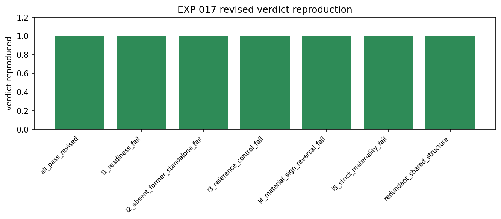
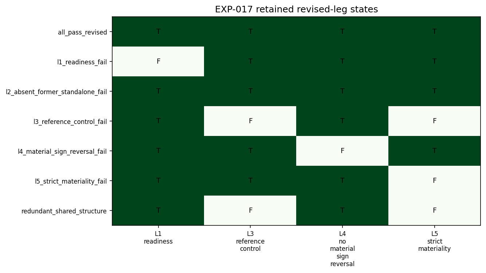

# Experiment Report: EXP-017 - Revised Incremental Referee Golden-Fixture Correctness

## Status: COMPLETED

**Date**: 2026-06-05
**Instruments**: Fixture labels only; no market data read
**Data Views / Feature Categories**: Seeded-deterministic in-memory return-space and R/C position fixtures

---

## Question

Does the revised incremental referee, with L2 removed and retained legs L1/L3/L4'/strict-L5, reproduce predeclared fixture behavior before calibration?

## Hypothesis

The revised incremental referee reproduces predeclared fixture verdicts, exposes all retained legs without short-circuit, omits L2 from gate output, and keeps the incremental-beyond-R claim in the retained leg set.

## Method Summary

The experiment replayed seven seeded-deterministic fixtures covering all-pass, retained-leg failures, a former L2-isolated failure now expected to pass, and redundant shared-structure rejection. It compared observed verdicts and retained-leg states to predeclared expectations and separately checked that no emitted revised-gate leg begins with `L2`.

## Key Findings

### Finding 1: Revised Fixture Verdicts All Match

`results/fixture_results.csv` reports 7/7 `verdict_status = PASS`, and `results/mismatch_details.csv` is empty. This includes the `l2_absent_former_standalone_fail` fixture, which has `legacy_l2_pass_diagnostic = false` but revised verdict PASS.

### Finding 2: Retained Legs Are Exposed and L2 Is Absent

`results/leg_exposure_matrix.csv` reports 28/28 retained-leg checks PASS, covering L1, L3, L4', and L5 for every fixture. `results/l2_absence_check.csv` reports 7/7 PASS and emits no L2 gate leg.

## Conclusion

**Hypothesis SUPPORTED.**

EXP-017 validates the revised incremental-referee logic gate. The fixture suite confirms the Phase 003b repair at the logic level: standalone L2 is absent, retained legs are visible, and the revised formula behaves as predeclared. This result authorizes EXP-018 to measure operating characteristics of the revised unit.

## Limitations

- Fixture replay validates logic wiring only; it does not estimate FPR, TPR, or MDE.
- No real market data or chart-type data is in scope.
- Fixed-seed bootstrap fixture expectations should be maintained as regression artifacts if the incremental referee changes.

## Implications for Future Research

- EXP-018 can use EXP-017 as a PASS dependency.
- Any future revision of `revised_incremental_gate_row()` should rerun this fixture gate before calibration.

## Recommended Next Experiments

1. **EXP-018**: Measure revised incremental referee portfolio-fitness MDE and redundancy-null FPR across the unchanged dependence grid.

## Artifacts

| Artifact | Path |
| --- | --- |
| Scope | [scope.md](scope.md) |
| Analysis Plan | [analysis-plan.md](analysis-plan.md) |
| Code | [code/](code/) |
| Audit | [audit.md](audit.md) |
| Results | [results.md](results.md) |
| Governance Reviews | [governance/](governance/) |
| Plots | [plots/](plots/) |
