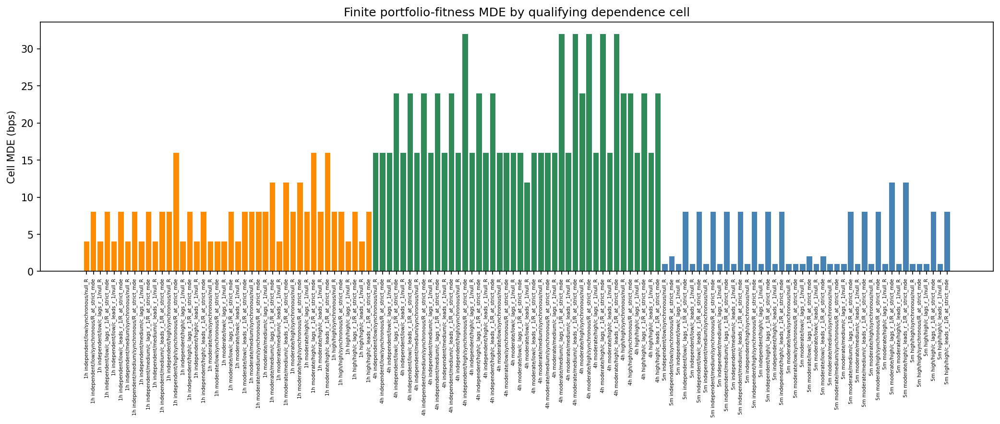
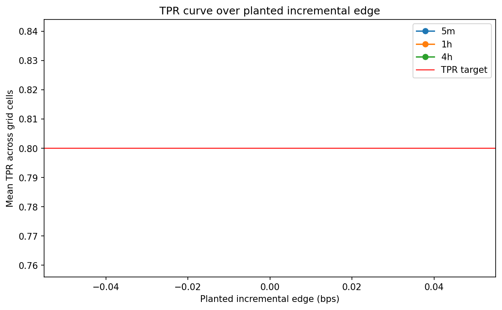
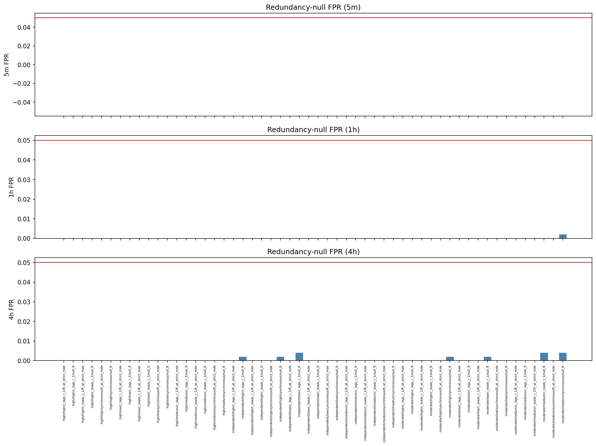

# Experiment Report: EXP-018 - Revised Incremental Referee Portfolio-Fitness Calibration

## Status: COMPLETED

**Date**: 2026-06-05
**Instruments**: BTCUSD, EURUSD, USTEC, XAUUSD
**Data Views / Feature Categories**: 1-minute time bars resampled to 5m, 1h, and 4h OHLC domains; seeded R/C dependence-grid known-truth draws

---

## Question

Does the revised incremental referee attain finite portfolio-fitness MDE at controlled FPR per domain across the unchanged Phase 003 dependence grid, including the EXP-015 stress corner?

## Hypothesis

The revised incremental referee has a finite portfolio-fitness MDE at FPR <= `alpha0` on each domain across the construction-accepted P3-D-dependence grid, and redundancy-null FPR remains controlled at the synchronous/high-overlap/null_R corner where EXP-015 failed.

## Method Summary

EXP-018 generated known-truth R/C draws over the frozen rho, overlap, lag, and reference-strength grid using the first-70% chronological analysis slice. It applied the revised L1/L3/L4'/strict-L5 incremental gate, summarized redundancy-null FPR and positive-edge TPR with Wilson intervals, derived finite cell MDEs, and reported worst-case domain MDEs.

## Key Findings

### Finding 1: The Revised Unit Validates on Accepted Grid Cells

`results/cell_mde_summary.csv` reports 126 PASS cells and 36 CONSTRUCTION_INVALID cells, with no FPR or no-finite-MDE failures. `results/domain_mde_summary.csv` reports 42 finite MDE cells per domain and 0 failing cells.

### Finding 2: Worst-Case Domain MDEs Are 12/16/32 bps

The headline revised-unit domain MDEs are:

| Domain | Domain MDE bps | Finite MDE Cells | Failing Cells | Construction-Invalid or Underpowered Cells |
| --- | ---: | ---: | ---: | ---: |
| 5m | 12.0 | 42 | 0 | 12 |
| 1h | 16.0 | 42 | 0 | 12 |
| 4h | 32.0 | 42 | 0 | 12 |

### Finding 3: The EXP-015 Failure Corner Now Passes

`results/binding_corner_summary.csv` reports PASS for the synchronous/high-overlap/null_R corner across all rho levels and domains. The moderate/high-rho stress rows have finite MDEs of 1.0 bps on 5m, 8.0 bps on 1h, and 24.0 bps on 4h.

## Conclusion

**Hypothesis SUPPORTED.**

The Phase 003b revised incremental unit is calibrated for every construction-accepted dependence-grid cell. FPR remains controlled and finite MDEs are available in all domains. This validates the revised portfolio-fitness unit for composition in EXP-019, while disclosing the infeasible high-rho/low-overlap cells as construction invalid rather than forcing them into pass/fail outcomes.

## Limitations

- The 36 non-PASS cells are construction-invalid, all due to infeasible target rho for overlap combinations; they are not empirical failures.
- The 5m/1h/4h MDEs are worst-case dependence-grid detection floors and should not be read as best-case signal thresholds.
- Real candidate behavior is not tested here.

## Implications for Future Research

- Phase 003b can proceed to the assembled-suite composition anchor.
- Future Phase 004 candidate screens should use the revised incremental MDE map as a qualification floor, not as an optimization target.

## Recommended Next Experiments

1. **EXP-019**: Exercise the assembled strict + ratified-loose + revised-incremental suite on both dogfood reject and synthetic positive pass paths.

## Artifacts

| Artifact | Path |
| --- | --- |
| Scope | [scope.md](scope.md) |
| Analysis Plan | [analysis-plan.md](analysis-plan.md) |
| Code | [code/](code/) |
| Audit | [audit.md](audit.md) |
| Results | [results.md](results.md) |
| Governance Reviews | [governance/](governance/) |
| Plots | [plots/](plots/) |
