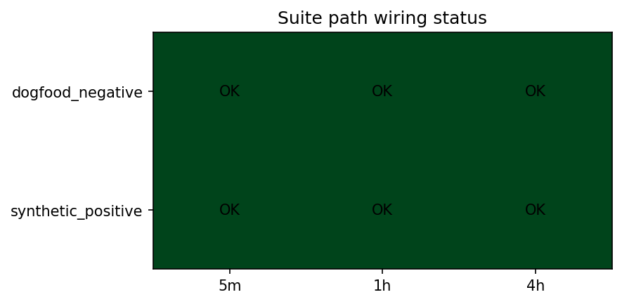
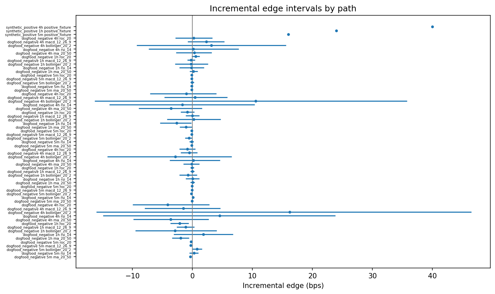
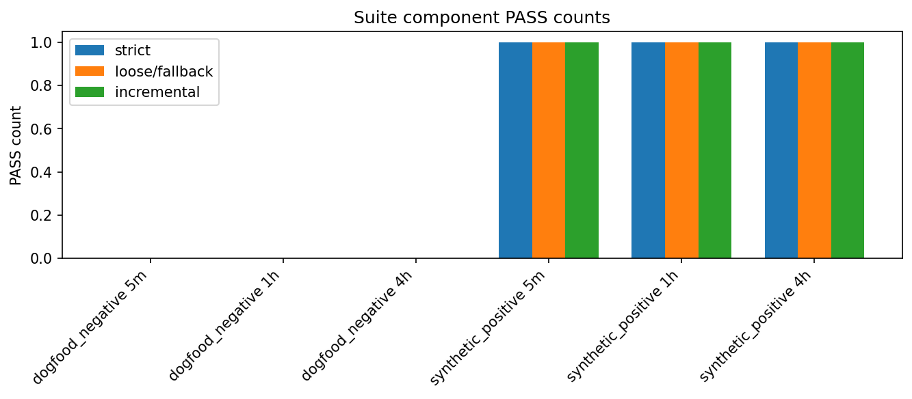

# Experiment Report: EXP-019 - Assembled Suite Composition Anchor

## Status: COMPLETED

**Date**: 2026-06-05
**Instruments**: BTCUSD, EURUSD, USTEC, XAUUSD for dogfood path; EURUSD fixture label for synthetic positive path
**Data Views / Feature Categories**: 5m, 1h, and 4h OHLC domains for dogfood path; deterministic synthetic positive fixture for pass path

---

## Question

Does the assembled strict + ratified-loose + revised incremental qualification suite wire both reject and pass paths end to end before Phase 004 uses it?

## Hypothesis

Exploratory integration claim: conditional on EXP-018 validation and the confirmed dogfood reference book, the assembled suite composes end to end on both the EXP-009 dogfood negative path and a synthetic positive suite-level fixture.

## Method Summary

The experiment assembled the frozen strict referee, EXP-012 ratified-loose referee, and EXP-018 revised incremental unit. It ran the dogfood negative path using the confirmed Donchian(20) reference book and the remaining EXP-009 candidate families, then ran a nonredundant synthetic positive fixture through all suite components.

## Key Findings

### Finding 1: Dogfood Reject Path Is Exercised

The dogfood path reports zero strict passes, zero loose/fallback passes, and zero incremental passes in every domain. `results/suite_composition_summary.csv` marks 5m, 1h, and 4h as `REJECT_PATH_EXERCISED`.

### Finding 2: Synthetic Pass Path Is Exercised

The synthetic positive path reports one strict pass, one loose/fallback pass, and one incremental pass in every domain. `results/positive_fixture_manifest.csv` confirms all positive fixtures are nonredundant.

### Finding 3: Suite Manifests Use Frozen Upstream Decisions

`results/suite_manifest.csv` carries strict MDEs 1/4/12 bps, EXP-012 ratified-loose effective MDEs 0.5/2/8 bps, and EXP-018 revised incremental MDEs 12/16/32 bps for 5m/1h/4h.

## Conclusion

**Integration claim SUPPORTED.**

EXP-019 demonstrates that the concluded suite wires both expected paths: dogfood rejects and synthetic positive passes. Together with EXP-017 and EXP-018, this completes the Phase 003b revised-unit validation and composition chain. Phase 004 can be opened after its mandatory multiplicity-registry precondition is documented.

## Limitations

- This is not new real signal exploration; the real path is the predeclared EXP-009 dogfood lower anchor.
- The positive path is synthetic and exists to validate pass wiring.
- A stale `results/blocker_report.csv` from an earlier blocked state remains in the results directory; current dependency and metadata artifacts supersede it.

## Implications for Future Research

- The framework can now ship as `{strict gate stack, EXP-012 ratified-loose referee, EXP-018 revised incremental unit}`.
- Phase 004 should treat this suite as frozen and should not tune thresholds against candidate outcomes.

## Recommended Next Experiments

1. **Phase 004 setup**: Create the programme-level multiplicity registry and candidate-family scope before any real signal exploration.

## Artifacts

| Artifact | Path |
| --- | --- |
| Scope | [scope.md](scope.md) |
| Analysis Plan | [analysis-plan.md](analysis-plan.md) |
| Code | [code/](code/) |
| Audit | [audit.md](audit.md) |
| Results | [results.md](results.md) |
| Governance Reviews | [governance/](governance/) |
| Plots | [plots/](plots/) |
