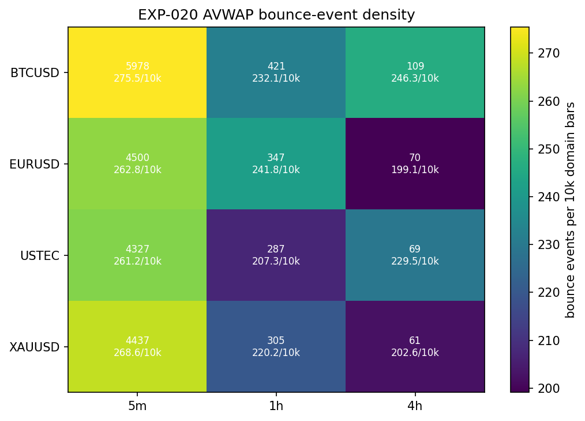
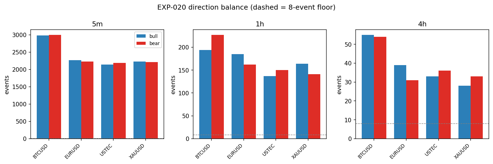

# Experiment Report: EXP-020 — AVWAP Event-Substrate Readiness

## Status: COMPLETED

**Date**: 2026-06-08
**Instruments**: BTCUSD, EURUSD, USTEC, XAUUSD
**Data Views / Feature Categories**: 1-minute time bars resampled to 5m, 1h, 4h domain OHLC bars. No chart-type views.

---

## Question

Can the first-branch AVWAP state machine produce temporally valid anchors, AVWAP values, bands, and bounce events with enough coverage to justify a follow-up real-price reaction study?

## Hypothesis

The Phase 004 Batch 004-A AVWAP definition can be implemented as a deterministic, look-ahead-safe event substrate with usable bounce-event coverage on at least one predeclared domain, without touching the global holdout.

## Method Summary

A sequential state machine processes completed domain bars per instrument/domain: MA(20,50) regime detection, viable-pivot anchor selection, anchored VWAP computation (typical price weighted by TickVolume^0.75), MAD band calculation, and arm/trigger bounce-event logic. Invariant checks independently validate anchor selection, temporal ordering, arm/trigger causality, value consistency, and re-arm sequencing. A full replay pass confirms determinism. Event coverage is classified per scoped readiness thresholds. See [analysis-plan.md](analysis-plan.md) for details.

## Key Findings

### Finding 1: Full Domain Readiness

All three scoped domains (5m, 1h, 4h) are ready with 4/4 reportable instruments each. Every instrument/domain cell produces ≥30 total bounce events and ≥8 events in each direction, meeting the scoped reportability thresholds. The 5m domain carries the highest absolute counts (4,327–5,978 events per instrument), while 4h provides 61–109 events per instrument.

### Finding 2: Deterministic and Causally Sound

The state machine produces identical output on replay (12/12 cells match event and regime hashes). All 192 invariant checks (16 checks × 12 cells) pass with zero violations, independently validating anchor selection, arm/trigger causality, temporal ordering, and re-arm sequencing.

### Finding 3: Balanced Direction Coverage

Direction balance holds across all cells (bull fractions 0.46–0.56), with no degenerate single-direction coverage for any instrument or domain.

### Finding 4: Holdout Exclusion Verified

All analyses use exactly the first 70% of chronologically ordered source data (verified per instrument). Zero holdout fence violations across all event rows.

## Conclusion

**Hypothesis SUPPORTED_FULL.**

The CF-AVWAP-001 first branch is a deterministic, look-ahead-safe event substrate with usable bounce-event coverage on all three scoped domains. All Evidence-FOR criteria are met: invariant integrity, deterministic replay, and at least one ready domain (all three). The phase's first gate is open — EXP-021 and EXP-022 may scope reaction and lifetime-move studies on any subset of the ready domains.

## Limitations

1. Readiness is not signal quality — reportable event counts do not imply predictive value.
2. Determinism verified within one execution environment; cross-platform floating-point differences could produce divergent hashes without changing event counts or direction labels.
3. EURUSD/4h has the lowest single-direction count (31 bear events), which may widen confidence intervals in follow-up reaction studies.
4. Result does not generalize to other regime detectors (Line Break, Market Bias, ATR pivot, etc.).

## Implications for Future Research

- The event substrate is now proven — EXP-021 and EXP-022 can use the generated event metadata without reconstructing the AVWAP state machine.
- The 4h domain has usable coverage but may require pooled-instrument or direction-pooled designs for statistical power.
- Non-baseline AVWAP branches (LB, MB, ATR, ALPHA, BAND, etc.) each require their own substrate-readiness experiments before reaction studies.

## Recommended Next Experiments

1. **EXP-021**: Scope a fixed-horizon direction-signed reaction study testing whether bounce events show better real-price outcomes than matched controls, on any subset of the ready domains.
2. **EXP-022**: Scope the original band-target and trend-change lifetime-move study using the stored favorable/adverse target fields.

## Artifacts

| Artifact | Path |
|----------|------|
| Scope | [scope.md](scope.md) |
| Analysis Plan | [analysis-plan.md](analysis-plan.md) |
| Code | [code/](code/) |
| Audit | [audit.md](audit.md) |
| Results | [results.md](results.md) |
| Governance Reviews | [governance/](governance/) |
| Plots | [plots/](plots/) |
