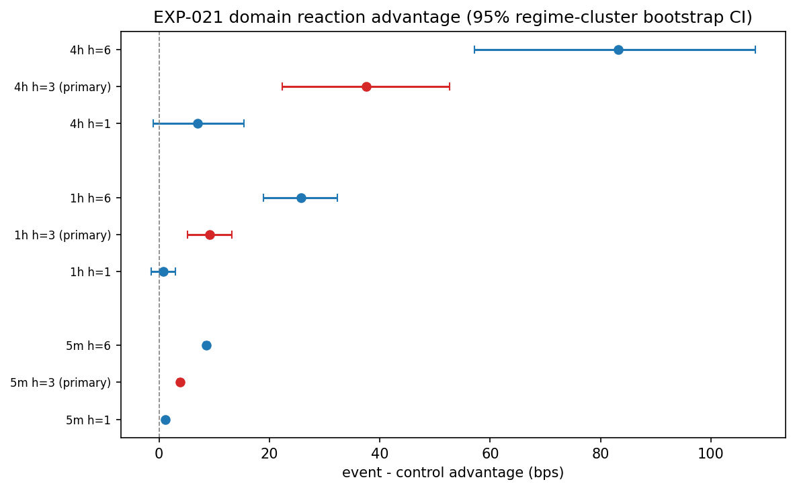

# Experiment Report: EXP-021 — AVWAP Bounce Reaction Study

## Status: COMPLETED

**Date**: 2026-06-08
**Instruments**: BTCUSD, EURUSD, USTEC, XAUUSD
**Data Views / Feature Categories**: 5m/1h/4h domain OHLC bars from 1-minute time bars (first-70% analysis slice); EXP-020 AVWAP bounce event substrate

---

## Question

After a registered AVWAP bounce triggers, do real domain closes move farther in the bounce direction over a fixed short horizon than comparable non-event bars from the same instrument, domain, and regime direction?

## Hypothesis

AVWAP bounce events from the supported CF-AVWAP-001 first branch show better fixed-horizon direction-signed real-price reaction than matched non-event controls on at least one EXP-020 ready domain, without touching the global holdout.

## Method Summary

Dependency gate on EXP-020 (SUPPORTED_FULL, ready 5m/1h/4h, zero invariant violations). Domain bars rebuilt from the first-70% analysis slice. Matched non-event controls selected from the same MA(20,50) regime by nearest anchor age and timestamp (up to 5 per event, minimum 3 for reportability). Direction-signed log returns computed at 1/3/6 completed bars. Domain-level effect estimated as equal-weight mean of per-instrument event-weighted paired differences, with 95% regime-cluster bootstrap CI and stratified paired sign-permutation p-value (Holm-adjusted across 3 domains). See [analysis-plan.md](analysis-plan.md) for details.

## Key Findings

### Finding 1: Bounce reaction positive across all domains

The primary 3-bar event-control advantage is positive in every domain with CI lower bounds well above zero:

| Domain | N events | Effect (bps) | 95% CI (bps) | Holm p |
|--------|----------|-------------|--------------|--------|
| 5m | 16,249 | +3.8 | [+3.5, +4.1] | 0.0003 |
| 1h | 1,207 | +9.1 | [+5.1, +13.3] | 0.0003 |
| 4h | 246 | +37.6 | [+22.3, +52.7] | 0.0003 |

All three domains meet Evidence-FOR criteria: effect > 0, CI lower > 0, Holm p ≤ 0.05, and no domain has both secondary horizons negative.

### Finding 2: Effect is consistent across instruments and directions

All 24 instrument×direction cells have positive mean paired differences at the primary horizon (see [instrument_direction_heatmap.png](plots/instrument_direction_heatmap.png)). The weakest cell is XAUUSD/1h/bull at +1.2 bps; the strongest is BTCUSD/4h/bull at +96.7 bps. Every instrument in every domain is reaction-reportable (≥30 events, ≥8 per direction).

### Finding 3: Effects scale monotonically with horizon

1-bar and 6-bar horizon effects are also positive in every domain, confirming the bounce reaction persists and compounds over at least 6 completed bars rather than reversing (see [event_control_distributions.png](plots/event_control_distributions.png)).

### Finding 4: Control matching is healthy

Reportable events average 4.5–5.0 matched controls. Non-reportable events are dominated by within-regime `insufficient_same_regime_controls` (see [control_match_diagnostics.png](plots/control_match_diagnostics.png)). All three domains have 4/4 instruments reportable.

## Conclusion

**Hypothesis SUPPORTED.**

AVWAP bounce events carry directional information relative to within-regime non-event controls across all three domains, all four instruments, and both regime directions. The primary 3-bar effect is positive, tightly estimated, survives Holm adjustment, and is stable across secondary horizons. The fixed-horizon bounce reaction operationalization of CF-AVWAP-001/HYP-002 is confirmed.

This result supports proceeding to EXP-022 (Lifetime Move Study) as the next component gate. EXP-021 alone cannot authorize EXP-023 cTrader screening.

## Limitations

1. **4h sample is small** (246 events). The CI is wide (22–53 bps). The large paired difference is partly driven by extreme negative control returns (−75 to −94 bps at BTCUSD), which inflate the event-control contrast.
2. **Same-regime control restriction** is conservative but reduces coverage for short regimes. The cost is visible in diagnostics and scoped, but results apply to regimes long enough to supply ≥3 eligible controls.
3. **Event-reaction returns are not strategy P&L.** No costs, slippage, execution lag, or position sizing are modeled.

## Implications for Future Research

- A positive fixed-horizon reaction signal is necessary but not sufficient for a tradeable strategy. EXP-022 must test the alternative lifetime operationalization before any cTrader screen.
- The broad instrument coverage (4/4 per domain) means the effect is not an instrument-specific artifact; domain-level results are robust.

## Recommended Next Experiments

1. **EXP-022 (AVWAP Original Lifetime Move Study)**: Test the band-target/trend-change move-completion method and lifetime metrics against a look-ahead-safe benchmark.
2. **EXP-023 (AVWAP Baseline Candidate Screen)**: Conditional on EXP-021 + EXP-022 supporting, screen the baseline AVWAP signal through the frozen suite via the cTrader strategy-host branch.

## Artifacts

| Artifact | Path |
|----------|------|
| Scope | [scope.md](scope.md) |
| Analysis Plan | [analysis-plan.md](analysis-plan.md) |
| Code | [code/](code/) |
| Audit | [audit.md](audit.md) |
| Results | [results.md](results.md) |
| Governance Reviews | [governance/](governance/) |
| Plots | [plots/](plots/) |
