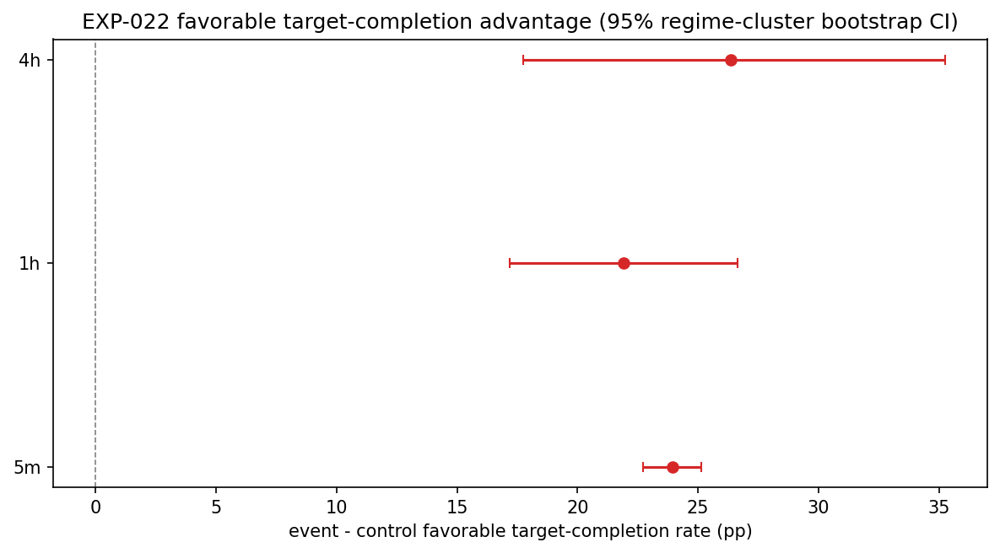

# Experiment Report: EXP-022 — AVWAP Original Lifetime Move Study

## Status: COMPLETED

**Date**: 2026-06-08
**Instruments**: BTCUSD, EURUSD, USTEC, XAUUSD
**Data Views / Feature Categories**: 5m (strict), 1h and 4h (`min_coverage=0.90`) OHLC domains from first-70% analysis slice; EXP-020 AVWAP events (CF-AVWAP-001 first branch); no chart-type views.

---

## Question

When an AVWAP bounce triggers, does the registered band-target/trend-change lifetime method resolve more favorably than the same lifetime challenge started from comparable non-event bars?

## Hypothesis

Under the registered band-target/trend-change lifetime definition, AVWAP bounce events from the supported CF-AVWAP-001 first branch produce more favorable completed-move outcomes than matched non-event lifetime analogs on at least one EXP-020 ready domain, without touching the global holdout.

## Method Summary

For each AVWAP bounce event in the EXP-020 substrate (all ~14,000 events across 4 instruments × 3 domains × 2 directions), scan completed domain closes from trigger+1 onward. Record which outcome comes first: favorable target, adverse target, trend-change (opposite MA(20,50) regime confirmation), or unfinished. Match each event with up to 5 same-regime non-event controls by nearest anchor age and timestamp, transferring the event's frozen target distances (log bps) to the control close. Compute the instrument-averaged event-minus-control favorable target-completion rate difference with a regime-cluster bootstrap CI and a stratified paired permutation test with Holm adjustment across the 3 domains. See [analysis-plan.md](analysis-plan.md) for details.

## Key Findings

### Finding 1: All Three Domains Show a Large Favorable Rate Advantage

Events complete favorably at 67-69% versus controls at 42-45% across all domains:

| Domain | Rate Diff (pp) | 95% CI | Holm p |
|--------|---------------|--------|--------|
| 5m | +23.9 | [22.7, 25.1] | 0.0003 |
| 1h | +21.9 | [17.2, 26.6] | 0.0003 |
| 4h | +26.4 | [17.7, 35.3] | 0.0003 |

### Finding 2: Lifetime Expectancy Confirms the Rate Advantage

Events realize larger per-completion log returns than controls in every domain, especially at longer horizons where targets are wider.

| Domain | Expectancy Diff (bps) | 95% CI |
|--------|---------------------|--------|
| 5m | +6.5 | [6.1, 7.0] |
| 1h | +27.0 | [20.4, 34.4] |
| 4h | +79.6 | [54.9, 105.8] |

### Finding 3: Controls Are Well Matched

Volatility-context ratios are near 1.0 for all domains (0.986–1.024), confirming control bars face comparable local volatility to events. Unfinished moves are <0.1% (analysis set spans years), so the target-completion denominator is not meaningfully eroded.

## Conclusion

**SUPPORTED**

The original band-target/trend-change lifetime method produces substantially more favorable outcomes for AVWAP bounce events than matched non-event controls on every EXP-020 ready domain. The result is consistent across instruments, directions, and bounce subtypes. The lifetime component supports proceeding to baseline strategy screening (EXP-023) through the cTrader strategy-host branch and frozen qualification suite.

## Limitations

- Specific to the CF-AVWAP-001 first-branch definition. Other branches may differ.
- ~4,600 events with geometrically invalid targets were excluded. This is correct but reduces effective event counts in cells with tight A/VWAP spreads.
- Matched-control design cannot control for unmeasured confounders that differ between bounce-trigger bars and non-trigger bars.
- This is a component result (lifetime method), not a strategy P&L result. EXP-023 remains required.

## Implications for Future Research

- The strong lifetime result across all three domains clears the Phase 004 gate to proceed toward EXP-023 (baseline candidate screen) if the checkpoint's PROCEED_TO_SCREEN criteria are met.
- Non-baseline AVWAP branches (Line Break regime, Market Bias regime, ATR pivot-reversal) remain registered for future comparator experiments, contingent on EXP-023 outcomes.

## Recommended Next Experiments

1. **EXP-023**: AVWAP Baseline Candidate Screen — test the CF-AVWAP-001 signal through the frozen strict + loose + incremental qualification suite using the cTrader strategy-host branch.

## Artifacts

| Artifact | Path |
|----------|------|
| Scope | [scope.md](scope.md) |
| Analysis Plan | [analysis-plan.md](analysis-plan.md) |
| Code | [code/](code/) |
| Audit | [audit.md](audit.md) |
| Results | [results.md](results.md) |
| Governance Reviews | [governance/](governance/) |
| Plots | [plots/](plots/) |
