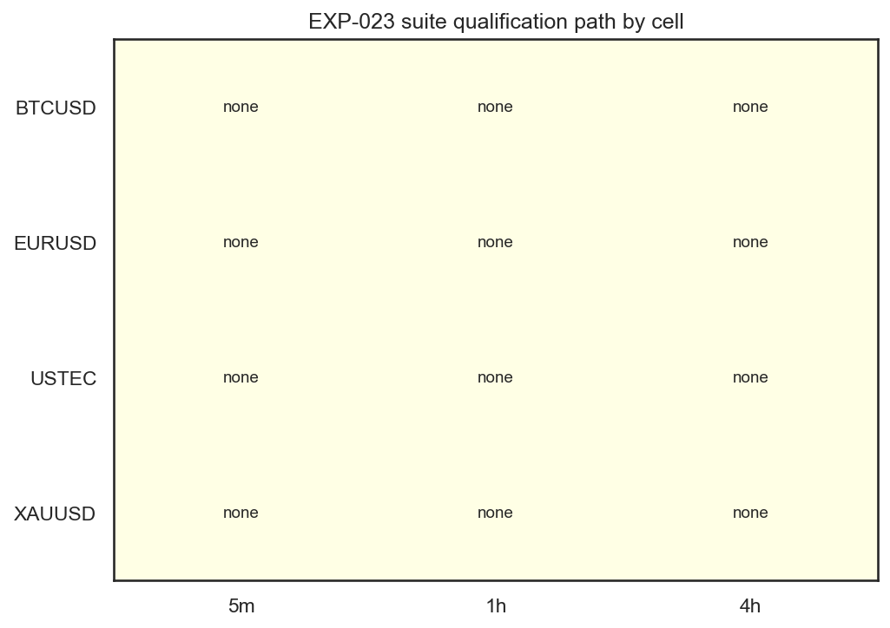
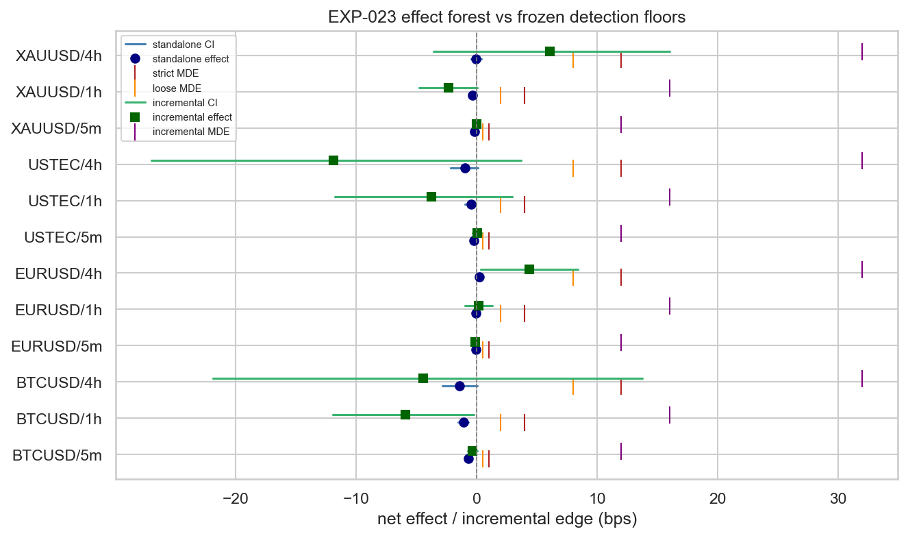

# Experiment Report: EXP-023 — AVWAP Baseline Candidate Screen

> **⚠ SUPERSEDED (framing-corrected) — 2026-06-08.** The REFUTED verdict in this
> report is valid **only as a per-bar continuous-position screen**. It is **not** a
> tradability test of the original selective event vehicle: a ~6%-active signal was
> scored against a per-bar MDE floor calibrated for ≥80%-active series (EXP-005), so
> the result is dominated by ~16× denominator dilution, not absence of signal. The
> position rule was ~faithful; the **evaluation yardstick** was wrong. Record
> retained (no erasure); conclusion corrected. Re-screened faithfully under an
> event-level method in **EXP-028** (checkpoint
> `2026-06-08-006-avwap-evaluation-correction`). Root-cause review:
> `docs/code-reviews/2026-06-08-avwap-evaluation-framing-divergence-review.md`.

## Status: COMPLETED (Hypothesis REFUTED) → SUPERSEDED (framing-corrected)

**Date**: 2026-06-08
**Instruments**: BTCUSD, EURUSD, USTEC, XAUUSD
**Data Views / Feature Categories**: cTrader `Mode=StrategyHost` AVWAP-baseline runs (CF-AVWAP-001 first branch) and aligned Donchian(20) reference, on 5m/1h/4h domains, evaluated on emitted real OHLC (`RealClose`); first-70% analysis slice only

---

## Question

Does the full CF-AVWAP-001 baseline signal — generated inside cTrader's engine and
evaluated on the real prices it executed on — survive the frozen Phase 004
qualification suite, after EXP-020/021/022 supported its substrate, bounce
reaction, and lifetime-move components?

## Hypothesis

The registered CF-AVWAP-001 baseline signal can qualify under at least one
component of the frozen Phase 004 suite — standalone strict, standalone
ratified-loose/fallback, or revised portfolio-fitness against the existing
D-dogfood-book Donchian(20) reference — while reporting the original AVWAP
strategy metric book, without touching the global holdout.

## Method Summary

The cTrader strategy-host branch emitted positions/events/trades for the AVWAP
baseline and Donchian(20) across all 12 instrument×domain cells, each fenced by
`AnalysisEndUtc` to the first-70% analysis slice. A Python harness ingested and
validated only — it never regenerated the candidate signal for screening — then
routed each admitted run through the **unchanged** frozen suite: the strict gate
stack (EXP-003/005), the EXP-012 ratified-loose/strict-fallback referee, and the
EXP-018 revised portfolio-fitness unit, all at α₀=0.05 with frozen bootstrap
settings. Returns were computed from emitted `RealClose`. A one-time C# AVWAP
transcription smoke against the `xen.avwap` reference, the original strategy
metric book, and event/trade diagnostics completed the screen. See
[analysis-plan.md](analysis-plan.md) for full methodology.

## Key Findings

### Finding 1: No suite component qualified any cell

All 12 cTrader cells were admitted (same-feed Donchian reference aligned exactly,
holdout fence respected, C# smoke PASS on all domains), yet no cell passed any
suite component: **0/12 strict, 0/12 ratified-loose/fallback, 0/12 revised
portfolio-fitness.**

*Figure 1 — `plots/suite_verdict_matrix.png`: qualification path per cell; all 12 cells resolve to no pass.*

### Finding 2: Effects sit far below every frozen detection floor

Standalone net effects ranged −1.41 bps (BTCUSD/4h) to +0.21 bps (EURUSD/4h) against
strict MDEs of 1.0/4.0/12.0 bps (5m/1h/4h); every `ci_lower` was below the
ratified-loose τ (0.375/0.375/1.5 bps). Revised-incremental edges versus Donchian(20)
ranged −11.90 to +6.05 bps against floors of 12/16/32 bps. The largest positive
points (EURUSD/4h +4.39, XAUUSD/4h +6.05 incremental) remain far below floor with
confidence intervals at or through zero — not evidence of edge.

*Figure 2 — `plots/effect_forest.png`: per-cell standalone net effects and incremental edges with CIs against strict, loose, and incremental detection floors; all effects sit well left of their floors.*

### Finding 3: High favorable-target rate, but ~zero-to-negative net expectancy

On real prices the baseline reaches its favorable target in 60–80% of resolved
moves, yet `model_net_bps` is ~0-to-negative in every cell (e.g. BTCUSD/5m −0.74,
BTCUSD/4h −1.36; only EURUSD/4h marginally +0.08). The model risk-adjusted level
(mean/std) is negative versus a small positive raw level. The reason is
mechanical: the favorable-target rate excludes trend-change exits, while net
expectancy and lifetime returns include them — trend-change exits plus per-active-bar
cost erode the edge.

- *`plots/event_trade_outcome_composition.png`*: favorable / adverse / trend-change /
  unfinished move mix per cell — trend-change exits are a material share.
- *`plots/model_vs_raw_cumulative_returns.png`*: model-net vs raw cumulative real return
  by domain; model curves do not outperform raw holding.
- *`plots/risk_adjusted_heatmap.png`*: model − raw mean/std level (the robust mean/MAD
  ratio is undefined for the sparse position series, ~93% flat — a scope-sanctioned
  null, not a gating failure).

## Conclusion

**Hypothesis REFUTED.**

The CF-AVWAP-001 baseline signal did not qualify under any component of the frozen
Phase 004 suite. All dependency gates and run-admission checks passed and all 12
cells were reportable against an aligned same-feed reference, so this is a
complete, admissible **Evidence-AGAINST** result — not a blocked or inconclusive
screen. The supportive conditional-event evidence from EXP-021 (fixed-horizon
bounce reaction) and EXP-022 (band-target/trend-change lifetime) did not carry
through to a tradable, always-on, cost-bearing position judged by a stringent
referee. A conditional edge around an event can be real and still fail to survive
as a continuously held strategy once cost, holding periods, and trend-change exits
are imposed against a detection floor. The screen bounds the baseline's edge to
below every frozen floor on the analysis set; it does not prove the edge is
exactly zero.

## Limitations

- Single untuned frozen branch (MA(20,50) regime, typical-price AVWAP,
  `TickVolume**0.75`, MAD band ×1.0, registered lifetime exits); no parameter was
  tuned, by design.
- First-70% analysis slice only; the final 30% global holdout remained sealed — no
  out-of-sample confirmation is claimed.
- The revised-incremental floors (12/16/32 bps) are the suite's least sensitive
  component; a sub-floor positive marginal edge would be undetectable here. The
  small positive 4h incremental points are below floor with CIs at/through zero.
- The primary robust mean/MAD model risk level is undefined for the sparse series;
  the mean/std diagnostic is used for the model-vs-raw comparison (both agree the
  model is not risk-superior to raw holding).

## Implications for Future Research

- This is a negative result for the **baseline branch only**. Per checkpoint
  `design.md` §8, COMPONENT_REFUTED (family retirement) requires substrate failure
  or both reaction *and* lifetime operationalizations failing — neither occurred —
  so CF-AVWAP-001 is **not** retired.
- File-drawer discipline: this REFUTED outcome must be registered under
  CF-AVWAP-001/HYP-004 in `docs/signal-registry/multiplicity-registry.md`.
- The high-hit-rate / negative-expectancy pattern points at exit design (cost and
  trend-change drag) as the binding constraint, not bounce detection.

## Recommended Next Experiments

1. **EXP-XXX (proposed)** — one new scoped experiment per registered non-baseline
   branch, one falsifiable question at a time: `CF-AVWAP-001/LB` (Line Break
   regime), `/MB` (Market Bias regime), `/ATR` (ATR pivot-reversal), `/ALPHA`
   (volume-exponent sensitivity), `/BAND` (band-multiplier sensitivity),
   `/MA-DOMAIN`, `/XTF`, or `/EXIT` (only after concrete exit rules are scoped).
   Registration is not permission to sweep — each needs a dedicated scope.
2. **EXP-XXX (proposed, diagnostic only)** — a registered study of why a 60–80%
   favorable-target rate yields negative net expectancy (trend-change-exit drag and
   cost decomposition) to inform `/EXIT` design. Diagnostic, not a qualification
   path.

## Artifacts

| Artifact | Path |
|----------|------|
| Scope | [scope.md](scope.md) |
| Analysis Plan | [analysis-plan.md](analysis-plan.md) |
| Code | [code/run_experiment.py](code/run_experiment.py) |
| Audit | [audit.md](audit.md) |
| Results | [results.md](results.md) |
| Governance Reviews | [governance/](governance/) |
| Results data | [results/](results/) |
| Plots | [plots/](plots/) |
