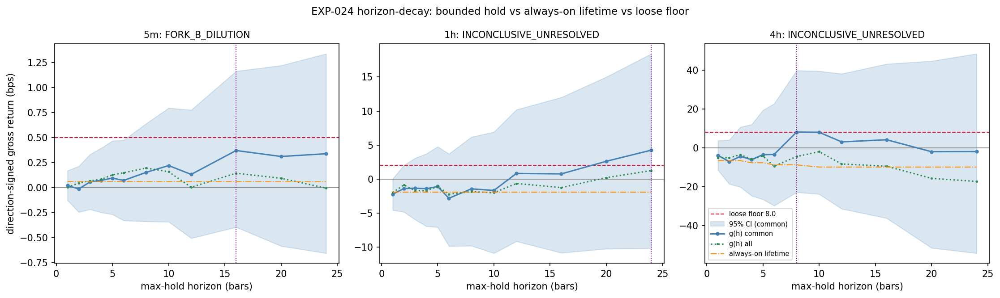
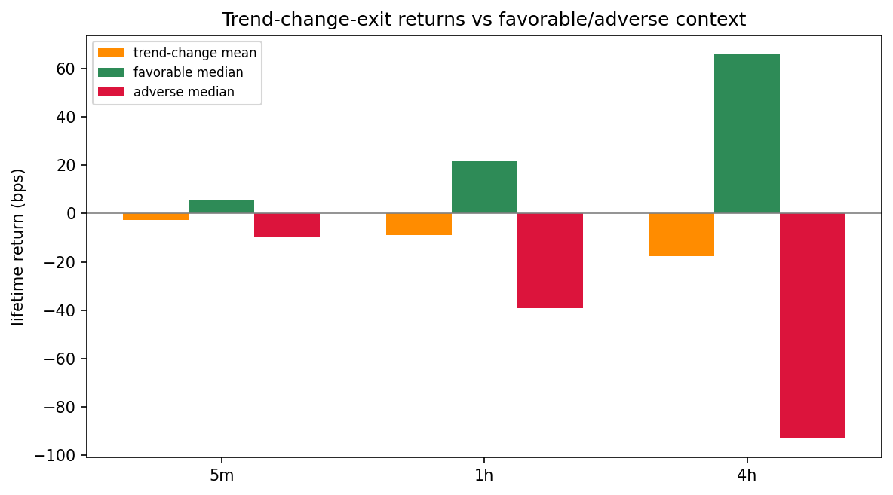

# Experiment Report: EXP-024 — AVWAP Event-Edge Dissipation Decomposition

> **⚠ RETAINED, fork leg discounted — 2026-06-08.** The headline fork-(b) leg
> compared a cumulative per-event hold return against a **per-bar** suite floor — a
> category mismatch that makes fork (b) near-foreordained and low-information. Two
> findings here are **valid and retained**: (1) the event edge is
> relative-not-absolute (the raw directional hold return is ~0 even though EXP-021's
> control-excess reaction was positive); (2) trend-change exits cut **losers**, not
> winners. Read this report for those findings, not for the fork verdict. Context:
> checkpoint `2026-06-08-005` (HALTED) → `2026-06-08-006`; review
> `docs/code-reviews/2026-06-08-avwap-evaluation-framing-divergence-review.md`.

## Status: COMPLETED (Diagnostic MIXED_OR_INCONCLUSIVE) — RETAINED, fork leg discounted

**Date**: 2026-06-08  
**Instruments**: BTCUSD, EURUSD, USTEC, XAUUSD  
**Data Views / Feature Categories**: EXP-020 AVWAP bounce events, EXP-021 fixed-horizon reaction rows, EXP-022 lifetime observations, and rebuilt 5m/1h/4h real OHLC domain bars from the first-70% analysis slice

---

## Question

Between EXP-021's positive fixed-horizon AVWAP bounce reaction and EXP-023's
~0-to-negative always-on strategy expectancy, is the edge mainly lost to a
fixable holding/exit problem, or to entry/position dilution that makes the
always-on/bounded-hold overlay the wrong vehicle?

## Hypothesis

EXP-024 is diagnostic rather than a qualification hypothesis. It predeclared a
fork:

- **fork (a)**: bounded max-hold returns clear the ratified-loose floor and beat
  the lifetime hold by a material margin, justifying a scoped `/EXIT` candidate;
- **fork (b)**: all adequately powered bounded horizons remain below the floor,
  implying entry/position dilution rather than a fixable exit problem.

## Method Summary

The experiment rebuilt real 5m/1h/4h domain close arrays from the first-70%
analysis slice, joined EXP-020 bounce events to EXP-022 lifetime outcomes, and
computed direction-signed real-close gross returns over the fixed horizon grid
`{1,2,3,4,5,6,8,10,12,16,20,24}`. It compared bounded-hold returns to the
full-lifetime hold on common completed event sets, with regime-cluster bootstrap
CIs and Holm adjustment across horizons. See [analysis-plan.md](analysis-plan.md)
for full methodology.

## Key Findings

### Finding 1: Audit guardrails pass after matched cross-check correction

The rerun exactly reproduces EXP-021 event returns on matched reportable rows:
`exp021_crosscheck.csv` reports max mean and row absolute difference `0.0` bps
across the `{1,3,6}` horizon checks. `event_join_diagnostics.csv` confirms the
EXP-020 event to EXP-022 lifetime left join preserves row counts and has 0
duplicate event or lifetime join keys.

This resolves the prior audit blocker and makes the decomposition interpretable.

### Finding 2: Primary 5m domain resolves fork (b)

The best 5m bounded-hold horizon is `h=16`: `g*=+0.370` bps, below the 5m
ratified-loose floor of `0.5` bps, with CI `[-0.396, +1.164]` and `n=15,037`.
Every adequately powered 5m horizon remains below the floor. The bounded-vs-
lifetime advantage at `h*` is only `+0.312` bps, below the required `0.5` bps
margin.

*Figure 1 — `plots/horizon_decay.png`: bounded-hold gross return curves versus
lifetime reference and loose floors. The 5m curve never reaches the 0.5 bps floor.*

### Finding 3: 1h and 4h are unresolved, not fork (a)

The slower domains have above-floor point estimates but unusable floor-clearance
precision:

| Domain | Best horizon | `g*` bps | Floor bps | 95% CI | N | Verdict |
| --- | ---: | ---: | ---: | --- | ---: | --- |
| 1h | 24 | +4.248 | 2.0 | [-10.190, +18.417] | 1,033 | `INCONCLUSIVE_UNRESOLVED` |
| 4h | 8 | +8.137 | 8.0 | [-22.769, +39.747] | 233 | `INCONCLUSIVE_UNRESOLVED` |

Neither domain clears the fork (a) precision rule. They also cannot be called
fork (b), because their point estimates reach or exceed the floor.

### Finding 4: Trend-change exits are negative on average

Trend-change lifetime returns are negative in all domains: 5m `-2.79` bps
(`[-3.32, -2.32]`), 1h `-8.76` (`[-15.03, -3.24]`), and 4h `-17.59`
(`[-40.38, +3.68]`). Negative fractions are 65.8%, 56.9%, and 54.0%.

*Figure 2 — `plots/trend_change_returns.png`: trend-change exits are adverse on
average, which weakens the simple "holding too long gives back winners" story.*

### Finding 5: Sparse exposure dilutes the conditional component edge

Event prevalence is low relative to domain bars: 2.68% on 5m, 2.26% on 1h, and
2.21% on 4h. Reconstructed active-bar fractions are similarly sparse:
6.17%, 5.73%, and 5.67%. Pyramid bounces are a large share of events
(9,679/19,242 on 5m).

This makes the EXP-023 baseline failure coherent with EXP-021/022: the
conditional event signal can be real while the always-on or bounded-hold vehicle
expresses too little recoverable gross edge.

## Conclusion

**Diagnostic verdict: MIXED_OR_INCONCLUSIVE.**

The primary 5m domain resolves to **FORK_B_DILUTION**: bounded-hold returns do
not reach the loosest suite floor, even before cost. The 1h and 4h domains remain
`INCONCLUSIVE_UNRESOLVED` because their CIs are too wide for floor-clearance
decisions. No domain supports fork (a).

Under the Phase 005 design, this does **not** automatically justify EXP-026
`/EXIT`. Opening `/EXIT` would require explicit operator/governance handling of
the mixed/inconclusive result, rather than treating EXP-024 as a clean
exit-fixable diagnosis.

## Limitations

- Diagnostic only: no frozen qualification suite and no candidate-screening slot.
- Slower domains are under-resolved for the floor-clearance question despite
  meeting minimum event counts.
- EXP-021 and EXP-024 estimate different quantities: matched event-vs-control
  reaction versus all/completed-event bounded-hold return.
- First-70% analysis slice only; the final 30% global holdout stayed sealed.

## Implications for Future Research

- The always-on/bounded-hold overlay is weak on the primary domain; exit timing
  alone is not a clean repair path from EXP-024.
- EXP-025 remains important because it tests whether price reacts directly at the
  AVWAP line, rather than whether an event-entry vehicle carries tradable edge.
- Stage C detector/anchor branches may be higher-value than exit-only repair if
  EXP-025 supports the line S/R mechanism.

## Recommended Next Experiments

1. **EXP-025 — AVWAP Line Support/Resistance Direct Test**: proceed with the
   remaining Phase 005 Stage A diagnostic.
2. **EXP-026 `/EXIT`**: do not run automatically from EXP-024 alone. If pursued,
   scope it explicitly as mixed/inconclusive-derived and run pre-execution
   governance before any candidate screen.

## Artifacts

| Artifact | Path |
|----------|------|
| Scope | [scope.md](scope.md) |
| Analysis Plan | [analysis-plan.md](analysis-plan.md) |
| Code | [code/run_experiment.py](code/run_experiment.py) |
| Audit | [audit.md](audit.md) |
| Results | [results.md](results.md) |
| Governance Reviews | [governance/](governance/) |
| Raw Results | [results/](results/) |
| Plots | [plots/](plots/) |
