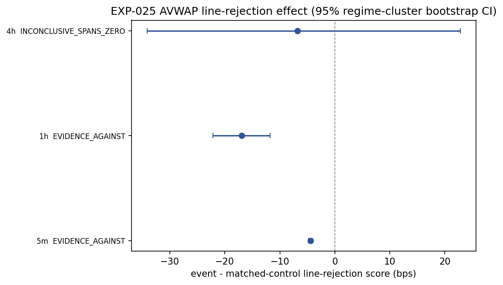
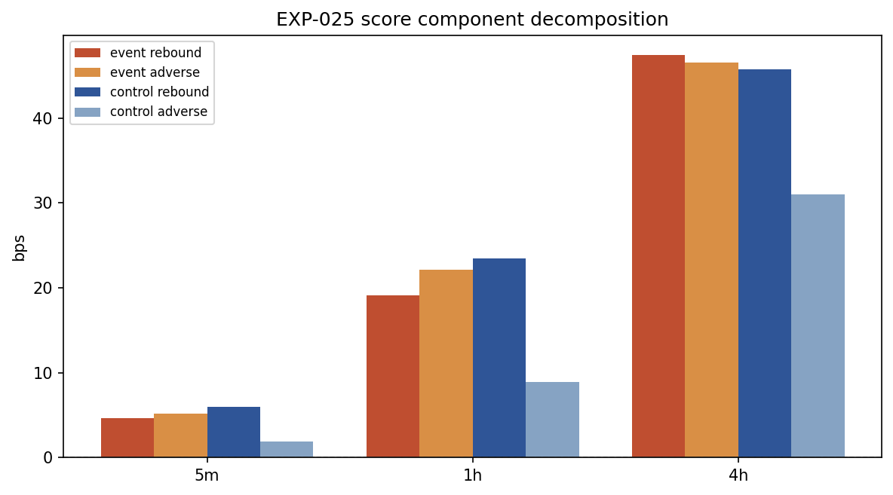

# Experiment Report: EXP-025 — AVWAP Line Support/Resistance Direct Test

> **⚠ INCONCLUSIVE — non-informative for HYP-001 — 2026-06-08.** The event-bar
> line-rejection metric is structurally confounded: a bounce trigger crosses AVWAP
> intrabar **by definition**, which inflates adverse penetration and biases the
> metric negative before any data is seen. This experiment therefore did **not**
> test HYP-001 (does price respect the AVWAP line as S/R) — **HYP-001 remains
> untested.** The result carries zero weight in the Stage A synthesis. Context:
> checkpoint `2026-06-08-005` (HALTED) → `2026-06-08-006`; review
> `docs/code-reviews/2026-06-08-avwap-evaluation-framing-divergence-review.md`.

## Status: INCONCLUSIVE (non-informative for HYP-001)

**Date**: 2026-06-08
**Instruments**: BTCUSD, EURUSD, USTEC, XAUUSD
**Data Views / Feature Categories**: 5m/1h/4h OHLC domains rebuilt from first-70% 1-minute analysis slices via EXP-020 conventions; EXP-020 avwap_events.csv event definitions; same-regime non-event controls with line-proximity matching

---

## Question

Does price measurably react at the AVWAP line itself as support/resistance, or were the EXP-021/022 positives mostly regime-gated continuation and completion effects rather than direct line reaction?

## Hypothesis

AVWAP bounce trigger bars from the supported CF-AVWAP-001 first branch show a larger event-bar AVWAP line-rejection score than matched same-regime non-event control bars on at least one EXP-020 ready domain, without touching the global holdout.

## Method Summary

Domain OHLC bars (5m/1h/4h) were rebuilt from exact EXP-020 source files within the first-70% analysis slice and validated against EXP-020 metadata. Per-bar AVWAP and band-spread values were replayed deterministically from each regime's anchor. The primary metric — line-rejection score = `close_rebound_bps - adverse_penetration_bps` — was computed at the trigger bar for each EXP-020 bounce event. Up to 5 same-regime line-proximate non-event controls were matched per event. Domain-level effects were estimated via equal-weight instrument means of event-weighted cell means, with 95% regime-cluster bootstrap CIs and Holm-adjusted stratified paired sign permutation tests. See [analysis-plan.md](analysis-plan.md) for full methodology.

## Key Findings

### Finding 1: Primary effects are consistently negative across all domains

The domain-level paired line-rejection advantage (event score minus mean matched-control score) is negative in every reportable domain. No domain has a positive point estimate, so Evidence FOR cannot be met.

| Domain | Effect (bps) | CI Low | CI High | n | Holm p | Decision | Balance |
|--------|-------------|--------|---------|---|--------|----------|---------|
| 5m | -4.41 | -4.85 | -4.00 | 10,432 | 1.0 | EVIDENCE_AGAINST | OK (1.99 bps) |
| 1h | -16.94 | -22.12 | -11.77 | 763 | 1.0 | EVIDENCE_AGAINST | Broken (6.58 bps) |
| 4h | -6.77 | -34.13 | +22.80 | 120 | 1.0 | INCONCLUSIVE_SPANS_ZERO | Broken (27.57 bps) |

Across all 24 reportable instrument/domain/direction cells, events have lower (more negative) line-rejection scores than matched controls — a systematic pattern, not a fluke.

### Finding 2: 5m provides the cleanest read and shows Evidence Against

The 5m domain has 10,432 reportable events across 4 instruments, tight CIs (0.85 bps width), and unbroken matching balance (1.99 bps median proximity diff, just under the 2.0 bps threshold). The effect of -4.41 bps (CI [-4.85, -4.00]) is precisely estimated and entirely negative. This is the most reliable read in the experiment.

The 5m CI upper bound is below zero, which would satisfy Evidence AGAINST if every domain did the same. The 4h domain's CI spans zero, preventing that conclusion at the experiment level.

### Finding 3: Score component decomposition explains the sign reversal

The negative effect is structurally expected: bounce triggers cross AVWAP by definition. For a bullish trigger, close is above AVWAP (positive rebound) but the intrabar low penetrates below AVWAP (positive adverse penetration), and the low's penetration typically exceeds the close's rebound because the bar must cross the line to trigger. Controls sit near AVWAP without crossing, so their intrabar penetration is smaller.

Across all 24 reportable cells, events have near-zero or slightly negative mean scores while controls have consistently positive mean scores. The decomposition shows this is driven by systematically higher adverse penetration in events, not by weaker close rebound.

## Conclusion

**INCONCLUSIVE.**

The scoped hypothesis (events show a positive line-rejection advantage) is not supported — all effects are negative. Evidence AGAINST does not apply because the 4h domain's CI spans zero (upper bound +22.80 bps), so "every reportable domain's CI upper bound ≤ 0" is not met. The 5m domain alone would produce Evidence AGAINST, and it is the cleanest read with unbroken balance and tight precision.

The consistent negative pattern has a structural explanation: the line-rejection score conflates the trigger definition with the signal. A bounce trigger cannot occur without adverse intrabar penetration (the crossover that defines it), so the metric systematically penalizes events versus non-crossing controls. This does not invalidate EXP-021/022, which test different constructs (regime-gated continuation and completion rather than bar-level line reaction).

## Limitations

- **Metric design conflates trigger definition with line-rejection signal**: the adverse-penetration term is inherent to the trigger definition, making the scoped metric structurally biased against finding positive effects.
- **Balance broken on slower domains**: 1h and 4h fail the predeclared proximity guard (6.58 and 27.57 bps), so their negative effects may partly reflect systematic proximity differences.
- **4h small sample and degenerate clusters**: 120 events across 3 instruments with 2-5 regime clusters per cell produce a coarse bootstrap distribution (CI width 57 bps).
- **BTCUSD 5m instrument-level proximity imbalance**: BTCUSD 5m shows broken balance (3.67-4.81 bps) masked by domain-level median pooling (1.99 bps passes the threshold).
- **Analysis set only**: all results are on the first-70% chronological slice; the global holdout remains sealed.
- **Diagnostic, not a candidate screen**: EXP-025 tests a component mechanism and does not qualify or disqualify a tradable strategy.

## Implications for Future Research

- The negative result is structural (metric artifact), not behavioral. A meaningful line-S/R test would require a different identification strategy (e.g., prospective AVWAP proximity, not bounce triggers), which is a fundamentally different experiment.
- EXP-021/022 positive component evidence is not invalidated — continuation and completion can be real without the trigger bar itself showing a line-rejection score advantage.
- Phase 005 Stage A completes with mixed/inconclusive diagnostics (EXP-023 REFUTED, EXP-024 MIXED_OR_INCONCLUSIVE, EXP-025 INCONCLUSIVE). No diagnostic provides a clean Stage A positive that automatically justifies Stage B.

## Recommended Next Experiments

1. **Register INCONCLUSIVE in the multiplicity registry** under CF-AVWAP-001/DIAG-002. The diagnostic tested direct bar-level line rejection and found events perform worse than controls, consistent with a structural metric artifact.
2. **Do not open a new experiment to fix the metric** — the structural issue (trigger definition conflates with line-rejection signal) means any metric scoring bars on AVWAP crossing faces the same confound.
3. **Stage B/C decisions require operator and governance handling** of the mixed/inconclusive Stage A output before any new candidate-screening scope or operationalization study.

## Artifacts

| Artifact | Path |
|----------|------|
| Scope | [scope.md](scope.md) |
| Analysis Plan | [analysis-plan.md](analysis-plan.md) |
| Code | [code/](code/) |
| Audit | [audit.md](audit.md) |
| Results | [results.md](results.md) |
| Governance Reviews | [governance/](governance/) |
| Plots | [plots/](plots/) |
