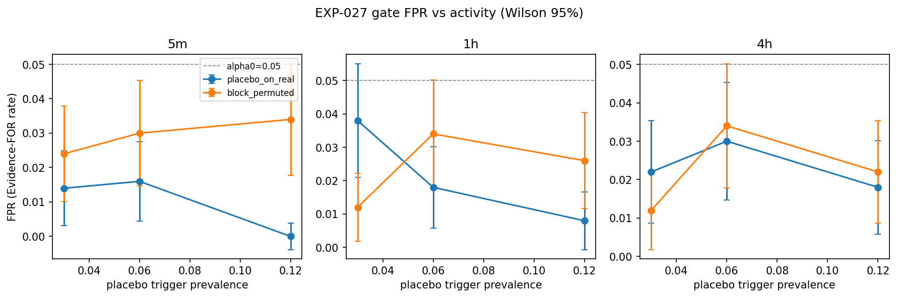
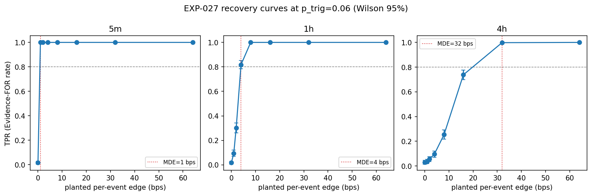
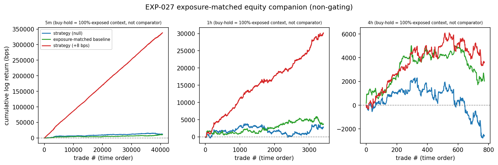
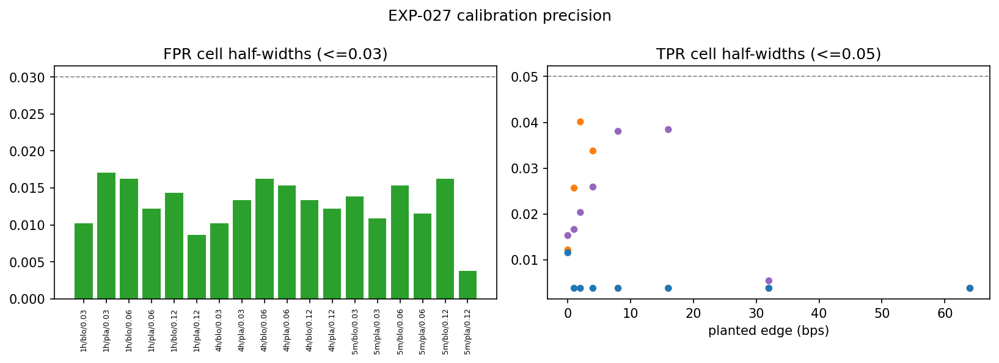

# Experiment Report: EXP-027 — Event-Level Evaluation Method: Definition and Sparse-Regime Calibration

## Status: COMPLETED

**Date**: 2026-06-09
**Instruments**: BTCUSD, EURUSD, USTEC, XAUUSD
**Data Views / Feature Categories**: 5m (strict), 1h and 4h (`min_coverage=0.90`) OHLC domains rebuilt from first-70% analysis slice of 1-minute time bars; EXP-020 regime intervals as matched-control scaffolding; no chart-type views

---

## Question

Does an event-level evaluation method, calibrated to the activity regime of a sparse (~6%-active) event signal, have controlled error and the power to detect a planted per-event edge — so that it can replace the per-bar continuous-position frozen suite (calibrated only for ≥80%-active series, EXP-005) as the evaluation vehicle for the AVWAP selective event strategy?

## Hypothesis

A predeclared event-level method — with per-event matched-control expectancy as the binding decision statistic (reusing the EXP-021/022 regime-cluster bootstrap + stratified paired sign-permutation + Holm inference and Evidence-FOR rule), and an exposure-aware equity-curve-vs-buy-hold companion — exhibits controlled false-positive error (empirical FPR ≤ α₀ = 0.05 under known-null sparse event processes) and recovery (a finite empirical event-level MDE at TPR ≥ 0.80 while FPR ≤ α₀) across the 5m / 1h / 4h domains, within a sparse activity envelope bracketing the real AVWAP signal ({~3%, ~6%, ~12%} active).

## Method Summary

The method calibrates an event-level inference pipeline on synthetic substrates only (placebo-on-real and block-permuted null generators at {3%, 6%, 12%} activity, plus a planted-edge grid {1, 2, 4, 8, 16, 32, 64} bps). Per draw: placebo events placed within real EXP-020 regime intervals, matched controls selected by nearest anchor-age from the same regime (up to 5, min 3), per-event paired excess computed as direction-signed log bps, aggregated by instrument-averaged equal-weight domain estimator, 95% regime-cluster bootstrap CI, stratified paired sign-permutation p-value, Holm adjustment across 3 domains, Evidence-FOR rule. Equity companion compares strategy vs exposure-matched baseline on an exposure-aware basis (non-gating). 500 draws/cell, 1000 bootstrap/permutation resamples.

## Key Findings

### Finding 1: FPR Controlled Across the Sparse Activity Envelope

All 3 domains show FPR ≤ α₀ = 0.05 under both null generators at all three activity rates.

| Domain | Null Generator | FPR at p_trig=0.06, α=0.05 | Wilson 95% CI | Max FPR Across Bracket |
|--------|---------------|-----------------------------|---------------|------------------------|
| 5m | placebo_on_real | 0.016 | [0.008, 0.031] | 0.024 (block, 0.03) |
| 5m | block_permuted | 0.030 | [0.018, 0.049] | 0.034 (block, 0.12) |
| 1h | placebo_on_real | 0.018 | [0.009, 0.034] | 0.038 (placebo, 0.03) |
| 1h | block_permuted | 0.034 | [0.021, 0.054] | 0.034 (all rates) |
| 4h | placebo_on_real | 0.030 | [0.018, 0.049] | 0.030 (primary) |
| 4h | block_permuted | 0.034 | [0.021, 0.054] | 0.034 (primary) |

Max per-domain FPR across all 54 cells is 0.042 (1h, placebo_on_real, p_trig=0.03, α=0.10). All Wilson upper bounds are within precision tolerance of α₀. Family-wise any-domain FPR reaches 0.094 (block_permuted, p_trig=0.06) — expected under 3-domain Holm adjustment.

### Finding 2: Finite Event-Level MDE in Every Domain

All 3 domains recover with a finite MDE at the primary ~6% activity rate.

| Domain | MDE (bps) | TPR at MDE | Wilson 95% CI at MDE | TPR at next-lower g |
|--------|-----------|------------|----------------------|---------------------|
| 5m | 1 | 1.000 | [0.992, 1.000] | 0.016 (g=0) |
| 1h | 4 | 0.818 | [0.782, 0.849] | 0.302 (g=2) |
| 4h | 32 | 0.998 | [0.989, 1.000] | 0.738 (g=16) |

MDE increases with domain duration (fewer events → less power): 5m (~20,800 events/draw) detects 1 bps; 1h (~1,750 events/draw) crosses 0.80 at 4 bps; 4h (~400 events/draw) requires 32 bps. TPR at α=0.01 remains adequate (MDE=8 bps at 1h, 32 bps at 4h).

### Finding 3: Equity Companion Sane (Non-Gating)

Under null (g=0), advantage rates are near chance: 0.358 (5m), 0.522 (1h), 0.442 (4h). Mean equity advantage under null is negative in all domains (−533, −38, −179 bps) — no systematic false advantage. Under planted edge, advantage rate and mean equity advantage increase monotonically with g, reaching 1.000 at g=1 (5m), g=8 (1h), g=32 (4h).

### Finding 4: Determinism PASS

Deterministic replay on a fixed (5m, p_trig=0.06, placebo_on_real) cell produces byte-identical FPR/TPR.

### Finding 5: Precision Gate

All cells precision-ok. Max FPR Wilson half-width = 0.018 (well below 0.03 ceiling). Max TPR Wilson half-width = 0.041 (below 0.05 ceiling).

## Conclusion

**METHOD_VALID** — all success criteria from `scope.md` are met:

| Criterion | Status | Evidence |
|-----------|--------|----------|
| FPR ≤ α₀ = 0.05 in every domain at p_trig = 0.06, both nulls | PASS | Max per-domain FPR = 0.034 at α₀ = 0.05; all Wilson upper bounds ≤ 0.054 |
| FPR not materially exceeding α₀ across {0.03, 0.06, 0.12} bracket | PASS | Max bracket FPR = 0.038 at α₀ = 0.05 |
| Finite event-level MDE at p_trig = 0.06 in every domain | PASS | 5m: 1 bps, 1h: 4 bps, 4h: 32 bps |
| Determinism replay | PASS | Byte-identical |
| Companion sanity (non-gating) | PASS | Null advantage rates 0.358–0.522 (near chance); planted edge monotonic |

The event-level method is a fit-for-purpose yardstick for re-screening the faithful selective AVWAP strategy in EXP-028. The reported per-domain MDEs (1 / 4 / 32 bps at α₀ = 0.05) define what per-event edge EXP-028 can detect.

## Limitations

1. **Secondary-horizon edge shift approximation (Audit Warning).** The planted-edge drift g is applied flat to secondary horizons (H=1, H=6) rather than scaled by horizon proportion. This could slightly inflate TPR under planted-edge draws by suppressing the `INCONCLUSIVE_SECONDARY_UNSTABLE` downgrade. FPR (g=0) is unaffected. The practical impact is likely small — TPR values and MDE thresholds show sensible monotonic patterns consistent with the event-count gradient across domains. Fix: omit the +g shift from secondary effects (option (a) in the audit).

2. **4h MDE is thin.** The 4h domain jumps from TPR=0.738 at g=16 bps to TPR=0.998 at g=32 bps. The true MDE lies between 16 and 32 bps with no finer grid resolution. A finer edge grid ({16, 20, 24, 28, 32}) could resolve this if precision matters for EXP-028 planning.

3. **Equity companion is interpretive, not a gate.** The companion null distribution is not centred at zero (null mean equity advantage is negative). This is structurally expected (the matched-control paired difference has a small negative drift on average) and does not affect the verdict, but is an interpretive caveat for EXP-028.

4. **Calibration on synthetic substrates only.** The method was never fed real AVWAP event outcomes during calibration (by design — anti-overfitting fence). Its performance on real sparse event signals is unknown until EXP-028.

## Implications for Future Research

- The method's per-domain MDE map (1/4/32 bps) at ~6% activity defines the detection floor for EXP-028. Any real AVWAP effect below these thresholds is structurally undetectable by this method.
- The thin 4h MDE suggests a finer edge grid or more draws may be worthwhile for that domain if EXP-028 requires precision near the 16–32 bps boundary.
- The successful calibration on synthetic substrates confirms the EXP-021/022 inference pipeline transfers to the sparse regime, validating the framing-correction strategy from Phase 006.

## Recommended Next Experiments

1. **EXP-028 — Re-screen the faithful selective AVWAP strategy** under this validated event-level method. The method is now frozen; apply the identical inference pipeline (regime-cluster bootstrap + sign-permutation + Holm + Evidence-FOR rule) to real AVWAP bounce-event outcomes from EXP-020.

2. **If EXP-028 precision on 4h is a concern**, consider a precision-only re-run of the 4h MDE calibration with a finer edge grid ({16, 20, 24, 28, 32} bps) before EXP-028 reads real outcomes. This is a precision increase, not a method object change, and is permitted in-phase.

## Artifacts

| Artifact | Path |
|----------|------|
| Scope | [scope.md](scope.md) |
| Analysis Plan | [analysis-plan.md](analysis-plan.md) |
| Code | [code/](code/) |
| Audit | [audit.md](audit.md) |
| Results | [results.md](results.md) |
| Governance Reviews | [governance/](governance/) |
| Plots | [plots/](plots/) |
