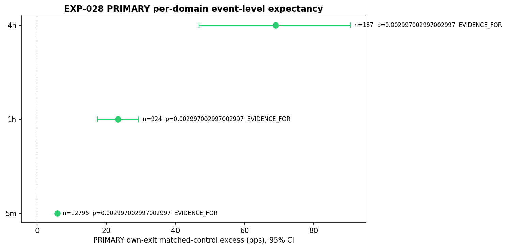
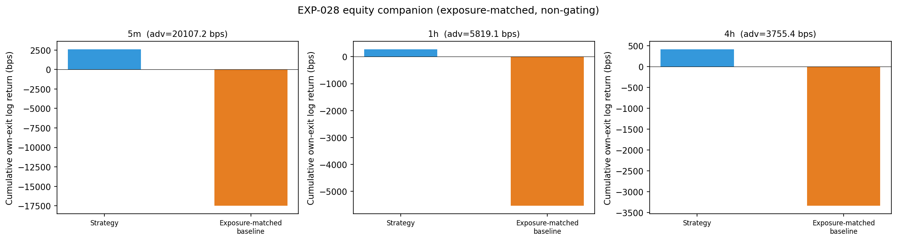

# Experiment Report: EXP-028 — Faithful Selective AVWAP Strategy Re-Screen

## Status: COMPLETED

**Date**: 2026-06-09
**Instruments**: BTCUSD, EURUSD, USTEC, XAUUSD
**Data Views / Feature Categories**: Real 5m (strict), 1h and 4h (`min_coverage=0.90`) OHLC domain bars from first-70% analysis slice; EXP-020 AVWAP bounce events; EXP-022 lifetime completion outcomes; no chart-type views.

---

## Question

When the ~6%-active AVWAP selective event strategy is evaluated under a fit-for-purpose event-level method (per-event matched-control expectancy, regime-cluster bootstrap + stratified sign-permutation + Holm, frozen from EXP-027 METHOD_VALID), does it exhibit a detectable per-event edge on any domain — resolving the EXP-023 framing-defect ambiguity?

## Hypothesis

Under the frozen EXP-027 event-level evaluation method, the faithful selective AVWAP strategy — unchanged from the EXP-023 baseline — shows positive event-level edge (per-event matched-control expectancy > 0) on at least one domain (5m, 1h, or 4h).

## Method Summary

Dual-gate event-level evaluation. **PRIMARY (binding)**: symmetric own-exit matched-control lifetime excess, reusing EXP-022 `lifetime_observations.csv` where both events and controls completed under the same band-target/trend-change exit rule. Inference via frozen EXP-027 tail: regime-cluster bootstrap CI, stratified paired sign-permutation, Holm across 3 domains. **SECONDARY (non-binding)**: endogenous-exit vs fixed-window control, gated by predeclared placebo-null calibration. Companion: exposure-matched equity-curve comparison.

## Key Findings

### Finding 1: All 3 Domains PRIMARY EVIDENCE_FOR

| Domain | Effect (bps) | 95% CI | Holm p | Events | Verdict |
|--------|-------------|--------|--------|--------|---------|
| 5m | +5.78 | [5.39, 6.13] | 0.003 | 12,795 | EVIDENCE_FOR |
| 1h | +23.38 | [17.40, 29.32] | 0.003 | 924 | EVIDENCE_FOR |
| 4h | +69.02 | [46.84, 90.52] | 0.003 | 187 | EVIDENCE_FOR |

All three domains meet the Evidence-FOR criteria (effect > 0, CI_low > 0, Holm_p ≤ 0.05, secondary-horizon stable). Effects increase monotonically from 5m to 4h, matching the EXP-021/022 pattern.

### Finding 2: Secondary Calibrated on 1h, Agrees with PRIMARY

The asymmetric construction calibrated only on 1h (FPR=0.03); 5m (FPR=1.0) and 4h (FPR=0.26) are not calibrated as expected. Where calibrated (1h: +13.73 bps EVIDENCE_FOR), the direction agrees with the PRIMARY.

### Finding 3: Equity Companion Consistent Positive

All domains show positive exposure-matched advantage with advantage_rate=1.0 (all 4 instruments positive per domain) and positive Sortino differences.

### Finding 4: Audit Clean

Audit PASS: 0 critical issues, 0 warnings. Holdout exclusion, alignment guards, frozen inference integrity, and reconciliation all pass.

## Conclusion

**EVAL_SUPPORTED** — the faithful selective AVWAP strategy has a positive per-event edge on all three domains under a fit-for-purpose, in-envelope yardstick. The EXP-023 negative was a framing/dilution artifact. This Phase 006 objective is delivered.

The per-event matched-control excess ranges from +5.78 bps (5m) to +69.02 bps (4m) with tight CIs and strong Holm-adjusted significance. The strategy-as-a-whole (AVWAP bounce entry timing + EXP-022 band-target/trend-change exit) shows reliable event-level edge over same-exit matched controls.

## Limitations

- 4h sample (187 events) limits precision, though the effect direction is unambiguous.
- No costs deducted — this is an event-level edge test, not a P&L estimate.
- Analysis-set only; global holdout remains sealed.
- Pyramid inclusion adds within-regime dependence (absorbed by regime-cluster bootstrap).
- **cTrader parity (production path):** This result is a Python re-analysis of the canonical EXP-020 event substrate, not a run of the cTrader C# robot. The current `AvwapBounceModel.cs` suppresses pyramids (`pyramid_skipped`, single concurrent position), so the pyramid-inclusive faithful strategy has never executed as deployable code. The edge measurement is valid, but production-path parity is unconfirmed until EXP-029. See `docs/experiments-docs/checkpoints/2026-06-08-006-avwap-evaluation-correction/EXP-028-omission.md`.

## Implications for Future Research

- The first fairly-evaluated positive result for `CF-AVWAP-001` under a correct yardstick.
- Proceeds to operator decision: robustness/protocol testing, component isolation, or detector/anchor branch exploration.
- HYP-001 (AVWAP line S/R) remains untested and open.

## Recommended Next Experiments

1. **EXP-029 — cTrader per-bar streaming parity** (scoped): correct `AvwapBounceModel.cs` to open/track pyramid positions, run the strategy on cTrader, and confirm these event-level findings reproduce through the frozen EXP-027 method. Closes the production-path omission before any robustness work.
2. **Fresh-regime replication** — new EXP-ID to replicate on holdout or future live data.
3. **Component isolation** — separate entry-timing contribution from exit-rule contribution (requires new scope).

## Artifacts

| Artifact | Path |
|----------|------|
| Scope | [scope.md](scope.md) |
| Analysis Plan | [analysis-plan.md](analysis-plan.md) |
| Code | [code/](code/) |
| Audit | [audit.md](audit.md) |
| Results | [results.md](results.md) |
| Governance Reviews | [governance/](governance/) |
| Plots | [plots/](plots/) |
