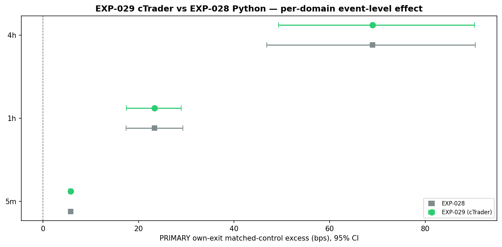
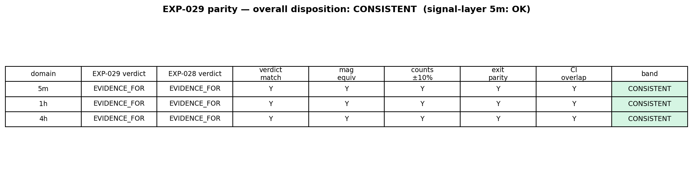

# Experiment Report: EXP-029 — cTrader Per-Bar Streaming Parity for Faithful AVWAP Strategy

## Status: COMPLETED (parity disposition: CONSISTENT)

**Date**: 2026-06-09
**Instruments**: BTCUSD, EURUSD, USTEC, XAUUSD
**Data Views / Feature Categories**: cTrader `Mode=StrategyHost` per-bar streaming output (`positions.parquet`, `avwap_events.parquet`) from the corrected C# `AvwapBounceModel`, on real 5m (strict), 1h and 4h (`min_coverage=0.90`) domain bars resampled in-engine from the 1-minute cTrader feed, first-70% analysis slice; no chart-type views.

---

## Question

EXP-028 found the faithful selective AVWAP strategy `EVAL_SUPPORTED` (all three domains `EVIDENCE_FOR`) under the corrected EXP-027 event-level method — but by **pure Python re-analysis** of upstream artifacts, never running the C# strategy on cTrader. Does the **corrected C# strategy, executed bar-by-bar inside cTrader's engine** (pyramid bounces opened as independent positions, executed completion serialized), reproduce EXP-028's per-domain event-level findings under the *same* estimand and *same* frozen inference?

## Hypothesis

The corrected C# AVWAP strategy running on cTrader via per-bar streaming produces event-level results consistent with the Python-only EXP-028 re-analysis — per-domain verdicts and effect directions agree and effects fall inside the predeclared parity tolerances — confirming the Python re-analysis faithfully represents the cTrader execution path.

## Method Summary

The corrected C# `AvwapBounceModel` was run on cTrader for all 12 cells (4 instruments × 3 domains), fenced by per-instrument `AnalysisEndUtc`. The harness rebuilt the **same** PRIMARY estimand EXP-028 reports — per-event symmetric own-exit matched-control excess (`event_lifetime_bps − mean(control_lifetime_bps)`, direction-signed log bps on cTrader `RealClose`) — using the imported EXP-021/022 control machinery on the cTrader feed, then applied the **frozen EXP-027 inference tail** (regime-cluster bootstrap CI, stratified sign-permutation, Holm across 3 domains), hash-asserted byte-identical to EXP-028's (`ea261b9ee0a8aca3`). Five predeclared binding gates (verdict-match, magnitude-equivalence, count ±10% incl. pyramid split, exit-parity, 5m signal-layer) decide each domain's parity band. See [analysis-plan.md](analysis-plan.md).

## Key Findings

### Finding 1: All three domains land in the CONSISTENT band — EXP-028 is cTrader-confirmed

PRIMARY event-level effect, EXP-029 (cTrader) vs EXP-028 (Python):

| Domain | EXP-029 [95% CI] (bps) | EXP-028 [95% CI] (bps) | \|Δeffect\| | Holm p | n (029/028) | Band |
|--------|------------------------|------------------------|------------|--------|-------------|------|
| 5m | +5.79 [5.37, 6.18] | +5.78 [5.39, 6.13] | 0.007 | 0.002997 | 12 784 / 12 795 | CONSISTENT |
| 1h | +23.33 [17.46, 28.91] | +23.38 [17.40, 29.32] | 0.054 | 0.002997 | 927 / 924 | CONSISTENT |
| 4h | +69.02 [49.32, 90.38] | +69.02 [46.84, 90.52] | 0.000 | 0.002997 | 187 / 187 | CONSISTENT |

Both experiments return `EVIDENCE_FOR` on every domain with `CI_low > 0` and Holm p at the permutation floor. Under the predeclared guide (CONSISTENT iff all five gates on ≥2/3 domains AND 5m signal-layer passes AND no INCONSISTENT domain), the disposition is **CONSISTENT** and EXP-028's Python-only `EVAL_SUPPORTED` is **upgraded to cTrader-confirmed**.

### Finding 2: Three production-code layers were independently graded, not just re-run

The disposition is deliberately falsifiable (the F01–F05 hardening replaced a confirmation-only "verdict + CI-overlap" read). All five gates hold on all domains:

- **Entry signal (F03)** — on the feed-exact 5m domain the C# AVWAP signal reproduces the EXP-020 substrate: 99.8% / 99.8% / 99.98% / 100% of EXP-020 5m triggers matched per instrument (≥98% floor); matched frozen targets agree to median relative difference 0.0 (≤1e-3).
- **Pyramid handling (F04)** — the corrected multi-position logic yields pyramid counts 6 254 / 445 / 84 vs EXP-028's 6 258 / 443 / 84 (±0.5%). Pyramids are ~49% of PRIMARY events.
- **Executed completion code (F01)** — the C# `MaybeCompletePosition` exits, graded against the Python `scan_lifetime` on the same feed, match at **rate 1.000** on all domains (15 027 / 1 038 / 236 events), max bps discrepancy 1.8e-11 / 1.4e-13 / 0.0. The non-zero residuals confirm a genuine cross-implementation agreement, not a tautology.

## Conclusion

**Parity CONSISTENT.** The faithful, pyramid-inclusive AVWAP strategy, evaluated as actual cTrader-executed code, carries the same positive event-level edge EXP-028 measured on all three domains under the frozen EXP-027 yardstick. The EXP-028 omission is closed: the entry signal, pyramid position opening, and completion-scan code are all independently graded and agree with the Python re-analysis to float precision. This **completes the Phase 006 objective** — "fix the yardstick, then re-screen the faithful strategy" — which the omission record had left half-satisfied, and extends VAL-002-style pipeline parity from MA crossover to the AVWAP baseline strategy.

This is a parity confirmation, not a new edge claim: it certifies that the Python and cTrader execution paths agree, on top of EXP-028's already-valid edge measurement on the EXP-020 substrate.

## Limitations

- **Event-level, not per-bar-suite tradability.** This confirms edge under the EXP-027 event-level method; it does **not** re-screen through the frozen per-bar qualification suite and does **not** overturn EXP-023's per-bar `REFUTED` (different, non-substitutable yardsticks).
- **No costs.** All effects are gross event-level excess; cost/slippage-bearing tradability is out of scope.
- **Holdout still sealed.** All evidence is first-70% analysis-set; the final 30% global holdout was never touched (in-robot fence + Python re-assertion). No out-of-sample confirmation.
- **HYP-001 (AVWAP line as direct support/resistance) remains untested** — out of scope.
- **Equity companion is non-gating** — a cumulative, cost-free, context-only diagnostic; not a P&L or expectancy figure.
- **Secondary-horizon {1,3,6} numbers intentionally differ from EXP-028** (F07, documented): computed from the cTrader feed and feeding only the non-binding stability guard. The PRIMARY excess is the sole parity object.
- **4h PRIMARY effect is bit-identical to EXP-028** (`69.0156543344473`): audit-verified as feed coincidence (the cTrader 4h resampled feed matched the local 4h bars for the fenced window), not data reuse — separate code paths, differing CIs. It strengthens, and should not be over-read.

## Implications for Future Research

- The AVWAP baseline now has both a fair event-level edge measurement (EXP-028) and production-path confirmation (EXP-029). The open question shifts from "is the re-analysis faithful?" to "does the edge survive costs and the holdout?".
- A process lesson is recorded: any "faithful re-screen" must state its execution path (cTrader per-bar vs Python re-analysis) explicitly in scope, and Stage 4 governance must check it against the lineage the faithfulness clause assumes (see `EXP-028-omission.md`).

## Recommended Next Experiments

1. **EXP-XXX (proposed)**: Out-of-sample confirmation of the event-level edge on the sealed final-30% holdout — a deliberate one-shot holdout-release with its own governance.
2. **EXP-XXX (proposed)**: Cost/slippage-bearing tradability of the faithful AVWAP strategy under an explicitly-scoped cost model and an appropriate referee — the question EXP-029 deliberately does not answer.
3. **EXP-XXX (proposed)**: HYP-001 direct AVWAP line-S/R test with a confound-free metric (the gap EXP-025 could not close).

## Artifacts

| Artifact | Path |
|----------|------|
| Scope | [scope.md](scope.md) |
| Analysis Plan | [analysis-plan.md](analysis-plan.md) |
| Code | [code/](code/) |
| Audit | [audit.md](audit.md) |
| Results | [results.md](results.md) |
| Governance Reviews | [governance/](governance/) |
| Plots | [plots/](plots/) |
| Run metadata | [results/run_metadata.json](results/run_metadata.json) |
| Omission record (closed) | [../../docs/experiments-docs/checkpoints/2026-06-08-006-avwap-evaluation-correction/EXP-028-omission.md](../../../docs/experiments-docs/checkpoints/2026-06-08-006-avwap-evaluation-correction/EXP-028-omission.md) |
