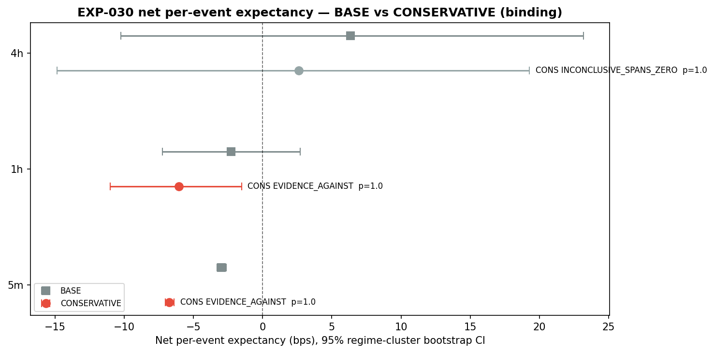
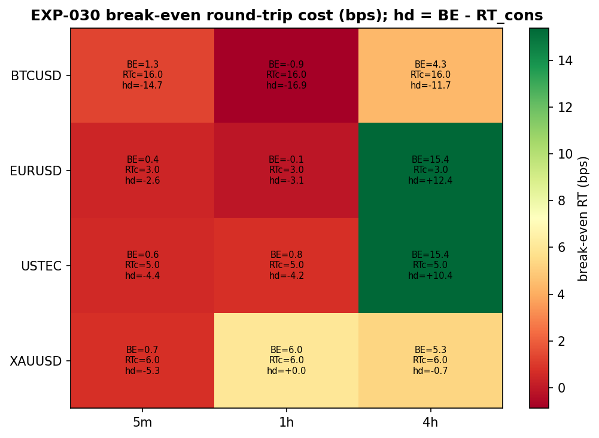
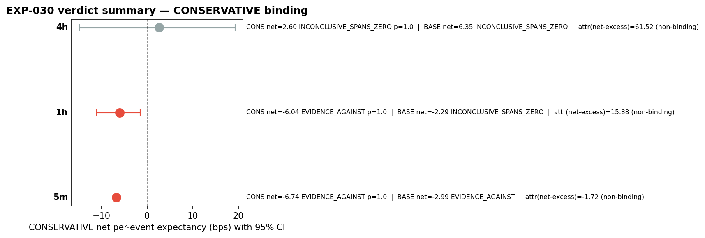

# Experiment Report: EXP-030 — Cost-Bearing Tradability of the Faithful Selective AVWAP Strategy

## Status: INCONCLUSIVE

**Date**: 2026-06-10
**Instruments**: BTCUSD, EURUSD, USTEC, XAUUSD
**Data Views / Feature Categories**: Per-event lifetime outcomes from EXP-022 (first-70% analysis set, pyramids included); cost overlay as per-instrument round-trip bps constants

---

## Question

Under a predeclared, event-level per-position cost/slippage model (CONSERVATIVE variant binding), does the faithful selective AVWAP strategy — trade logic identical to the EXP-028/029 baseline — retain positive **net** per-event expectancy on at least one domain (5m, 1h, 4h) on the first-70% analysis set?

This is the **hard tradability gate** for any future holdout-release experiment (EXP-032). The Phase-006 gross edge (+5.78/+23.38/+69.02 bps matched-control excess) is known to be gross of costs; this experiment adds a deterministic cost overlay.

## Hypothesis

The faithful AVWAP strategy retains positive **net** per-event expectancy (absolute: `mean(lifetime_bps) − RT_i`) under CONSERVATIVE costs on ≥1 domain, with bootstrap `CI_low > 0` and Holm-adjusted p ≤ 0.05.

## Method Summary

A deterministic cost overlay on the EXP-028 PRIMARY event set (EXP-022 `lifetime_observations.csv`, `role=event` rows, pyramids included). Per-instrument round-trip costs (CONSERVATIVE = 4× one-way `c_i`: EURUSD 3.0 / USTEC 5.0 / XAUUSD 6.0 / BTCUSD 16.0 bps) are subtracted from each event's absolute lifetime return. Binding metric: instrument event-weighted mean, then equal-weight cross-instrument domain mean. Inference: frozen EXP-027 regime-cluster bootstrap CI (1000 resamples) + one-sided bootstrap p (replacing sign-permutation, which is invalid for the absolute estimand) + Holm across 3 domains. Three integrity guards: (1) reconciliation of recomputed gross excess vs EXP-028 (≤0.01 bps), (2) commute check (net bootstrap distributions = gross − mean_inst(RT) elementwise), (3) frozen inference hash pin. See `analysis-plan.md` for full methodology.

## Key Findings

### Finding 1: No domain passes the tradability gate; phase outcome INCONCLUSIVE

The equal-weight cross-instrument net per-event expectancy under CONSERVATIVE costs:

| Domain | n | Gross absolute (bps) | CONS net (bps) | 95% CI (bps) | Holm p | Verdict |
|--------|---|---------------------|----------------|--------------|--------|---------|
| 5m | 12,795 | +0.76 | −6.74 | [−7.04, −6.38] | 1.000 | EVIDENCE_AGAINST |
| 1h | 924 | +1.46 | −6.04 | [−11.02, −1.53] | 1.000 | EVIDENCE_AGAINST |
| 4h | 187 | +10.10 | +2.60 | [−14.87, +19.28] | 1.000 | INCONCLUSIVE_SPANS_ZERO |

The phase outcome is **INCONCLUSIVE**: 5m and 1h are clean EVIDENCE_AGAINST (CIs entirely below 0), while 4h is INCONCLUSIVE_SPANS_ZERO (CI spans 0, half-width ~17 bps, n=187).

### Finding 2: BTCUSD cost (16 bps RT) dominates the equal-weight aggregate

The predeclared equal-weight aggregation gives each instrument equal influence. With mean RT_cons = 7.5 bps (BTCUSD 16.0, XAUUSD 6.0, USTEC 5.0, EURUSD 3.0), BTCUSD contributes 4.0 of the 7.5 bps drag. Per-instrument breakout reveals:

- **EURUSD-4h**: net_cons = +12.38 bps [CI: +2.67, +21.46] — individual CI excludes 0 (descriptive, non-binding)
- All 5m/1h cells: net_cons negative with CI entirely below 0 (except XAUUSD-1h CI spans 0)
- Break-even RTs range from EURUSD-4h (15.4 bps) down to EURUSD-1h (−0.1 bps, negative before costs)

### Finding 3: The non-binding attribution companion remains FOR on 1h/4h

The net matched-control excess (gross excess shifted by RT_i, controls uncosted) — a different estimand measuring what the Phase-006 method looks like after costs — is EVIDENCE_FOR on 1h/4h under CONSERVATIVE costs (Holm p=0.003). The companion is explicitly non-binding and must not be read as tradability, but it confirms that the Phase-006 excess survives costs on the matched-control structure. The verdict gap between the binding absolute metric and the companion arises because matched-control subtraction removes a negative control discount that the absolute P&L must carry.

### Finding 4: All integrity guards pass

- **Reconciliation**: recomputed gross excess reproduces EXP-028 to exactly 0.00 bps in all domains; event counts match (12795/924/187).
- **Commute check**: net bootstrap distributions = gross − mean_inst(RT) at machine epsilon (max 7e−15 bps).
- **Frozen inference hash**: pinned EXP-027 hash `e50873d12a9f68d9` verified.
- **Dependency gate**: EXP-028 EVAL_SUPPORTED, EXP-029 CONSISTENT confirmed.
- **Determinism**: same-seed replay PASS; 8-seed robustness shows stable CI boundaries.

## Conclusion

**INCONCLUSIVE** (per scope phase-outcome definition). The cost-bearing tradability gate for EXP-032 (holdout release) is **not passed**.

The faithful AVWAP strategy does not show reliable positive net per-event expectancy under the predeclared CONSERVATIVE cost model on the equal-weight cross-instrument binding metric. 5m and 1h are cleanly net-negative under costs (gross absolute ≪ any instrument's RT_cons). 4h is unresolved (wide CI, n=187). EURUSD-4h individually survives at the per-instrument level (descriptive, not binding), suggesting that on low-cost instruments the edge may be positive — but this is not a verdict-level result.

The Phase-006 gross edge is not overturned: the non-binding attribution companion confirms the matched-control net excess survives costs on 1h/4h. The distinction is economic: the strategy's edge is relative (control selection) rather than absolute P&L, so cost-bearing tradability depends on the framing question.

## Limitations

1. **BTCUSD cost dominance**: The equal-weight mean gives BTCUSD (16 bps RT) 4× the cost influence of EURUSD (3 bps RT). A per-instrument test with multiplicity control would be needed to evaluate tradability on low-cost instruments individually.
2. **4h power**: n=187 for the absolute estimand yields CI half-widths ~17 bps, preventing resolution. The INCONCLUSIVE on 4h reflects non-resolution, not absence of edge.
3. **Financing/swap excluded**: Duration-correlated costs (most material on 1h/4h) are not included. A positive tradability finding would need a financing check before holdout release.
4. **Cost model is operator-declared**: Values are typical cTrader retail CFD costs. Real execution may differ, especially BTCUSD slippage.
5. **5m gross absolute near zero**: The +0.76 bps gross absolute confirms EXP-024's finding that the edge on 5m is essentially all relative (control discount), making 5m untradable under any realistic cost model.

## Implications for Future Research

- The tradability gate blocks EXP-032 (holdout release). No holdout access for this candidate.
- The family review path per Phase 007 design §9 is triggered: consider Stage-C branches, HYP-001 S/R test, or alternative strategy framings.
- The mechanism decomposition (EXP-031) runs regardless and will inform whether the edge's locus (entry vs exit) suggests alternative strategy forms that might better carry costs.
- A per-instrument tradability test on low-cost instruments (EURUSD, potentially USTEC) could be a follow-up scope with explicit multiplicity control.

## Recommended Next Experiments

1. **EXP-031 (Edge isolation)**: Entry-timing vs exit-rule decomposition. Runs regardless of EXP-030 outcome; mechanism information is valuable for any follow-up strategy.
2. **Per-instrument tradability (new scoped experiment)**: If EURUSD-4h's descriptive net-positive is worth pursuing, a pre-registered experiment with multiplicity control.
3. **Family review**: Evaluate pivot to Stage-C detectors (/LB /MB /ATR), HYP-001 direct S/R test, or alternative AVWAP framings (e.g., non-pyramid entries, different exit rules).

## Artifacts

| Artifact | Path |
|----------|------|
| Scope | [scope.md](scope.md) |
| Analysis Plan | [analysis-plan.md](analysis-plan.md) |
| Code | [code/](code/) |
| Audit | [audit.md](audit.md) |
| Results | [results.md](results.md) |
| Governance Reviews | [governance/](governance/) |
| Plots | [plots/](plots/) |
