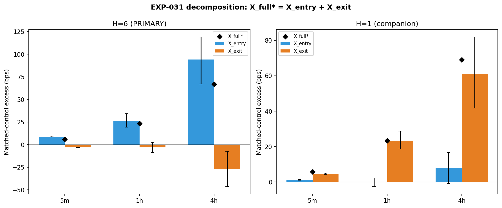
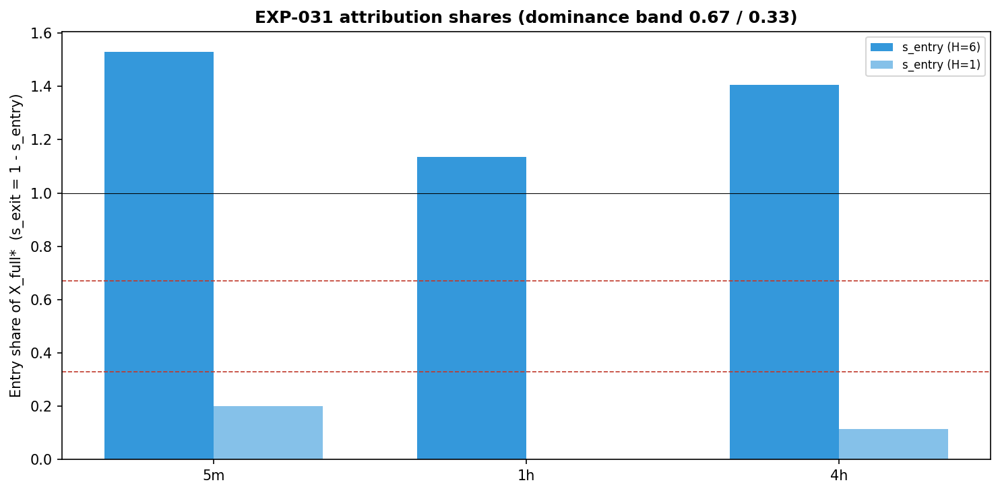

# Experiment Report: EXP-031 — AVWAP Edge Isolation (Entry-Timing vs Exit-Rule)

## Status: COMPLETED (ISOLATION_READ_UNRESOLVED)

**Date**: 2026-06-10
**Instruments**: BTCUSD, EURUSD, USTEC, XAUUSD
**Data Views**: 5m/1h/4h OHLC domains from first-70% analysis slice; EXP-022 lifetime observations (event/control returns with band-target/trend-change exit); rebuilt domain Close series for fixed-horizon recompute

---

## Question

Of the EXP-028 measured per-event matched-control excess (+5.78 / +23.38 / +69.02 bps on 5m/1h/4h), how much is attributable to AVWAP bounce entry timing versus the band-target/trend-change (BTC) exit rule?

## Method Summary

For every EXP-022 event/control row (the EXP-028 PRIMARY population), a neutral fixed-horizon return was computed at H ∈ {1, 6} on the rebuilt domain Close series. Three matched-control-differenced per-event legs were formed on the common-control intersection — X_full (BTC exit), X_entry (fixed-horizon exit), and X_exit (X_full − X_entry, the exit's differential contribution) — ensuring exact per-event additivity. Each leg was pushed through the frozen EXP-027/028 inference (regime-cluster bootstrap CI, stratified paired sign-permutation, Holm adjustment), and a predeclared sign-complete classifier assigned a per-domain attribution label at H=6 (PRIMARY) and H=1 (companion). See [analysis-plan.md](analysis-plan.md) for details.

## Key Findings

### Finding 1: Entry-timing dominant at H=6 (PRIMARY) on all domains

At the 6-bar horizon, the entry carries >100% of the total excess on every domain. The BTC exit is a net differential drag on bounce-entries relative to the fixed-horizon exit.

| Domain | X_full (bps) | X_entry (bps) | X_exit (bps) | s_entry | Label (H=6) |
|--------|-------------|---------------|-------------|---------|-------------|
| 5m | 5.78 [5.40, 6.17] | 8.84 [8.36, 9.31] | −3.06 [−3.45, −2.69]† | 1.53 | ENTRY_DOMINANT |
| 1h | 23.38 [17.77, 29.46] | 26.53 [19.42, 34.15] | −3.15 [−8.63, 2.57]† | 1.13 | ENTRY_DOMINANT |
| 4h | 66.87 [45.77, 88.97] | **94.01** [67.18, 119.05] | −27.14 [−46.47, −7.44]† | 1.41 | ENTRY_DOMINANT |

*† Not leg-significant.*

### Finding 2: Exit-rule dominant at H=1 (companion) on all domains

At the 1-bar horizon, the exit dominates. The BTC exit is a strong differential advantage on bounce-entries over controls at short horizons.

| Domain | X_full (bps) | X_entry (bps) | X_exit (bps) | s_exit | Label (H=1) |
|--------|-------------|---------------|-------------|--------|-------------|
| 5m | 5.78 [5.41, 6.17] | 1.16 [1.00, 1.32] | 4.61 [4.30, 4.96] | 0.80 | EXIT_DOMINANT |
| 1h | 23.38 [17.71, 29.74] | 0.01 [−2.58, 2.34]† | 23.37 [18.63, 28.81] | 1.00 | EXIT_DOMINANT |
| 4h | 69.02 [47.82, 90.25] | 7.99 [−0.90, 16.74]† | 61.03 [41.74, 81.90] | 0.88 | EXIT_DOMINANT |

*† Not leg-significant.*

### Finding 3: H=1 and H=6 contradict on all domains — unresolved

No domain shows agreement between the two predeclared horizons. The primary domain (5m) flips from ENTRY_DOMINANT (H=6) to EXIT_DOMINANT (H=1), triggering the predeclared ISOLATION_READ_UNRESOLVED outcome. The edge is real but its attribution is horizon-sensitive.

*Per-domain X_full = X_entry + X_exit with bootstrap CIs, at H=6 (PRIMARY) and H=1.*

*Entry share s_entry per domain. The 0.67 dominance band (dashed) shows no domain has a stable attribution across horizons.*

### Mechanism: Exit-substitution effect

The BTC exit adds value at H=1 (cuts early losers on controls) but removes value at H=6 (truncates trends prematurely on bounce-entries). The exit-substitution diagnostic confirms this pattern:

| Domain | H=1 Event dH | H=1 Control dH | H=6 Event dH | H=6 Control dH |
|--------|-------------|----------------|-------------|----------------|
| 5m | +0.42 bps | −4.19 bps | −0.60 bps | +2.47 bps |
| 1h | +2.97 bps | −20.48 bps | −0.84 bps | +2.26 bps |

*The BTC exit outperforms FH(1) on events but underperforms FH(6) on events — consistent with a loss-cutting (short-horizon) but trend-truncating (long-horizon) mechanism.*

## Conclusion

**ISOLATION_READ_UNRESOLVED.** The per-event edge is not cleanly attributable to either entry timing or the exit rule alone. Entry timing dominates at the 6-bar horizon (the exit is a differential drag on bounce-entries), while the exit rule dominates at the 1-bar horizon (the exit cuts losers on controls). This horizon-dependent attribution pattern holds across all three domains and constrains future scope design: the BTC exit has both beneficial (loss-cutting) and harmful (trend-truncating) effects that change sign with the evaluation horizon.

## Limitations

1. **Horizon sensitivity**: The attribution depends on the neutral exit horizon. Two predeclared horizons {1, 6} were tested; a finer or different grid could give a different picture.
2. **4h H=6 effects**: The 4h H=6 entry effects are now finite for all instruments (the Polars NaN-vs-null handling issue was fixed — audit Warning 1 CLOSED). The pre-fix classification (ENTRY_DOMINANT) was robust throughout.
3. **Gross decomposition**: Costs are excluded (EXP-030's question). The entry-timing edge is gross; net tradability is a separate, unresolved question.
4. **Two-horizon-only**: Only H=1 and H=6 were predeclared. The crossover point where s_entry ≈ s_exit is unknown.

## Implications for Future Research

- The unresolved isolation constrains how EXP-026 `/EXIT` should be designed: any exit redesign must account for the horizon-dependent trade-off between loss-cutting (beneficial at short horizons) and trend-truncation (harmful at longer horizons).
- HYP-001 (line S/R) remains a viable alternative mechanism, since the edge is not localized to entry or exit individually.

## Recommended Next Experiments

1. **Horizon sweep (provisionally EXP-033)**: Map s_entry over a fine grid H ∈ {1, 2, 3, 4, 5, 6, 12, 24} on 5m to find the crossover horizon and assess whether the attribution stabilizes. Register as DIAG-004, 0 candidate slots.
2. **Exit-overlay redesign (EXP-026/EXIT)**: Use the horizon-dependent exit-substitution profile to design a modified exit that preserves short-horizon loss-cutting while reducing long-horizon trend-truncation.
3. **HYP-001 line S/R test**: Design an experiment testing P(bounce | AVWAP approach) vs matched non-AVWAP reference levels, independent of the bounce-trigger definition.

## Artifacts

| Artifact | Path |
|----------|------|
| Scope | [scope.md](scope.md) |
| Analysis Plan | [analysis-plan.md](analysis-plan.md) |
| Code | [code/](code/) |
| Audit | [audit.md](audit.md) |
| Results Interpretation | [results.md](results.md) |
| Governance | [governance/](governance/) |
| Plots | [plots/](plots/) |
