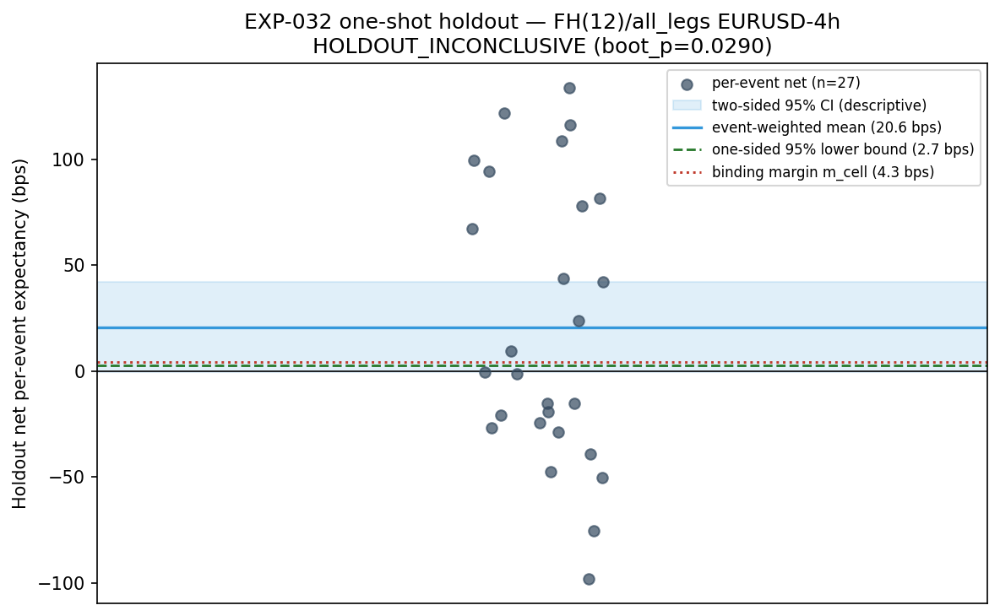
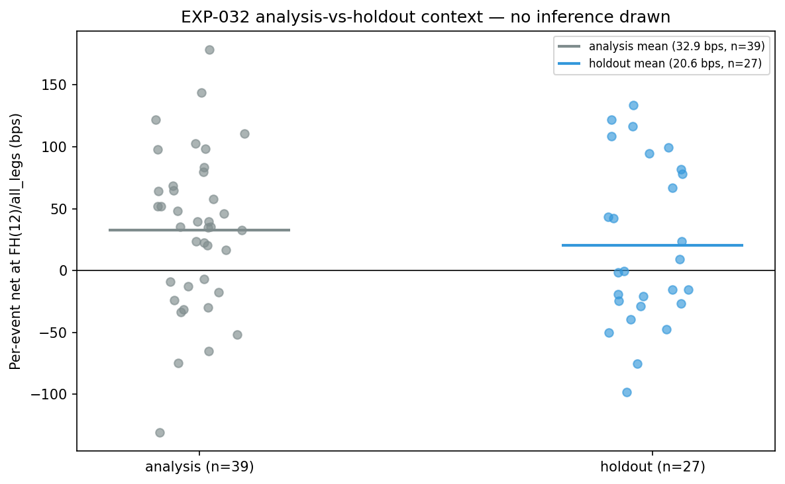

# Experiment Report: EXP-032 — One-Shot Holdout Confirmation of Package B (EURUSD-4h, FH H\*=12, all_legs)

## Status: INCONCLUSIVE (binding: HOLDOUT_INCONCLUSIVE — holdout shot SPENT)

**Date**: 2026-06-10
**Registry**: `CF-AVWAP-001/HOLDOUT-B` (holdout shot, 1-of-1, programme-level)
**Phase**: 009 ([design](../../../docs/experiments-docs/checkpoints/2026-06-10-009-avwap-holdout-release/design.md))
**Instruments**: EURUSD only (4h domain)
**Data Views**: full EURUSD 1-minute series (analysis + sanctioned holdout read); EXP-031-identical 4h rebuild; frozen EXP-020/022 AVWAP event stream

---

## Question

Does the operator-selected Package-B candidate — the faithful selective AVWAP
bounce strategy on EURUSD-4h with the TRAIN-frozen fixed-horizon exit at H\*=12
domain bars and all_legs pyramid policy, under frozen CONSERVATIVE costs (RT 3.0
bps) plus financing (0.6 bps/day, adverse-side, fractional calendar days) — retain
positive net per-event expectancy on the global holdout stratum (final 30%, never
previously read)?

## Hypothesis

On the holdout stratum, the Package-B cell has positive net per-event expectancy:
`ci_low_1s > m_cell` AND one-sided bootstrap p ≤ 0.05 (HOLDOUT_CONFIRMED). Every
parameter inherited frozen (EXP-037 selection hash-pinned, EXP-030 costs, EXP-027
inference tail `e50873d12a9f68d9`); zero selection inside EXP-032; family of 1.

## Method Summary

Two-phase one-shot protocol (see [analysis-plan.md](analysis-plan.md), Revision 1):
**H1** regenerated the frozen event stream over the full EURUSD series, proved
lineage by exact reconciliation of the analysis stratum against the certified
EXP-022/EXP-037 population (39 events, 27 TRAIN / 12 TEST, TEST net anchor
reproduced to 3.6e-7 bps), ran a pre-outcome synthetic-null calibration at the
holdout's exact cluster structure to set the binding margin, and froze the stratum
manifest (content-hashed) before any outcome contact. **H2** (separate invocation,
hash-verified against the frozen manifest, refused if a verdict already existed)
computed per-event nets once, applied the frozen 1000-resample regime-cluster
bootstrap, and emitted the mechanical verdict. Audit: **PASS** (0 critical, 0
warnings) — all 8 integrity guards verified with persisted evidence; only the
EURUSD file was opened (BTCUSD/USTEC/XAUUSD holdout remains sealed).

## Key Findings

### Finding 1: HOLDOUT_INCONCLUSIVE — positive point estimate, margin not cleared

On n = 27 holdout events: net **+20.60 bps** per event, two-sided 95% CI
[−0.39, +42.15], one-sided 95% lower bound **+2.71 bps**, boot_p **0.029**.
The p-gate passed but the lower bound did not clear the predeclared calibration
margin **m_cell = 4.32 bps**, and the two-sided CI spans zero → binding verdict
**HOLDOUT_INCONCLUSIVE**, descriptive label **INCONCLUSIVE_SPANS_ZERO**.

The margin did the job it was designed for: the pre-outcome calibration measured
an uncorrected null FPR of **0.0715** for the naive dual rule at this exact
27-event/16-cluster structure (margin restores 0.050). An uncalibrated read would
have "confirmed" at an inflated false-positive rate.

### Finding 2: Attenuation, not reversal, out of sample

The holdout mean (+20.60 bps, n=27) sits below the analysis-era mean (+32.87 bps,
n=39) and the EXP-037 TEST point (+40.56 bps, n=12) at the identical estimand,
with comparable per-event dispersion (13 positive / 14 negative events; range
−98.2 to +133.7 bps). Decomposition: gross +25.26 − RT 3.00 − financing 1.67.

### Finding 3: Non-binding companion — FH(12) exit again dominates the BTC exit

On the identical 27 events, the Package-A (BTC-exit) net point estimate is
**+2.35 bps** vs +20.60 bps for the binding FH(12) cell — directionally consistent
with the EXP-031/033/037 long-horizon exit-drag finding. Predeclared never
promotable; carries no inferential weight.

## Conclusion

**Hypothesis INCONCLUSIVE — the holdout shot is SPENT.**

The programme's single sanctioned holdout read produced positive but
insufficiently strong evidence: the verdict turned on the calibrated margin
(2.71 ≤ 4.32 bps), not the p-value. Per the locked Phase 009 rules, this outcome
spends the shot exactly as CONFIRMED or REFUTED would: there is no second holdout
read for `CF-AVWAP-001` Package B (or Package A) under any circumstance, the
TEST-stratum evidence (net +40.56 bps) stands but is **permanently
non-upgradable**, and the EURUSD holdout is contaminated-by-disclosure for any
future EURUSD-4h event-level claim. The holdout seal remains intact for
BTCUSD/USTEC/XAUUSD. Resource routing follows the REFUTED path: return to
characterisation, Tier C (Phase 008 design §9).

## Mandatory Disclosures (R1)

- **Ex-post reportability (F04):** the binding estimand conditions on
  `reportable_event`, a deterministic ex-post rule (control candidacy spans the
  regime interval after the trigger) — a live trader cannot identify the binding
  population at entry time. In this stratum the filter bound nothing (27 events
  pre- and post-filter), but the external-validity caveat attaches to the estimand
  definition.
- **Calibration fidelity (F05):** the margin's null transports analysis-era
  variance components (σ_b 57.85, σ_w 29.98 bps) onto the holdout cluster layout;
  load-bearing only for CONFIRMED, which did not occur. Holdout dispersion is
  visually comparable to the analysis era's (plot 3).
- **Power expectation:** the stratum held 27 binding events vs the predeclared
  ≈15–18; disclosure-only by design (H2 ran regardless). Even at the larger n, the
  limiting factor was per-event dispersion, not stratum thinness.

## Limitations

- Single instrument/domain cell, n = 27, one contiguous holdout era (triggers
  2025-05 → 2026-05); a true ≈+20 bps effect and a lucky zero-effect draw are
  indistinguishable at this power, by design.
- The one-shot protocol forbade any sensitivity, alternative-horizon, or
  cost-variant analysis on holdout data — nothing beyond the single predeclared
  cell exists or can be computed.
- boot_p 0.029 should not be quoted standalone: the same bootstrap measured
  uncorrected FPR 0.0715 at this structure.

## Implications for Future Research

- The holdout-release lever is gone for this candidate family on EURUSD; future
  AVWAP work proceeds on analysis-set evidence only and must treat TEST-stratum
  results as the ceiling of attainable confirmation.
- The recurring FH-vs-BTC exit gap (third consecutive out-of-sample-direction
  consistency) reinforces that exit design, not entry timing, is the dominant
  P&L lever on this substrate — but only analysis-set scopes can pursue it.
- Tier-C routing (Stage-C branches, HYP-001 direct S/R test) per Phase 008
  design §9 is the predeclared next direction.

## Recommended Next Experiments

1. **Phase 009 retrospective** (documentation, not an EXP): record the spent shot
   and close the checkpoint.
2. **Tier-C scope (new EXP-ID)**: HYP-001 direct support/resistance test or
   Stage-C branch characterisation, per Phase 008 design §9 — analysis set only.
3. **Optional (new EXP-ID, analysis set only)**: cTrader per-bar parity of the FH
   exit, if FH-exit machinery is ever needed for other uses (the design mandates
   this only under CONFIRMED; it is not required now).

## Artifacts

| Artifact | Path |
|----------|------|
| Scope | [scope.md](scope.md) |
| Analysis Plan (Rev 1) | [analysis-plan.md](analysis-plan.md) |
| Code | [code/run_experiment.py](code/run_experiment.py) |
| Frozen manifest (H1) | [results/frozen_holdout_manifest.json](results/frozen_holdout_manifest.json) |
| Binding verdict | [results/holdout_verdict.csv](results/holdout_verdict.csv) |
| Per-event table | [results/holdout_events.csv](results/holdout_events.csv) |
| Null calibration | [results/null_calibration.csv](results/null_calibration.csv) |
| Reconciliation | [results/reconciliation.csv](results/reconciliation.csv) |
| Audit | [audit.md](audit.md) |
| Results interpretation | [results.md](results.md) |
| Governance | [governance/](governance/) |
| Plots | [plots/](plots/) |
