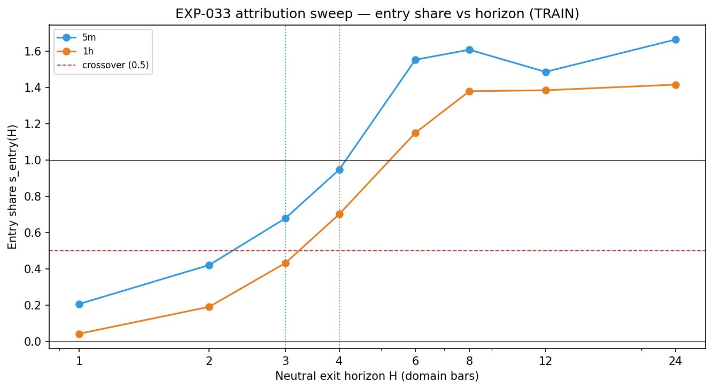
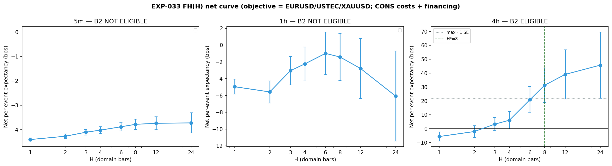

# Experiment Report: EXP-033 — TRAIN-Only Horizon Sweep (Attribution Crossover + FH(H) Net Curve)

## Status: COMPLETED

**Date**: 2026-06-10
**Instruments**: BTCUSD, EURUSD, USTEC, XAUUSD
**Data Views / Feature Categories**: EXP-022 lifetime observations (5m/1h/4h OHLC domains); rebuilt domain series via `xen.bar_aggregator`; EXP-020 event timestamps

---

## Question

At what evaluation horizon does the AVWAP edge shift from exit-driven to entry-driven, and is there a fixed-horizon exit that makes the strategy's absolute net expectancy positive on TRAIN?

## Method Summary

TRAIN-only diagnostic (DIAG-004, 0 slots). Attribution decomposition (X_full = X_entry + X_exit, matched-control differencing) evaluated over H ∈ {1,2,3,4,6,8,12,24} domain bars per domain on a fixed contained population. FH(H) absolute net curve (fixed-horizon-exit variant under frozen costs + financing) evaluated on the same population, with mechanical one-SE H* and pyramid-policy selections for B2. Reconciliation anchors against EXP-031 before any sweep output.

## Key Findings

### Finding 1: Attribution Crossover Resolved

5m crosses s_entry = 0.5 at H=3; 1h crosses at H=4 (both STABLE_CROSSOVER). The EXP-031 horizon-dependent flip (EXIT_DOMINANT at H=1, ENTRY_DOMINANT at H=6) is a horizon-regime structure: the BTC exit cuts early losers at short horizons but truncates trends at long horizons. 4h is UNPOWERED.

### Finding 2: FH(H) Net Negative on Powered Domains

5m/1h B2-ineligible: grid maxima ≤ 0 (−3.72 and −0.99 bps respectively). The fixed-horizon exit cannot rescue absolute net on these domains. Only 4h is B2-eligible: H*=8, net=+31.30 bps, pyramid policy=all_legs.

### Finding 3: 4h Selection Fragile

Split-half stability disclosure: `h_star_stable = false` on 4h (argmax shifts between H=12 and H=24 across halves). The H*=8 selection is fragile on ~90 TRAIN events. Policy selection is stable (all_legs in both halves).

## Conclusion

**MEASUREMENT_COMPLETE.** Attribution resolves the Phase 7 open question (crossover at H=3/4). Capture-efficiency path (B2) is viable only on 4h, with a stability caveat. The selectivity lever (B1) is the remaining Tier-B path for 5m/1h.

## Limitations

- TRAIN-only (first 70% of analysis set). No TEST or holdout validation.
- 4h attribution UNPOWERED; 4h B2 selection fragile (flagged in stability disclosure).
- BTCUSD excluded from objective H* set per D0 §4 (data-dependent choice).

## Implications for Future Research

- B2 (/EXIT-FH) should proceed only on 4h; the 4h selection fragility must be weighed at Tier-B scope time.
- The crossover finding (H_cross=3/4 on 5m/1h) provides a mechanism rationale: any exit redesign should target the short-horizon regime.

## Recommended Next Experiments

1. **EXP-037 (/EXIT-FH)**: If the operator decides to spend a Tier-B slot on 4h, consume the EXP-033 selections (H*=8, all_legs) with the fragility caveat.

## Artifacts

| Artifact | Path |
|----------|------|
| Scope | [scope.md](scope.md) |
| Analysis Plan | [analysis-plan.md](analysis-plan.md) |
| Code | [code/](code/) |
| Audit | [audit.md](audit.md) |
| Results | [results.md](results.md) |
| Governance Reviews | [governance/](governance/) |
| Plots | [plots/](plots/) |
