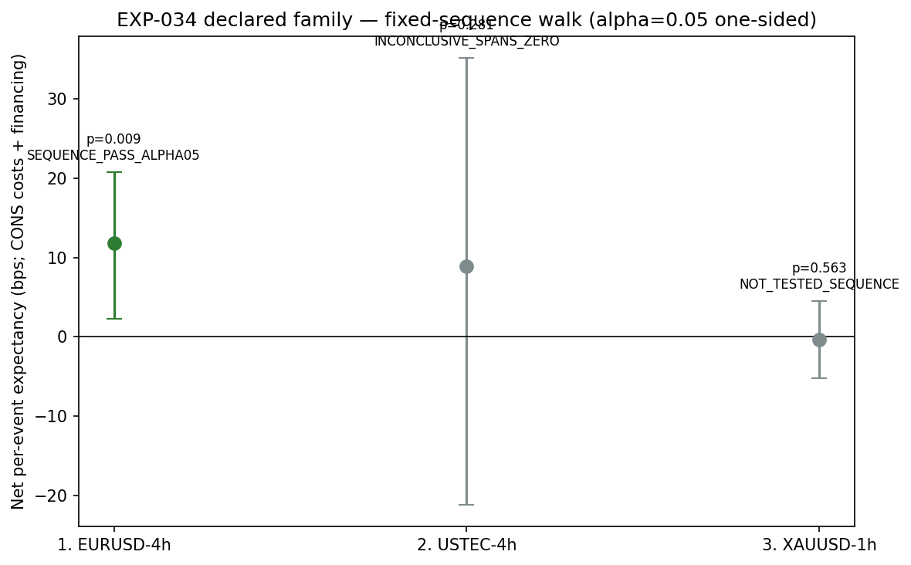

# Experiment Report: EXP-034 — Per-Instrument Cost-Bearing Tradability Screen (with Financing)

## Status: COMPLETED

**Date**: 2026-06-10
**Instruments**: BTCUSD, EURUSD, USTEC, XAUUSD (declared family: EURUSD-4h, USTEC-4h, XAUUSD-1h)
**Data Views / Feature Categories**: EXP-022 lifetime observations (5m/1h/4h OHLC domains); EXP-020 event timestamps; rebuilt domain series for completion timestamps

---

## Question

Does any individual instrument×domain cell carry a tradable net edge that the EXP-030 equal-weight aggregate masked — formally, with FWER control, and with duration-bearing financing included?

## Method Summary

Fixed-sequence walk over D0-declared cells (EURUSD-4h → USTEC-4h → XAUUSD-1h) at one-sided α = 0.05 using regime-cluster bootstrap CIs (frozen EXP-027 tail). Per-event net = `lifetime_bps − RT_cons_i − financing_i`, where financing = `rate_i × elapsed_calendar_days(trigger_close, completion_close)` (adverse-side, fractional calendar days). Reconciliation guards verify identical counts and no-financing nets vs EXP-030 before any verdict.

## Key Findings

### Finding 1: EURUSD-4h Strict Pass

Net = +11.77 bps [one-sided 95% lower bound = +3.90 bps, boot_p = 0.009]. The EXP-030 disclosure (net_cons +12.38 bps) survives the financing layer (mean 0.61 bps/event). Sequence walk stopped at cell 2.

### Finding 2: USTEC-4h INCONCLUSIVE as Predeclared

Net = +8.90 bps, CI = [−21.10, +35.09], boot_p = 0.281. n=36 events — per power statement, the ≈+10 bps point cannot resolve (CI half-width ~28 bps). G1-lenient continuation flag = true (point > 0, CI not entirely below 0).

### Finding 3: XAUUSD-1h Not Tested

Sequence stopped at cell 2 failure. Descriptive label: INCONCLUSIVE_SPANS_ZERO (net = −0.35 bps, CI = [−5.18, +4.51], boot_p = 0.563). G1-lenient continuation flag = false.

## Conclusion

**A1_STRICT_PASS_TEST_CONFIRMATION_REQUIRED.** EURUSD-4h passes the binding one-sided α = 0.05 test. Per design §8.4 (F02 amendment): this is necessary-but-not-sufficient for holdout release. EURUSD-4h routes to a one-shot Tier-B TEST-stratum confirmation. The only positive net equity cell survives the full cost + financing layer.

## Limitations

- A1 selects its cell family from EXP-030 disclosures and tests on the same analysis data — the pass is in-sample.
- EURUSD-4h n=39: well-resolved (boot_p=0.009) but precision-limited.
- Financing rates are predeclared constants; real swap costs vary.

## Implications for Future Research

- EURUSD-4h TEST confirmation is the natural next step. If TEST confirms, the holdout-release checkpoint (EXP-032) becomes admissible.
- Per-instrument instrument selection (lever 2 of the three clinical levers) is now resolved: only EURUSD-4h carries a net-positive cell.

## Recommended Next Experiments

1. **Tier-B TEST confirmation**: Register EURUSD-4h TEST confirmation (0 new slots) — the same registered baseline estimand on the held-back TEST segment.

## Artifacts

| Artifact | Path |
|----------|------|
| Scope | [scope.md](scope.md) |
| Analysis Plan | [analysis-plan.md](analysis-plan.md) |
| Code | [code/](code/) |
| Audit | [audit.md](audit.md) |
| Results | [results.md](results.md) |
| Governance Reviews | [governance/](governance/) |
| Plots | [plots/](plots/) |
