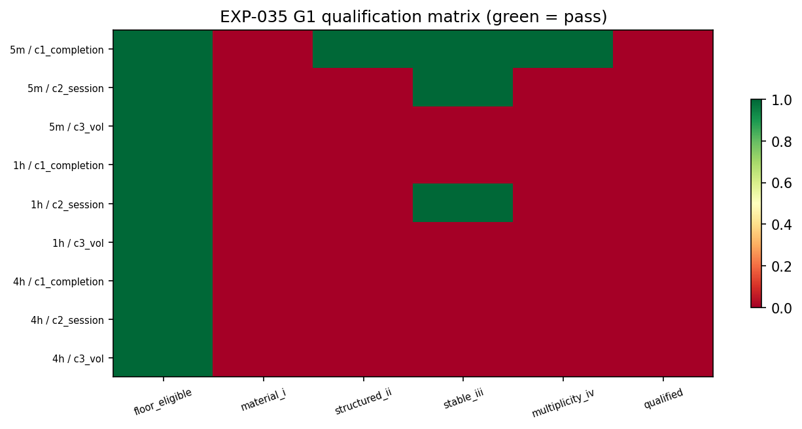
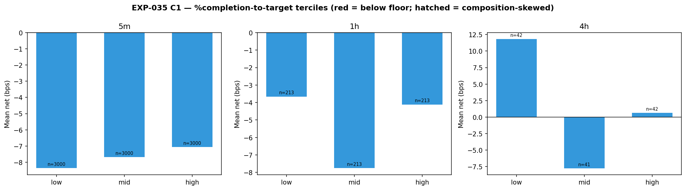

# Experiment Report: EXP-035 — TRAIN-Only Conditioning Characterisation (Clinical-Trade Dimensions)

## Status: COMPLETED

**Date**: 2026-06-10
**Instruments**: BTCUSD, EURUSD, USTEC, XAUUSD
**Data Views / Feature Categories**: EXP-022 lifetime observations (5m/1h/4h OHLC domains); EXP-020 band geometry at trigger; rebuilt domain series for ATR covariate

---

## Question

Are there predeclared, causally-available-at-confirmation event characteristics that identify "clinical" subsets of bounce events whose net expectancy is positive — without post-hoc stratum shopping?

## Method Summary

TRAIN-only diagnostic (DIAG-005, 0 slots). Three predeclared dimensions: C1 (%completion-to-target at confirmation, TRAIN-quantile terciles), C2 (session: Asia/London/NY), C3 (trailing-vol percentile, TRAIN-quantile terciles). G1 qualification per design §8.1: materiality (SNR ≥ 1 AND candidate net > 0) ∧ structure ∧ stability ∧ multiplicity (Holm at α_G1 = 0.10). Joint cluster-bootstrap contrast CI, selection-aware stratified permutation. Hard no-selection rule.

## Key Findings

### Finding 1: Zero Qualified Dimensions

All 9 domain×dimension cells fail materiality (§8.1i): no candidate-bin mean net > 0 under frozen costs + financing. The closest is 5m/c1 (SNR = 1.42, stable monotonic gradient) but the best bin's net is −7.07 bps — still negative.

### Finding 2: Relative Separation, Not Absolute

5m/c1 shows a genuine and stable %completion gradient (higher completion → less negative outcomes, perm_p = 0.010, holm_p = 0.030). This is a relative separation within a net-negative regime, not a path to a clinical subset.

### Finding 3: 4h Underpowered

4h CI half-widths 42–64 bps (n=125 TRAIN events across 4 instruments). No conditioning conclusion possible. Predeclared as expected.

## Conclusion

**CHARACTERISATION_DELIVERED — zero G1-qualified dimensions.** Per design §9, this maps to FLAT: no selectivity lever (B1) opens. The phase outcome leans entirely on capture efficiency (B2 from EXP-033's 4h eligibility) and Tier C.

## Limitations

- TRAIN-only characterisation. The 5m/c1 gradient may not hold on TEST.
- 4h underpowered for conditioning analysis.
- No interaction analysis permitted (conjunction may behave differently from single dimensions).

## Implications for Future Research

- The selectivity lever is empty on this entry substrate. B1 (/COND) does not open.
- Per design §9, the FLAT path: Tier B reduces to B2 (/EXIT-FH) only, and Tier C (Stage-C branches or HYP-001) becomes the next direction.

## Recommended Next Experiments

1. **B2 (/EXIT-FH)**: Consume EXP-033's 4h B2 eligibility (H*=8, all_legs) with documented fragility caveat.
2. **Tier C**: Stage-C branch exploration (/LB /MB /ATR /ANCHOR) if B2 fails G2.

## Artifacts

| Artifact | Path |
|----------|------|
| Scope | [scope.md](scope.md) |
| Analysis Plan | [analysis-plan.md](analysis-plan.md) |
| Code | [code/](code/) |
| Audit | [audit.md](audit.md) |
| Results | [results.md](results.md) |
| Governance Reviews | [governance/](governance/) |
| Plots | [plots/](plots/) |
