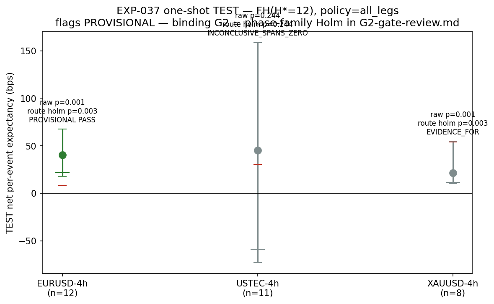
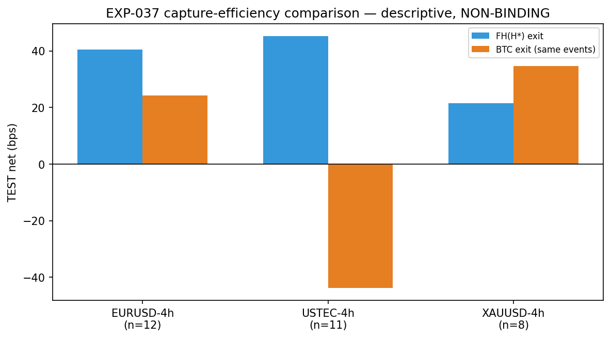

# Experiment Report: EXP-037 — `/EXIT-FH` Fixed-Horizon-Exit Capture-Efficiency Variant (4h, one-shot TEST)

## Status: ROUTE_PASS_PROVISIONAL_PENDING_PHASE_HOLM

**Date**: 2026-06-10
**Instruments**: EURUSD, USTEC, XAUUSD (4h domain; BTCUSD excluded by break-even map)
**Data Views / Feature Categories**: 4h OHLC domain; EXP-022 lifetime events (PYRIMARY population); rebuilt 4h Close series for FH exit-bar prices; EXP-027 frozen regime-cluster bootstrap

---

## Question

Does the disclosed 4h capture-efficiency headroom (BTC-exit matched-control drag −27 bps, EXP-031) convert into a net-positive, TEST-stratum-confirmed exit variant — or is the H\* selection too fragile to carry a TEST read?

## Hypothesis

On the 4h domain, replacing the band-target/trend-change (BTC) exit with a fixed-horizon exit at a single TRAIN-frozen horizon H\* yields positive net per-event expectancy (absolute estimand, frozen CONSERVATIVE costs + financing) that survives a one-shot TEST-stratum confirmation with Holm across the phase-level G2 family.

## Method Summary

TRAIN: mechanical H\* tie-break over {4,6,8,12} (stability filter + max-min worst-half criterion) on the contained TRAIN subset, pyramid policy by the EXP-033 one-SE preference rule. R1.2 synthetic-null calibration (R=2000) of the frozen bootstrap at each cell's TEST structure. Freeze-before-TEST barrier. TEST: one-shot regime-cluster bootstrap (1000 resamples) at H\*/frozen policy per declared cell (EURUSD, USTEC, XAUUSD). Within-route Holm-3 for provisional flag; binding adjudication in phase-level G2-gate-review.md.

## Key Findings

### Finding 1: TRAIN H\* = 12, all_legs policy selected

The tie-break retained all four candidate horizons (all N>0, N1>0, N2>0). H\* = 12 selected by max-min criterion (worst-half 41.07 bps). All_legs was the only feasible policy (n≥15 floor).

### Finding 2: Null calibration corrects anti-conservatism

FPR uncorrected: EURUSD 0.105, USTEC 0.104, XAUUSD 0.163. Margins: EURUSD 8.4, USTEC 30.3, XAUUSD 54.2 bps — all restored to FPR=0.05.

### Finding 3: EURUSD-4h provisional pass

TEST: n=12, net=+40.56 bps, ci_low_1s=21.94 > margin 8.42, raw boot_p=0.001, within-route Holm p=0.003 → **route_pass_provisional**. FH-vs-BTC: FH added +16.29 bps on the same events.

### Finding 4: USTEC inconclusive, XAUUSD margin-bound

USTEC: n=11, CI [−72.6, +158.7], boot_p=0.244 — power-limited as predeclared. XAUUSD: n=8, boot_p=0.001 but ci_low_1s 11.45 < margin 54.2 — correct calibration blocks the pass.

## Conclusion

**ROUTE_PASS_PROVISIONAL_PENDING_PHASE_HOLM.** EURUSD-4h produces a provisional pass. The fixed-horizon exit recovers substantial capture efficiency (+16 bps vs BTC exit on the same TEST events). The binding G2 verdict (phase-level Holm across Phase 008) is deferred to `G2-gate-review.md`. `B2_NO_ROBUST_HSTAR` was not triggered.

## Limitations

- Small TEST strata (n=8–12) — all cells near the power boundary of the frozen bootstrap.
- Single-shot TEST read — no replication within this experiment.
- 5m/1h domains not tested (G1-B2 ineligible grid maxima ≤ 0).
- XAUUSD cell count (n=8) below the ~13-event expectation, driven by policy feasibility.

## Implications for Future Research

- The FH exit shows directional consistency with the EXP-031 BTC-drag diagnosis — capture efficiency is a viable lever for this entry substrate.
- The null calibration margins highlight that small-n cells need explicit correction before their verdicts can gate holdout release.

## Recommended Next Experiments

1. **G2-gate-review.md** — desk artifact adjudicating the phase-level Holm family across EXP-037 and EXP-038.
2. **EXP-032 (holdout release)** — admissible only if G2 is satisfied; operator selects one package.

## Artifacts

| Artifact | Path |
|----------|------|
| Scope | [scope.md](scope.md) |
| Analysis Plan | [analysis-plan.md](analysis-plan.md) |
| Code | [code/](code/) |
| Audit | [audit.md](audit.md) |
| Results | [results.md](results.md) |
| Governance Reviews | [governance/](governance/) |
| Plots | [plots/](plots/) |
