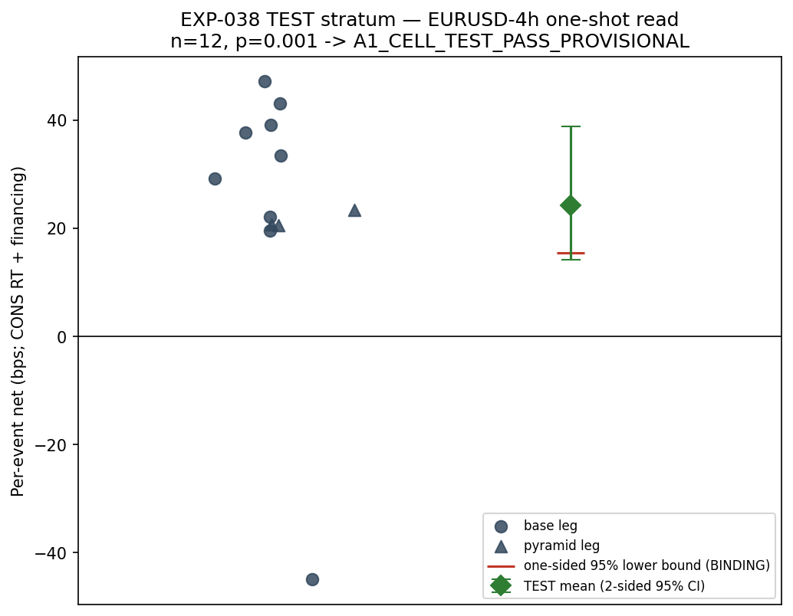
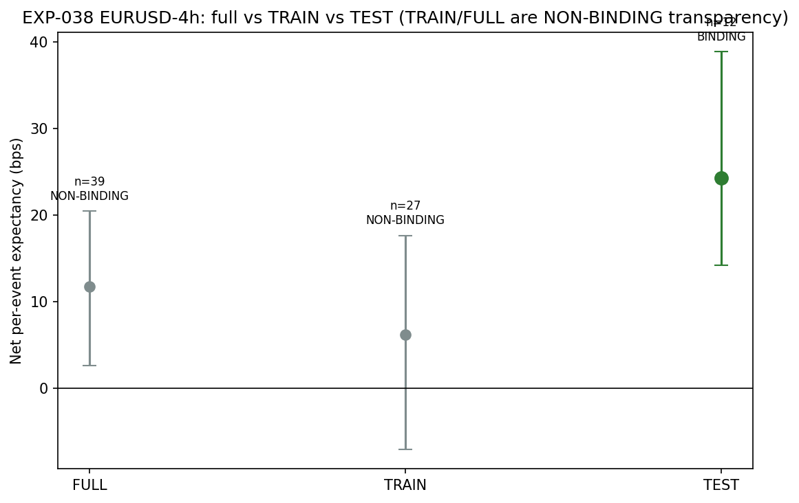

# Experiment Report: EXP-038 — EURUSD-4h A1-Cell TEST-Stratum Temporal-Stability Subsample Check (one-shot)

## Status: A1_CELL_TEST_PASS_PROVISIONAL_PENDING_PHASE_HOLM

**Date**: 2026-06-10
**Instruments**: EURUSD (4h domain only)
**Data Views / Feature Categories**: 4h OHLC domain; EXP-022 lifetime events (PRIMARY population); EXP-034 cost/financing/inference path reused verbatim; EXP-027 frozen regime-cluster bootstrap

---

## Question

Does EURUSD-4h's A1 strict pass (EXP-034 `SEQUENCE_PASS_ALPHA05`) remain temporally stable on the held-back TEST stratum — the only fresh stratum-level read available before the holdout?

## Hypothesis

On the TEST stratum (last 30% of the analysis set by trigger time), EURUSD-4h retains positive net per-event expectancy (the same registered baseline estimand as EXP-034: BTC exit, pyramids included, frozen CONSERVATIVE cost + financing).

## Method Summary

Reuse EXP-034's exact pipeline (filters, cost overlay, financing, frozen inference tail with hash pin). Partition by trigger close time vs the 1-minute `train_end_ts` boundary (TEST iff trigger > boundary; ties → TRAIN). Pre-TEST R1.2 null calibration (R=2000 Gaussian cluster-model replicates) produces the binding margin m = max(0, Q95 null ci_low_1s). One-shot regime-cluster bootstrap (1000 resamples) on TEST events. Provisional rule: ci_low_1s > m AND boot_p ≤ 0.05. LOCO fragility diagnostic accompanies the read.

## Key Findings

### Finding 1: All integrity guards pass — exact EXP-034 reproduction

Full-cell count 39 exact. Full-cell net mean 11.77 bps reproduces EXP-034 to 0.0. Full-cell bootstrap CI replay with EXP-034's own seed reproduces to ≤ 8.9e-16.

### Finding 2: Null calibration margin = 3.78 bps

FPR uncorrected = 0.0975 at n=12 (9 clusters). The mechanical margin restores FPR to 0.05. Sigma_b = 14.4, sigma_w = 25.2 bps.

### Finding 3: TEST-stratum provisional pass

TEST: n=12 (3 bull, 9 bear), net=+24.27 bps, ci_low_1s=15.43 > margin 3.78, raw boot_p=0.001 → **A1_CELL_TEST_PASS_PROVISIONAL**. The TEST effect is larger than the full-cell effect (+24.27 vs +11.77 bps) — later-period events had larger price moves.

### Finding 4: LOCO — no single-cluster fragility

All 9 regime-cluster drops above margin (min ci_low_1s 13.25 bps). The pass is not driven by a single cluster.

### Finding 5: Seed robustness and nomination precondition

Over 8 seeds: ci_low_1s range [14.59, 15.66], all sign-stable positive. TRAIN net point +6.22 > 0 → nomination precondition met.

## Conclusion

**A1_CELL_TEST_PASS_PROVISIONAL_PENDING_PHASE_HOLM.** The EURUSD-4h A1 strict pass is temporally stable at the TEST-stratum level. The LOCO diagnostic shows no single-regime fragility, and seed robustness confirms the pass is not a sampling artifact. The binding G2 verdict (phase-level Holm family adjudication in G2-gate-review.md) is the final gate. Per R1.7, this is a dependent subsample check (TEST events contributed to both D0 cell selection and the EXP-034 pass), NOT an independent out-of-sample confirmation.

## Limitations

- Dependent subsample (R1.7): TEST events are not independent of the A1 pass — they are ~30% of the EXP-034 estimate.
- Small TEST n (12 events) — limited precision despite the null calibration correction.
- Single cell, single domain — does not generalize.
- Temporal non-stationarity: TEST events (late 2024–early 2025) showed larger effects than TRAIN (2023–2024).

## Implications for Future Research

- The EURUSD-4h baseline survives its stratum-level check, making it a candidate for holdout release (pending G2).
- The R1.2 null calibration and R1.7 LOCO diagnostic are now established patterns for any future single-cell confirmations.

## Recommended Next Experiments

1. **G2-gate-review.md** — desk artifact adjudicating the phase-level Holm family.
2. **EXP-032 (holdout release)** — admissible if G2 satisfied; operator selects one package (noting the EXP-037/038 EURUSD-4h overlap).

## Artifacts

| Artifact | Path |
|----------|------|
| Scope | [scope.md](scope.md) |
| Analysis Plan | [analysis-plan.md](analysis-plan.md) |
| Code | [code/](code/) |
| Audit | [audit.md](audit.md) |
| Results | [results.md](results.md) |
| Governance Reviews | [governance/](governance/) |
| Plots | [plots/](plots/) |
