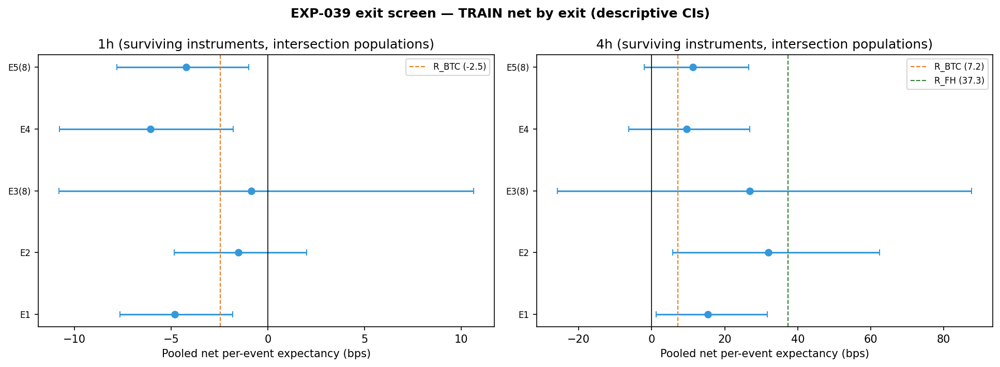
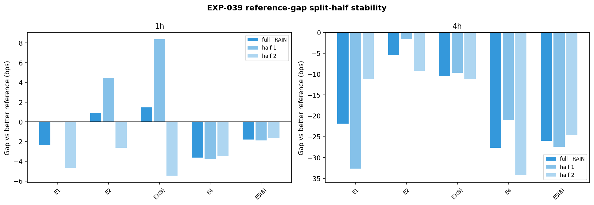

# Experiment Report: EXP-039 — `/EXIT-X` TRAIN-Only Exit Screen (DIAG-006)

## Status: MEASUREMENT_COMPLETE — FLAT

**Date**: 2026-06-10
**Instruments**: BTCUSD, EURUSD, USTEC, XAUUSD (surviving: EURUSD, USTEC, XAUUSD)
**Data Views / Feature Categories**: 1-minute time bars resampled to 1h and 4h OHLC domains; Heiken Ashi candles (E1/E2 triggers only); AVWAP bounce-entry substrate (MA 20/50, TickVolume^0.75, MAD band 1.0)

---

## Question

On the unchanged AVWAP bounce-entry substrate, does any structurally distinct exit rule (E1–E5, with E3/E5 parameter grids) beat the best validated exits (FH H\*=12 on 4h; band-target/trend-change everywhere) on TRAIN, positively and stably, on the 4h (primary) or 1h (secondary) domain, under frozen CONSERVATIVE costs + Phase 008 financing?

## Hypothesis

Exploratory diagnostic screen (no binding hypothesis test). The deliverable is a mechanical qualification verdict — whether any (exit, domain) cell qualifies under the predeclared §8.1 rule for the provisional EXP-041 one-shot TEST confirmation.

## Method Summary

Five candidate exit families (E1 HA Harami, E2 HA trailing, E3 Last-X high/low trailing with X∈{3,5,8}, E4 adverse-band stop, E5 target-conditional time-stop with H_ts∈{8,12,24}) were evaluated on the shared TRAIN AVWAP bounce-entry substrate across 1h and 4h domains (10 evaluated cells). Per-event net expectancy was computed under frozen CONSERVATIVE costs + Phase 008 financing, with boundary-contained event populations and intersection-based reference gap comparisons. Gridded exits (E3, E5) were pre-selected by max-min worst-half net. Qualification required per-instrument positivity, beating the better reference, split-half stability, and the event-count floor.

## Key Findings

### Finding 1: 4h — No Candidate Beats R-FH(12) at +37.3 bps

- **Reference**: R-FH(12) pooled net = +37.3 bps (n=86 intersection, SE 17.9 bps); R-BTC = +7.2 bps. R-FH(12) is the binding bar.
- **Best candidate**: E2 (HA trailing) at +31.9 bps pooled net, gap −5.4 bps vs R-FH(12). Passes per-instrument positivity (criterion i) and split-half stability (criterion iii) but fails criterion (ii) — negative gap.
- **E3(3)**: highest raw net (+39.9 bps) but selected point E3(8) yields +26.9 bps and fails per-instrument positivity (XAUUSD −1.7 bps).
- **E5(8)**: passes criterion (i) at +11.3 bps but gap is −26.0 bps vs R-FH(12).
- All 4h events resolve within the TRAIN boundary (0 unresolved per candidate).

### Finding 2: 1h — All Candidates Net Negative

- **Reference**: R-BTC pooled net = −2.5 bps (n=443 intersection).
- Best candidate E2 at −1.5 bps — fails per-instrument positivity and net magnitude.
- No candidate passes criterion (i). 1h is structurally non-viable on this substrate.

### Finding 3: Power and Fragility

- 4 of 10 evaluated cells flagged power-fragile (|gap| < bootstrap SE), consistent with ~86 events per 4h cell.
- Split-half filter correctly identifies instability in all 1h candidates and E4 on 4h.

### Finding 4: Determinism and Reconciliation

- Determinism replay PASS (max drift = 0.0).
- R-BTC per-event reconciliation with EXP-022: max diff 0.0 bps.
- R-FH(12) per-instrument reconciliation with EXP-033: max diff 2.1e-14 bps.

## Conclusion

**FLAT** — no (exit, domain) cell satisfies the §8.1 mechanical qualification rule. The qualifying set is empty. The EXP-041 one-shot TEST slot is unused.

The R-FH(12) bar at +37.3 bps is the strongest known exit on this substrate. Capture-efficiency beyond FH is exhausted on the AVWAP bounce-entry substrate across the structurally distinct exit families tested. Track A is FLAT per Phase 010 design §9.

## Limitations

1. **TRAIN-only selection, winner's curse exposed**: All measurements are descriptive TRAIN statistics. Even if a candidate had qualified, TRAIN selection is fully exposed to winner's curse.
2. **Power-limited 4h cells**: ~86 intersection events per 4h cell yields bootstrap SEs of 7–30 bps. Reference gaps below the SE are not stably selectable.
3. **EURUSD TEST-cap**: EURUSD evidence is permanently TEST-capped (design §7.3). Qualification strength would depend on TEST replication across uncapped instruments.
4. **1h structural weakness**: The 1h domain generates events that are net-negative even under R-BTC on this substrate.
5. **BTCUSD descriptive only**: BTCUSD excluded from binding statistics per the EXP-030/D0 break-even map.

## Implications for Future Research

1. EXIT_FLAT triggers the Phase 010 design §9 consequence — no further exit-only variation on this substrate is warranted.
2. New exit exploration should consider entry-substrate changes (Stage-D) or market-regime conditioning rather than further exit-only variation.
3. HYP-001 (direct S/R test, EXP-040) and new-universe groundwork (INFR-002) are the remaining Phase 010 tracks.

## Recommended Next Experiments

1. **EXP-040 (HYP-001 direct S/R test)**: The parallel science track for mechanism knowledge.
2. **Stage-C family review**: Review EXIT_FLAT in context of broader exit-exploration program before committing to new directions.

## Artifacts

| Artifact | Path |
|----------|------|
| Scope | [scope.md](scope.md) |
| Analysis Plan | [analysis-plan.md](analysis-plan.md) |
| Code | [code/](code/) |
| Audit | [audit.md](audit.md) |
| Results | [results.md](results.md) |
| Plots | [plots/](plots/) |
