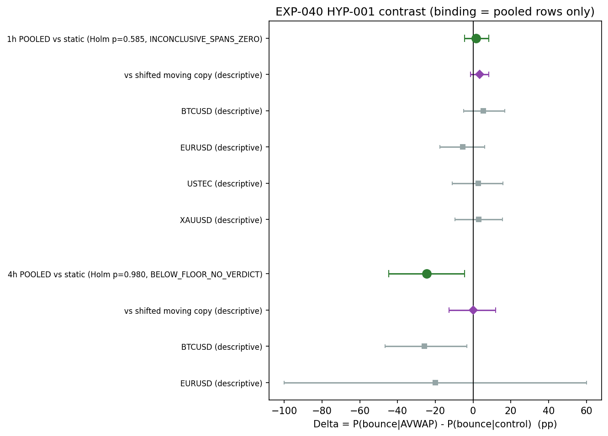

# Experiment Report: EXP-040 — HYP-001 Direct AVWAP Line Support/Resistance Test

## Status: INCONCLUSIVE

**Date**: 2026-06-10
**Instruments**: BTCUSD, EURUSD, USTEC, XAUUSD
**Data Views / Feature Categories**: 1-minute time bars resampled to 1h and 4h OHLC domains; EXP-020 AVWAP state machine (MA 20/50, TickVolume^0.75, MAD band multiplier 1.0)

---

## Question

Is the AVWAP line itself a price barrier, or is the Phase 006–008 edge a continuation/regime effect for which the line is merely a trigger location?

## Hypothesis

**HYP-001:** Price approaching the anchored VWAP line reacts at the line as support/resistance beyond what matched non-AVWAP price levels show — `P(bounce | approach to AVWAP) > P(bounce | approach to matched control level)` on the 1h and/or 4h domain.

## Method Summary

Approach episodes to the AVWAP line (within ε = 0.25 × MAD band-width) were detected via a sequential streaming pass over 1h and 4h domain bars. Control episodes used horizontal price levels at randomized offsets from the contemporaneous AVWAP (1.5–3.5 band-width units), matched on entry direction, volatility tercile, and speed tercile. The binding contrast is the rate difference Δ = P(bounce | AVWAP) − P(bounce | control) in percentage points, per domain, pooled across instruments. Inference uses a regime-cluster bootstrap CI and within-stratum permutation with Holm adjustment across the 2-domain family (α = 0.05). No cost, tradability, or strategy claim attaches — this is mechanism science.

## Key Findings

### Finding 1: 1h Domain — INCONCLUSIVE_SPANS_ZERO

Δ = +1.55 pp, 95% CI [−4.52, +8.43], Holm p = 0.585. n = 1,594 AVWAP / 339 control episodes across 70 matched strata. The CI symmetrically straddles zero. The point estimate is directionally consistent with HYP-001 but cannot be distinguished from noise. Power statement: unclustered MDE ≈ 4.9 pp (optimistic under clustering); immateriality verdict (CI half-width < 2 pp) was structurally unreachable at this n.

### Finding 2: 4h Domain — BELOW_FLOOR_NO_VERDICT

Δ = −24.67 pp, 95% CI [−44.63, −4.40], Holm p = 0.980. n = 50 AVWAP / 22 control episodes across 7 strata — both arms well below the 100/arm reportability floor. The CI is entirely negative, which would constitute EVIDENCE_AGAINST if n were adequate, but the floor correctly prevents a verdict. The negative Δ is consistent with the control arm's expected upward bias from the unmatched price-stretch regime (control approaches occur 1.5–3.5 BW from VWAP, a location AVWAP approaches never occupy).

### Finding 3: Per-Instrument Descriptive (1h, Non-Binding)

All 1h CIs span zero — no instrument suggests a reliable signal:
- BTCUSD: +5.4 pp [−4.9, +16.8], n=515/109
- EURUSD: −5.4 pp [−17.5, +6.1], n=415/89
- USTEC: +2.8 pp [−11.1, +15.8], n=315/67
- XAUUSD: +3.0 pp [−9.5, +15.6], n=349/74

EURUSD is the only instrument with a negative point estimate; no systematic cross-instrument pattern emerges.

### Finding 4: Stability and Censoring

Split-half (1h, non-binding): h1 = −2.26, h2 = +1.02 pp — opposite signs consistent with noise around zero. Censoring sensitivity (1h): extreme imputations bracket Δ = +1.55 in [−2.47, +3.04] pp, driven by unresolved episode imbalance (95 AVWAP / 59 control).

### Finding 5: Moving-Copy Control Arm (Descriptive Secondary, Design §11/8)

The shifted-moving-copy control (AVWAP(t) + δ·BW(t)) isolates the moving-vs-static kinematic confound (limitation 4):
- **1h**: Δ_m = +3.41 pp, CI [-1.23, +8.35] — *larger* than the static Δ = +1.55 pp. The kinematic confound does not explain the AVWAP premium; if anything, the static control underestimates it.
- **4h**: Δ_m = +0.09 pp, CI [-12.68, +11.95] — essentially zero. The strongly negative static Δ (−24.67 pp) was entirely a kinematic artifact. Against a moving level with identical kinematics, AVWAP is indistinguishable.

The confound is now measured, not merely disclosed. The binding verdicts are unchanged.

### Finding 6: Determinism Replay PASS

Determinism replay PASS: drift = 0.0. All binding tables byte-identical on rerun.

## Conclusion

**HYP-001: INCONCLUSIVE.** Neither domain met the FOR criteria (Δ > 0, CI_low > 0, Holm p ≤ 0.05) nor the AGAINST criteria (CI ≤ 0, or CI_high < +2 pp with CI_low ≤ 0). The 1h result is inconclusive by CI-spanning-zero. The 4h result is below the reportability floor. The mechanistic S/R question for the AVWAP line remains open — neither FOR nor REFUTED was reached. Per design §8.3, this is a permanent mechanism record and a Phase 011 / family-review input; no gate consequence.

## Limitations

1. **Bar-close granularity**: intrabar touches are invisible. This attenuates bounce rates symmetrically across arms.
2. **Control specificity**: the horizontal-snapshot control tests "AVWAP line vs frozen nearby level," not "vs every conceivable structural level." A FOR would be specific to this contrast; a null does not prove the absence of structure everywhere.
3. **Δ is a conditional rate difference**, not a tradable quantity. No economic claim attaches.
4. **Moving-vs-static kinematic confound (resolved in-scope via design §11/8)**: the AVWAP arm's level moves each bar while the static control is frozen. The shifted-moving-copy arm was implemented — see Finding 5. On 1h it does not explain the AVWAP premium; on 4h it explains the entire negative static Δ.
5. **Unmatched price-stretch regime**: control arm approaches occur 1.5–3.5 BW from VWAP, a location AVWAP approaches never occupy. Generic mean reversion inflates control bounce rates, biasing Δ against HYP-001 — conservative for a FOR but weakening interpretability of an AGAINST result.

## Implications for Future Research

- HYP-001 remains open. An inconclusive read means the line-S/R story is not closed — a REFUTED (NO) would reframe the edge as relative momentum around pivots, but that closure was not achieved.
- The 1h Δ = +1.55 pp (CI [−4.52, +8.43]) suggests the true effect, if any, is small (< 5 pp). Detecting a 2–3 pp effect would require substantially more episode data.
- The 1h power limitation (n ~ 1,594 AVWAP episodes) is the binding constraint. A longer analysis window, more instruments, or a different approach definition could increase episode counts.
- The kinematic confound (limitation 4) was resolved in-scope via the shifted-moving-copy secondary arm: it does not explain the 1h premium but explains the entire 4h negative static contrast.

## Recommended Next Experiments

1. **Follow-up power analysis**: Assess whether a longer analysis window or expanded instrument set could produce sufficient episode counts for a conclusive read on 1h.
2. **Stage-C family review**: The HYP-001 INCONCLUSIVE verdict is an input to the broader family review per Phase 010 design §9.

## Artifacts

| Artifact | Path |
|----------|------|
| Scope | [scope.md](scope.md) |
| Analysis Plan | [analysis-plan.md](analysis-plan.md) |
| Code | [code/](code/) |
| Audit | [audit.md](audit.md) |
| Results | [results.md](results.md) |
| Plots | [plots/](plots/) |
