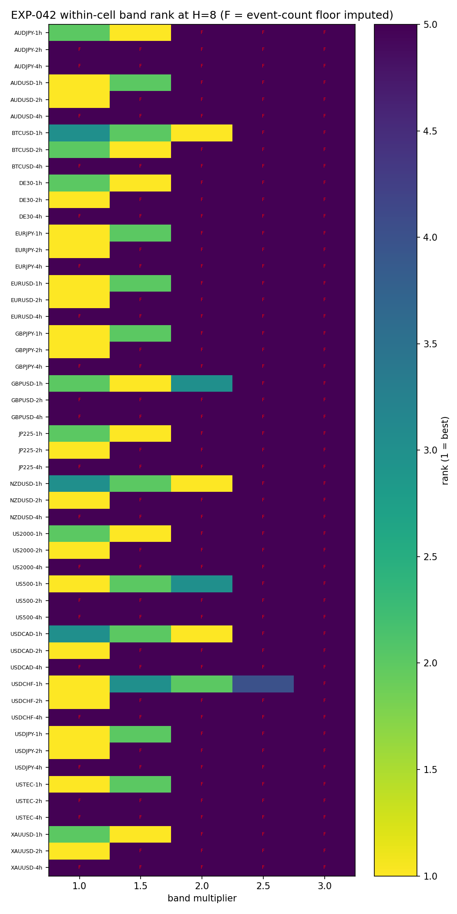
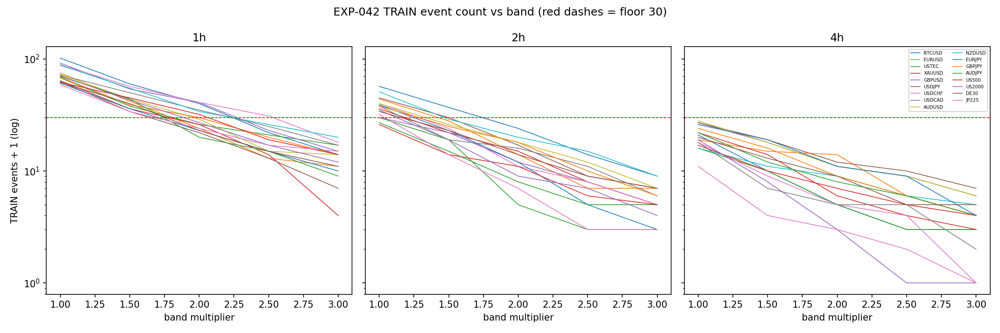
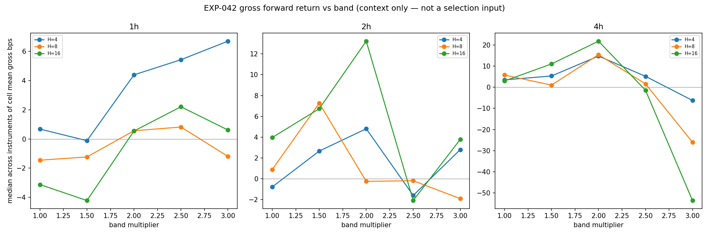

# EXP-042 — Track A0 Band-Selection Scan

> **SET ASIDE 2026-06-11 — FRAMING_ERROR.** Post-execution review found the
> arm-at-adverse-band entry rule applied the band multiplier as an **entry
> filter**, when across Phases 004–010 it was always an **exit parameter**
> (favorable/adverse target levels frozen at trigger; registry `/BAND` is an
> exit/structural branch). EXP-042 therefore measured a filtered
> deep-pullback subpopulation, and the band=1.0 "selection" reflects event
> availability, not exit-parameter quality. **No decision is based on these
> results.** Track A0 is removed from Phase 011 (the band has no entry-level
> object to select); the band multiplier belongs entirely to Track B exit
> training, where it was already correctly scoped (design §5.4, Family 2).
> Code, results, and run_metadata are retained as a negative-process record;
> the pending DEGENERATE_FLOOR adjudication is moot. Final disposition:
> **MEASUREMENT_COMPLETE — FRAMING_ERROR** (0 slots, 0 TEST reads).
> Root-cause review:
> `docs/code-reviews/2026-06-11-band-multiplier-framing-error.md`.

**Phase:** 011 (per-instrument foundation) · **Track:** A0 (removed) · **Date:** 2026-06-11
**Verdict:** `MEASUREMENT_COMPLETE — FRAMING_ERROR` (set aside; original
verdict `BAND_SELECTED_DEGENERATE_FLOOR_PENDING_ADJUDICATION` carried zero
weight — freeze never granted).
**Audit:** PASS (implementation correct; the error was in the scope's framing)
· **TEST reads consumed:** 0 (TRAIN-only, descriptive)

## Question

Which global AVWAP entry-band multiplier in {1.0, 1.5, 2.0, 2.5, 3.0} does the
frozen design-§5.2 rank rule select over 51 TRAIN cells (17 instruments ×
{1h, 2h, 4h}), and what are the selected band's event rates for the Phase 011
power statements?

## Method (all frozen before any TRAIN read)

Events from the frozen AVWAP substrate under the operator-ratified
**arm-at-adverse-band** entry rule (arm when a completed close crosses beyond
`AVWAP ∓ b×MADspread`; trigger unchanged at the AVWAP recross) — a pre-read
amendment made because the multiplier had no entry role in the frozen
baseline (a naive sweep would have been vacuous; see the design amendment
log). Per band×cell: event count and mean gross forward return (bps,
direction-signed log on real domain Close) at H ∈ {4, 8, 16} domain bars.
Selection: within-cell rank at H=8, n ≥ 30 floor (failing bands imputed
worst rank), best median rank across cells, wider-band tie-break. TRAIN =
first 70% of the first-70% slice (R1.3 1-minute-row boundary); TEST/holdout
rows never entered the scan engine (file-order head; no full-file sort).

## Key results

| Band | Median rank | Floor-imputed cells |
|---|---|---|
| **1.0** | **2.0** | 41% |
| 1.5 | 5.0 | 65% |
| 2.0 | 5.0 | 88% |
| 2.5 | 5.0 | 98% |
| 3.0 | 5.0 | 100% |

Wider bands lost on **event starvation**, not on measured per-event gross —
where they have events their per-event gross is often higher (the conjectured
deeper-pullback effect), but at 25.5 months of TRAIN they cannot feed an
exit-training programme. DEGENERATE_FLOOR fired (>50% imputation at every
band ≥ 1.5), so the freeze escalates to the operator (accept-with-disclosure
vs early FOUNDATION_NON-TUNABLE; no re-ranking or grid extension permitted).

**Power statement (band 1.0):** 1h — 17/17 cells ≥ 30 TRAIN events (median
69, projected TEST ~30); 2h — 13/17 (median 37, TEST ~16); **4h — 0/17**
(median 19, TEST ~8). 4h per-cell exit training is effectively unpowered for
the new event population; 1h is the only fully-powered domain.

## Disclosures

- Entry-rule discontinuity: no band (including 1.0) reproduces the Phase
  004–010 event population; design §7.5 non-comparability covers the whole
  grid.
- F02 proxy limitation: selection is gross/H=8/no-cost by frozen
  predeclaration; "best per-event economics" across bands remains an open,
  unpowered question.
- DE30 truncated history (ends 2026-01-16; own-timeline boundaries).
- Substrate change regression-tested (`python/tests/test_avwap_band_param.py`,
  20/20 project tests pass); defaults reproduce the frozen baseline.

## Artifacts

`scope.md` · `analysis-plan.md` · `code/run_experiment.py` ·
`governance/pre-execution-review.md` (APPROVE + F01–F05 addendum) ·
`results/` (band_scan.parquet, rank_table.csv, power_statement.csv,
run_metadata.json) · `audit.md` (PASS) · `results.md`
