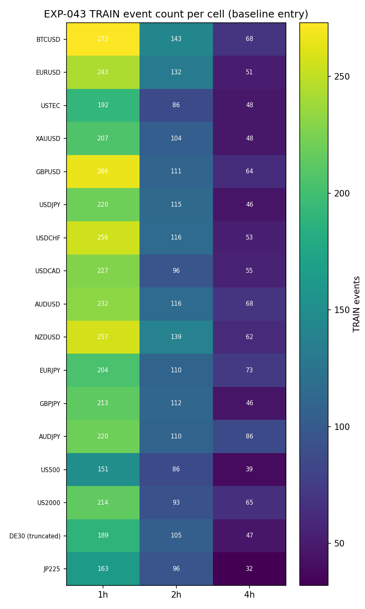
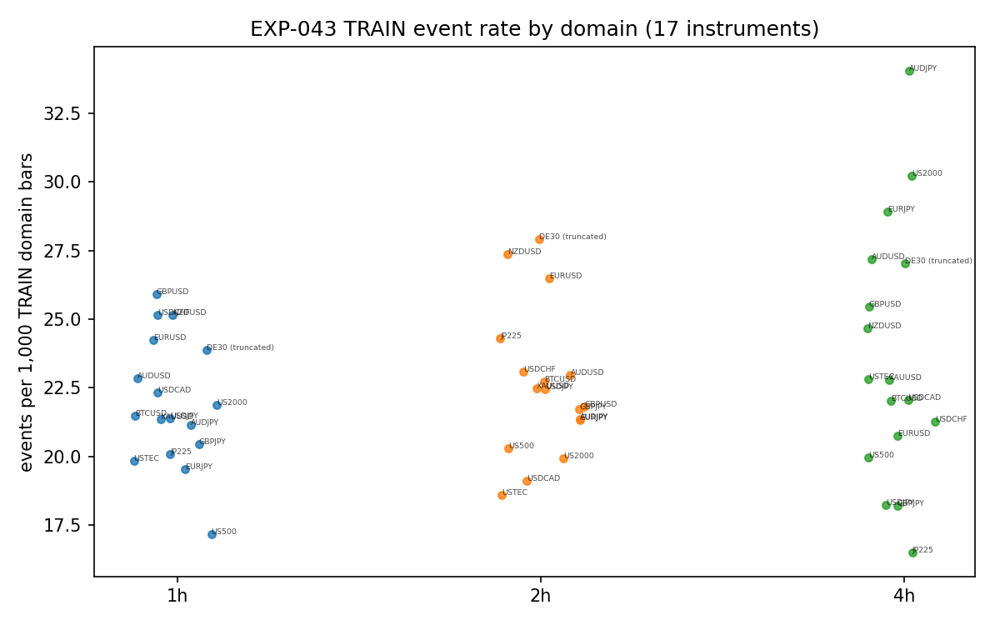
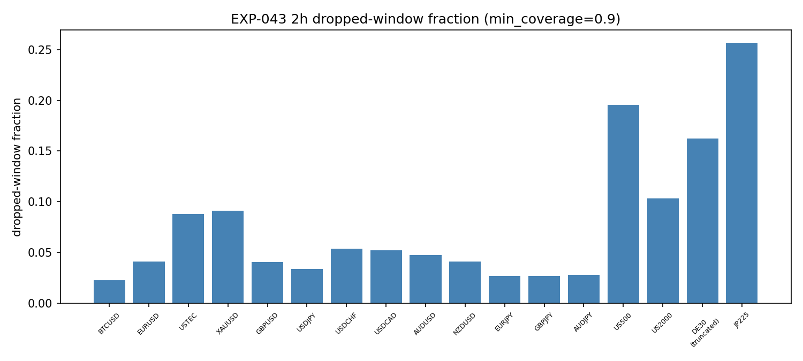

# Experiment Report: EXP-043 — Phase 011 Track A Substrate Readiness (Baseline Entry, 51 Cells)

## Status: COMPLETED — READINESS_DELIVERED

**Date**: 2026-06-11
**Instruments**: BTCUSD, EURUSD, USTEC, XAUUSD (old universe) + GBPUSD, USDJPY,
USDCHF, USDCAD, AUDUSD, NZDUSD, EURJPY, GBPJPY, AUDJPY, US500, US2000, DE30
(truncated), JP225 (new universe, VAL-003 PASS)
**Data Views / Feature Categories**: 1-minute time bars aggregated to 1h/2h/4h
clock-aligned domain bars (`min_coverage=0.90`; 2h first-ever construction);
frozen baseline AVWAP bounce events (`generate_avwap_events` defaults —
Phases 004–010 entry, bit-for-bit). TRAIN stratum only. No chart-type views,
no return metric of any kind.

---

## Question

For each of the 51 instrument×domain cells: (a) does domain-bar construction
from 1-minute source bars pass integrity checks (including the first-ever 2h
construction); (b) does the frozen baseline event generator produce
invariant-clean, deterministic events; and (c) how many TRAIN events does each
cell yield, relative to the 30-event reporting floor used for Track B power
planning?

## Hypothesis

Exploratory readiness question (no market-edge claim): the frozen baseline
AVWAP event substrate is deterministic, invariant-clean, and constructible on
all 51 cells, and its measured TRAIN event rates quantify per-cell power for
Track B exit training. This experiment feeds gate G1 (Phase 011 design §8.2)
and replaces the non-transferable EXP-042 power statement.

## Method Summary

F01-compliant TRAIN loading (first `floor(0.7 × floor(0.7 × total))` file-order
1-minute rows per instrument; no full-file sort; order re-asserted), per-cell
construction-integrity predicates, the frozen-baseline event generation, an
exact 7-family invariant battery, a full second regeneration compared
frame-identically (determinism), and descriptive event-rate/power reporting.
0 statistical tests; thresholds frozen pre-data-contact (Revision 1): 2h
dropped-window fraction <10% clean / 10–25% flagged / >25% NOT_READY;
substrate-level halt iff non-determinism anywhere or the same invariant
violated on ≥3 instruments. See [analysis-plan.md](analysis-plan.md).

## Key Findings

### Finding 1: 50/51 cells READY; no systematic failure

Zero invariant violations across all events in all cells, zero determinism
failures (second pass frame-identical everywhere; the audit independently
reproduced two cells exactly in a third pass), and every construction
predicate passing except one cell's coverage gate. `substrate_alert: false` —
the predeclared halt condition was not approached. The frozen Phase-004
baseline generator and the clock-aligned aggregation transfer cleanly to the
13 new instruments and the first-ever 2h domain.

### Finding 2: JP225-2h NOT_READY on the frozen coverage gate — a session-structure outcome, not a generator defect

JP225-2h drops 25.66% of candidate 2h windows at `min_coverage=0.90`,
breaching the frozen >25% threshold. Its 96 events, 89 regimes, invariants,
and determinism are otherwise clean and recorded. Per design §8.2 the cell is
excluded from Track B; 16 instruments remain at 2h.

### Finding 3: event rates are scale-stable; this table supersedes design §7.4 power figures

Events per 1,000 TRAIN domain bars sit in a narrow 16.5–34.0 band across all
domains and instruments. Realized TRAIN counts: 1h 151–273 (below the §7.4
"~350–400" planning figure), 2h 86–143 (the intended middle ground), 4h 32–86.
**No cell falls below the 30-TRAIN-event reporting floor** (min 32, JP225-4h),
so Track B training is power-feasible everywhere — but 11 of 17 4h cells have
only 32–55 events, and the heuristic TEST projections (`TRAIN × 30/70`,
uniformity heuristic, not an estimate) put most 4h cells below 30 projected
TEST events.

### Finding 4: 2h construction is clean for forex, flagged for indices

2h dropped fractions: 0.02–0.05 (forex); flagged disclosure band (10–25%,
READY-eligible): US2000 0.103, DE30 0.163, US500 0.196. The 2h/1h bar-count
ratio is 0.475–0.498 everywhere (disclosure band never triggered). Audit
Info-1: un-gated *4h* index retention reaches 0.20–0.30 (JP225 0.297,
US500 0.286) — Track B should treat index 4h bars as sitting on thinner
window retention.

## Conclusion

**READINESS_DELIVERED** (predeclared criterion: the 51-cell map plus the
event-rate/power table is produced). Cell-level: **50 READY / 1 NOT_READY
(JP225-2h) / 0 CONSTRUCTED_EMPTY**; substrate-level Evidence AGAINST not
triggered.

The Phase 011 Track B substrate is certified on 50 cells: deterministic,
invariant-clean, and constructed with disclosed coverage quality. The realized
per-cell event-rate table is now the authoritative power basis for Track B
(replacing both the set-aside EXP-042 statement and the design §7.4 planning
figures). G1 remains incomplete pending the other two Track A items
(EXP-027-analog calibration coverage, EXP-029-analog parity).

## Limitations

- Readiness only — no information about edge, tradability, or exit quality
  (no return metric computed, by scope).
- TEST projections are a uniformity heuristic; regime clustering can shift
  realized TEST counts materially.
- The 30-event floor is TRAIN-side; it does not guarantee TEST-side power for
  future per-cell confirmations.
- DE30 figures derive from a ~5-months-shorter history (power note on every
  row: projected counts optimistic by ~15–20% vs full-span instruments).
- Determinism verified same-machine/same-library (in-run second pass + audit
  third pass); cross-platform parity is the EXP-029-analog's job.

## Implications for Future Research

- 2h behaves as designed (the middle-ground domain) for 16 of 17 instruments;
  the JP225-2h exclusion is a session-structure interaction worth a dedicated
  scope only if JP225 matters to the eventual portfolio.
- Thin 4h cells (32–55 events) will produce noisy Track B stability planes;
  the n-neighbour stability rule's non-tunable outcome is the honest path for
  cells where the plane cannot separate from noise.

## Recommended Next Experiments

1. **EXP-027-analog (Track A)**: event-level inference calibration covering
   the 50 READY cells' event populations (required by G1 before Track B).
2. **EXP-029-analog (Track A)**: C#/Python parity re-verification for the 2h
   domain and the new universe.
3. **Track B exit training** (design §5.4) on the READY map, using this power
   table for per-cell expectations.
4. Optional new scope: JP225-specific 2h construction study (`min_coverage`
   sensitivity) — out of scope here (no tuning permitted).

## Artifacts

| Artifact | Path |
|----------|------|
| Scope | [scope.md](scope.md) |
| Analysis Plan | [analysis-plan.md](analysis-plan.md) |
| Code | [code/run_experiment.py](code/run_experiment.py) |
| Readiness map | [results/readiness_map.csv](results/readiness_map.csv) |
| Power statement | [results/power_statement.csv](results/power_statement.csv) |
| Full check table | [results/per_cell_checks.parquet](results/per_cell_checks.parquet) |
| Run metadata | [results/run_metadata.json](results/run_metadata.json) |
| Audit | [audit.md](audit.md) (PASS, 0C/0W/4 Info) |
| Results | [results.md](results.md) |
| Governance Reviews | [governance/](governance/) |
| Plots | [plots/](plots/) |
