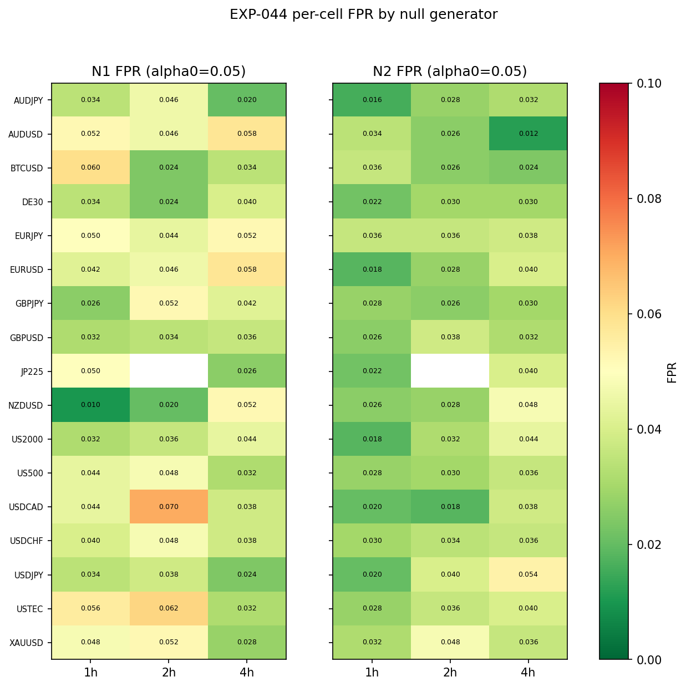
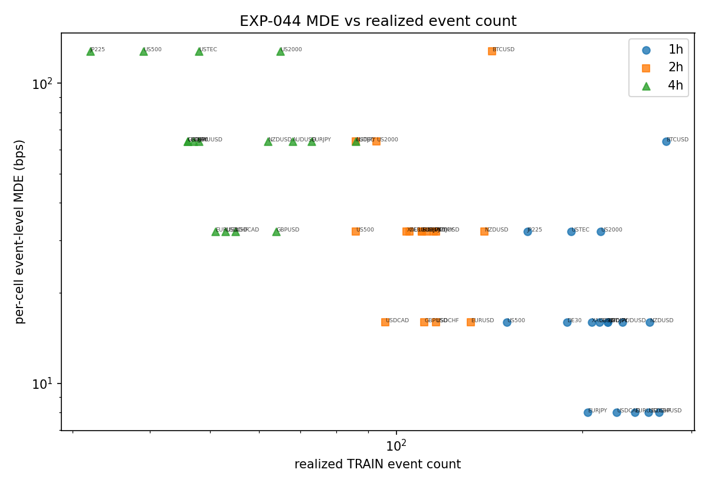

# Experiment Report: EXP-044 — Phase 011 Track A Per-Cell Event-Level Inference Calibration (EXP-027-Analog)

## Status: COMPLETED — CALIBRATION_DELIVERED

**Date**: 2026-06-11
**Instruments**: full 17-instrument Phase-011 universe (BTCUSD, EURUSD, USTEC, XAUUSD, GBPUSD, USDJPY, USDCHF, USDCAD, AUDUSD, NZDUSD, EURJPY, GBPJPY, AUDJPY, US500, US2000, DE30, JP225)
**Data Views / Feature Categories**: 1h/2h/4h clock-aligned domain bars from F01 TRAIN-only 1-minute rows; frozen baseline AVWAP regime/event scaffolding (placement only — real event outcomes never read); synthetic placebo/planted-edge substrates. Track A methodology experiment: 0 candidate slots, 0 TEST reads.

---

## Question

For each of the 50 READY cells certified by EXP-043, does the frozen EXP-027
event-level inference — per-event matched-control excess, regime-cluster
bootstrap CI, stratified sign-permutation p, Evidence-FOR rule — applied
**standalone per cell** (no instrument pooling, no Holm) control false
positives (FPR ≤ α₀ = 0.05) and retain power (finite event-level MDE at
TPR ≥ 0.80) at that cell's realized TRAIN event count (32–273 events)?

## Hypothesis

The per-cell application of the unchanged EXP-027 machinery exhibits
controlled FPR under two structurally different known-null generators and a
finite per-cell MDE at each READY cell's realized event count. Cells where
this holds are COVERED (G1 leg (ii) satisfied; admitted to Track B); cells
where it fails are NOT_COVERED (excluded with record).

## Method Summary

Per cell: 500 N1 (placebo events on real TRAIN returns) and 500 N2
(block-permuted returns, same placement) null draws at the cell's exact
realized bull/bear counts inside its real regime intervals, plus planted
direction-signed edges g ∈ {1,…,128} bps evaluated from the N1 draws
(bootstrap CI shifts exactly by +g; permutation p recomputed per g). Each
draw is scored with the frozen single-cell rule (effect > 0 ∧ CI_low > 0 ∧
p ≤ α). Wilson precision gates (FPR half-width ≤ 0.03, TPR ≤ 0.05), a 90%
draw-completion floor, predeclared coverage classification, and a two-cell
full determinism replay. Details in [analysis-plan.md](analysis-plan.md).

## Key Findings

### Finding 1: 37/50 cells COVERED; failures are mostly marginal FPR excess

Per-cell FPR at α₀ = 0.05 averages 0.041 (N1) / 0.031 (N2) on 500 reportable
draws per point (100% completion; zero CALIBRATION_UNDERPOWERED cells).
Twelve cells fail on an FPR point estimate above α₀ — eleven marginal
(0.052–0.062, Wilson lower bound below α₀) and one **material** (USDCAD-2h,
N1 = 0.070); one cell (BTCUSD-4h) fails on no finite MDE (TPR at 128 bps =
0.64). Notably, three high-count old-universe 1h cells (AUDUSD, BTCUSD,
USTEC) are marginal-excess NOT_COVERED — pooled-domain FPR control (EXP-027)
did not automatically transfer to every single cell.

### Finding 2: MDE degrades smoothly with event count — no cliff

Among COVERED cells, median MDE is 16 bps at 1h (151–266 events; range
8–32), 32 bps at 2h (86–143; range 16–128), 64 bps at 4h (32–86; range
32–128). TPR curves are monotone within Monte-Carlo noise. Thin 4h cells
remain usable but only certify large effects; BTCUSD carries the largest
MDEs at every domain (volatility, not method defect). Four cells sit at the
128 bps grid endpoint (true MDE possibly higher; grid not extended post hoc).

### Finding 3: Substrate triggers not fired, but N1 > N2 is a systematic offset

The METHOD_NOT_TRANSFERABLE triggers did not fire: two-null Wilson-interval
disagreement in only 2 instruments (AUDUSD, USDCAD; trigger requires ≥3), no
domain-wide FPR excess. However, N1 FPR exceeds N2 FPR in 35/50 cells
(sign-test p ≈ 0.001; medians 0.041 vs 0.030), and 11 of the 12 FPR-based
exclusions fail on N1 only — the Wilson non-overlap trigger is structurally
insensitive to a consistent ~0.01 offset at n = 500, so the pooled-domain
two-null agreement EXP-027 found did not replicate per cell. The failures
spread across all domains (1h 3 / 2h 4 / 4h 5) and are uncorrelated with
event count (BTCUSD-1h at 273 events fails), pointing at within-regime
real-return dependence (which i.i.d.-like N2 destroys, block length = 1
everywhere) rather than event sparsity. The predeclared both-nulls rule makes
the stricter N1 binding by construction, so the 12 exclusions stand;
re-basing on N2 would be post-hoc metric reselection.
The 13 new-universe instruments contribute 31 COVERED / 7 NOT_COVERED; the
first-ever 2h domain is 12/16 COVERED with MDEs 16–64 bps (BTCUSD-2h: 128).
Determinism replay (BTCUSD-1h, JP225-4h) frame-identical; placement exact in
100% of draws.

## Conclusion

**CALIBRATION_DELIVERED (Evidence FOR, deliverable criterion).** The 50-cell
coverage map is produced with every cell classified at predeclared precision,
the per-cell MDE table recorded, and determinism passing. G1 leg (ii) is
adjudicable from `results/coverage_map.csv`: 37 COVERED cells form the Track
B grid; the 13 NOT_COVERED cells (12 FPR-excess — 11 marginal, 1 material —
and 1 no-finite-MDE) are excluded with record, consuming nothing. The
per-cell operating-characteristic map replaces the EXP-027 pooled-domain map
as the binding power context for Tracks B and D.

## Limitations

- Calibrated at H_cal = 8 bars only; if Track D selects exits far from H≈8,
  a predeclared targeted second-horizon FPR check is required pre-TEST.
- Secondary α = 0.01 columns are anti-conservative (mean FPR 0.0225); only
  the α₀ = 0.05 operating point is classified and consumable.
- Estimated block length is 1 in every cell, making N2 effectively an i.i.d.
  resample — a weaker serial-dependence stress than designed.
- The 11 marginal NOT_COVERED cells are individually compatible with
  Monte-Carlo noise around a true FPR of 0.05 — every marginal cell's Wilson
  95% interval includes α₀ (only USDCAD-2h sits entirely above) — but the
  systematic N1 > N2 offset means the marginal tail is unlikely to be pure
  noise collectively. The predeclared rule resolves this conservatively.
  MDEs recorded for NOT_COVERED cells are power context only — the verdict
  column governs Track B admission.
- Audit (PASS) noted one latent code branch: an imprecise TPR point with
  point estimate ≥ 0.80 could define an MDE; the branch never fired in this
  run (max TPR half-width 0.0436).

## Implications for Future Research

- Track B power planning must use the per-cell MDE table: 4h candidates need
  plausible per-event excess ≥ 32–128 bps to be detectable.
- Single-cell inference at 500-draw resolution shows a marginal FPR-excess
  tail even at high event counts — per-cell verdicts downstream (Track D /
  G3) inherit the conservative exclusion rule, and Holm at G3 only tightens.

## Recommended Next Experiments

1. **G1 adjudication 2 of 2** (governance, not an EXP): close G1 against
   `coverage_map.csv` in the Phase 011 `G1-gate-review.md`.
2. **Conditional new scope**: targeted second-horizon FPR check on Track
   D-selected cells with exits far from H≈8.
3. **Operator option**: precision-only re-run (more draws, no object change)
   on the 11 marginal NOT_COVERED cells if the 37-cell grid proves limiting.
4. **EXP-029-analog C#/Python parity** — separate registered Track A item,
   pre-TEST-read requirement for 2h/new-universe strata.

## Artifacts

| Artifact | Path |
|----------|------|
| Scope | [scope.md](scope.md) |
| Analysis Plan | [analysis-plan.md](analysis-plan.md) |
| Code | [code/](code/) |
| Audit | [audit.md](audit.md) |
| Results | [results.md](results.md) |
| Coverage map | [results/coverage_map.csv](results/coverage_map.csv) |
| Governance Reviews | [governance/](governance/) |
| Plots | [plots/](plots/) |
