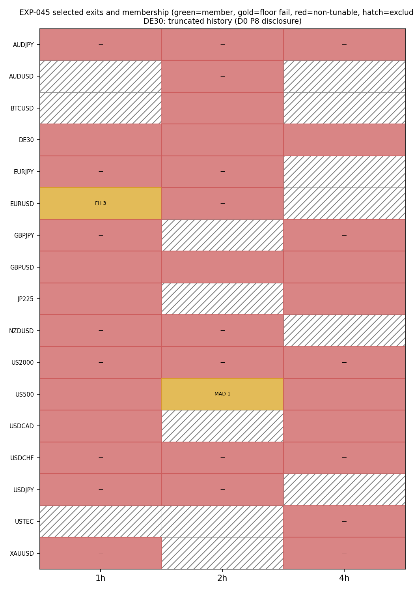
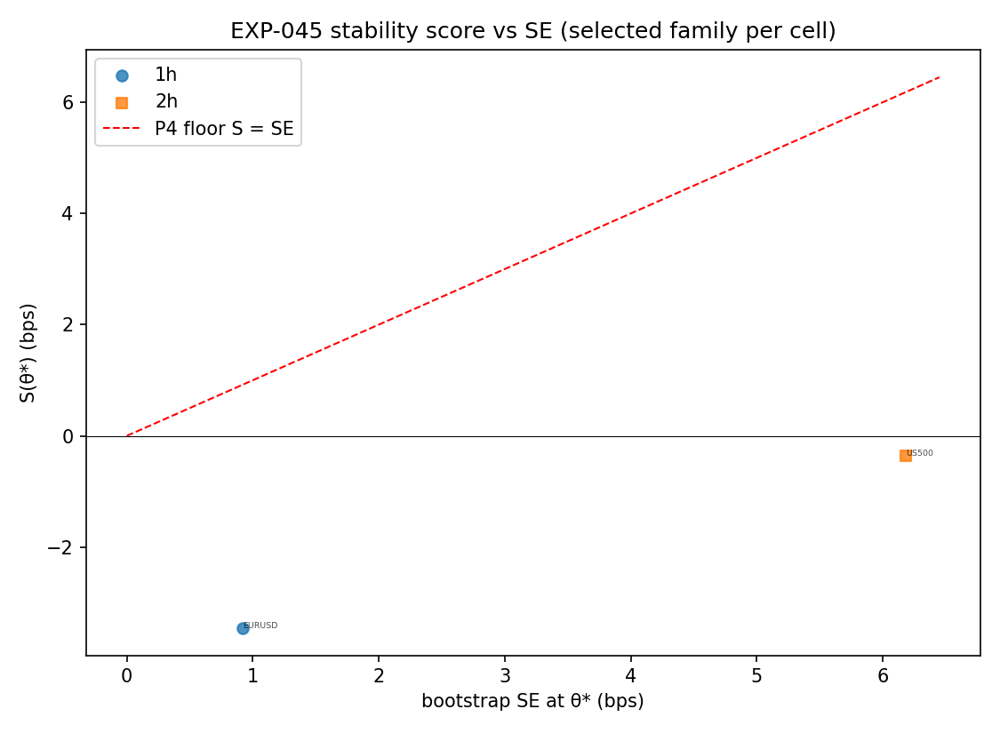

# Experiment Report: EXP-045 — Phase 011 Track B Per-Cell Exit Training (37-Cell COVERED Grid)

## Status: COMPLETED — TRAINING_DELIVERED (empty membership)

**Date**: 2026-06-11
**Instruments**: the 37 COVERED cells from EXP-044 (16 instruments across
{1h, 2h, 4h}; DE30 carries the D0 P8 truncated-history disclosure verbatim)
**Data Views / Feature Categories**: F01 TRAIN-only 1-minute rows → 1h/2h/4h
clock-aligned domain bars → frozen baseline AVWAP bounce events; per-event
net returns under the frozen D0 P2 CONSERVATIVE cost model. Track B
selection/measurement experiment: 0 candidate slots, **0 TEST reads**.

---

## Question

For each of the 37 COVERED cells, which of the two G0-frozen exit families —
FH(H) over {2,3,4,6,8,11,16,23} and MAD-band-target(m) over
{0.5,0.7,1.0,1.4,2.0,2.8,4.0,5.7} — is tunable on TRAIN under the
n-neighbour stability plane (k = 1, interior-only), and does the cell join
the candidate portfolio (tunable + P4 floor S(θ\*) ≥ +1×SE)? Does the
membership set meet the G2 composition rule (P5: ≥5 cells over ≥3
instruments) that authorizes the Track C portfolio TEST read?

## Method Summary

Per cell: one deterministic forward scan computed per-event exits for all 16
grid points of both families (completed-close fills; MAD exits at the
trigger-frozen target `avwap ± m×spread` or the next opposite MA(20,50)
confirmation, strictly after the trigger; TRAIN-end forced closes flagged
and included). Net per event = direction-signed log bps − CONSERVATIVE RT −
financing × calendar days (ns-exact timestamps). θ\* per family = interior
argmax of the 3-point stability mean; tunability = no endpoint dominance +
1×SE separation + chronological split-half agreement; membership = P4 floor
on the leading family. Details in [analysis-plan.md](analysis-plan.md);
fixes from the pre-execution adversarial review (financing units, explicit
endpoint rule, DE30 disclosure) in
[governance/pre-execution-review.md](governance/pre-execution-review.md).

## Key Findings

### Finding 1: Zero members — net cost exceeds gross edge everywhere

35/37 cells are NON_TUNABLE (`endpoint_argmax` 42 and `flat_plane` 30 of 74
family-cells) and the 2 tunable cells fail the P4 floor with **negative**
plateaus (EURUSD-1h FH(3) S(θ\*) = −3.45 bps; US500-2h MAD(1.0) −0.37 bps).
Median net expectancy is −5 to −7 bps at every grid point of both families;
20/37 cells are net-negative at all 16 grid points, while a gross proxy
(best net + RT) is positive in 31/37 — the few-bps gross bounce edge
survives but the frozen CONSERVATIVE costs consume it. The failure is
economic, not methodological.

### Finding 2: The selection machinery declined to select on noise — as designed

Endpoint dominance is side-mixed (FH 12 low / 8 high; MAD 11/11) and planes
are flat — the signature of a wandering best point on a noisy negative
surface, not of a too-narrow grid. The design-§6 stability rule's
operational no-signal detection did exactly what the one-SE rule of Phase
008 could not: it refused to certify noise. Audit re-derived all 74
family-classifications and all 37 verdicts with 0 mismatches, and
reproduced one cell from raw data to full float precision.

### Finding 3: 4h shows the only net-positive grid points, at unverifiable noise levels

Median best-grid-point net is +13.8 bps at 4h (US500-4h +76.7, US2000-4h
+53.4, DE30-4h +46.7) versus −2.0 (1h) and −3.4 bps (2h) — but 4h bootstrap
SEs reach ~41 bps and the EXP-044 power map (4h MDEs 32–128 bps) says
single-point positives of this size at 32–86 events are indistinguishable
from noise. The tunability rule correctly refused them; they are not
candidate evidence.

## Conclusion

**TRAINING_DELIVERED — empty membership; G2 composition NOT met.** The
deliverable criterion is satisfied (every cell classified, determinism PASS,
audit PASS), and the substantive answer is negative: under frozen
CONSERVATIVE costs, no cell of the authorized grid has a tunable exit with a
positive stable plateau, in either family. Per design §8.3 the phase path is
**FOUNDATION_NON-TUNABLE with no TEST read spent** — the G2 gate review
adjudicates this; Tracks C and D never open. Phase 011's contribution is
that the per-instrument exit-side lever is now *measured and exhausted* on
this substrate: exit training cannot manufacture net edge that gross does
not contain.

## Limitations

- Verdicts are net-of-CONSERVATIVE costs (frozen, binding); the conclusion
  is "not tunable at these costs", not "no gross structure exists".
- The 1×SE separation and P4 floor are conservative by construction; at
  −5 to −7 bps medians this cannot change the G2 outcome (the floor
  requires a positive plateau).
- TRAIN-selected scores are upward-biased (winner's curse) — making the
  empty membership more credible, not less.
- `split_half.csv` `agree=false` counts are informative geometry, not
  binding failures (audit Info 1).

## Implications for Future Research

- The exit-side lever is exhausted on the baseline AVWAP substrate; the
  entry-side levers (`/ENTRY`, `/ALPHA`, `/MA-DOMAIN` — frozen this phase)
  are the only untried route to raising gross per-event edge above the cost
  floor.
- The 4h gross positives (index CFDs) are characterisation targets only if
  a cheaper execution layer or stronger entry is on the table first.

## Recommended Next Experiments

1. **G2 adjudication** (governance act): record G2 FAIL →
   FOUNDATION_NON-TUNABLE in the Phase 011 gate review; TEST budget remains
   0 of ≤6 spent.
2. **Future phase**: entry-side exploration (`/ENTRY`/`/ALPHA`/
   `/MA-DOMAIN`) as a new design, per design §9's FOUNDATION_NON-TUNABLE
   routing.
3. **Future phase (optional)**: gross-structure characterisation of the
   US500/US2000/DE30 4h cells at an honest power budget.

## Artifacts

| Artifact | Path |
|----------|------|
| Scope | [scope.md](scope.md) |
| Analysis Plan | [analysis-plan.md](analysis-plan.md) |
| Code | [code/](code/) |
| Audit | [audit.md](audit.md) |
| Results | [results.md](results.md) |
| Selection table | [results/exit_selection.csv](results/exit_selection.csv) |
| Governance Reviews | [governance/](governance/) |
| Plots | [plots/](plots/) |
