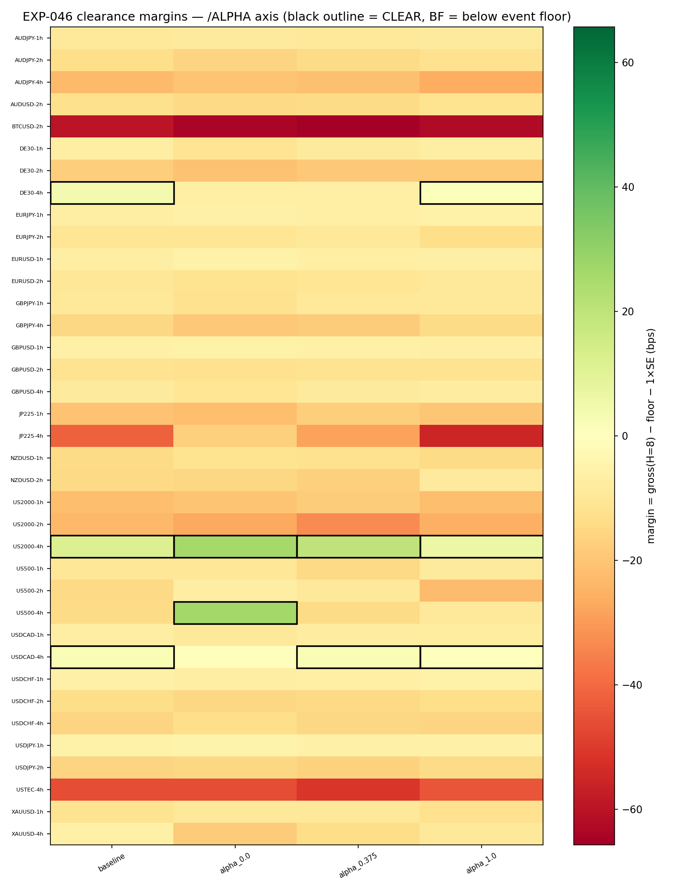
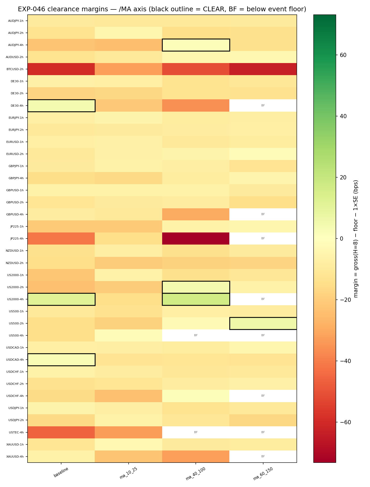
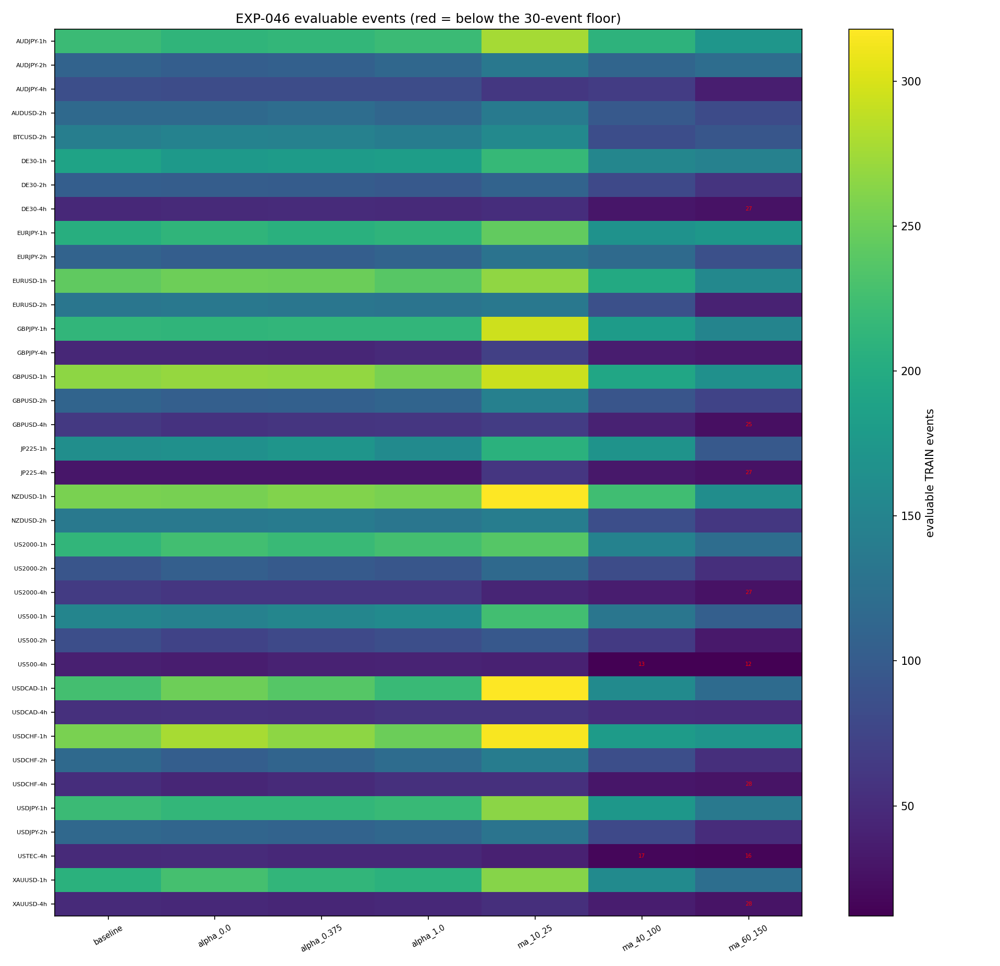

# Experiment Report: EXP-046 — Phase 012 Entry-Side Gross Screen (`/ALPHA` × `/MA-DOMAIN` OAT, 37-Cell Grid)

## Status: COMPLETED

**Date**: 2026-06-12
**Instruments**: the 17 instruments of the Phase 011 37-cell COVERED grid (EXP-044 `coverage_map.csv`, verbatim)
**Data Views / Feature Categories**: 1-minute time bars aggregated to 1h/2h/4h domain bars (frozen `xen.bar_aggregator` conventions); AVWAP bounce events via the parameterized frozen `xen.avwap`; TRAIN stratum only

---

## Question

Can any single entry-parameter lever — tick-volume exponent α or regime-MA
pair — raise the gross AVWAP-bounce edge enough to pay frozen CONSERVATIVE
costs somewhere meaningful, before any net/exit machinery is rebuilt?

## Hypothesis

At least one predeclared OAT entry variant (α ∈ {0.0, 0.375, 1.0} at
MA=(20,50); MA ∈ {(10,25), (40,100), (60,150)} at α=0.75; baseline α=0.75,
MA=(20,50)) raises TRAIN gross per-event expectancy at H=8 domain bars to
≥ the frozen per-cell cost floor + 1×SE, with positive gross at H=4 and
H=16, in ≥5 cells spanning ≥3 instruments of the 37-cell grid.

## Method Summary

For each of 7 variants × 37 cells: generate AVWAP bounce events on TRAIN
(F01 file-order rows, bound to the EXP-043 boundary record), fix one event
population per cell×variant (H=16 window inside TRAIN), compute
direction-signed gross log-bps at H ∈ {4, 8, 16} from real domain-bar
closes, a regime-cluster bootstrap SE at H=8 (descriptive, seeded), and the
mechanical D0 clearance verdict against `floor = RT + financing × days(8,d)`.
The baseline row was reconciled against EXP-043 realized counts and the
EXP-045 FH net curve before any non-baseline row was read. Details in
[analysis-plan.md](analysis-plan.md).

## Key Findings

### Finding 1: No variant approaches the composition threshold

Clearance partition: 14 CLEAR / 235 NO_CLEAR / 10 BELOW_FLOOR over 259
rows. Per-variant clearing counts: baseline 3 cells / 3 instruments;
alpha_1.0 3/3; ma_40_100 3/2; alpha_0.0 2/2; alpha_0.375 2/2; ma_60_150
1/1; ma_10_25 0. The 5-cell/3-instrument threshold is missed by a wide
margin everywhere, and no non-baseline variant exceeds the baseline's own
3 clearing cells.

### Finding 2: Variant effects on gross level are ~1–2 bps — an order of magnitude short

Per-variant H=8 cross-cell medians: baseline −1.15 bps; alpha_0.0 −2.35;
alpha_0.375 −1.27; alpha_1.0 −1.62; ma_10_25 −0.54; ma_40_100 −0.16;
ma_60_150 +0.28 (n = 37 cells each; level summaries — event populations
differ across variants by construction). Floors run ~5–20 bps, so neither
lever moves gross anywhere near payability. The binding constraint is the
floor + 1×SE margin leg, not horizon sign robustness (only one row passed
the margin but failed the H=4/H=16 sign leg).

### Finding 3: Clearances sit in the predeclared false-positive channel; slow MAs lose eligibility

12 of 14 CLEAR rows are 4h cells and 8 involve US index CFDs (US2000-4h
clears under five variants), with SEs 6–28 bps and n = 33–66 — exactly the
correlated-bloc/large-SE channel the plan predeclared as the main
false-positive risk. All 10 BELOW_FLOOR rows are slow-MA variants on 4h
cells (ma_60_150 n = 12–28): slowing the detector mildly raises per-event
quality (+0.28 bps median) while collapsing event counts below the 30-event
floor where costs are highest.

## Conclusion

**Hypothesis REFUTED — mechanical G1 readout ENTRY_GROSS_FLAT.**

The readout is read from a fully valid grid: reconciliation 259/259 legs
pass at 1e-9 bps (37 EXP-043 event-count identities, 111 EXP-045 FH-net
anchors, 111 internal gross-path cross-checks), determinism 259/259, audit
PASS (0 critical / 0 warnings). Neither the tick-volume exponent across its
full range nor a 2× detector rescaling in either direction lifts the
bounce's gross edge over frozen CONSERVATIVE costs at any meaningful
breadth: the gross shortfall is a property of the AVWAP-bounce substrate,
not of its entry parameterization. Under the ratified Phase 012 operator
pre-commitment, this routes the programme to substrate revision; G1 is
adjudicated in the Phase 012 checkpoint `G1-gate-review.md`.

## Limitations

- TRAIN-only (0 TEST reads); nothing characterizes TEST behavior.
- Bootstrap SEs are descriptive; the regime-cluster SE does not capture
  overlap correlation between short adjacent regimes
  (`n_regimes_evaluable` per row in `results/events_summary.csv`).
- The P4 calendar-day floor understates weekend/closure financing, largest
  for 4h index cells — relevant to the sub-5-bps index clearances (e.g.
  DE30-4h alpha_1.0, margin +0.85 bps).
- Cross-cell clearance noise is positively correlated (shared dollar/regime
  moves), so the composition threshold's false-positive rate exceeds an
  independence reading — reinforcing, not softening, FLAT.
- OAT design: `/ALPHA`×`/MA-DOMAIN` interactions were excluded at D0; given
  the ~1–2 bps movement across both levers' full ranges, an interaction
  closing a 5–20 bps gap is implausible.

## Implications for Future Research

- The entry-parameter lever joins the exit lever (EXP-039, EXP-045) as
  exhausted on this substrate: gross edge must come from a different event
  definition, not from tuning around the AVWAP bounce.
- US2000-4h's repeated clearance across five variants is
  hypothesis-generating only (correlated 4h index channel, large SEs).
- The EXP-046 harness (dependency gates, 1e-9 reconciliation, mechanical
  clearance) reproduced external anchors exactly and can be re-pointed at a
  revised substrate cheaply.

## Recommended Next Experiments

1. **Phase 013 substrate revision (new phase design, not an EXP yet)**:
   close Phase 012 via `G1-gate-review.md` with ENTRY_GROSS_FLAT and design
   the substrate pivot per the operator pre-commitment.
2. **EXP-047 (proposed, conditional on a Phase 013 design)**: readiness +
   gross screen of the revised substrate reusing the EXP-046 harness.

## Artifacts

| Artifact | Path |
|----------|------|
| Scope | [scope.md](scope.md) |
| Analysis Plan | [analysis-plan.md](analysis-plan.md) |
| Code | [code/](code/) |
| Results data | [results/](results/) |
| Audit | [audit.md](audit.md) |
| Results interpretation | [results.md](results.md) |
| Governance Reviews | [governance/](governance/) |
| Plots | [plots/](plots/) |
