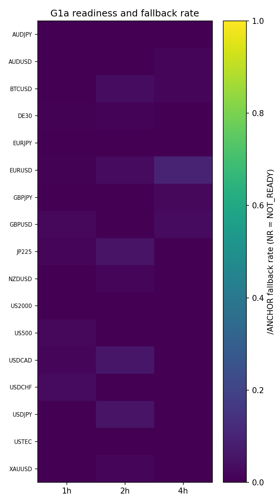
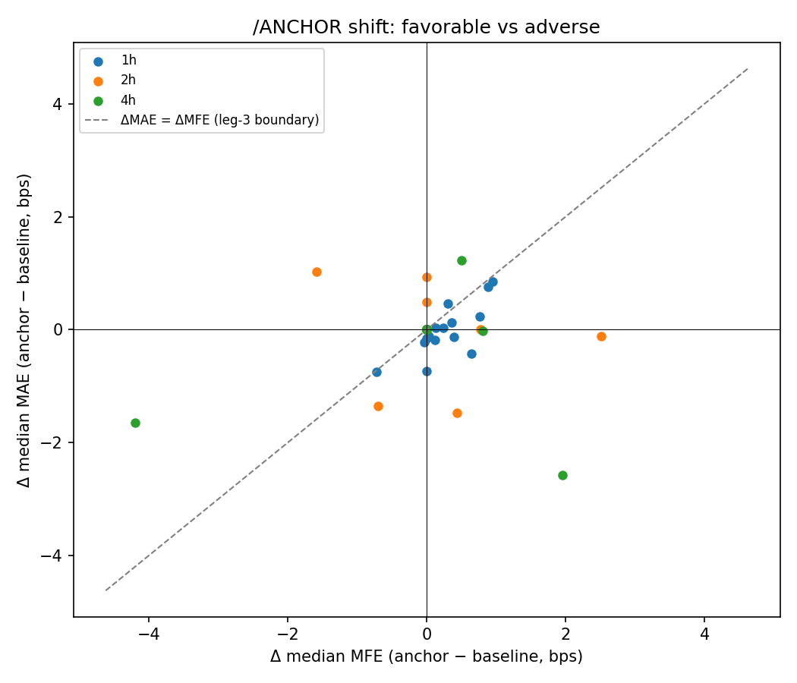
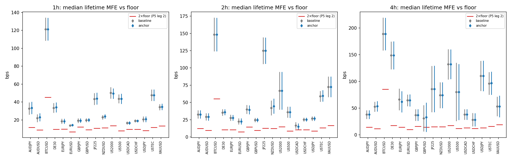

# Experiment Report: EXP-047 — `/ANCHOR` Move-Size Diagnostic (ATR-Prominence Pivot vs Running-Extreme Anchor)

## Status: COMPLETED — REFUTED (mechanical G1b input: ANCHOR_MOVE_FLAT)

**Date**: 2026-06-12
**Registry**: `CF-AVWAP-001/DIAG-007` (Phase 013; 0 slots, 0 TEST reads, 0 holdout reads, ledger unchanged)
**Instruments**: full 17-instrument × {1h, 2h, 4h} grid (51 cells)
**Chart Types**: none (time bars only)

---

## Question

Is the thin captured move of the AVWAP bounce substrate a property of anchor
placement (fixable in-family via the registered `/ANCHOR` branch), or
intrinsic to MA(20,50)-regime trend legs at these timeframes (requiring a new
candidate family)?

## Hypothesis

Replacing the frozen running-extreme anchor with the ratified ATR-prominence
significant-pivot anchor (`ATR_period=14`, `k=1.0`) materially shifts the
TRAIN gross available move-size (MFE) distribution rightward — by ≥1×SE_diff,
to ≥2× the frozen cost floor, without an offsetting MAE shift — in ≥5 READY
cells over ≥3 instruments.

## Method Summary

TRAIN-only, gross-only diagnostic behind the P8 regression gate (15/15 green
before first data read). Both anchors generated by the same frozen `xen.avwap`
machinery on identical TRAIN slices; per READY cell, lifetime MFE/MAE
distributions (EXP-022 boundary, excursions floored at 0), matched-control MFE
(EXP-021/027 convention), frozen P2 CONSERVATIVE cost floors (binding = max of
the two arms' lifetime-derived floors), and the mechanical P5 five-leg
classification. Blocking integrity anchor: baseline reconciliation against
EXP-043 counts and EXP-046 gross(H=8). See [analysis-plan.md](analysis-plan.md).

## Key Findings

### Finding 1: The ratified `/ANCHOR` rule collapses to the baseline anchor by qualification

Anchor coincidence with the baseline running extreme is 97.8% / 98.3% / 98.5%
(mean; min 94.6%) on 1h/2h/4h, while the predeclared fallback disclosure reads
only 0.7–1.5% — by MA(20,50) confirmation, the segment extreme almost always
has a completed ≥1×ATR(14) counter-move, qualifies, and (being the most
price-extreme candidate) is selected. 13/51 cells produced literally identical
event populations; 29/51 had exactly zero median-MFE delta
(audit-verified: `results/audit_anchor_coincidence.csv`).

At k=1.0, "significant pivot" is a near-vacuous filter at these timeframes;
the NOT_SHIFTED outcome was close to structurally forced (audit W2). The
verdict closes the *ratified* `/ANCHOR` definition, not anchor placement in
general.

### Finding 2: No material MFE shift anywhere (P5 leg 1: 0/51)

Δ median MFE spans −2.7 to +0.9 bps; best leg-1 margin −1.67 bps (EURUSD-1h:
ΔMFE +0.30 vs SE_diff 1.97). No borderline flags; the relaxed sensitivity
thresholds (≥4/≥2, ≥3/≥2) are also unmet. Mechanically **0/51
SHIFTED_VIABLE** → G1b input ANCHOR_MOVE_FLAT (adjudication at checkpoint).

### Finding 3: Available peak move clears 2×floor in every cell (P5 leg 2: 51/51)

Median lifetime MFE ≈ 24 / 36 / 64 bps on 1h/2h/4h against binding floors
≈ 4.9 / 5.3 / 7.2 bps — roughly 5–9× the floor on **both** anchors
(censoring ≤3.1%). Descriptive and necessary-not-sufficient (MFE is a
non-tradable peak), but it relocates the programme's binding constraint:
**move availability was never the problem; capture geometry (peak →
realizable exit, net of cost) is** — consistent with, and sharpening, the
Phase 010/011 exit-side negatives.

### Finding 4: Event moves resemble generic in-regime moves

Matched-control median MFE ≈ event median MFE (1h 24.9 vs 24.0; 2h 31.6 vs
35.9; 4h 59.1 vs 64.5 bps) — the bounce trigger does not access privileged
move sizes (descriptive; same-sub-segment circularity disclosed).

## Conclusion

**REFUTED — ANCHOR_MOVE_FLAT (mechanical input to G1b).** The ratified
ATR-prominence anchor is, in practice, the running-extreme anchor: it moves
the anchor in only ~2–5% of regimes and produces no shift outside noise in
any cell. The in-family `/ANCHOR` lever, as ratified, is closed. Integrity
was clean end to end: 51/51 READY, reconciliation 125/125 with diff exactly
0.0, determinism everywhere, audit PASS.

Two durable lessons: (1) a collapse-toward-baseline disclosure must measure
**anchor coincidence**, not just fallback rate — the predeclared column
missed the dominant collapse path; (2) the available-move ceiling framing of
the pivot decision should be replaced by a capture-geometry framing in the
new-family design.

## Limitations

- Conditional on the ratified `k=1.0` and confirmation convention; a binding
  prominence threshold was not tested and would require a new predeclared
  scope (no re-parameterisation in-phase).
- MFE is an upper bound no exit attains; Finding 3 is not a tradability
  claim.
- Matched controls share the events' regime sub-segments (disclosed).

## Implications for Future Research

- The pre-committed routing on ANCHOR_MOVE_FLAT is a **new candidate
  family** (own design/D0, fresh EXP-020/027/029-analog scaffolding). Its
  design brief should target capture geometry rather than move size.
- If the operator wants one more in-family read first: a `/ANCHOR` variant
  whose threshold demonstrably binds (k calibrated on synthetic fixtures to
  a target anchor-displacement rate) is a legitimate new scope motivated by
  the collapse finding.

## Recommended Next Experiments

1. **New-family readiness (proposed)**: EXP-020-analog substrate validation
   for the next candidate family selected at the Phase 014 design.
2. **Binding-`k` `/ANCHOR` variant (optional, new D0)**: synthetic-fixture-
   calibrated prominence threshold with anchor-displacement-rate
   predeclaration.

## Artifacts

| Artifact | Path |
|----------|------|
| Scope | [scope.md](scope.md) |
| Analysis Plan | [analysis-plan.md](analysis-plan.md) |
| Code | [code/](code/) |
| Audit | [audit.md](audit.md) |
| Results | [results.md](results.md) |
| Governance Reviews | [governance/](governance/) |
| Plots | [plots/](plots/) |
| Audit coincidence table | [results/audit_anchor_coincidence.csv](results/audit_anchor_coincidence.csv) |
