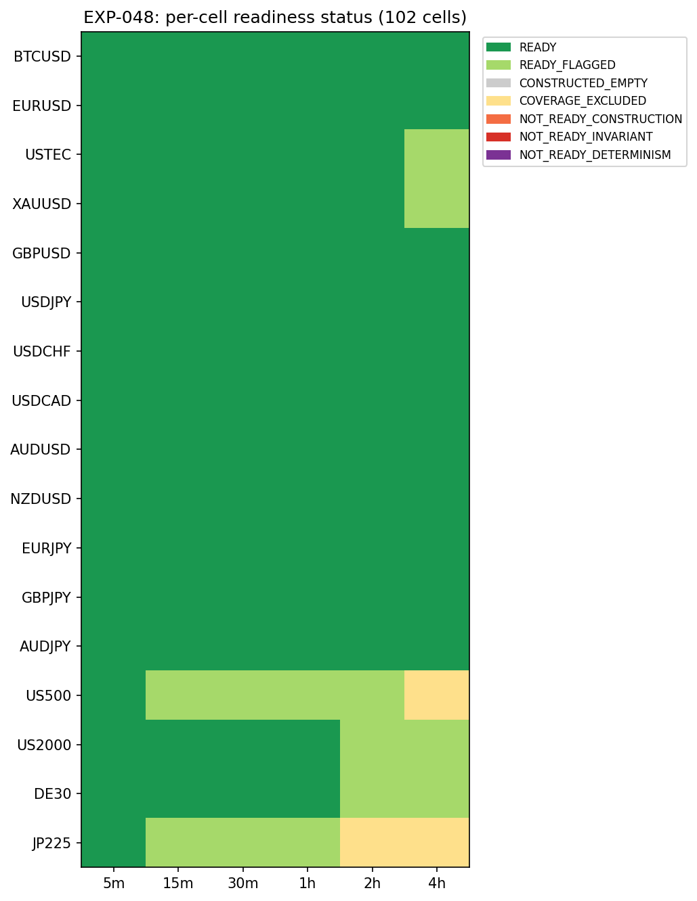

# Experiment Report: EXP-048 — Phase 014-A Substrate & Detector Readiness (ATR-ZigZag + HA Harami, 102 Cells)

## Status: READINESS_DELIVERED

**Date**: 2026-06-14
**Instruments**: BTCUSD, EURUSD, USTEC, XAUUSD, GBPUSD, USDJPY, USDCHF, USDCAD, AUDUSD, NZDUSD, EURJPY, GBPJPY, AUDJPY, US500, US2000, DE30, JP225 (all 17)
**Data Views / Feature Categories**: 1-minute time bars aggregated to 5m (strict), 15m/30m/1h/2h/4h (`min_coverage=0.90`) OHLC domains; Heiken Ashi candles from domain bars; ATR-ZigZag trend substrate on real bars; HA harami detector on HA candles

---

## Question

For each of 102 cells (17 instruments × 6 domains), can the ATR-ZigZag trend substrate and the HA harami detector be computed deterministically, look-ahead-safe, and invariant-clean on the TRAIN stratum, and what are the resulting per-cell move/event rates and `/BARCFG` coverage?

## Hypothesis

Exploratory readiness question (no market-edge claim): both primitives are mechanically computable across the 102-cell grid, producing a descriptive readiness map, move/event-rate table, and `/BARCFG` coverage table — whatever the mix of READY/NOT_READY/COVERAGE_EXCLUDED.

## Method Summary

Each of 102 cells was processed independently on the TRAIN stratum (first 49% of the file, F01 prefix convention). Domain bars were aggregated from 1-minute source bars. The ATR-ZigZag substrate (Wilder ATR-14, `ATR_MULT=1.0`) was run as a sequential streaming state machine on real OHLC; the HA harami detector was run as a bounded shift-1 vectorized predicate on HA candles. Invariant batteries, determinism replay, and descriptive rate/coverage counting were applied per cell. No combined event, no return/edge metric, no statistical test.

## Key Findings

### Status Distribution

All 102 cells processed. Status distribution: 86 READY, 13 READY_FLAGGED, 3 COVERAGE_EXCLUDED, 0 CONSTRUCTED_EMPTY, 0 NOT_READY of any type. No invariant violations, no determinism failures.

| Status | Count | Criterion |
|--------|-------|-----------|
| READY | 86 | construction PASS ∧ all invariants clean ∧ determinism PASS |
| READY_FLAGGED | 13 | same as READY but dropped ∈ [0.10, 0.25] |
| COVERAGE_EXCLUDED | 3 | dropped > 0.25 (US500-4h, JP225-2h, JP225-4h) |
| NOT_READY (any type) | 0 | — |

### COVERAGE_EXCLUDED Cells

Three cells excluded by the frozen dropped-fraction > 0.25 gate:

| Cell | Dropped Fraction | Cause |
|------|-----------------|-------|
| US500-4h | 0.286 | US-index market-hour gaps × longest aggregation |
| JP225-2h | 0.257 | JST gap × moderate aggregation |
| JP225-4h | 0.297 | JST gap × longest aggregation |

Follows the EXP-043 pattern. These cells are excluded from EXP-049 with record.

### Move Rates (ATR-ZigZag)

Stable range: **170.2–207.0** confirmed moves per 1,000 domain bars across all 99 non-excluded cells. Fast domains ~200–207/1k, slow domains ~170–196/1k — consistent with `ATR_MULT=1.0` sensitivity on Wilder ATR-14. All 99 cells have ≥30 moves (minimum 336).

### Harami Event Rates

Near-constant range: **229.6–261.4** per 1,000 HA candles. Stability reflects the construction-derived reduction (HAClose₀ constrained by prior-body centre), not market-structure variation. All 99 cells have ≥30 events (minimum 401 in DE30-4h).

### `/BARCFG` Coverage

Near-symmetric same-direction dominance:

| Configuration | Pooled Fraction | Description |
|--------------|-----------------|-------------|
| UP_UP | ~33–35% | HA₁ green, HA₀ green |
| DN_DN | ~31–34% | HA₁ red, HA₀ red |
| UP_DN | ~16–18% | HA₁ green, HA₀ red |
| DN_UP | ~15–17% | HA₁ red, HA₀ green |

Expected from the family's construction-derived reduction. Slight UP_UP > DN_DN asymmetry consistent with mild bullish TRAIN-period drift.

## Conclusion

**READINESS_DELIVERED**

Both primitives are valid across all 99 non-excluded cells: zero invariant violations (12 invariant keys all 0 on every cell), zero determinism failures (102/102 PASS), and all three output tables (readiness map, move/event rates, `/BARCFG` coverage) produced as scoped. The 13 READY_FLAGGED and 3 COVERAGE_EXCLUDED cells are coverage outcomes (dropped-fraction disclosures), not primitive defects. The SUBSTRATE_REFUTED criteria (non-determinism anywhere; same invariant on ≥3 instruments) are unmet. The 99 non-excluded cells are clear for EXP-049 (capture read).

## Limitations

1. **Latent `/BARCFG` null-handling bug (audit Warning 1):** Returns zero-filled configs for zero-harami non-empty cells instead of nulls as scoped. Not exercised in this run (all cells ≥401 harami events). Fix trivial before EXP-049.
2. **5m strict coverage convention:** 5m dropped fraction is not computed or flagged, consistent with project convention but less transparent for 5m cells.
3. **Determinism replay scope:** Re-aggregates from in-memory `train_1m`, not from Parquet re-read. I/O-layer determinism not tested.
4. **DE30 span:** ~5 months shorter history; rates per 1k comparable, absolute counts not.

## Implications for Future Research

- The ATR-ZigZag substrate is a known-quantity causal, deterministic, invariant-clean primitive — reusable for any future trend-exhaustion work without re-validation.
- The HA harami detector is a deterministic, invariant-clean detector with near-constant incidence (~230–260/1k) — a construction-derived property, not a market signal. The `/BARCFG` distribution is stable and near-symmetric, usable as a descriptive baseline.
- The COVERAGE_EXCLUDED cells (US500-4h, JP225-2h/4h) are a permanent exclusion from this family's 102-cell grid under the frozen coverage convention.
- The 30-event reporting floor is met by every non-excluded cell with substantial margin (minimum 336 moves, 401 events), confirming EXP-049 will have adequate event counts for capture-rate measurement.

## Recommended Next Experiments

1. **EXP-049 (Phase 014-A Capture Read):** Proceed on all 99 READY and READY_FLAGGED cells. Introduce the 3-barrier capture framework on the combined harami-at-trend-exhaustion event; compute per-cell capture rates and excursion statistics.
2. **Fix latent `/BARCFG` null bug:** Add the zero-harami guard in `process_cell` before EXP-049 re-uses the `barcfg_counts` utility.
3. **EXP-050+ (Phase 014-B):** After EXP-049, define the combined harami-at-trend-exhaustion event and characterize its per-cell yield, `/BARCFG` composition, and position-in-move properties.

## Artifacts

| Artifact | Path |
|----------|------|
| Scope | [scope.md](scope.md) |
| Analysis Plan | [analysis-plan.md](analysis-plan.md) |
| Code | [code/](code/) |
| Audit | [audit.md](audit.md) |
| Results | [results.md](results.md) |
| Governance Reviews | [governance/](governance/) |
| Plots | [plots/](plots/) |
