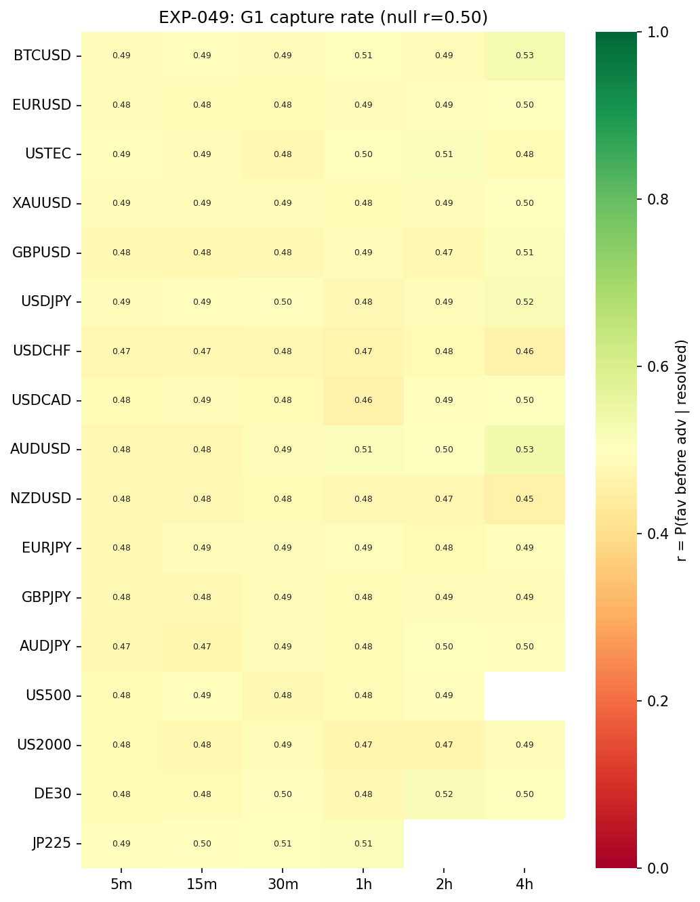
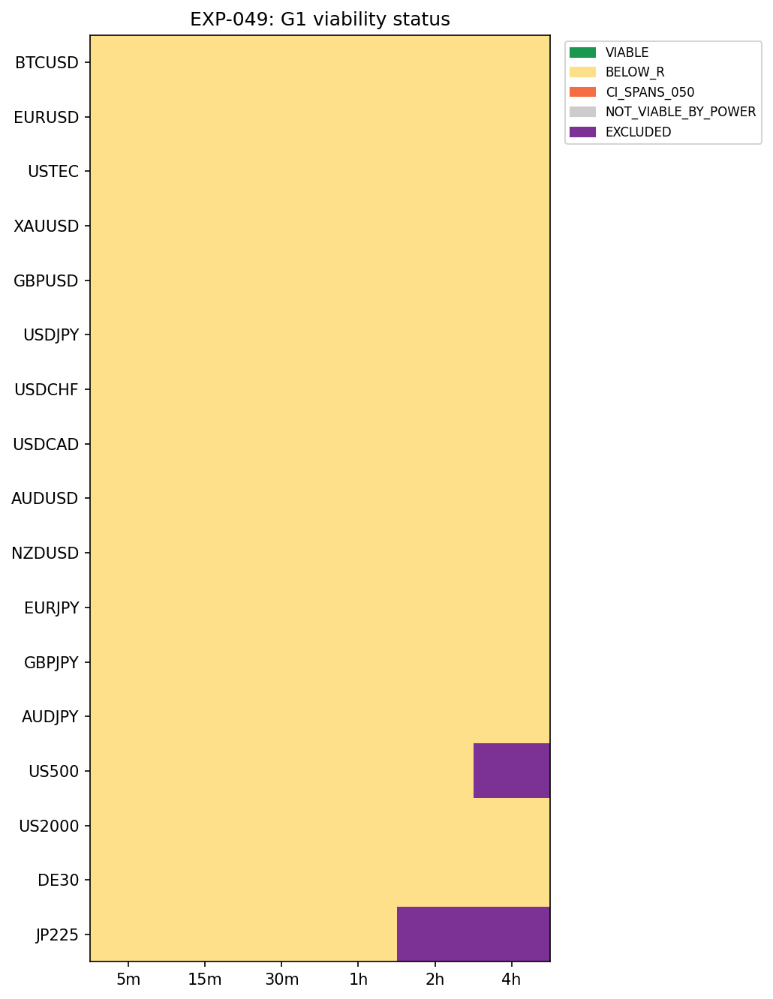
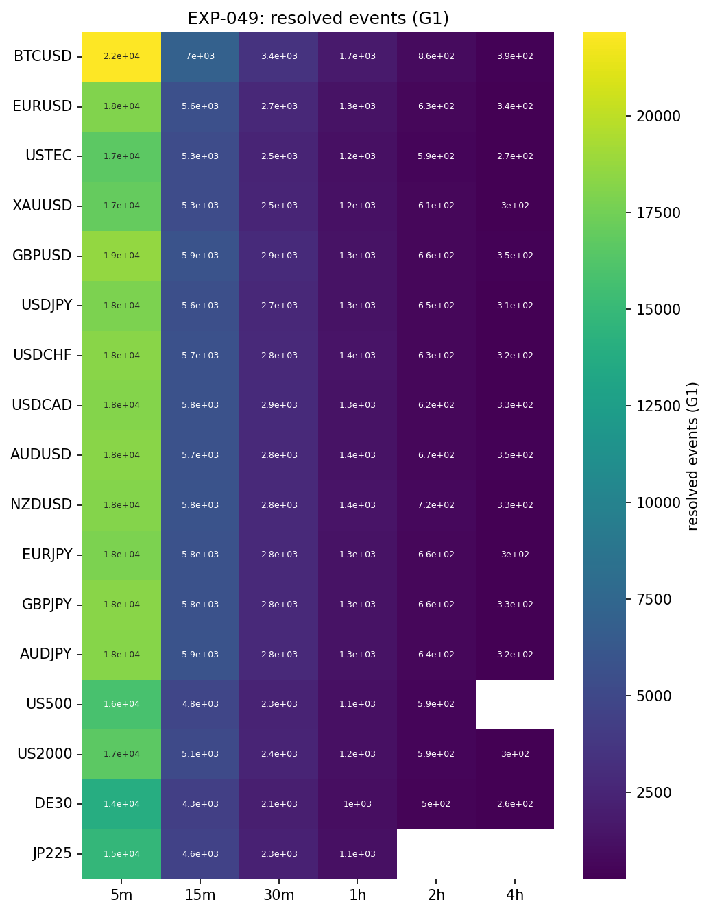
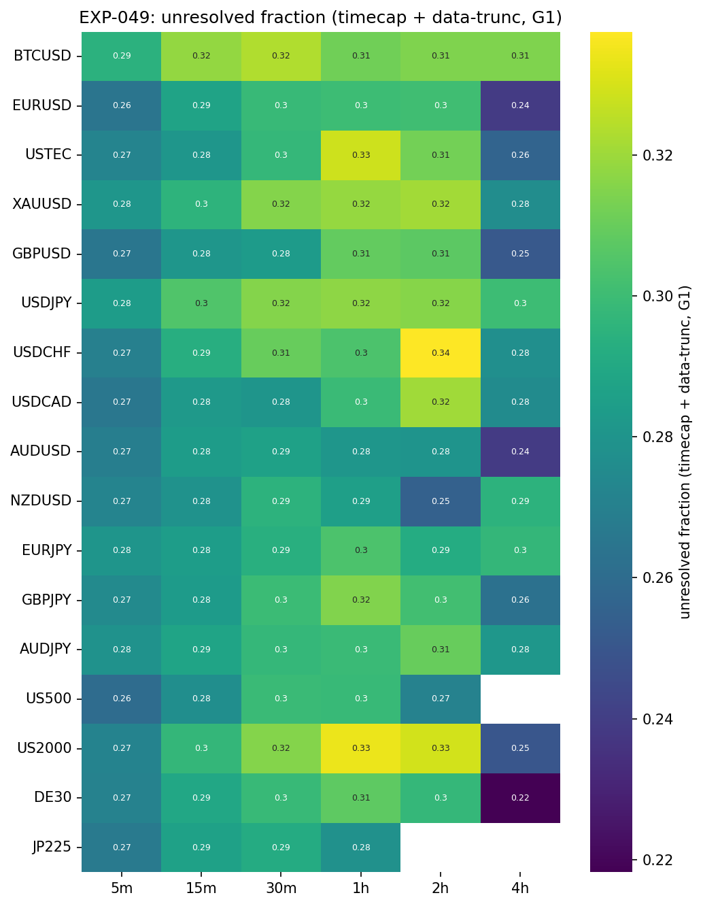

# Experiment Report: EXP-049 — Phase 014-A 3-Barrier Capture Readiness & Gross Capture Rate

## Status: COMPLETED

**Date**: 2026-06-15
**Instruments**: 17 (all EXP-048-READY cells: 99/102)
**Data Views / Feature Categories**: 5m/15m/30m/1h/2h/4h real domain OHLC; ZigZag trend-change confirmation anchor; P1–P5 benchmark 3-barrier system

---

## Question

For every EXP-048-READY cell (instrument × domain), can the P1–P5 3-barrier capture system be built deterministically and causally on real bars, and what is the per-cell gross favourable-before-adverse capture rate `r = P(fav before adv | resolved)` under the predeclared default barriers?

## Hypothesis

HYP-002: The barrier system is construction-valid on all READY cells; the G1 capture rate `r` and its P12 viability readout are measured mechanically as a routing input (not a self-declared gate).

## Method Summary

For each of 99 EXP-048-READY cells (TRAIN-only, first 49% by F01 file-order prefix), the script aggregates real domain OHLC, runs the frozen `xen.zigzag` substrate, builds the Phase 014 benchmark 3-barrier system (two favourable geometries G1/G2, P3 1:1 adverse, P4 adaptive time cap, P5 LOOKBACK=1) at each confirmed trend-change, and resolves favourable-before-adverse on real OHLC with a conservative same-bar double-touch → ADVERSE tie-break. Per-cell `r` is estimated with a regime-clustered moving-block bootstrap (MBB, `b=round(m^(1/3))`, `N_BOOT=10_000`). P12 viability (`r ≥ 0.55`, `CI_low > 0.50`, `resolved ≥ 30`) and P11 composition (≥5 cells over ≥3 instruments) are applied as a mechanical readout.

## Key Findings

### Finding 1: Barrier-construction readiness — PASS (99/99 cells)

All 99 member cells pass the invariant battery: 0 causality violations, 0 determinism failures, 0 NaN barriers, 0 TRAIN-fence violations, 0 G1 `fav_dist ≤ 0` events. The `xen.capture_barriers` module is correct and the data pipeline is holdout-clean. CAPTURE_READINESS_DELIVERED.

### Finding 2: G1 capture rate — 0/99 cells VIABLE (all BELOW_R)

Per-cell G1 `r` ranges from 0.4545 to 0.5343, tightly clustered around the 0.50 symmetric-barrier null. No cell reaches the P12 viability bar of 0.55. The viability-status heatmap is uniformly `BELOW_R` across all 99 cells.

*Figure 1: Per-cell G1 capture rate `r`. All cells show r < 0.55, clustering around the 0.50 null.*

*Figure 2: P12 viability status. All 99 member cells are BELOW_R.*

### Finding 3: Composition readout — not viable on either geometry

G1: 0 VIABLE cells over 0 instruments → `composition_met = false`. G2: same. Sensitivity at relaxed bars (≥4 cells/≥2 instruments, ≥3 cells/≥2 instruments, `r ≥ 0.52` threshold) also reads `false`. The family-level P11 rule is not met.

### Finding 4: Power is adequate; time-cap censoring is ~24–33%

All cells have `resolved ≥ 30` (min 128). No cells are NOT_VIABLE_BY_POWER. Time-cap censoring (unresolved fraction) ranges 22–33% across cells; data-truncation censoring is < 0.5%. The adaptive P4 cap binds at the 6-bar floor in 96/99 cells.

*Figure 3: Resolved event counts across the 17×6 grid. All cells clear the 30-event floor.*

*Figure 4: Unresolved fraction (time-cap + data-truncation). Material at 22–33%, driven by the 6-bar floor.*

## Conclusion

**CAPTURE_READINESS_DELIVERED** — the barrier system is construction-valid. However, the G1 capture-rate readout yields **0 VIABLE cells** under P12, consistent with design §10 `CHARACTERISED_NOT_VIABLE` on the capture leg. Under symmetric 1:1 barriers at 50% of the prior move, ZigZag-confirmation entries do not exhibit a favourable-before-adverse bias above the P12 viability bar in any cell of the 17×6 grid. The G1 desk adjudication (combining EXP-048 leg (a), this leg (b), and future 014-B leg (c)) will make the routing decision.

## Limitations

- Only the P2 50% favourable fraction and P3 1:1 R:R benchmark defaults were tested. Other ratios are 014-B questions.
- The adaptive P4 cap binds at its 6-bar floor in 96/99 cells; sensitivity to k/window/floor is deferred to `/THIRD-TIME` in 014-B.
- G2 is systematically degraded by 52–60% degeneracy rates and provides no additional routing signal.
- All results are gross (exit-agnostic, no costs).

## Implications for Future Research

- Capture geometry under benchmark defaults is measured as flat on this substrate, matching the AVWAP failure mode (move availability is not the constraint; favourable-before-adverse conversion is).
- The barrier system is mechanically sound and reusable — it passed `CAPTURE_READINESS_DELIVERED`. Any 014-B variant can build on `xen.capture_barriers` without re-validation.

## Recommended Next Experiments

1. **G1 desk adjudication** (post-014-A) — combine with EXP-048 and EXP-050–052 for routing.
2. **If PROCEED**: 014-B barrier-model variants (`/VPTARGET`, `/MAGTARGET`, `/ADV-EXTREME`, `/ADV-NONE`, `/THIRD-TIME`, `/THIRD-EVENT`).
3. **If CHARACTERISED_NOT_VIABLE**: new candidate family or substrate revision.

## Artifacts

| Artifact | Path |
|----------|------|
| Scope | [scope.md](scope.md) |
| Analysis Plan | [analysis-plan.md](analysis-plan.md) |
| Code | [code/](code/) |
| Audit | [audit.md](audit.md) |
| Results | [results.md](results.md) |
| Governance Reviews | [governance/](governance/) |
| Plots | [plots/](plots/) |
