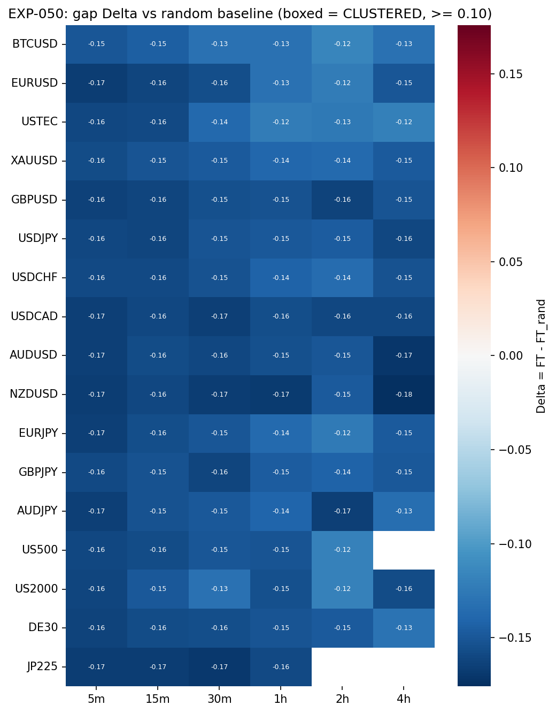

# Experiment Report: EXP-050 — Phase 014-A Harami-in-Context

## Status: CONTEXT_CHARACTERISATION_DELIVERED

**Date**: 2026-06-15
**Instruments**: BTCUSD, EURUSD, USTEC, XAUUSD, GBPUSD, USDJPY, USDCHF, USDCAD, AUDUSD, NZDUSD, EURJPY, GBPJPY, AUDJPY, US500, US2000, DE30, JP225 (99 EXP-048-READY cells)
**Data Views**: 5m (strict), 15m/30m/1h/2h/4h (min_coverage=0.90); HA candles for harami detection; real domain prices for all metrics

---

## Question

For each EXP-048-READY cell, where in a ZigZag move do raw HA harami signals occur, and does the final-third rate FT exceed the direction-matched random-timing baseline FT_rand by ≥ 10pp (P9 materiality)?

## Hypothesis

Exploratory characterization: every harami can be placed deterministically in its containing ZigZag move, and the per-cell final-third rate is measured against predeclared baselines. No market-edge screen — this is a descriptive baseline.

## Method Summary

For each of 99 member cells (TRAIN-only, first 49%): build domain bars → generate HA candles → detect haramis (`xen.ha_harami`) → generate ZigZag moves (`xen.zigzag`, ATR 14/1.0) → assign each harami to its containing move via pivot-tiling interval join → compute price-excursion position `pos = (P−S_i)/(E_i−S_i)` → measure FT = P(pos ≥ 0.67) → compute exact direction-stratified random baseline FT_rand → regime-clustered moving-block bootstrap CI on Δ = FT − FT_rand. Two-pass determinism replay. MA(20,50) alternative-segmentation secondary. P9/P11 mechanical readout.

## Key Findings

### Finding 1: Haramis are systematically front-loaded (0/99 CLUSTERED)

- **Observation**: Every cell has Δ < 0. FT range [0.210, 0.312], FT_rand range [0.334, 0.432]. The median delta is approximately −0.15. No cell is within 10pp of the materiality threshold.
- **Evidence**: `results/final_third_rate_map.csv`. All 99 member cells are NOT_CLUSTERED. Composition readout: 0 cells, 0 instruments, composition_met=false at every support tier and every sensitivity threshold tested.
- **Interpretation**: Raw HA haramis fire early in ZigZag moves, not near exhaustion. The thesis requires selection to reverse this pattern.

### Finding 2: The front-loading is ZigZag-specific

- **Observation**: Under MA(20,50) segmentation, delta_ma_vs_rand ≈ 0 (range [−0.041, +0.010]), meaning haramis are uniformly distributed within MA regime moves.
- **Evidence**: `results/secondary_disclosure.csv`.
- **Interpretation**: The front-loading arises because ZigZag defines move starts at pivot extremes, and haramis (small consolidations) appear soon after that extreme. MA regimes define moves by crossover timing, not extremes — haramis have no systematic position bias there.

### Finding 3: All invariants pass; construction is sound

- **Observation**: All 99 cells pass the invariant battery (detector self-check, assignment well-formedness, TRAIN fence), all are deterministic, all are reportable (min n_assigned = 393, well above the 30 power floor).
- **Evidence**: `results/per_cell_context.parquet`.
- **Interpretation**: The negative result is a genuine property of the raw signal on this substrate, not a construction defect.

## Conclusion

**CONTEXT_CHARACTERISATION_DELIVERED.** The raw unfiltered HA harami signal does not cluster near exhaustion on the ATR-ZigZag substrate. Harami timing is systematically front-loaded relative to random in-move timing. This is a clean, definitive baseline measurement: the null landscape any filter or confirmation rule must beat is known (Δ ≈ −0.12 to −0.18 across cells). Selection force equivalent to 12–18pp rightward shift is needed just to reach Δ = 0; 22–28pp to reach the P9 materiality threshold.

## Limitations

- **Look-ahead carve-out**: position-in-move uses the terminal pivot (descriptive characterization of completed moves only).
- **No filter applied**: the raw signal pools all haramis — no `/BARCFG`, strong-move, or confirmation filter.
- **ZigZag-specific**: the front-loading attenuates under MA segmentation (P13.2), meaning it is partly a segmentation artifact.

## Implications for Future Research

- The anti-exhaustion bias means any 014-B combined event definition cannot rely on harami position-in-move as a timing filter — capture barriers (EXP-049/014-B) must manage outcome structurally.
- EXP-051 (strong-move filters) and EXP-052 (confirmation) should test whether selection can shift the position distribution rightward.
- If filtering cannot overcome the front-loading, the family's capture-geometry thesis (structurally bounded favourable target) becomes the sole survival path.

## Artifacts

| Artifact | Path |
|----------|------|
| Scope | [scope.md](scope.md) |
| Analysis Plan | [analysis-plan.md](analysis-plan.md) |
| Code | [code/](code/) |
| Audit | [audit.md](audit.md) |
| Results Interpretation | [results.md](results.md) |
| Governance Reviews | [governance/](governance/) |
| Plots | [plots/](plots/) |
