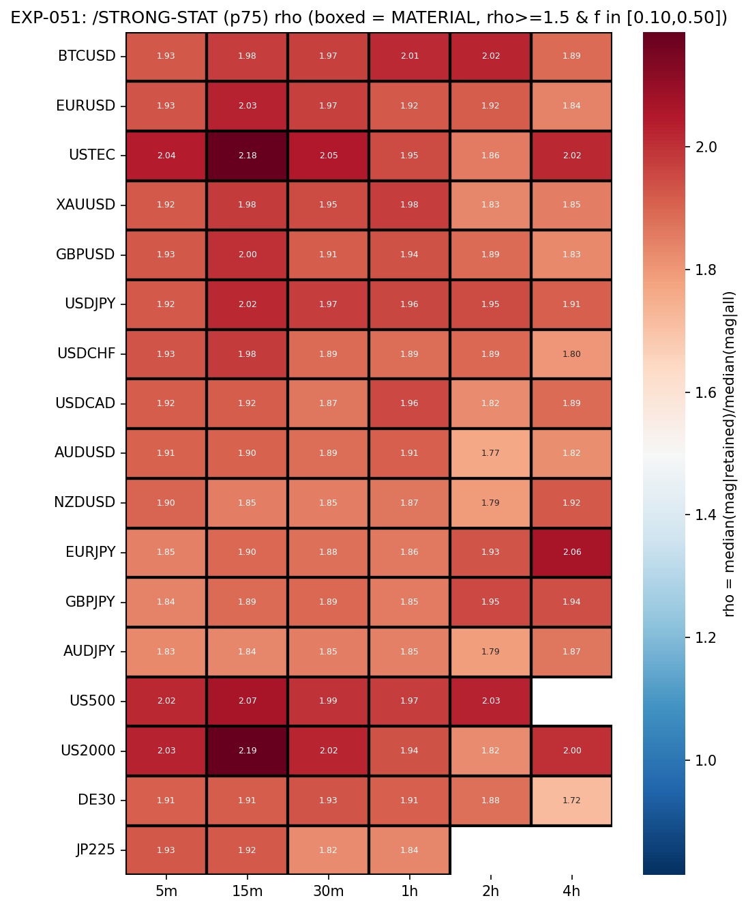
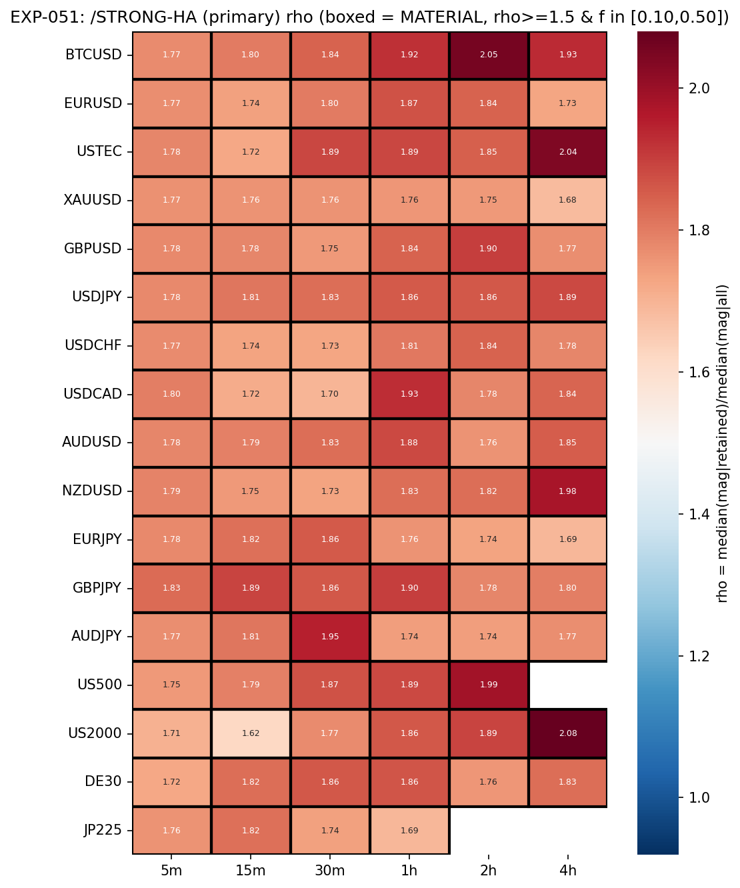

# Experiment Report: EXP-051 — Phase 014-A Strong-Move Filter Characterisation

## Status: STRONG_FILTER_CHARACTERISATION_DELIVERED

**Date**: 2026-06-15
**Instruments**: BTCUSD, EURUSD, USTEC, XAUUSD, GBPUSD, USDJPY, USDCHF, USDCAD, AUDUSD, NZDUSD, EURJPY, GBPJPY, AUDJPY, US500, US2000, DE30, JP225 (99 EXP-048-READY cells)
**Data Views**: 5m (strict), 15m/30m/1h/2h/4h (min_coverage=0.90); HA candles for /STRONG-HA impulse-run detection; real domain prices for all magnitude metrics

---

## Question

For each EXP-048-READY cell, taking every confirmed ZigZag move as one unit: do /STRONG-STAT (p75) and /STRONG-HA (primary same-direction) each carve a materially different move sub-population by P10 (ρ ≥ 1.5 and f ∈ [0.10, 0.50]), and does each meet P11 (≥5 cells over ≥3 instruments)?

## Hypothesis

Exploratory characterization: both strong-move filters can be computed deterministically and causally on the confirmed-move substrate, and their per-cell median-magnitude ratio ρ and retained fraction f can be measured against the predeclared P10 bar. No market-edge screen — gross descriptive readout for G1 adjudication.

## Method Summary

For each of 99 member cells (TRAIN-only, first 49%): build domain bars → generate confirmed ZigZag moves (`xen.zigzag`, ATR 14/1.0) → apply /STRONG-STAT trailing-window p75 filter (window ≤ 20, warmup 5, both p75 binding and median+1×MAD disclosed) → generate HA candles → detect qualifying 3-bar impulse runs → map runs to retained moves (primary same-direction binding; any-direction sensitivity disclosed) → compute per-cell ρ and f → apply P10 point criterion → apply P11 composition rule → compute disclosed moving-block bootstrap CI on ρ. Two-pass determinism replay. Harami overlap secondary (disclosed). P10/P11 mechanical readout.

## Key Findings

### Finding 1: /STRONG-STAT (p75) — 99/99 MATERIAL, P11 pass

- **Observation**: Every cell meets both P10 legs. ρ ranges 1.72–2.19, median 1.92, IQR [1.86, 1.97]. f ranges 0.25–0.32, median 0.27. 99 material cells across all 17 instruments.
- **Evidence**: `p10_map.csv`, `composition_readout.json`. All 99 cells reportable (n_defined 331–31,431).
- **Interpretation**: The trailing-window p75 reliably selects the top quartile of confirmed-move magnitudes. The median retained move is ~1.9× the unfiltered median — a material size differential consistent with a heavy-tailed distribution.

### Finding 2: /STRONG-HA (primary) — 99/99 MATERIAL, P11 pass, slightly more selective

- **Observation**: ρ ranges 1.62–2.08, median 1.80, IQR [1.76, 1.86]. f ranges 0.15–0.24, median 0.20 — more selective than /STRONG-STAT (f ≈ 0.27). 99 material cells across all 17 instruments.
- **Evidence**: `p10_map.csv`, `composition_readout.json`. All 99 cells reportable.
- **Interpretation**: The HA impulse-run detector retains a smaller fraction (~20%) with a slightly lower median-magnitude ratio (~1.80 vs ~1.92). Both P10 legs satisfied in every cell.

### Finding 3: Disclosed alternative forms agree — zero flips

- **Observation**: 0 cells flip materiality status between p75 and median+1×MAD; 0 cells flip between primary and sensitivity HA mappings.
- **Evidence**: `composition_readout.json` cross_form_agreement. MAD-form ρ median 1.80, f ≈ 0.32. Sensitivity-form ρ median 1.79 (vs primary 1.80).
- **Interpretation**: The materiality conclusion is robust within each filter family. Threshold choice shifts ρ/f but does not push any cell below the P10 bar.

### Finding 4: All invariants pass; construction is sound

- **Observation**: All invariant counts 0 (filter well-formedness, magnitude validity, HA self-consistency, causality fence). Determinism PASS. All 99 cells reportable (n_defined ≥ 331). Degenerate moves: 0–1 per cell. STAT warmup: exactly 5 NO_DECISION per cell; HA warmup: 0.
- **Evidence**: `run_metadata.json`, `excluded_fractions.csv`, `per_cell_strong_move.parquet`.
- **Interpretation**: The characterisation is construction-valid on every cell. No power issues, causality violations, or determinism failures.

### Finding 5: Harami overlap (disclosed secondary)

- **Observation**: Overlap_A: 65–87% (/STRONG-STAT), 74–91% (/STRONG-HA). Overlap_B: 24–46% across both filters.
- **Evidence**: `harami_overlap.csv`.
- **Interpretation**: Most retained strong moves contain ≥1 harami, but most haramis occur on non-retained moves. Informs 014-B combined-event registration.

## Conclusion

**STRONG_FILTER_CHARACTERISATION_DELIVERED.** Both binding forms clear P11:

- /STRONG-STAT (p75): 99/99 MATERIAL, 17/17 instruments, ρ median=1.92, f median=0.27.
- /STRONG-HA (primary): 99/99 MATERIAL, 17/17 instruments, ρ median=1.80, f median=0.20.

Disclosed forms agree (0 flips between p75↔MAD, 0 between primary↔sensitivity). All invariants 0, determinism PASS, all 99 member cells reportable. Audit PASS (0 critical, 0 warnings). The materiality readout is a mechanical output for G1 checkpoint desk work.

## Limitations

- **Completed-move magnitude allowance**: `mag` uses the terminal pivot (descriptive characterization of completed moves only; filter thresholds are causal).
- **Gross characterisation, no costs**: All measurements are gross. No costs, slippage, or capture geometry applied.
- **TRAIN-only**: Results describe the first 49% of file-order data. TEST/holdout not assessed.
- **Benchmark defaults**: Window 20, warmup 5, run length X=3, p75/MAD thresholds D0-frozen. Other parameters would yield different ρ/f values.
- **DE30 truncated history**: Within the cross-cell range; does not distort composition tallies.

## Implications for Future Research

1. **G1 desk adjudication** — Combine with EXP-049 (capture readout), EXP-050 (position-in-move), and EXP-048 (readiness) for the 014-A phase verdict.
2. **014-B combined-event registration** — Both filters are viable candidates for conditioning harami detection on strong-move context. Key design inputs: filters select ~20–27% of moves; overlap_B 24–46% is the baseline.
3. **Narrow cross-cell IQR** on ρ and f suggests uniform filter behaviour across instruments/domains — 014-B parameterisation can be simpler.
4. **EXP-052 (HYP-005, already scoped)** — Test signal + confirmation combinations on this characterised substrate.

## Artifacts

| Artifact | Path |
|----------|------|
| Scope | [scope.md](scope.md) |
| Analysis Plan | [analysis-plan.md](analysis-plan.md) |
| Code | [code/](code/) |
| Audit | [audit.md](audit.md) |
| Results Interpretation | [results.md](results.md) |
| Governance Reviews | [governance/](governance/) |
| Plots | [plots/](plots/) |
