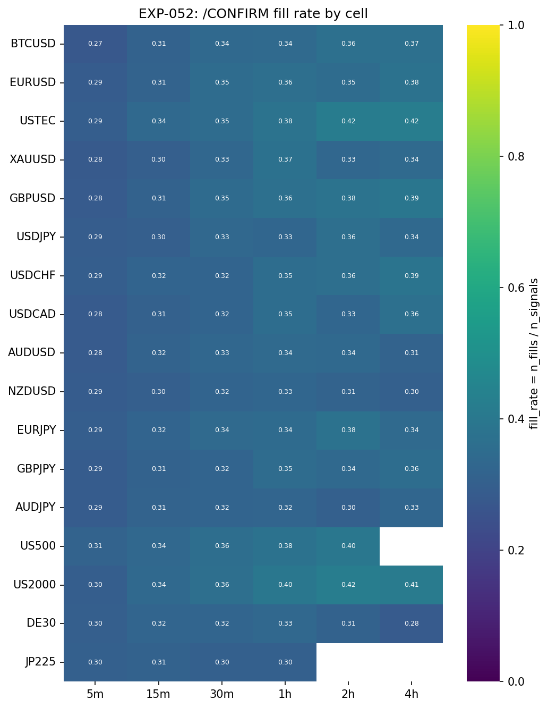
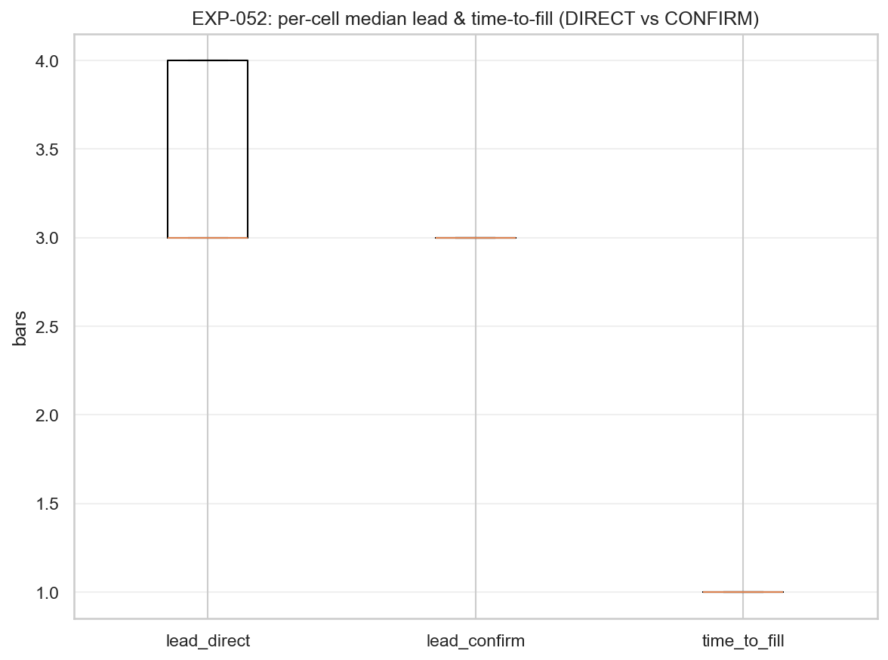
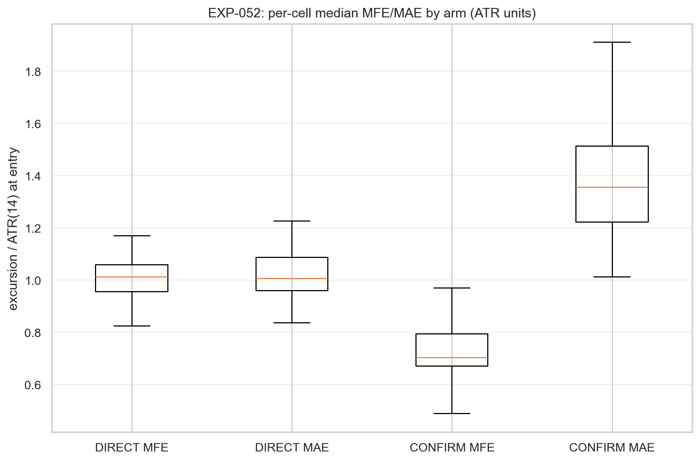
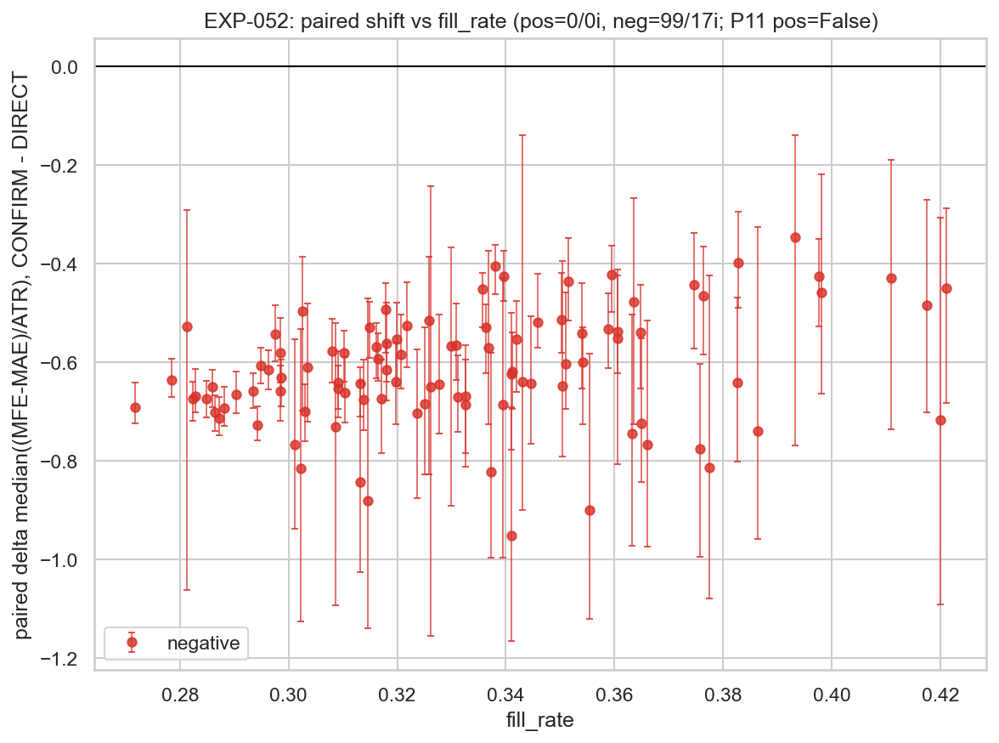

# Experiment Report: EXP-052 — Phase 014-A Signal-Interpretation Characterisation: Direct vs /CONFIRM Entry (HA Harami, 99 Cells)

## Status: CONFIRM_CHARACTERISATION_DELIVERED

**Date**: 2026-06-15
**Instruments**: BTCUSD, EURUSD, USTEC, XAUUSD, GBPUSD, USDJPY, USDCHF, USDCAD, AUDUSD, NZDUSD, EURJPY, GBPJPY, AUDJPY, US500, US2000, DE30, JP225 (all 17; 99 EXP-048-READY cells)
**Data Views / Feature Categories**: 5m (strict), 15m/30m/1h/2h/4h (`min_coverage=0.90`) OHLC domains; Heiken Ashi candles for harami detection; real domain prices for all entries, stops, and outcome metrics

---

## Question

For every EXP-048-READY cell, can the HA harami signal be interpreted under two entry rules — **direct** (enter at the signal bar's real close) and **signal+confirmation** (`/CONFIRM` stop-order, enter when price trades through the signal bar's real extreme after the harami) — and how do these arms compare on frequency (fill rate), timing (lead in bars over the ZigZag trend-change confirmation), and subsequent outcome distribution (direction-signed MFE/MAE on real prices)?

## Hypothesis

Exploratory signal-interpretation characterisation (HYP-005, no market-edge claim, no viability gate): both arms can be computed deterministically and causally; their per-cell frequency, timing, and outcome distributions are measured and compared. A non-binding P11-style readout flags where CONFIRM's outcome distribution exceeds DIRECT's — but there is no pass/fail threshold. The experiment verdict is delivery of the descriptive comparison.

## Method Summary

For each of 99 EXP-048-READY cells, the ATR-ZigZag substrate (Wilder ATR-14, `ATR_MULT=1.0`) is computed on real domain bars, Heiken Ashi candles are generated, and HA harami signals are detected via `xen.ha_harami`. For each qualifying harami, a reversal direction `rd` is assigned from the most recent confirmed ZigZag move (causal, via `searchsorted`). The DIRECT arm enters at `RealClose[signal]`; the CONFIRM arm sets a stop at the signal bar's real extreme in the reversal direction (buy-stop at `RealHigh` for bullish, sell-stop at `RealLow` for bearish) and scans forward bars within a validity window bounded by `min(next_confirm_idx−1, s+N_event)` for a causal fill. Outcome is measured as direction-signed MFE/MAE over `[entry+1, entry+N_event]`, ATR-normalized (Wilder ATR-14 at entry bar). A secondary disclosed view uses symmetric 1:1 fav-before-adv barriers (EXP-049-comparable `r`). Per-arm and paired CONFIRM−DIRECT differences are reported with moving-block bootstrap CIs (fixed seed, `B=10_000`). A full second-pass determinism replay compares frame-identical output. See [analysis-plan.md](analysis-plan.md) for full methodology.

## Key Findings

### Finding 1: Construction Integrity — Determinism PASS, Invariants Clean

The experiment runs deterministically on all 99 cells (0 non-deterministic cells). All 4 invariant battery items pass on every cell (0 violations across event well-formedness, stop/fill validity, MFE/MAE validity, and causality/TRAIN fence). Exclusion fractions are minimal — `no_trend_context` 0–9, `p4_warmup` 3–15, `direct_censored` 0–3 per cell. Well-formedness confirmed. The /CONFIRM arm construction is mechanically sound across the full 99-cell grid.

- **Determinism**: PASS — 0 non-deterministic cells.
- **Invariants**: 0 failures on all 99 cells (4 battery items).
- **Audit**: PASS (0 Critical, 0 Warnings, 3 Info notes).

### Finding 2: Fill Rate — Moderate, Consistent Across Cells

Per-cell qualifying haramis `n_signals` range 384–37,043; `n_fills` range 108–10,067. The median fill rate is 32.8% (Q25–Q75: 30.8%–35.4%), with a range of 27.2% (BTCUSD-5m) to 42.1% (US2000-2h). Approximately two-thirds of haramis are NOT confirmed before the ZigZag's own trend-change confirmation fires — the `next_confirm_idx` boundary usually arrives before the stop triggers.

### Finding 3: Lead Times — Near-Identical Between Arms

Lead times are tightly clustered and virtually identical:

| Metric | DIRECT | CONFIRM |
|--------|--------|---------|
| Lead median (bars) | 3 | 3 |
| Q25–Q75 | [3, 4] | [3, 3] |
| Range | [3, 4] | [2, 4] |

Time-to-fill (trigger − signal bar) is median 1 bar across all cells. Confirmation fills happen within ~1 bar of the signal bar; with both leads at ~3 bars, the confirmation typically fires ~2 bars before the ZigZag confirmation, fills immediately, and retains ~1 bar of remaining lead. The gap between arms is ~0 bars median difference.

### Finding 4: Primary Outcome — Universal Negative Shift (0/99 Positive)

- **DIRECT** median((MFE−MAE)/ATR): centered near zero (median ~0.00, range −0.36 to +0.15). Replicates EXP-049's null finding — direct harami entry with mechanical reversal-direction assignment has no systematic gross excursion bias.
- **CONFIRM** median((MFE−MAE)/ATR): systematically negative (median ~−0.58, range −1.38 to −0.20). The stop-order entry is structurally adverse.
- **Paired Δ (CONFIRM − DIRECT)**: median −0.62, Q25–Q75 [−0.68, −0.54], range [−0.95, −0.35].
- **P11 readout**: 0 positive-shift cells, **99 negative-shift cells over 17 instruments**. `p11_neg_readout: true`.
- Every single reportable cell (99/99) has paired `CI_high < 0` — unanimous across all instruments and all 6 domains.

The mechanism is structural: the stop level at the signal bar's extreme forces entry at a price level that has already rejected the harami direction. The CONFIRM arm systematically selects for adverse entry timing.

### Finding 5: Secondary Outcome — Symmetric Fav-Before-Adv Corroborates

| Metric | DIRECT | CONFIRM |
|--------|--------|---------|
| `r` median | 0.49 | 0.32 |
| `r` range | [0.44, 0.55] | [0.24, 0.41] |

DIRECT `r ≈ 0.50` replicates the EXP-049 null finding (symmetric 1:1 barrier on a harami anchor is a fair coin). CONFIRM `r ≈ 0.32` is materially below the 0.50 null, confirming the adverse shift observed in the primary outcome. The secondary readout is consistent and corroborative across all cells.

### Finding 6: Cross-Cell Consistency — Unanimous and Systematic

The negative shift is directionally unanimous across all 17 instruments and all 6 domains (5m–4h). Every domain shows 0 positive and 0 flat cells:

| Domain | Positive | Negative | Flat |
|--------|----------|----------|------|
| 5m | 0 | 17 | 0 |
| 15m | 0 | 17 | 0 |
| 30m | 0 | 17 | 0 |
| 1h | 0 | 17 | 0 |
| 2h | 0 | 16 | 0 |
| 4h | 0 | 15 | 0 |

The effect is not driven by a subset of instruments or timeframes — it is a systematic property of the stop-order rule on this substrate.

## Conclusion

**CONFIRM_CHARACTERISATION_DELIVERED.**

The experiment produces complete per-cell frequency, timing, and outcome tables for both DIRECT and CONFIRM arms across all 99 EXP-048-READY cells. Determinism PASS, 0 invariant violations, audit PASS.

**Core result**: The /CONFIRM stop-order entry is universally worse than DIRECT entry on the gross excursion balance. 99/99 cells show a negative paired shift (median −0.62 ATR units, range −0.95 to −0.35), with `p11_neg_readout = true` across 17 instruments. The finding is unanimous across all instruments and domains — no cell, instrument, or timeframe escapes the adverse shift. Fill rate is moderate (~33%), meaning most haramis are not confirmed before the ZigZag's own giveback. Lead times are near-identical between arms (~3 bars each).

**P11 readout (non-binding, descriptive)**: The universal negative shift confirms that the tested stop-order rule (stop at the signal bar's real extreme) is structurally harmful — not helpful — on the HA harami substrate under the predeclared parameters. This readout selects nothing and routes nothing per scope. The outcome is input to the 014-B checkpoint desk.

## Registry Disposition

**Updates applied:**

1. **`multiplicity-registry.md` line 325**: `CF-HA-HARAMI-001/HYP-005` updated from PLANNED to COMPLETE with description reflecting the experiment result and verdict.
2. **`candidate-families/harami.md` line 11**: 014-A experiments completed line updated from "EXP-051/052 pending" to "EXP-051 (STRONG_FILTER_CHARACTERISATION_DELIVERED) and EXP-052 (CONFIRM_CHARACTERISATION_DELIVERED)."
3. **`python/experiments/INDEX.md`**: Row added for EXP-052 with status and one-line finding.
4. **Family detail `INDEX.md`**: Per-experiment card appended for EXP-052.

This is a characterisation experiment (0 candidate slots, 0 TEST reads). No signal-registry status advancement or candidate branch registration occurs — the experiment delivers a descriptive comparison to inform desk-level 014-B routing decisions.

## Limitations

- **Gross only**: MFE/MAE and fav-before-adv are gross excursion metrics. No costs, slippage, commission, or market impact are included. A net-P&L comparison might differ.
- **Descriptive only**: No viability gate, no selection, no hypothesis test. The P11 readout is non-binding colour.
- **TRAIN-only**: Results apply to the first 49% (file-order) of each instrument's history. No TEST or holdout contact.
- **Directional signal not incorporated**: Reversal direction is assigned mechanically from the preceding confirmed ZigZag move. No directional filter or market-regime selection is applied.
- **Single stop rule**: Only one CONFIRM rule was tested (stop at the signal bar's real extreme, fill-or-expire by `next_confirm_idx`). Alternative stop placements or confirmation windows might produce different results.
- **Heiken Ashi substrate for detection only**: Results may differ with raw-candle harami detection.
- **DE30 coverage**: DE30 broker history ends 2026-01-16; train end is 2024-06-28. Counts derive from DE30's own timeline and are not span-comparable with other instruments.

## Implications for Future Research

- The universal negative readout strongly suggests that requiring price to exceed the harami's extreme before entering is structurally harmful on this substrate. Any 014-B combined event that incorporates a confirmation rule must address this property.
- The /CONFIRM variant as tested (stop at signal bar extreme) should not be pursued as a candidate filter unless modified. Alternative stop placements (fractional penetration, ATR-based) may warrant investigation.
- The DIRECT arm's ~zero gross excursion balance (consistently with EXP-049) confirms that raw HA harami entry carries no systematic directional edge on this substrate — edge, if it exists, must come from filtering (EXP-051 /STRONG variants) or from target geometry (014-B capture).

## Recommended Next Experiments

1. **014-B checkpoint desk** — This experiment's output (universal negative readout) should be reviewed at the Phase 014 checkpoint. Routing decisions for combined-event characterisation belong to the desk per scope.
2. **/STRONG variant on CONFIRM (014-B)** — Apply the STRONG-STAT or STRONG-HA filter to the harami set before comparing DIRECT vs CONFIRM to test whether the negative shift persists on high-conviction haramis.
3. **Alternative stop rules** — Test stop levels at fractional penetration (e.g., 50% of the signal bar's range), trailing levels, or ATR-based levels to see if alternative stop placement can alter the excursion balance.

## Artifacts

| Artifact | Path |
|----------|------|
| Scope | [scope.md](scope.md) |
| Analysis Plan | [analysis-plan.md](analysis-plan.md) |
| Code | [code/](code/) |
| Audit | [audit.md](audit.md) |
| Results | [results.md](results.md) |
| Results data | [results/](results/) |
| Plots | [plots/](plots/) |
