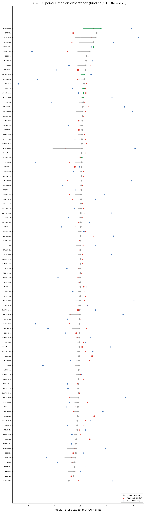
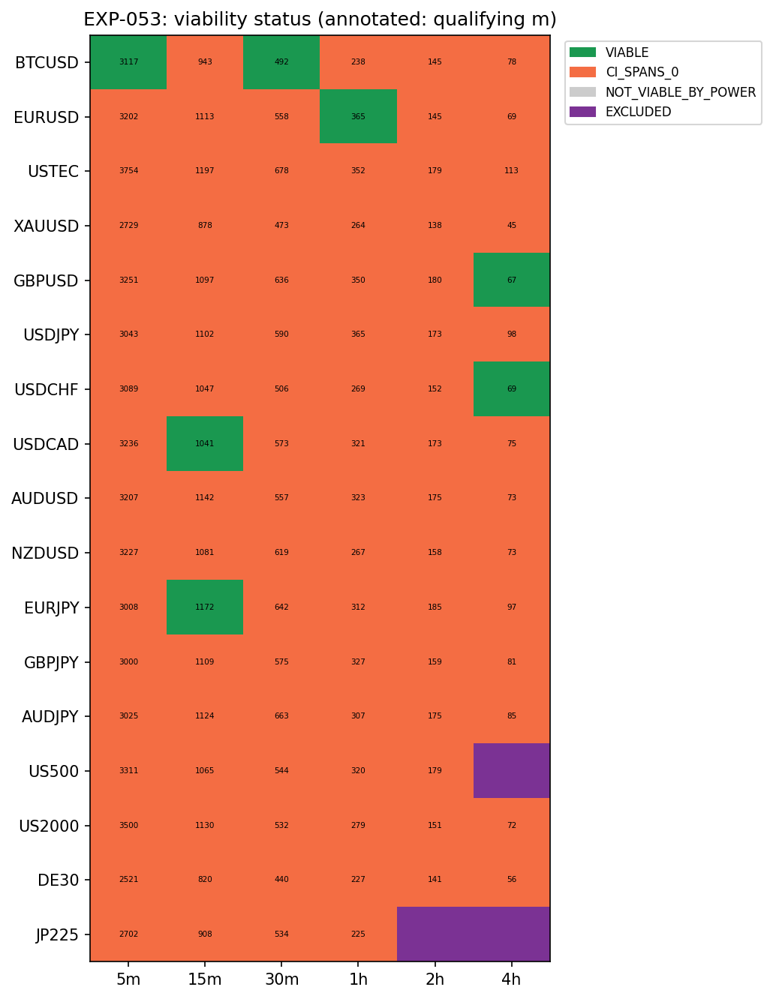
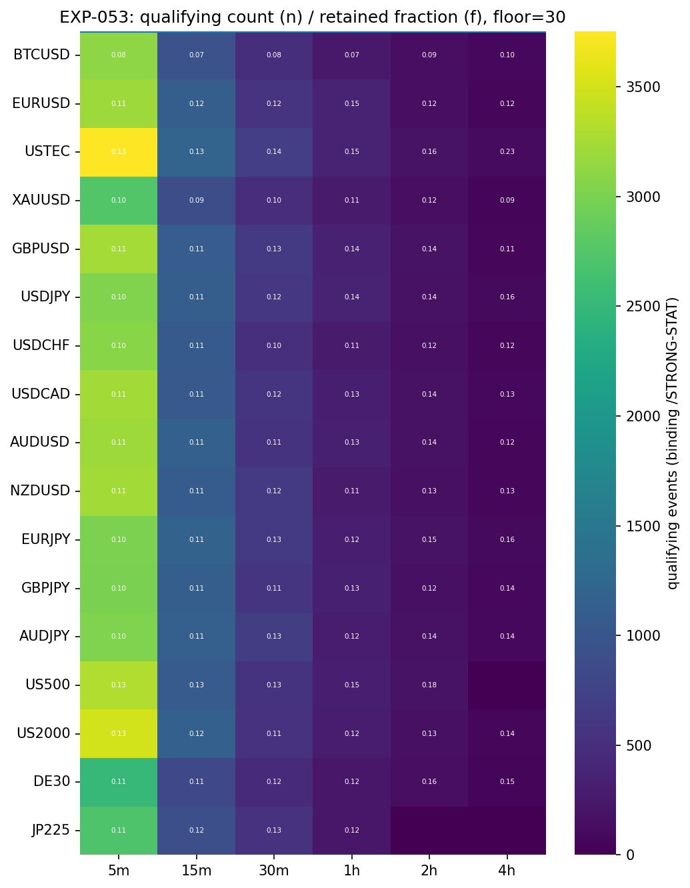
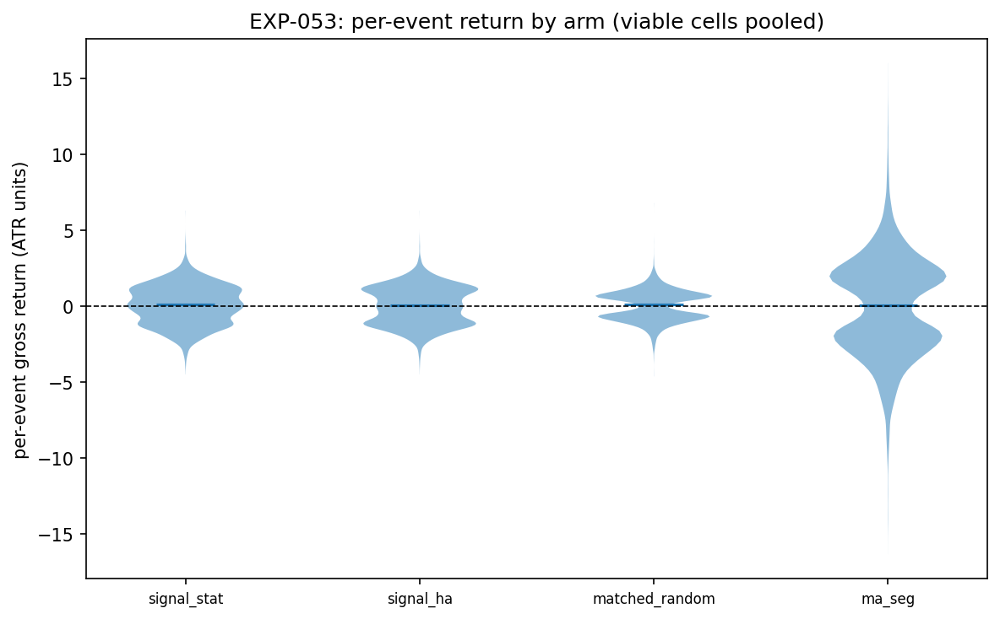

# Experiment Report: EXP-053 — Conditioned-Signal Efficacy (HA Harami at Strong-Move Exhaustion, Harami-Anchored)

## Status: CONDITIONED_EFFICACY_DELIVERED — EVIDENCE_FOR

**Date:** 2026-06-15
**Instruments:** BTCUSD, EURUSD, USTEC, XAUUSD, GBPUSD, USDJPY, USDCHF, USDCAD, AUDUSD, NZDUSD, EURJPY, GBPJPY, AUDJPY, US500, US2000, DE30, JP225 (99 cells)
**Data Views / Feature Categories:** 5m/15m/30m/1h/2h/4h real domain OHLC; HA candles for harami detection; ATR-ZigZag substrate; `/STRONG-STAT` live magnitude-percentile filter; benchmark 3-barrier geometry (50% favourable, 1:1 adverse, adaptive time-cap); P15 path-ordered intrabar fills

---

## Question

Does the live, causal, `/STRONG`-conditioned HA harami — anchored at the harami confirmation-bar close and faded against the in-progress strong move under benchmark barriers and realistic intrabar fills — have a positive, matched-control-beating gross per-event expectancy, per cell and composed across the grid?

## Hypothesis

A HA harami at the probabilistic exhaustion of a strong impulsive move (`/STRONG-STAT` p75), entered at the harami close and traded as a reversal under benchmark 3-barrier geometry with path-ordered fills, produces positive gross per-event median expectancy clearing P11 (≥5 cells over ≥3 instruments with CI_low > 0 and ≥30 events) and exceeding both matched-control baselines.

## Method Summary

Compose the frozen Phase-014 primitives (ZigZag, HA harami detector, `/STRONG-STAT` live magnitude-percentile filter) across the 99-cell member grid. Each qualifying event is entered at the harami confirmation-bar real close, faded against the in-progress strong move under benchmark 50%/1:1/adaptive-time-cap barriers resolved via the P15 path-ordered intrabar fill model. Per-cell median ATR-normalised gross return is estimated via a regime-clustered moving-block bootstrap (10,000 resamples). Two P13 baselines — matched-count random in-progress timestamps and MA(20,50) segmentation — run through the identical pipeline. P11 composition readout is mechanical.

## Key Findings

### Finding 1: P11 Viability Quorum Cleared

7 cells have CI_low > 0 with ≥30 qualifying events, spanning 6 instruments (BTCUSD, EURUSD, GBPUSD, USDCHF, USDCAD, EURJPY). The signal composition clears the P11 threshold (≥5/≥3).

### Finding 2: Signal Exceeds Both Matched-Control Baselines

6 of the 7 viable cells (all except USDCAD-15m) beat both P13 baselines — matched-random and MA(20,50) segmentation — covering 5 instruments. The baseline-beat composition also clears P11. The edge is specific to the harami + `/STRONG-STAT` conjunction on ATR-ZigZag segmentation, not an artifact of entry timing or direction rules.

### Finding 3: Power Is Not Limiting

All 99 cells have ≥30 qualifying events after conditioning. Retained fractions (0.08–0.16) are consistent with EXP-051's `/STRONG-STAT` retention rate but do not deplete power.

### Finding 4: Effect Is Concentrated, Not Uniform

92 of 99 cells have CI spanning zero. Viable cells cluster in specific pockets: BTCUSD short-term (5m, 30m), EURUSD-1h, GBPUSD/USDCHF/EURJPY longer-term (4h/15m). This is consistent with the mechanism relying on strong-move exhaustion — not every instrument–domain pair qualifies.

### Finding 5: Secondaries Consistent with Symmetric Barriers

Win rates (~0.46–0.63) and first-hit r (~0.33–0.63) cluster near 0.50, replicating the EXP-049 null barrier finding. The positive median expectancy arises from asymmetric return magnitudes, not higher FAV counts.

### Finding 6: No Substrate or Method Defects

Determinism replay passes on 17/17 reconciled cells. All invariants pass. 0 non-deterministic cells, 0 defect flags.

## Conclusion

**EVIDENCE_FOR** — The conditioned family's central efficacy claim is supported on benchmark geometry. Mechanical criteria: signal P11 = (7 ≥ 5) AND (6 ≥ 3) = True; beats-both P11 = (6 ≥ 5) AND (5 ≥ 3) = True; EVIDENCE_FOR both true.

The `/STRONG`-conditioned HA harami, anchored at the harami confirmation-bar close and traded as a reversal under benchmark 3-barrier geometry with P15 fills, produces positive gross per-event median expectancy that clears programme composition thresholds and exceeds matched controls. This is the first outcome read of the actual conditioned family hypothesis — what 014-A left untested.

## Registry Disposition

**Updates applied:**
- `docs/signal-registry/multiplicity-registry.md`: `CF-HA-HARAMI-001/HYP-006 — EXP-053` advanced from PLANNED to CHARACTERISED — EVIDENCE_FOR. 0 candidate slots, 0 TEST reads consumed.
- `docs/signal-registry/candidate-families/harami.md`: HYP-006 row added to the hypotheses table alongside 014-A entries.
- No `test-read-ledger.md` entry required (TRAIN-only, 0 TEST reads).

## Limitations

1. **Gross (no costs):** All returns are gross of trading costs, slippage, and financing. Cost-bearing tradability is deferred.
2. **P15 fill model is an approximation:** The path-ordered intrabar fill model (`O→L→H→C` / `O→H→L→C`) is documented as an approximation; 1-minute bars are not replayed inside the domain bar. EXP-054 bounds its effect.
3. **TRAIN-only:** Results are on the first 49% of data (TRAIN slice). TEST and global holdout are sealed. Generalisation to unseen regimes is unconfirmed.
4. **Concentration risk:** Only 7/99 cells are viable. The signal is not broadly positive — it works in specific instrument–domain pockets. Acceptable per P11 but limits claim breadth.
5. **No parameter tuning:** All parameters frozen D0; different values may produce different results.

## Implications for Future Research

- The conditioned family hypothesis is supported on benchmark geometry — the family's core mechanism (strong-exhaustion harami, harami-anchored reversal) produces detectable gross edge.
- The effect is concentrated (7/99 cells), suggesting the signal is real but substrate-dependent. Broadening the claim requires either more selective instrument/domain targeting or alternative barrier geometries.
- The P15 fill model replaces the worst-case tie-break — EXP-054 must quantify whether the difference is material.
- Remaining 014-B experiments (EXP-054–060) will test alternative geometries, overlays, and the combined event system before the single G2.

## Recommended Next Experiments

1. **EXP-054:** Quantify P15 path-ordered fill effect vs worst-case tie-break.
2. **EXP-055–060:** Continue the 014-B slate: long-horizon availability, alternative geometries, position-management exits, combined event system.
3. Post-G2: cost-bearing screen and, if the family advances, TEST-stratum confirmation.

## Artifacts

| Artifact | Path |
|----------|------|
| Scope | [scope.md](scope.md) |
| Analysis Plan | [analysis-plan.md](analysis-plan.md) |
| Code | [code/](code/) |
| Audit | [audit.md](audit.md) |
| Results | [results.md](results.md) |
| Governance Reviews | [governance/](governance/) |
| Plots | [plots/](plots/) |
