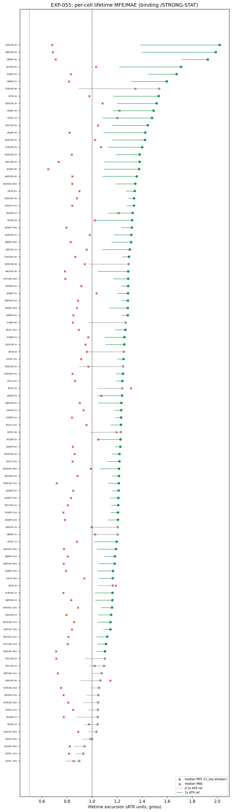
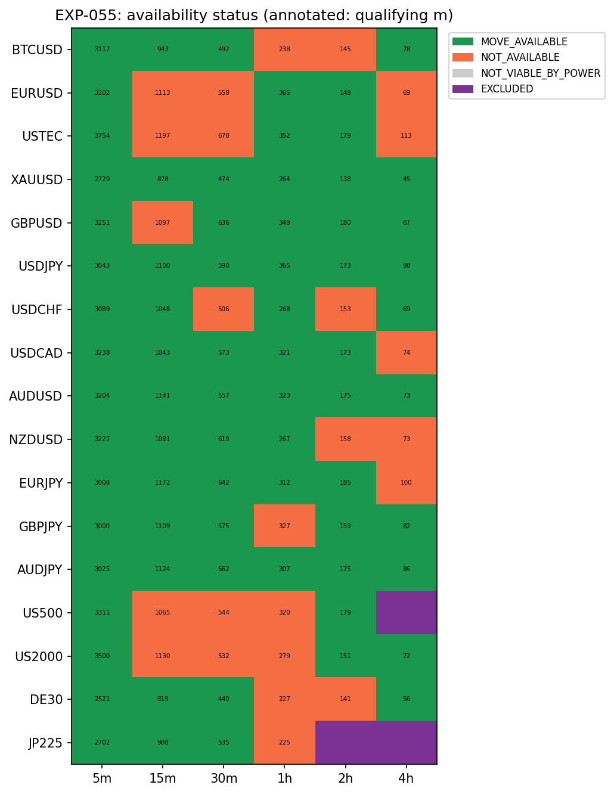
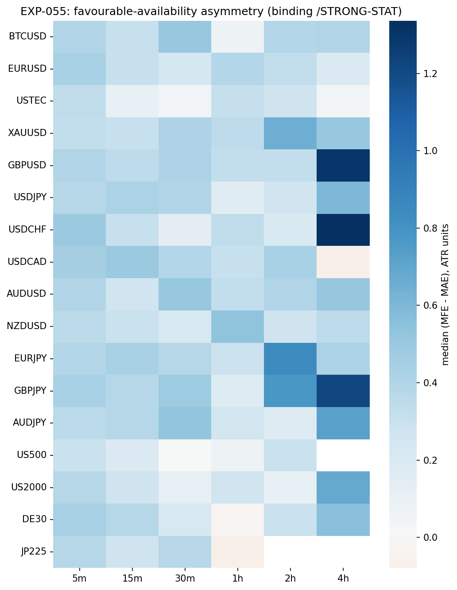
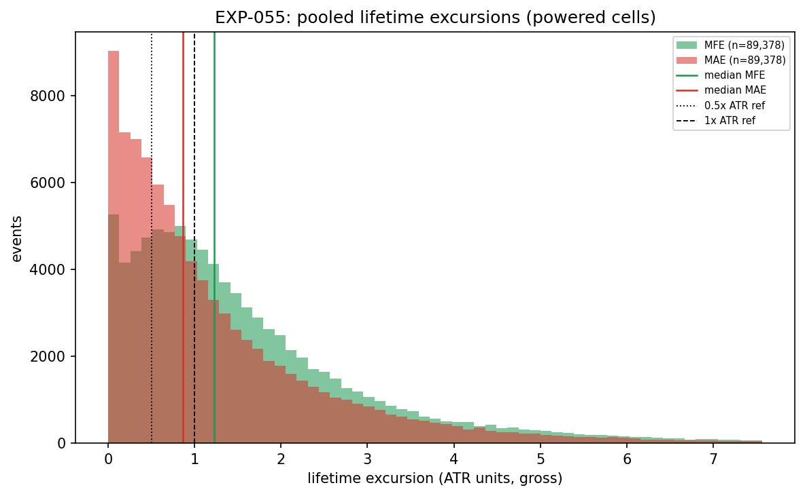

# Experiment Report: EXP-055 — Long-Horizon Availability (Conditioned HA Harami; AVWAP-Analog Lifetime MFE/MAE)

## Status: COMPLETED — AVAILABILITY_GOOD

**Date**: 2026-06-16
**Instruments**: All 17 (BTCUSD, EURUSD, USTEC, XAUUSD, GBPUSD, USDJPY, USDCHF, USDCAD, AUDUSD, NZDUSD, EURJPY, GBPJPY, AUDJPY, US500, US2000, DE30, JP225); 99 member cells (3 COVERAGE_EXCLUDED)
**Data Views / Feature Categories**: 5m/15m/30m/1h/2h/4h real domain OHLC; HA candles for harami detection only; ATR-ZigZag substrate (Wilder ATR 14/1.0); `/STRONG-STAT` live magnitude-percentile filter

---

## Question

For the live `/STRONG`-conditioned HA harami (anchored at the harami confirmation-bar close), over the **full reversal move** that follows it, does the distribution of lifetime favourable excursion (MFE) vs adverse excursion (MAE) look like the AVWAP situation — a meaningful favourable move is *available* but short-horizon capture missed it — or worse — no favourable reversal move is available at all?

## Method Summary

For each of the 99 member cells (17 instruments × 6 domains minus 3 COVERAGE_EXCLUDED), the experiment:
1. Reuses the EXP-053 conditioned-signal construction (identical event population, verified by reconciliation) to identify live `/STRONG-STAT`-qualified HA harami events, entered at the harami confirmation-bar real close.
2. Measures ATR-normalised lifetime MFE and MAE over the **end-of-reversal-move (M_b) window** — `[entry+1, c2]` where `c2` is the 2nd confirmed ZigZag pivot at/after the harami (the 1st ends the faded in-progress move M_a; the 2nd ends the predicted reversal move M_b).
3. Bootstraps per-cell median MFE and MAE (regime-clustered moving-block, 10,000 draws) and applies the mechanical MOVE_AVAILABLE three-leg test (power ≥ 30, MFE CI_low > 1.0 ATR, median MFE > median MAE) with P11 composition.
4. Runs determinism replay + window invariants + EXP-053 population reconciliation on every cell.

See [analysis-plan.md](analysis-plan.md) for full methodology.

## Key Findings

### Finding 1: AVAILABILITY_GOOD — the reversal move is broadly available

The conditioned harami's predicted reversal move offers a robust favourable excursion across the grid. 74/99 member cells are MOVE_AVAILABLE, clearing P11 (≥5 cells over ≥3 instruments) with 74 cells over all 17 instruments.

| Metric | Value |
|--------|-------|
| MOVE_AVAILABLE | 74 cells, 17 instruments |
| NOT_AVAILABLE | 25 cells |
| EXCLUDED | 3 cells |
| Powered (≥30 events) | 99 cells, 17 instruments |
| Pooled qualifying events | 89,378 |
| Median MFE range | 0.90–2.02 ATR units |
| Median MAE range | 0.65–1.34 ATR units |

Most cells show median MFE above 1.0 ATR, and median MFE exceeds median MAE in 74/99 cells. This is the AVWAP situation: the move *is available*; the EXP-049/053 capture failure was a capture-geometry problem, not a signal problem.

### Finding 2: Availability is strongest in short domains and forex pairs

MOVE_AVAILABLE cells cluster in shorter domains (5m–1h) and major forex pairs. NOT_AVAILABLE cells concentrate in longer domains (2h/4h) and index instruments (US500, US2000) where wider CIs from fewer events prevent the CI_low from clearing 1.0 ATR.

### Finding 3: The favourable move is an ambient regime property

The signal does NOT beat the matched-random or MA(20,50)-segmentation baseline on median MFE in any cell — all contrast_low values are negative, and `beats_both_mfe` is empty. This is expected: any entry during a strong move captures the same ambient reversal swing. The availability finding is about move *existence*, not entry uniqueness.

### Finding 4: No correctness defects

0 non-deterministic, 0 causality failures, 0 EXP-053 reconciliation mismatches across all 99 member cells.

## Conclusion

**AVAILABILITY_GOOD.** The `/STRONG`-conditioned HA harami's predicted reversal move offers a meaningful favourable excursion that robustly clears 1.0 ATR and exceeds adverse excursion across a P11 quorum of cells (74 cells, 17 instruments). The open parallel from the 014-A G1 desk is settled: this is the AVWAP situation — *move available, capture missing* — not the worse alternative of no available move. Continuing to iterate capture geometry/exit surface (EXP-056–060) is justified.

No edge claim is made (gross, availability is a ceiling on capture). No gate is self-adjudicated (routing is the single 014-B G2 after the full slate).

## Registry Disposition

**Not applicable — characterisation/diagnostic within an open family.** EXP-055 is HYP-008 (long-horizon availability) under CF-HA-HARAMI-001, Phase 014-B lead 3. It is a diagnostic read with 0 candidate slots and 0 TEST reads. No candidate branch is registered from this experiment. The family status remains OPEN (014-B still running). The multiplicity-registry entry for `CF-HA-HARAMI-001/HYP-008` is updated from PLANNED to the characterisation result (AVAILABILITY_GOOD). No `test-read-ledger.md` entry applies.

## Limitations

1. **Gross only** — No costs are applied. MFE/MAE represent available excursion, not capturable return.
2. **Ambient regime property** — The favourable move is a property of reversal move structure, not of the specific harami entry timing, as shown by the matched-random baseline.
3. **ATR normalisation** — ATR at entry is a fixed divisor for a variable-length window; a simplification consistent with the 014-B endpoint discipline.
4. **MA-segmentation contrast** — Not a fair comparison: MA(20,50) segments produce structurally larger moves, making the contrast negative by construction. Disclosed and expected.

## Implications for Future Research

- Capture geometry (EXP-056–060) is now the critical path — the move exists, and the challenge is extracting it through barrier placement and position management.
- Index instruments and longer domains may need focused attention in the surface experiments; their NOT_AVAILABLE pattern should be monitored.

## Recommended Next Experiments

1. **EXP-056** — Favourable-target geometry (`/VPTARGET`, `/MAGTARGET`)
2. **EXP-057** — Adverse-target geometry (`/ADV-EXTREME`, `/ADV-NONE`)
3. **EXP-058** — Third-barrier geometry (`/THIRD-EVENT`, `/THIRD-TIME`)
4. **EXP-059** — Position-management exits (`/EXIT-PARTIAL`, `/EXIT-TRAIL-STRUCT`)
5. **EXP-060** — Combined event system

## Artifacts

| Artifact | Path |
|----------|------|
| Scope | [scope.md](scope.md) |
| Analysis Plan | [analysis-plan.md](analysis-plan.md) |
| Code | [code/](code/) |
| Audit | [audit.md](audit.md) |
| Results | [results.md](results.md) |
| Governance Reviews | [governance/](governance/) |
| Plots | [plots/](plots/) |
