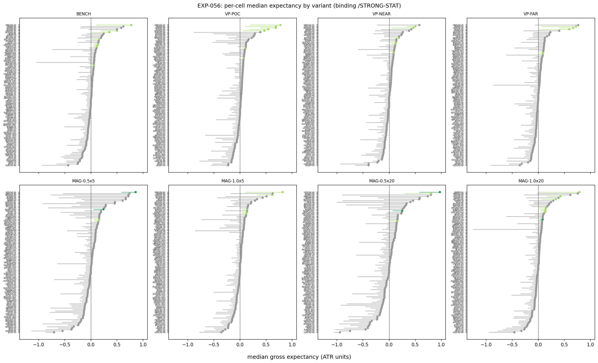
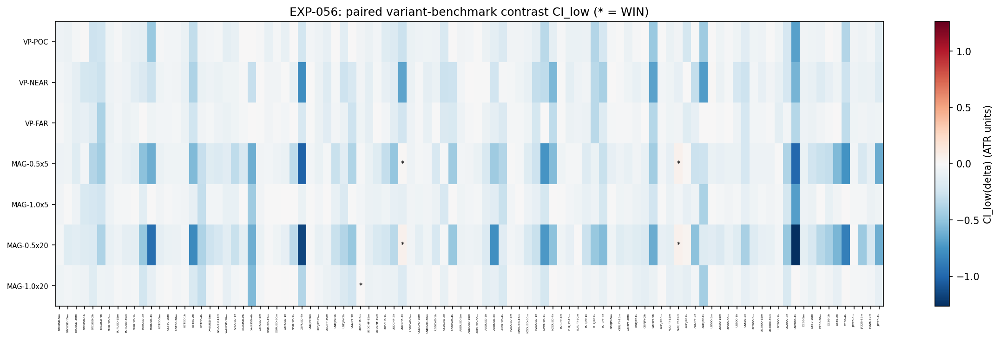
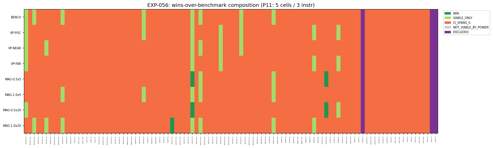
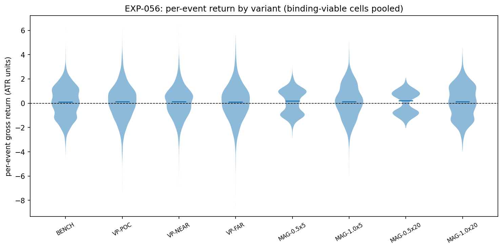
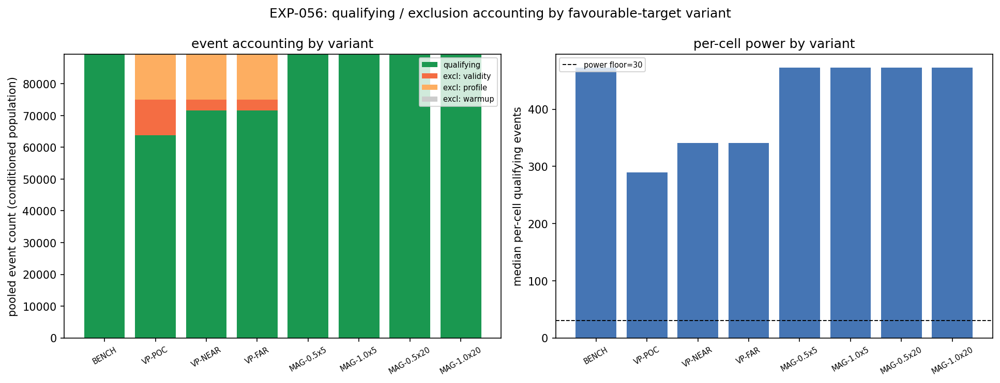

# Experiment Report: EXP-056 — Favourable-Target Geometry (Conditioned HA Harami; `/VPTARGET`, `/MAGTARGET` vs Benchmark 50%)

## Status: FAVOURABLE_TARGET_CHARACTERISED — EVIDENCE_AGAINST

**Date:** 2026-06-16
**Instruments:** All 17 (BTCUSD, EURUSD, USTEC, XAUUSD, GBPUSD, USDJPY, USDCHF, USDCAD, AUDUSD, NZDUSD, EURJPY, GBPJPY, AUDJPY, US500, US2000, DE30, JP225); 99 member cells (3 COVERAGE_EXCLUDED)
**Data Views / Feature Categories:** 5m/15m/30m/1h/2h/4h real domain OHLC; HA candles for harami detection only; ATR-ZigZag substrate (Wilder ATR 14/1.0); `/STRONG-STAT` live magnitude-percentile filter; `/VPTARGET` volume-profile levels of the prior completed move; `/MAGTARGET` trailing-magnitude distances; benchmark 3-barrier geometry (1:1 adverse, adaptive time-cap); P15 path-ordered intrabar fills

---

## Question

Does changing only the **favourable target** — from the benchmark 50%-of-`M_sofar` level to a volume-profile level of the prior completed move (`/VPTARGET`: near VA edge, POC, far VA edge) or a trailing-magnitude distance (`/MAGTARGET`: `{0.5,1.0} × median(trailing-{5,20})`) — improve the conditioned HA-harami's gross per-event median expectancy vs the benchmark, per cell and composed across the grid?

## Hypothesis

At least one alternative favourable-target geometry (`/VPTARGET` or `/MAGTARGET`) produces **higher gross per-event median expectancy** (P14, ATR-normalised, P15 fills) than the benchmark 50%-of-`M_sofar` target, on the binding `/STRONG-STAT` arm, clearing P11 (≥5 cells over ≥3 instruments with CI_low > 0 on its own expectancy **and** beating the benchmark variant on the paired contrast CI_low > 0).

## Method Summary

Compose the EXP-053 conditioned-signal construction (identical event population, verified by reconciliation) across the 99-cell member grid. For each qualifying harami (live `/STRONG-STAT` p75, harami confirmation-bar close entry, reversal direction), compute **8 predeclared favourable-target variants** plus 1 disclosed secondary (in-progress VP-POC):

| Category | Variant | Description |
|----------|---------|-------------|
| **Benchmark** | BENCH | 50%-of-`M_sofar` (reproduces EXP-053) |
| `/VPTARGET` | VP-POC | Prior completed move volume POC |
| `/VPTARGET` | VP-NEAR | Prior VA edge with smaller `fav_dist` |
| `/VPTARGET` | VP-FAR | Prior VA edge with larger `fav_dist` |
| `/MAGTARGET` | MAG-0.5x5 | `0.5 × median(trailing-5 magnitudes)` |
| `/MAGTARGET` | MAG-1.0x5 | `1.0 × median(trailing-5 magnitudes)` |
| `/MAGTARGET` | MAG-0.5x20 | `0.5 × median(trailing-20 magnitudes)` |
| `/MAGTARGET` | MAG-1.0x20 | `1.0 × median(trailing-20 magnitudes)` |

Each variant sets the adverse target at 1:1 (P3 benchmark) and the adaptive time cap (P4), resolved via P15 path-ordered fills. Per-cell median ATR-normalised gross return per variant estimated via regime-clustered moving-block bootstrap (10,000 draws). WIN = viable on own median (CI_low > 0, ≥30 events) **AND** beats the benchmark on the paired contrast (CI_low of variant − BENCH > 0 in the common qualifying subset). P11 composition readout mechanical per the Interpretation Guide.

## Key Findings

### Finding 1: No variant clears P11 WIN

All 8 alternative favourable-target variants fail the P11 threshold (≥5 WIN cells over ≥3 instruments).

| Variant | Viable cells | WIN cells | WIN instruments | P11 met? |
|---------|-------------|-----------|-----------------|----------|
| BENCH | 8 | — | — | — |
| VP-POC | 7 | **0** | 0 | No |
| VP-NEAR | 6 | **0** | 0 | No |
| VP-FAR | 5 | **0** | 0 | No |
| MAG-0.5x5 | 4 | **2** | 2 | No |
| MAG-1.0x5 | 5 | **0** | 0 | No |
| MAG-0.5x20 | 4 | **2** | 2 | No |
| MAG-1.0x20 | 8 | **1** | 1 | No |

P11 threshold: ≥5 WIN cells over ≥3 instruments. **No variant passes.** `n_pass = 0`.

### Finding 2: VP variants consistently trail the benchmark

All three `/VPTARGET` variants produce **0 WIN cells**. The volume profile of the prior completed move — whether POC, near value-area edge, or far value-area edge — does not provide a better favourable target than the adaptive 50%-of-`M_sofar` level. The 50% benchmark is already an effective central-tendency estimator of the reversal move's geometry, while VP levels track the *completed* move's price distribution (structurally orthogonal to the reversal's expected extent).

### Finding 3: MAG variants produce sparse, scattered WIN cells

The best performers (MAG-0.5x5, MAG-0.5x20) each have **2 WIN cells on 2 instruments**, concentrated in:
- **USDCHF-4h**: both 0.5× variants win (W=5 and W=20)
- **AUDJPY-30m**: both 0.5× variants win (W=5 and W=20)

MAG-1.0x20 is viable in 8 cells (matching BENCH) but beats the benchmark in only 1 cell (USDCHF-5m, marginal +0.000165 ATR units). The pattern — specific cells on specific instruments — is consistent with noise-level variation rather than systematic improvement.

### Finding 4: BENCH reproduces EXP-053 exactly

99/99 cells match EXP-053 population to machine precision on both m and median. BENCH viable composition (8 cells, 7 instruments) replicates EXP-053's benchmark finding — the conditioned signal has a modest gross edge on a subset of cells, identical to the earlier readout.

### Finding 5: Power is not limiting

All 99 cells are powered (≥30 qualifying events) on **all 8 variants**. Exclusion counts — VP profile insufficient (<3 domain bars), VP level on wrong side of C, MAG warmup (<W prior moves) — are low enough that no cell drops below the power floor.

### Finding 6: No correctness defects

- **Determinism**: 17/17 cells (first usable per instrument) re-run byte-identical — **PASS**
- **Causality**: 0 violations across all cells
- **Reconciliation vs EXP-053**: 99/99 cells PASS with diff = 0.0 on m and median

## Conclusion

**EVIDENCE_AGAINST** — Favourable-target geometry — whether a volume-profile level of the prior completed move (`/VPTARGET`) or a trailing-magnitude distance (`/MAGTARGET`) — is not a lever that improves conditioned capture on this surface.

Mechanical criteria: bench_pow = (99 ≥ 5) AND (17 ≥ 3) = True; alt_pow = (99 ≥ 5) AND (17 ≥ 3) = True for all variants; no alternative variant clears P11 WIN → **EVIDENCE_AGAINST** per the Interpretation Guide.

The scope's falsifiable condition is met: no alternative favourable-target variant clears P11 on WIN. This is a measured-negative characterization. The adaptive 50%-of-`M_sofar` level is competitive with or superior to every tested alternative — volume profile levels from the prior move and trailing-magnitude distance estimates — on this entry substrate, with benchmark 1:1 adverse and adaptive time-cap geometry.

## Registry Disposition

**Not applicable — characterisation readout (0 candidate slots, 0 TEST reads).** EXP-056 is HYP-009 (favourable-target geometry) under CF-HA-HARAMI-001, Phase 014-B surface read 1. It exercises the registered branches `/VPTARGET` and `/MAGTARGET` but does not consume a candidate slot — per P21, a branch activates as a screening candidate only after G2 PROCEED_TO_SCREEN.

**Updates applied:**
- `docs/signal-registry/multiplicity-registry.md`: `CF-HA-HARAMI-001/HYP-009 — EXP-056` advanced from PLANNED to CHARACTERISED — EVIDENCE_AGAINST. Branch entries for `/VPTARGET` and `/MAGTARGET` remain REGISTERED (exercised but not promoted).
- `docs/signal-registry/candidate-families/harami.md`: HYP-009 row added with verdict, 0-slot/0-TEST-read accounting.
- No `test-read-ledger.md` entry required (TRAIN-only, 0 TEST reads).
- Family status remains **OPEN** (014-B still running).

## Limitations

1. **TickVolume proxy.** `/VPTARGET` uses broker tick count as a traded-volume proxy. A systematic volume-profile effect could be masked if tick count diverges from true traded volume for some instruments or regimes.
2. **Prior-completed-move VP reference only.** VP variants reference only the immediately prior completed move (LOOKBACK=1). A multi-move or multi-modal VP profile was not tested.
3. **Gross only.** All results are gross of costs. Favourable-target lever may behave differently under costs.
4. **Paired contrast sensitivity.** Variants with conditioned-exclusion patterns that differ from the benchmark have smaller `|S|` (common qualifying subset), reducing the paired contrast's power. Disclosed via `contrast_bench_n` per cell; not a material factor (all cells ≥30).
5. **1:1 adverse model held fixed.** The favourable-target lever was tested only under the benchmark 1:1 adverse model. Interaction with alternative adverse models (`/ADV-EXTREME`, `/ADV-NONE`) is deferred to EXP-057.

## Implications for Future Research

- The favourable-target lever is measured and closed on this entry surface. The benchmark 50%-of-`M_sofar` is competitive with all tested alternatives — the problem is not target placement.
- This supports the hypothesis that the binding constraint may be the adverse model (r ≈ 0.50 symmetry — EXP-057 tests `/ADV-EXTREME` and `/ADV-NONE`) or the third-barrier/time horizon (EXP-058), not how close the favourable target sits.
- The adaptation-enriched benchmark (50% of the *in-progress* magnitude-so-far) was a stronger reference than any static or prior-move-derived level — a positive finding about the baseline itself.

## Recommended Next Experiments

1. **EXP-057** — Adverse-target geometry (`/ADV-EXTREME`, `/ADV-NONE`). The asymmetric lever that can directly shift `r` off 0.50 — the structural constraint EXP-049 identified and EXP-053's conditioned benchmark still displays.
2. **EXP-058** — Third-barrier geometry (`/THIRD-EVENT`, `/THIRD-TIME`). The adaptive time cap is at its floor in most cells — longer horizons may be more consequential than target placement.
3. **EXP-059/060** — Position-management exits and combined event system.
4. Continue the 014-B slate per design; EXP-056 is a measured-negative read feeding the single G2.

## Artifacts

| Artifact | Path |
|----------|------|
| Scope | [scope.md](scope.md) |
| Analysis Plan | [analysis-plan.md](analysis-plan.md) |
| Code | [code/](code/) |
| Audit | [audit.md](audit.md) |
| Results | [results.md](results.md) |
| Governance Reviews | [governance/](governance/) |
| Plots | [plots/](plots/) |
