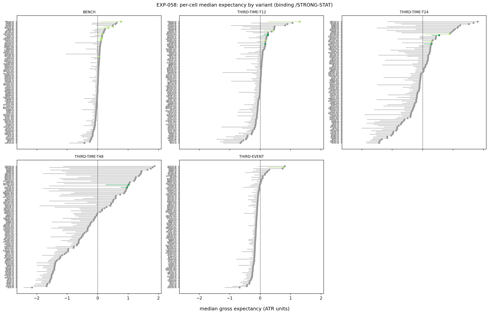
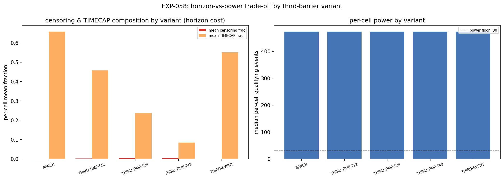

# Experiment Report: EXP-058 — Third-Barrier Geometry (Conditioned HA Harami; `/THIRD-TIME`, `/THIRD-EVENT` vs Benchmark Adaptive Cap)

## Status: COMPLETED — EVIDENCE_AGAINST

**Date**: 2026-06-16
**Instruments**: BTCUSD, EURUSD, USTEC, XAUUSD, GBPUSD, USDJPY, USDCHF, USDCAD, AUDUSD, NZDUSD, EURJPY, GBPJPY, AUDJPY, US500, US2000, DE30, JP225 (99 EXP-053 member cells; 3 COVERAGE_EXCLUDED)
**Data Views / Feature Categories**: 5m/15m/30m/1h/2h/4h real domain OHLC; HA candles for harami detection; ATR-ZigZag substrate (Wilder ATR 14/1.0); `/STRONG-STAT` live magnitude-percentile filter; 5 predeclared third-barrier variants; P15 path-ordered intrabar fills; P14 median per-event ATR-normalised gross return

---

## Question

Does any alternative third-barrier geometry (`/THIRD-TIME` floor ∈ {12, 24, 48}; `/THIRD-EVENT` with ZigZag `rd`-direction confirm and 8× backstop) produce higher gross per-event median expectancy than the benchmark floor-6 adaptive time cap, on the `/STRONG-STAT`-conditioned HA harami population?

## Hypothesis

**HYP-011**: At least one alternative third-barrier variant clears the P11 quorum (≥5 WIN cells over ≥3 instruments), where WIN = viable (CI_low > 0) AND beats benchmark on the paired contrast.

## Method Summary

One-at-a-time (OAT) sweep of the third barrier on the fixed benchmark favourable (50%-of-`M_sofar`) and adverse (1:1) geometry. Five binding variants: BENCH (floor-6 adaptive cap), THIRD-TIME-T12/24/48 (floors 12/24/48, k=1.5, window=20 fixed), and THIRD-EVENT (exit on next ZigZag `rd`-direction confirmation, backstopped at 8× bench_N). Per-cell median ATR-normalised gross return (P14) with regime-clustered MBB (10,000 draws), paired variant-benchmark contrast, and P11 composition readout. All processed through the same P15 path-ordered fill model. See [analysis-plan.md](analysis-plan.md) for full details.

## Key Findings

### Finding 1: No alternative third-barrier variant wins at P11 quorum

| Variant | Powered (m≥30) | Viable (CI_low>0) | Win (viable + beats_bench) | P11 pass? |
|---------|-------|--------|-----|----------|
| BENCH | 99 | 8 | 0 (N/A) | N/A |
| THIRD-TIME-T12 | 99 | 6 | 3 (BTCUSD-30m, XAUUSD-1h, USDCAD-5m) | No (3<5) |
| THIRD-TIME-T24 | 99 | 4 | 2 (XAUUSD-15m, USDCAD-5m) | No (2<5) |
| THIRD-TIME-T48 | 99 | 2 | 2 (BTCUSD-30m, USDCAD-5m) | No (2<5) |
| THIRD-EVENT | 99 | 1 | 0 | No (0<5) |

All 99 cells powered for every variant — the result is not a power failure. THIRD-TIME-T12 comes closest (3 wins/3 instruments) but falls below the P11 quorum.

### Finding 2: Censoring/horizon trade-off depletes viability

Raising the floor systematically reduces viable and win counts: 8→6→4→2→1 viable cells as the floor rises from 6→12→24→48→event. Longer horizons admit symmetric noise (1:1 fav/adv geometry), letting TIMECAP exit prices drift toward zero or negative. First-hit `r` stays near 0.50 across all variants — the lever works through TIMECAP exit price, not the FAV/ADV ratio.

### Finding 3: THIRD-EVENT is the weakest performer

The event-based barrier (next ZigZag `rd`-confirm exit, 8× backstop) produces 1 viable cell and 0 WIN cells. The `rd`-confirm event arrives too late; the backstop (a longer time cap) dominates, making this a structurally worse time cap rather than a superior structural alternative.

### Finding 4: Pattern mirrors EXP-056 — benchmark geometry is apparently optimal on each axis

EXP-056 (favourable-target OAT) and EXP-058 (third-barrier OAT) both return EVIDENCE_AGAINST. Together they suggest the benchmark geometry (50%-of-`M_sofar` / 1:1 / floor-6 adaptive cap) sits at a local optimum on two orthogonal surface legs.

### Finding 5: All defect gates pass

- Determinism: 17/17 cells PASS byte-identical replay
- Causality violations: 0
- Invariants: cap monotonicity holds, `/THIRD-EVENT` bounds satisfied, warmup masks identical
- EXP-053 reconciliation: 99/99 cells match to 1e-9 precision on `m`, `median`, `r_firsthit`

## Conclusion

**EVIDENCE_AGAINST** — No alternative third-barrier variant clears P11. The benchmark floor-6 adaptive cap is apparently optimal on this axis: longer time horizons (T12/24/48) admit symmetric noise that erodes expectancy, and the event-based barrier (THIRD-EVENT) is structurally disadvantaged. The deliverable is a measured-negative characterization (`THIRD_BARRIER_CHARACTERISED`) feeding the single 014-B G2 alongside EXP-056 and EXP-057.

## Registry Disposition

**Updates applied:**
- `docs/signal-registry/multiplicity-registry.md`: EXP-058 (`CF-HA-HARAMI-001/HYP-011`) status updated from PLANNED to `CHARACTERISED — EVIDENCE_AGAINST (2026-06-16)`. No candidate slot consumed, 0 TEST reads.
- `docs/signal-registry/candidate-families/harami.md`: HYP-011/EXP-058 row updated from PLANNED to CHARACTERISED — EVIDENCE_AGAINST.
- `docs/signal-registry/test-read-ledger.md`: unchanged — 0 TEST reads.

## Limitations

1. **Gross-only**: No costs modelled. Relative ranking could shift under realistic costs.
2. **P15 fill approximation**: Intrabar path is an approximation of unobserved motion (EXP-054 bounded effect at Δr ≈ 0.010 ATR). Contrast between variants is unbiased.
3. **TRAIN-only**: First-49% TRAIN slice only. Nested TEST and global holdout remain sealed.
4. **OAT variation only**: Only the third barrier is varied. Combined levers (EXP-060) may unlock improvement.
5. **Operator-defined grid**: Floor-only sweep (k=1.5, window=20 fixed); `/THIRD-EVENT` backstop = 8× bench_N. Different choices could produce different results.

## Implications for Future Research

- The censoring narrative (symmetric noise at longer horizons under 1:1 geometry) should inform EXP-059 exit-overlay design: partial exits and trailing stops that cut losing TIMECAP positions early may preserve horizon extension's upside while mitigating its downside.
- The benchmark is a local optimum on at least two axes (EXP-056, EXP-058). Combined levers (EXP-060) are the remaining path before the single 014-B G2.

## Recommended Next Experiments

1. **EXP-060 (combined levers)**: Test whether combinations of third-barrier changes with favourable-target or adverse-target changes unlock improvement that OAT variation does not.

## Artifacts

| Artifact | Path |
|----------|------|
| Scope | [scope.md](scope.md) |
| Analysis Plan | [analysis-plan.md](analysis-plan.md) |
| Code | [code/](code/) |
| Audit | [audit.md](audit.md) |
| Results | [results.md](results.md) |
| Governance Reviews | [governance/](governance/) |
| Plots | [plots/](plots/) |
