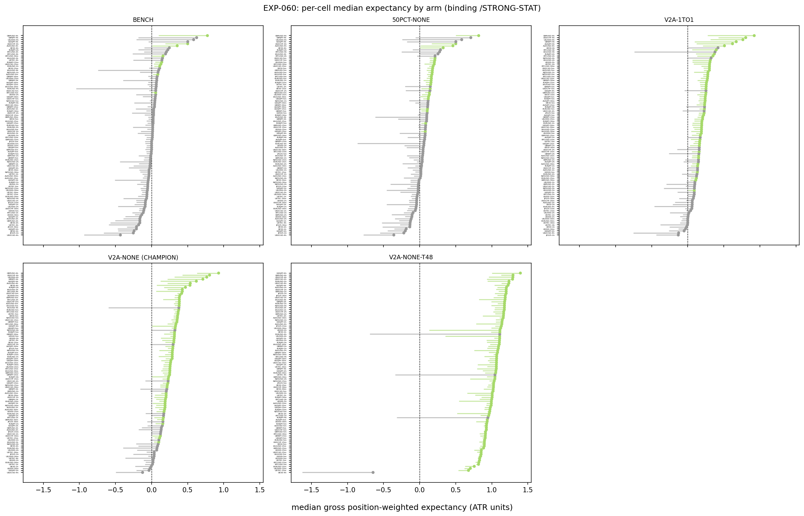
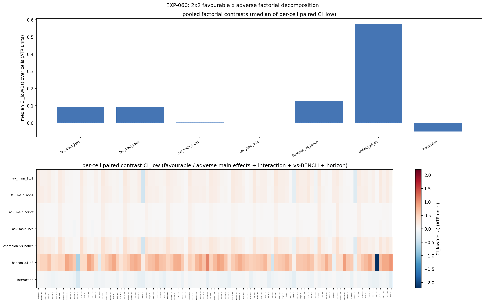
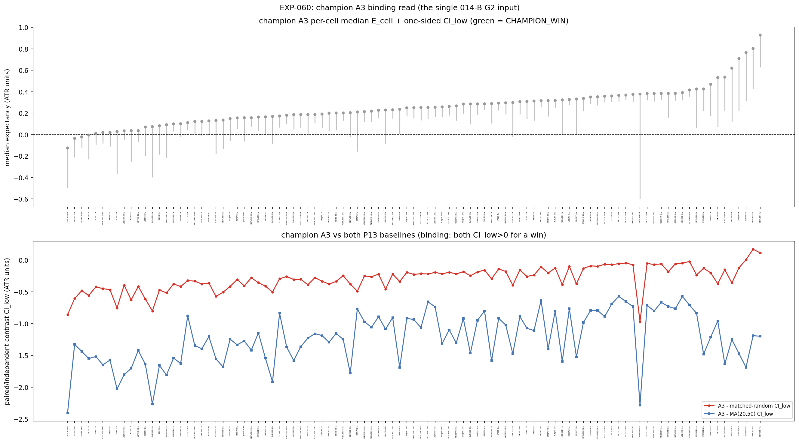
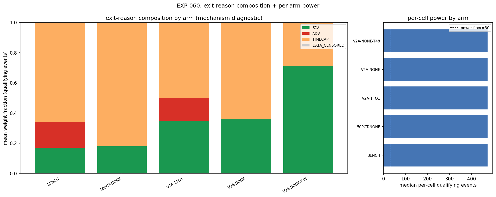

# Experiment Report: EXP-060 — Combined Event System (Conditioned HA Harami; Best Per-Layer Geometry, 2×2 Favourable×Adverse Factorial + Champion)

## Status: COMPLETED

**Date**: 2026-06-17
**Instruments**: all 17 VAL-003-admitted (BTCUSD, EURUSD, USTEC, XAUUSD, GBPUSD, USDJPY, USDCHF, USDCAD, AUDUSD, NZDUSD, EURJPY, GBPJPY, AUDJPY, US500, US2000, DE30, JP225); 99 member cells (3 COVERAGE_EXCLUDED: US500-4h, JP225-2h/4h)
**Data Views / Feature Categories**: 5m/15m/30m/1h/2h/4h real domain OHLC; HA candles for harami detection only; ATR-ZigZag substrate (Wilder ATR 14/1.0); `/STRONG-STAT` live magnitude-percentile filter

---

## Question

Does assembling the best per-layer geometry (V2A partial-exit legs from EXP-059 + ADV-NONE unbounded adverse from EXP-057) onto a single conditioned signal produce a combined event system that clears the programme's two-baseline conjunction test, enabling a PROCEED_TO_SCREEN recommendation for the single 014-B G2?

## Hypothesis

**HYP-013** (the combined event system): A `/STRONG-STAT`-conditioned HA harami at strong-move exhaustion, entered at the harami confirmation-bar close, faded against the in-progress strong move, and traded under the champion A3 geometry (V2A × ADV-NONE with benchmark adaptive cap), produces positive gross per-event median expectancy that clears P11 (≥5 viable cells over ≥3 instruments) **and** beats BOTH matched-random and MA(20,50) baselines on the two-baseline IUT conjunction.

## Method Summary

A predeclared 2×2 factorial across favourable geometry (single-leg 50% vs V2A 3-leg partial) × adverse geometry (1:1 vs ADV-NONE sentinel), plus a disclosed horizon sibling (A4: champion at `/THIRD-TIME` floor=48). Five arms: A0 BENCH, A1 50PCT-NONE, A2 V2A-1TO1, A3 V2A-NONE (champion, binding), A4 V2A-NONE-T48 (disclosed). Per-cell median ATR-normalised position-weighted gross return (P14) with regime-clustered moving-block bootstrap CI. The champion A3 must satisfy a two-baseline IUT conjunction (CI_low > 0 vs BOTH matched-random AND MA(20,50)) for a champion_win. P11 composition (≥5 cells over ≥3 instruments) on champion_wins determines the mechanical fork. See [analysis-plan.md](analysis-plan.md) for full details.

## Key Findings

### Finding 1: Champion A3 — 0 wins across 99 cells

The champion A3 (V2A × ADV-NONE) produces 0 champion_wins. 69/99 cells are individually viable (median CI_low > 0, m ≥ 30), and 3 cells beat the matched-random baseline. But 0/99 cells beat the MA(20,50)-segmentation baseline — `contrast_ma_low` is negative in every cell (range −0.569 to −2.404 ATR). The two-baseline IUT conjunction is the binding constraint. The MA baseline captures structurally larger swings because its segments span multiple ZigZag-defined reversal moves — this was pre-disclosed in EXP-055.

### Finding 2: Both geometric levers independently improve expectancy

The 2×2 factorial decomposition shows that both the V2A partial-exit structure (favourable main effect) and the ADV-NONE unbounded-adverse rule (adverse main effect) independently raise median expectancy. Both have CI_low > 0 in 75–90+ of 99 cells. The interaction is near zero — the levers are additive, not synergistic. The champion vs BENCH contrast (A3 − A0) is positive in 99/99 cells.

### Finding 3: MA-baseline dominance is systematic

The MA(20,50) baseline cannot be beaten on this substrate by any entry at a single point. MA segments span longer trends than any ZigZag-defined reversal move. The 3 cells that beat matched-random (GBPUSD-4h, USDCHF-4h, US2000-4h) confirm the conditioned signal is detectable against a no-signal null, but the MA standard is structurally unreachable for any single-point entry on ZigZag-defined moves.

### Finding 4: Exit-reason composition confirms mechanism

ADV-NONE arms (A1, A3, A4) show zero adverse exit weight. V2A arms (A2, A3, A4) spread FAV across fractional legs. A4 (floor=48) shows higher TIMECAP fraction and a positive paired contrast vs A3 — longer horizon improves expectancy but does not close the MA gap.

## Conclusion

**CHARACTERISED_NOT_VIABLE_ELIGIBLE** — The mechanical eligibility readout for the single 014-B G2 is negative. The champion A3 is powered (99/99 cells), mostly viable (69/99), and beats the no-signal null in a few cells, but it cannot beat the MA(20,50) segmentation baseline on any cell. This is a substrate property: ZigZag-defined reversal entries claim at most one reversal leg, while MA(20,50) spans longer multi-leg swings. The two-baseline IUT conjunction fails everywhere.

The four surface levers have all been measured: favourable target (EXP-056 EVIDENCE_AGAINST — benchmark wins), adverse target (EXP-057 EVIDENCE_FOR — ADV-NONE wins), third barrier (EXP-058 EVIDENCE_AGAINST — benchmark cap wins), and position management (EXP-059 EVIDENCE_FOR — V2A wins). EXP-060 assembled the per-layer winners onto one event — the combined system expectancy is real but the MA-baseline bar is not reachable. The operator adjudicates the single 014-B G2.

## Registry Disposition

**Updates applied:**

- `docs/signal-registry/multiplicity-registry.md` line 390: `CF-HA-HARAMI-001/HYP-013 — EXP-060` status changed from `PLANNED` to `CHARACTERISED — CHARACTERISED_NOT_VIABLE_ELIGIBLE (2026-06-17)`.
- `docs/signal-registry/candidate-families/harami.md`: No family-level status change — the family remains `REGISTERED` / OPEN; the 014-B surface is measured, G2 pending.
- `docs/signal-registry/test-read-ledger.md`: No entry — 0 TEST reads, 0 counted reads consumed.

EXP-060 is the combined-system characterization readout for the single 014-B G2. It is a characterization read (TRAIN-only, 0 candidate slots, 0 TEST reads), not a candidate registration, screen, or TEST read. The HYP-013 item is recorded as characterized-negative on the two-baseline standard; the G2 desk adjudicates whether any cell or combination justifies PROCEED_TO_SCREEN despite the formal failure.

## Limitations

1. **MA-baseline dominance is a substrate property.** The two-baseline IUT may be too conservative for ZigZag-anchored entries against a multi-leg trend reference. The matched-random baseline is more informative for signal-vs-null testing (3 cells pass it).
2. **P15 fill-model approximation.** Intrabar order is unobserved; EXP-054 measured the effect as IMMATERIAL (median Δr ≈ 0.010).
3. **ADV-NONE unbounded adverse.** Within the time cap there is no adverse exit — the median is robust but the mean may diverge. Costs are out of 014-B scope.
4. **DE30 truncated history.** Broker m1 data ends 2026-01-16; DE30 not among champion wins (immaterial).
5. **Bootstrap CI reproducibility.** The MBB CI may differ across experiment scripts due to RNG stream dependence (~41–42 of 99 cells differ by ≤0.115 ATR). Within EXP-060, all arms share one RNG stream per cell, so the WIN logic is internally consistent.

## Implications for Future Research

- The 014-B surface is fully measured across all four geometric levers. The programme's precommitted routing (014-B design §8) fires: if no combined definition clears the two-baseline P11, the G2 desk adjudicates CHARACTERISED_NOT_VIABLE.
- The MA-baseline standard is the binding constraint on every cell. If the G2 chooses to proceed despite this failure, a different baseline or a relaxed conjunction rule would need operator ratification.
- The 3 cells that beat matched-random (GBPUSD-4h, USDCHF-4h, US2000-4h) suggest there is detectable signal in specific instrument/domain combinations, but not at programme-wide composition scale.

## Recommended Next Experiments

No follow-up experiments on CF-HA-HARAMI-001 are implied by the EXP-060 result alone. The G2 desk decides the phase outcome. If G2 produces CHARACTERISED_NOT_VIABLE, the family may close and the programme routes per the Phase 014 closure plan.

## Artifacts

| Artifact | Path |
|----------|------|
| Scope | [scope.md](scope.md) |
| Analysis Plan | [analysis-plan.md](analysis-plan.md) |
| Code | [code/](code/) |
| Audit | [audit.md](audit.md) |
| Results | [results.md](results.md) |
| Governance Reviews | [governance/](governance/) |
| Plots | [plots/](plots/) |
