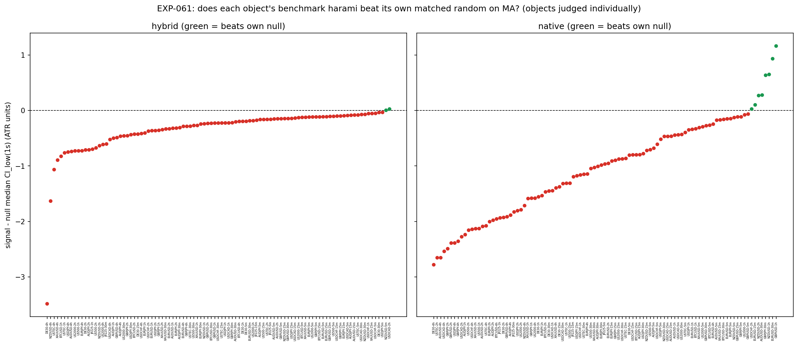
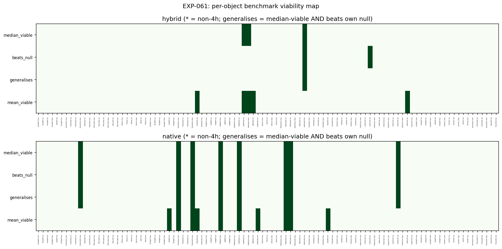
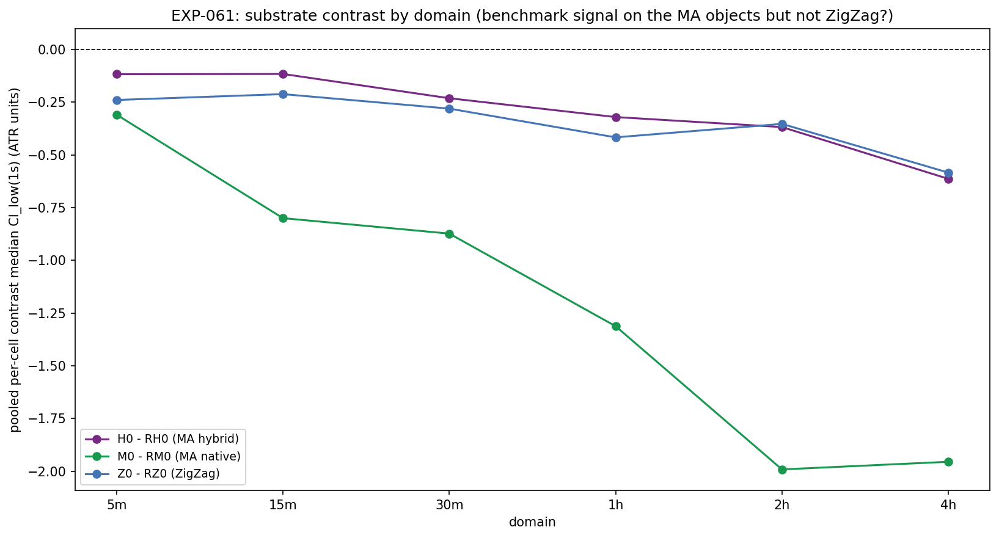
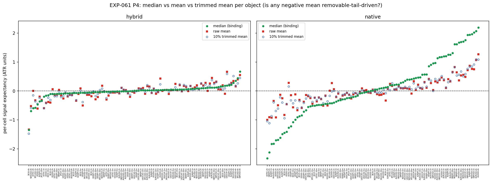
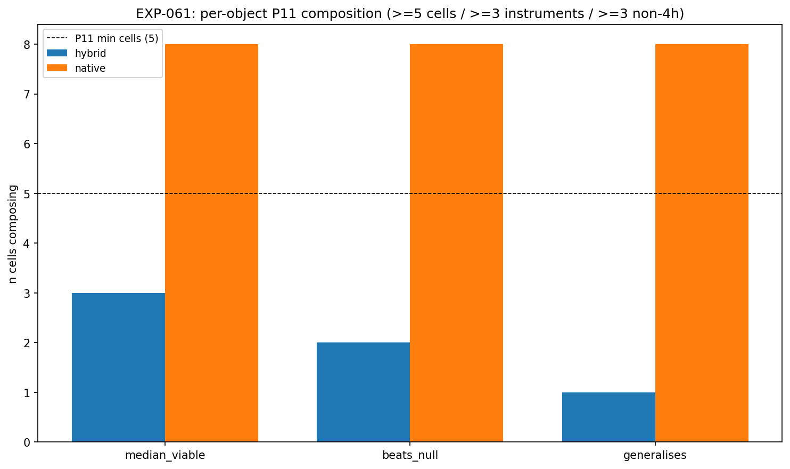

# Results: Experiment EXP-061 (dual-object re-run)

> **Dual-object re-run** under `D0-amendment-001-dual-parallel-substrate.md` (2026-06-17).
> Supersedes the prior single-object interpretation in place. Both conditioning objects are
> reported **individually and never pooled**; the phase verdict is the stronger object's.

## Summary

**Phase verdict: EVIDENCE_FOR (stronger object = native).** The two `/STRONG-STAT`-conditioned
HA-harami objects diverge sharply at the benchmark 3-barrier geometry (50% favourable × 1:1 adverse ×
adaptive cap) on the MA(20,50) substrate:

- **Native object (`M0`) — EVIDENCE_FOR.** MA-segment-`/STRONG-STAT`-conditioned harami; signal-attributable
  median edge in **8 cells / 6 instruments / all 8 non-4h** — composes P11 + P6. This is the object the
  EXP-060B/061 `M`-arms actually measured (8360-class); it reconciles to EXP-060B 99/99 at 1e-9.
- **Hybrid object (`H0`) — EVIDENCE_AGAINST.** ZigZag-`/STRONG-STAT`-conditioned harami × MA geometry
  (the *genuinely-new* 3202-class object that was never computed before); generalises in only **1 cell**
  (NZDUSD-5m) — fails P11. The powered grid composes (99 cells), so this is EVIDENCE_AGAINST, not power-limited.

**The headline correction.** The prior EXP-061 EVIDENCE_FOR was a *native-object* result mislabelled
"hybrid." The re-run confirms that result as native **and** computes the genuine hybrid object for the
first time — which does **not** generalise. The EXP-060B MA-substrate edge is a property of conditioning
the strong-move filter on the **MA segment**, not on the ZigZag move. **Where the `/STRONG-STAT` filter
is computed matters.**

## Detailed Findings

### Finding 1 — Native object (`M0`) generalises; hybrid object (`H0`) does not

**Observation.** Per-object P11 composition (binding endpoint = median):

| Object | median-viable | beats own null | **generalises** | mean-viable (P4) | P11 verdict |
|--------|---------------|----------------|-----------------|------------------|-------------|
| **Native `M0`** | 8 / 6 / 8 | 8 / 6 / 8 | **8 / 6 / 8 — composes** | 10 / 6 / 7 | **EVIDENCE_FOR** |
| **Hybrid `H0`** | 3 / 2 / 3 | 2 / 2 / 2 | **1 / 1 / 1 — fails** | 5 / 3 / 2 | **EVIDENCE_AGAINST** |

(cells / instruments / non-4h.) For native, the three flags coincide exactly across the same 8 cells —
no cell is median-viable without beating its matched random. For hybrid, median-viability (3 cells) and
beating-the-null (2 cells) only intersect on **NZDUSD-5m**, the lone generalising cell.

**The 8 native generalisation cells:**

| Cell | `M0` median | CI_low(1s) | `M0−RM0` CI_low(1s) | `M0` mean | 10% trim mean | Tail-share | n |
|------|-----------|------------|---------------------|-----------|---------------|------------|---|
| EURUSD-15m | +0.57 | +0.11 | +0.10 | +0.31 | +0.29 | 0.27 | 2749 |
| EURUSD-30m | +1.69 | +1.01 | +0.93 | +0.54 | +0.67 | 0.27 | 1281 |
| GBPUSD-1h | +2.02 | +1.27 | +1.16 | +0.75 | +0.91 | 0.28 | 690 |
| USDCHF-2h | +1.76 | +0.04 | +0.03 | +0.49 | +0.58 | 0.23 | 370 |
| AUDUSD-30m | +1.13 | +0.31 | +0.28 | +0.29 | +0.35 | 0.26 | 1434 |
| NZDUSD-1h | +1.96 | +0.79 | +0.65 | +0.76 | +0.85 | 0.26 | 659 |
| NZDUSD-2h | +1.62 | +0.21 | +0.27 | +0.83 | +0.82 | 0.25 | 303 |
| GBPJPY-30m | +1.31 | +0.63 | +0.63 | +0.66 | +0.64 | 0.25 | 1529 |

All 8 outside 4h (6 on 15m–2h, 2 on 30m). Not fragile — well above the P6 minimum of 3.

**The 3 hybrid median-viable cells (only NZDUSD-5m also beats its null):**

| Cell | `H0` median | CI_low(1s) | `H0−RH0` CI_low(1s) | beats null? | n |
|------|-----------|------------|---------------------|-------------|---|
| NZDUSD-5m | +0.089 | +0.026 | **+0.0035** | YES → generalises | 3127 |
| GBPUSD-30m | +0.120 | +0.008 | −0.146 | no | 619 |
| GBPUSD-2h | +0.123 | +0.006 | −0.234 | no | 169 |

(USDCAD-2h beats its null (`+0.026`) but is not median-viable.) The hybrid generalising count is 1 cell,
and even that single cell clears both legs only marginally.

**Interpretation.** The native (MA-segment-conditioned) harami produces a robust, signal-attributable
positive median through the benchmark geometry on 6 liquid FX instruments; the hybrid (ZigZag-conditioned)
harami does not. The benchmark geometry distinguishes the two objects cleanly — the edge depends on
conditioning the strong-move filter on the same substrate (MA) whose geometry defines the outcome.

### Finding 2 — Substrate contrast: native MA vs ZigZag

**Observation.** At the benchmark geometry the disclosed ZigZag contrast `Z0` beats `RZ0` in 7 cells
(USTEC-2h, GBPUSD-30m, AUDUSD-2h, GBPJPY-2h, GBPJPY-4h, US500-2h, US2000-15m) — a different set,
weighted to indices and higher TFs.

| Contrast | Cells | Instruments | Non-4h | Composes? |
|----------|-------|-------------|--------|-----------|
| Native `M0` beats `RM0` | 8 | 6 | 8 | YES |
| Hybrid `H0` beats `RH0` | 2 | 2 | 2 | NO |
| Disclosed `Z0` beats `RZ0` | 7 | 6 | 6 | YES |

**Interpretation.** The MA-native edge is the one that generalises to the benchmark geometry. The hybrid
arm — which conditions on ZigZag but is scored on MA geometry — is the weakest of the three, consistent
with the conditioning substrate and the outcome substrate needing to match.

### Finding 3 — P4 mean diagnostic (disclosed, never binding)

**Observation.** Native `M0` is mean-viable in 10 cells (P11 PASS). Within the 8 native binding cells the
10% trimmed mean is positive in all 8 and the worst-5% tail-share is a modest, consistent 0.23–0.28. At
the benchmark 1:1 stop the negativity that defined the champion `/ADV-NONE` geometry is largely absent —
the small raw-mean misses (USDCHF-2h, AUDUSD-30m in the prior native read) are tail-driven, not structural.
Hybrid `H0` is mean-viable in only 5 cells and does not compose.

**Interpretation.** A favourable early read for the L3 mean-recovery investigation (EXP-063) — on the
native object. At the benchmark geometry the native mean sits close to the median.

### Finding 4 — Integrity (P12 reconciliation, corrected roles, and defect guards)

**Observation.** All defect gates pass (`is_defect: false`):

| Gate | Result |
|------|--------|
| Native `M0` ↔ EXP-060B BENCH-MA | 99/99 cells match, median + count to 1e-9 (`m0_match=true`) |
| `Z0` ↔ EXP-053/060B BENCH-ZZ | 99/99 cells match (`z0_match=true`) |
| Hybrid `H0` outcome anchor | none (new object) — `h0_has_outcome_anchor=false` |
| Hybrid `H0` conditioning mask | verified via `Z0` 99/99 (`h0_cond_verified_via_z0=true`; ZigZag `/STRONG-STAT` retained set = EXP-053) |
| Matched-count per object | `RH0`=`H0`, `RM0`=`M0`, `RZ0`=`Z0` — all OK |
| Determinism replay | 17/17 first-cell replays byte-identical |
| Causality / invariant violations | 0 / 0 |

**Interpretation.** The corrected P12 roles hold: native and ZigZag reconcile to their EXP-060B/053
outcome anchors at 1e-9, and the anchorless hybrid object's conditioning mask is verified transitively
through `Z0`. The capture machinery is causal, deterministic, covered, and reconciled — the
SUBSTRATE/METHOD_DEFECT guard is clean, so both readouts can be interpreted.

## Hypothesis Verdict

**Per object (never pooled):**

- **Native `M0` — EVIDENCE_FOR.** The MA-segment-conditioned harami's edge generalises to the benchmark
  geometry: signal-attributable median in 8 cells / 6 instruments, all outside 4h; P11 + P6 satisfied,
  not fragile. Not champion-geometry-specific.
- **Hybrid `H0` — EVIDENCE_AGAINST.** The ZigZag-conditioned harami × MA geometry does not generalise
  (1 cell). The powered grid composes, so this is a genuine negative, not power-limited.

**Phase outcome (stronger object): EVIDENCE_FOR.** Family stays OPEN; the surface runs regardless (P9).

## Limitations

1. **TRAIN-only.** First 49% of the full dataset. TEST and the global holdout remain sealed for G-015.
2. **Gross only.** No costs/slippage; P15 intrabar fills approximate (not replay) 1-minute sequences (EXP-054 bounds it).
3. **Native edge concentrated on FX majors.** The 8 native cells are EURUSD, GBPUSD, USDCHF, AUDUSD,
   NZDUSD, GBPJPY; indices show no generalisation — consistent with prior family experiments.
4. **MODERATE native breadth.** 8/99 cells (8%) composes P11+P6 without fragility, but is a modest absolute count.
5. **Hybrid lone cell is marginal.** NZDUSD-5m clears both legs at contrast CI_low = 0.0035 — it does not
   change the EVIDENCE_AGAINST reading and should not be over-interpreted.

## Alternative Explanations

1. **MA geometry drift (native).** Could the benchmark MA geometry produce a positive baseline independent
   of the signal? The `RM0` matched-random null controls for this: `M0` beats `RM0` in the same 8 cells —
   the native edge is signal-attributable.
2. **Conditioning/outcome substrate mismatch (hybrid).** The hybrid arm conditions on ZigZag but is scored
   on MA geometry. Its failure is consistent with the strong-move filter needing to be computed on the same
   substrate that defines the outcome — the most parsimonious explanation for the native/hybrid divergence.
3. **Regime clustering.** The native cells could cluster in favourable regimes; the moving-block bootstrap
   accounts for within-regime dependence but regime boundaries are not directly controlled.

## Recommended Next Steps

1. **L2 (EXP-062) — champion-geometry MA-substrate comparison**, per object, to measure benchmark→champion uplift.
2. **L3 (EXP-063) — mean-recovery decomposition** on the native object (the benchmark P4 preview is favourable).
3. **S1–S4 and the full surface (EXP-064–068)** on both objects per the Phase 015 D0 slate; the native/hybrid
   divergence found here should be carried through every read before G-015 adjudicates.
