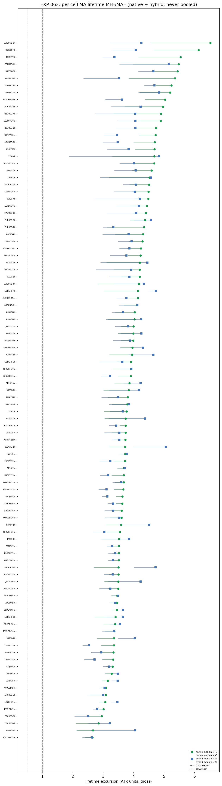
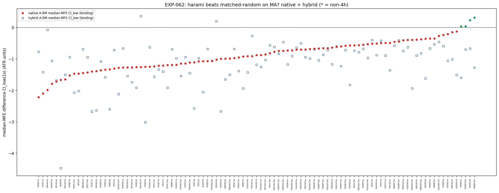
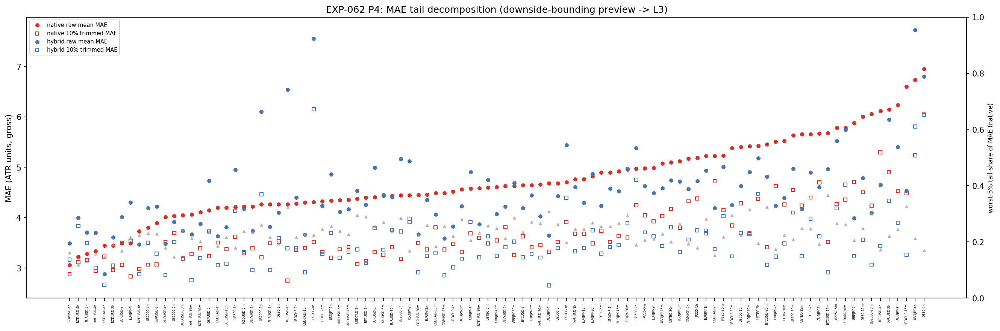
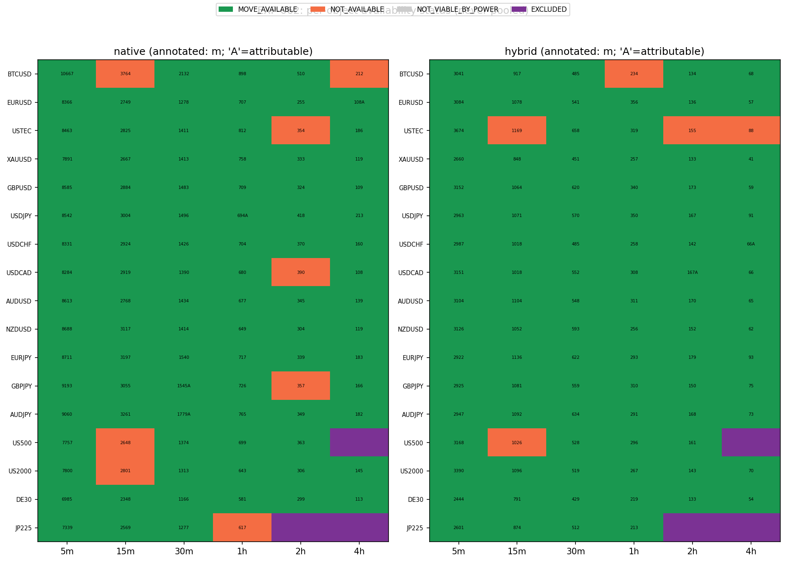

# Experiment Report: EXP-062 — MA(20,50)-Substrate Lifetime Availability (Dual Conditioning Object: Hybrid + Native, Phase 015 L2)

## Status: COMPLETED (dual-object re-run)

**Date:** 2026-06-17
**Instruments:** all 17; 99 member cells (3 COVERAGE_EXCLUDED: US500-4h, JP225-2h/4h)
**Data views:** 5m/15m/30m/1h/2h/4h real domain OHLC; HA candles for harami detection only; MA(20,50)
crossover substrate (real close); ZigZag (atr_mult=1.0) for the hybrid conditioning mask + disclosed
contrast; lifetime favourable MFE / adverse MAE, gross, ATR-normalised, over the reversal MA segment M_b.

> **Re-run under `D0-amendment-001-dual-parallel-substrate.md`** — supersedes the prior EXP-062 in place.
> The prior result reported a single MA availability arm labelled "hybrid" that actually conditioned on
> the **MA segment** (the *native* object). This re-run emits **both** objects individually — native
> `A_MA_nat` (reconciles EXP-055 `ma_seg`) and the genuinely-new hybrid `A_MA_hyb` (ZigZag `/STRONG-STAT`
> × the MA lifetime window; no outcome anchor) — each with its own matched-random-on-MA null, never pooled.

## Question

For each conditioning object individually, over the reversal MA segment that follows the conditioned
HA harami, (1) is a meaningful favourable lifetime move **available** (median MFE CI_low > 1.0 ATR and
> median MAE), (2) is that room **signal-attributable** (does the harami beat its own matched-random-on-MA
null), and (3) what does the adverse tail look like (the L3 downside-bounding input)?

## Method Summary

Forked the existing EXP-062 single-object harness; reused EXP-055's `availability.py` verbatim. Relabelled
the existing MA arm as **native** `A_MA_nat` and added the **hybrid** `A_MA_hyb` (the ZigZag-`/STRONG-STAT`
mask applied through the same MA lifetime window). Six arms per cell: `A_MA_nat`/`RM_MA_nat`,
`A_MA_hyb`/`RM_MA_hyb`, `A_ZZ`/`RM_ZZ`; each object's null matched to its own qualifying count, excluding
its own signal entries, on disjoint RNG. Binding endpoint = per-cell **median** lifetime MFE (and MAE),
regime-clustered moving-block bootstrap, fixed per-cell seed; `MOVE_AVAILABLE` = median-MFE CI_low > 1.0
ATR ∧ median MFE > median MAE; `SIGNAL_ATTRIBUTABLE` = the object's `A − RM` median-MFE difference-bootstrap
CI_low > 0. P4 MAE mean/10%-trim/worst-5% tail-share disclosed (never a gate). Objects judged
**individually, never pooled**; phase verdict = stronger object's.

## Key Findings

### Finding 1 — A large favourable lifetime move is available on MA, on both objects

Native median MFE ≈ 3.84 ATR / MAE ≈ 2.92 ATR with **91/99** `MOVE_AVAILABLE` cells (17 instruments, 77
non-4h, P11+P6 composes); hybrid ≈ 3.77 / 2.83 ATR, **94/99** `MOVE_AVAILABLE` (80 non-4h, composes). The
EXP-055 ZigZag AVAILABILITY_GOOD reading reproduces in magnitude on the MA substrate for both objects.

### Finding 2 — But the room is NOT harami-attributable — it is ambient MA-segment length

The binding P5 leg fails: the conditioned harami beats its own matched-random-on-MA null in only **4/99**
(native) / **2/99** (hybrid) cells (neither composes P11), and the *typical* contrast lower bound is
**negative** (≈ −0.88 / −0.98 ATR). A random in-regime entry on the same MA segment gets **as much or more**
lifetime favourable room. The available move is a property of MA-segment length, not of the harami signal.

### Finding 3 — Availability does not distinguish the objects; capture does

Both objects are broadly available and both non-attributable — availability is the same ambient property
for native and hybrid. This is the mirror of EXP-061, where *capture* (benchmark-geometry median) cleanly
distinguished native (generalises) from hybrid (does not). The harami signal, where it exists (native),
lives in the **capture geometry**, not in raw lifetime availability.

### Finding 4 — The adverse tail (L2→L3 hand-off)

Median MAE ≈ 2.9 ATR; worst-5% tail-share ≈ 0.23; raw-mean MAE ≈ 4.60 vs 10%-trimmed ≈ 3.52 (native): a
moderately top-heavy adverse tail. There is a truncatable catastrophic tail, but the bulk MAE stays large —
EXP-063 confirms bounding repairs the catastrophic mean without making the centre small.

## Conclusion

**Phase verdict: AVAILABILITY_GOOD (stronger object = native) — with a binding attribution caveat.** A
large favourable lifetime move is available on the MA substrate for both objects, but it is **not
signal-attributable** (4/99 native, 2/99 hybrid; the conditioned MFE is typically *not* above
matched-random). The availability is ambient MA-segment length, not a harami edge. Read together with
EXP-061, the harami signal (native only) lives in capture geometry, not availability. The family stays
OPEN; this per-object characterisation feeds the single terminal G-015 — no closure or candidate
registration here.

## Registry Disposition

Registry-relevant for **supersession bookkeeping** (resolves the SUPERSEDED status) and for recording the
attribution caveat; **not** for closure. 0 candidate slots consumed, 0 TEST reads, holdouts sealed.
- `multiplicity-registry.md` — `CF-HA-HARAMI-001/HYP-015 (EXP-062)`: SUPERSEDED → **CHARACTERISED
  (dual-object): AVAILABILITY_GOOD both objects by magnitude, but NOT signal-attributable (ambient
  MA-segment-length room)**; item retained, feeds G-015.
- `candidate-families/harami.md` — `MA-SUBSTRATE` L2 card updated to the dual-object outcome; family stays
  **REGISTERED, OPEN**.
- `test-read-ledger.md` — unchanged; no HA-harami TEST stratum exists or was touched.

## Artifacts

- `scope.md`, `analysis-plan.md`, `code/run_experiment.py`, `code/availability.py`
- `results/`: `per_cell_availability.parquet`, `availability_map.csv`, `availability_secondary.csv`,
  `mae_tail_decomposition.csv`, `reconciliation.csv`, `composition_readout.json`, `run_metadata.json`
- `plots/`: `per_cell_mfe_mae_forest.png`, `a_ma_rm_ma_attribution_forest.png`,
  `mae_tail_decomposition.png`, `move_available_composition_map.png`
- `audit.md`, `results.md`, `governance/pre-execution-review.md`, `governance/post-experiment-review.md`
