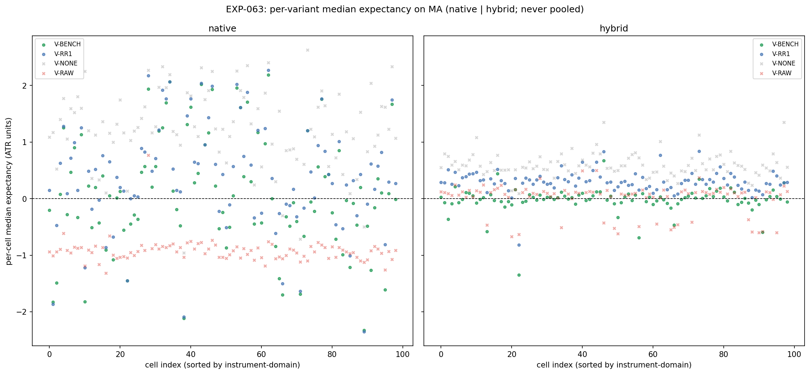
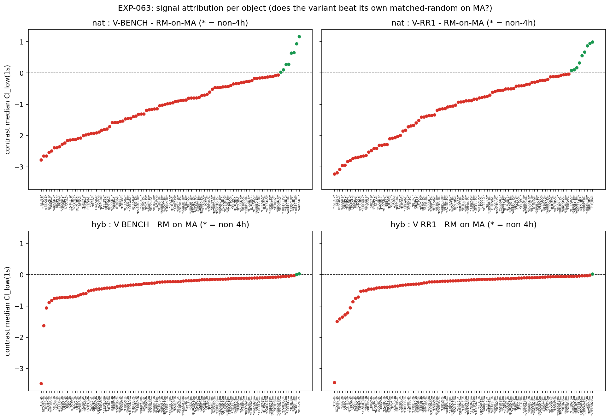
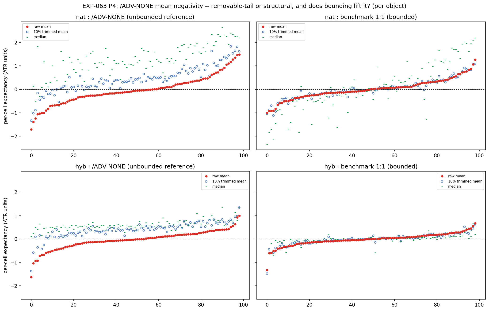
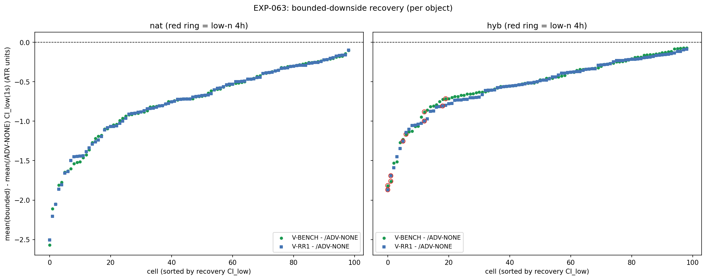
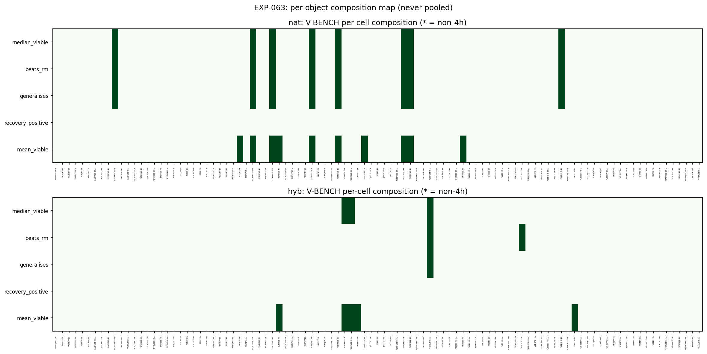

# Experiment Report: EXP-063 — MA(20,50)-Substrate Adverse Geometry & the Mean Investigation (Dual Conditioning Object: Hybrid + Native, Phase 015 L3)

## Status: COMPLETED (dual-object re-run)

**Date:** 2026-06-17
**Instruments:** all 17; 99 member cells (3 COVERAGE_EXCLUDED: US500-4h, JP225-2h/4h)
**Data views:** 5m/15m/30m/1h/2h/4h real domain OHLC; HA candles for harami detection only; MA(20,50)
crossover substrate (real close); benchmark favourable (0.50·M_sofar) + MA adaptive cap held fixed; OAT on
the adverse leg (V-BENCH 1:1, V-RR1 `/ADV-EXTREME-rr1`, V-NONE `/ADV-NONE`, V-RAW `/ADV-EXTREME-raw`); P15
fills; median binding + the §4 mean decomposition.

> **Re-run under `D0-amendment-001-dual-parallel-substrate.md`** — supersedes the prior EXP-063 in place.
> The prior result reported a single MA adverse surface labelled "hybrid" that actually conditioned on the
> **MA segment** (the *native* object). This re-run emits the full 4-variant adverse axis for **both**
> objects individually — native `M-*` (reconciles EXP-061 `M0`) and the genuinely-new hybrid `H-*`
> (reconciles EXP-061 `H0`) — each with its own per-variant matched-random-on-MA null, never pooled.

## Question

For each object individually, does varying only the adverse target (bounded 1:1 / `/ADV-EXTREME-rr1` vs
unbounded `/ADV-NONE`) (1) preserve a median-viable, signal-attributable edge on MA, and (2) explain and
repair the EXP-060B negative mean — is the negativity a removable tail or structural, and does bounding
fix it?

## Method Summary

Forked EXP-061's dual-object MA harness; reused `xen.adverse_targets` wholesale. Generalised the single
BENCH geometry to a per-variant loop over the 4 adverse models, run on **both** conditioning populations
(native MA-segment `/STRONG-STAT`; hybrid ZigZag `/STRONG-STAT` via a new `_zz_context`, scored on the
shared MA geometry). Per object per variant: a matched-random-on-MA null (matched to that object's count,
excluding its own entries, disjoint RNG), the independent `variant − RM` median contrast, the §4 raw mean
+ 10% trimmed mean + worst-5% tail-share, and the bounded-downside recovery contrast
`mean(bounded) − mean(/ADV-NONE)`. Binding endpoint = median (P14); mean = the P4 diagnostic co-primary
(never a blind disqualifier). Objects judged **individually, never pooled**.

## Key Findings

### Finding 1 — Native (EVIDENCE_FOR): bounded-downside median edge survives, catastrophic mean repaired — to neutral, not positive

Both bounded variants are median-viable, beat their own RM-on-MA null, and compose P11+P6 — V-BENCH 8/99,
V-RR1 9/99. The §4 decomposition resolves the EXP-060B mean precisely:

- `/ADV-NONE` raw-mean median **−0.058 ATR** but **10%-trimmed +0.422 ATR** (worst-5% tail-share 0.356) —
  the unbounded negativity is a **thin catastrophic left tail** (the uncapped-downside skew).
- Bounded V-BENCH raw-mean median **+0.0065 ATR**, trimmed **−0.018** — the 1:1 stop truncates the left
  tail (raw mean recovers from −0.058 to ≈ 0) but clips the right-tail winners, so the **centre is ≈ 0**.
- The recovery contrast `mean(bounded) − mean(/ADV-NONE)` is **null in 0/99** — bounding does not *lift* the
  raw mean relative to `/ADV-NONE`; it neutralises the catastrophe rather than producing positivity.

The verdict is **EVIDENCE_FOR** in its **weak, median-preserving** form: the bounded lever keeps the
signal-attributable median edge and removes catastrophic-mean risk, but does **not** demonstrate a
materially positive gross mean. (Equally, the structural-irrecoverability MEDIAN_ONLY case is not met — the
negativity is a removable tail, not structural.)

### Finding 2 — Hybrid (EVIDENCE_AGAINST): median viability without signal attribution

Hybrid variants are median-viable in many cells (V-RR1 90/99) but beat their own RM-on-MA null in **0** →
generalise in only 1 cell, failing P11. The hybrid object's median positivity is **ambient**
(random-in-regime matches it), not harami-driven — confirming EXP-061 on the adverse axis: the edge is a
matched-substrate (MA-conditioning) property; the ZigZag-conditioned hybrid does not express it.

### Finding 3 — Integrity

Native `V-BENCH` reproduces EXP-061 `M0` and hybrid `V-BENCH` reproduces EXP-061 `H0` per-cell median + m
to 1e-9 across 99/99 cells; determinism replay byte-identical; 0 causality / 0 invariant violations (incl.
the new hybrid ZigZag-causality leg and the per-object V-NONE-0-ADV / V-RAW≤V-RR1 checks); `is_defect:
false`.

## Conclusion

**Phase verdict: EVIDENCE_FOR (stronger object = native); hybrid = EVIDENCE_AGAINST.** The native
MA-conditioned harami's bounded-downside median edge generalises and beats matched-random, and bounding the
downside repairs the EXP-060B catastrophic mean — but to **neutral (≈ 0 gross), not positive**; the
recovery contrast is flat because `/ADV-NONE`'s negativity is a removable tail rather than a structural
drag the stop can convert into positive expectancy. The hybrid object's median viability is ambient, not
signal-attributable. Native remains the only object expressing a signal-attributable edge (L1 + L3); the
open G-015 question is whether a median edge with a neutralised gross mean earns a candidate slot under
costs — a later phase. Family stays OPEN; no closure here.

## Registry Disposition

Registry-relevant for **supersession bookkeeping** and recording the dual-object outcome; **not** for
closure. 0 candidate slots, 0 TEST reads, holdouts sealed.
- `multiplicity-registry.md` — `CF-HA-HARAMI-001/HYP-016 (EXP-063)`: SUPERSEDED → **CHARACTERISED
  (dual-object): native EVIDENCE_FOR (median edge + bounded ≈0 mean; recovery flat), hybrid
  EVIDENCE_AGAINST (median viability not RM-attributable)**; item retained, feeds G-015.
- `candidate-families/harami.md` — `MA-SUBSTRATE` L3 card updated to the dual-object outcome; family stays
  **REGISTERED, OPEN**.
- `test-read-ledger.md` — unchanged; no HA-harami TEST stratum touched.

## Artifacts

- `scope.md`, `analysis-plan.md`, `code/run_experiment.py`
- `results/`: `per_cell_expectancy.parquet`, `adverse_map.csv`, `mean_investigation.csv`,
  `signal_attribution.csv`, `secondary_map.csv`, `readiness.csv`, `reconciliation.csv`,
  `composition_readout.json`, `run_metadata.json`
- `plots/`: `per_variant_median_forest.png`, `variant_rm_attribution_forest.png`, `mean_investigation.png`,
  `bounded_downside_recovery_map.png`, `composition_verdict_map.png`
- `audit.md`, `results.md`, `governance/pre-execution-review.md`, `governance/post-experiment-review.md`
